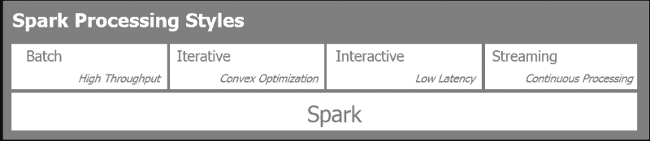
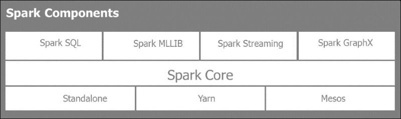
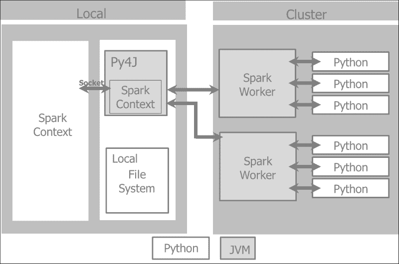
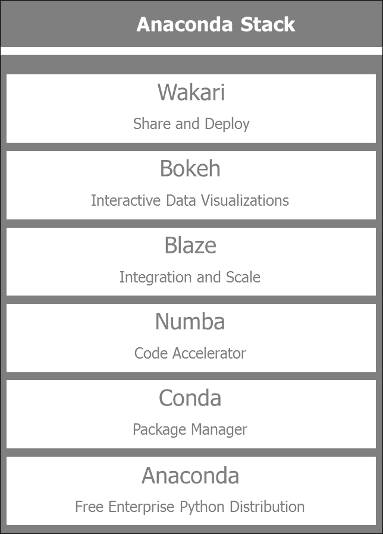
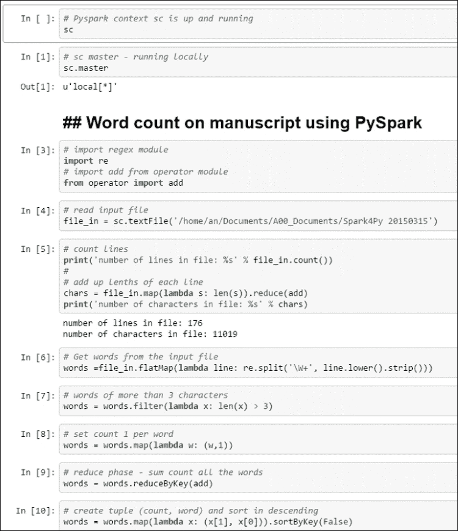
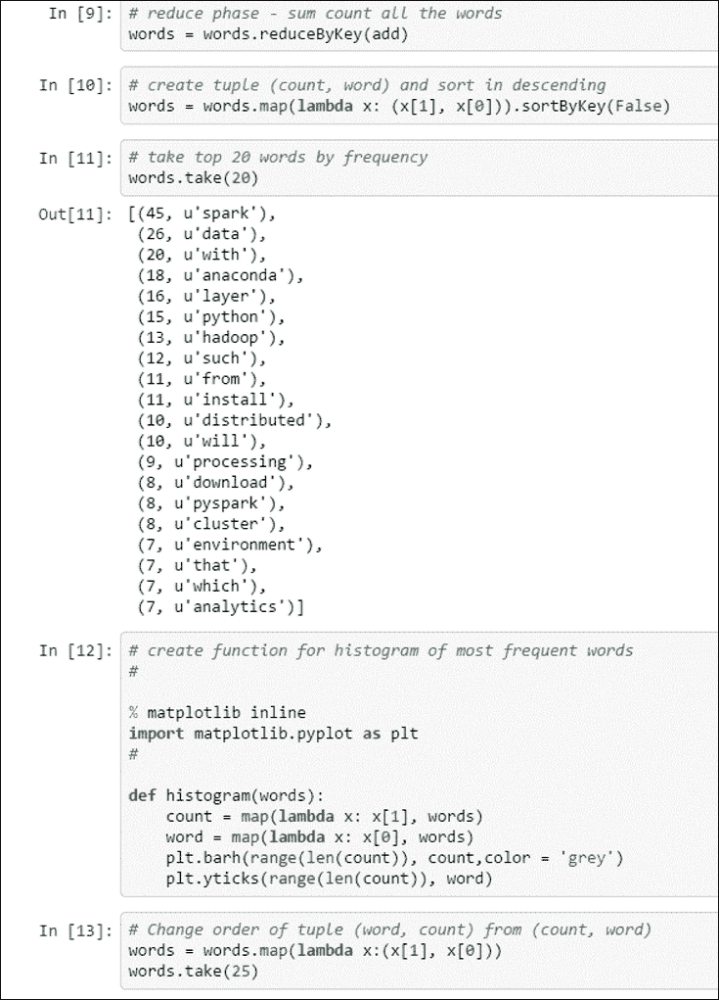

# 第一章：建立火花虚拟环境

在本章中，我们将为开发目的构建一个隔离的虚拟环境。 该环境将由 Spark 和 Python Anaconda 发行版提供的 PyData 库提供支持。 这些图书馆包括熊猫、Scikit-Learn、Blaze、Matplotlib、Seborn 和 Bokeh。 我们将进行以下活动：

*   使用 Anaconda Python 发行版设置开发环境。 这将包括为我们的数据探索任务启用由 PySpark 提供支持的 IPython 笔记本环境。
*   安装并启用 Spark 以及 PyData 库，如 Pandas、Scikit-Learn、Blaze、Matplotlib 和 Bokeh。
*   构建`word count`示例应用程序以确保一切正常运行。

过去十年见证了亚马逊、谷歌、Twitter、LinkedIn 和 Facebook 等数据驱动的庞然大物的崛起和主导地位。 这些公司通过播种、共享或公开他们的基础设施概念、软件实践和数据处理框架，培育了一个充满活力的开源软件社区。 这改变了企业技术、系统和软件架构。

这包括新的基础设施和 DevOps(开发和运营的缩写)、利用虚拟化、云技术和软件定义的网络的概念。

为了处理 PB 级的数据，Hadoop 被开发并开源，灵感来自**Google File System**(**GFS**)和相邻的分布式计算框架 MapReduce。 在控制成本的同时克服扩展的复杂性也导致了新数据存储的激增。 最近数据库技术的例子包括柱状数据库 Cassandra、文档数据库 MongoDB 和图形数据库 Neo4J。

Hadoop 凭借其处理海量数据集的能力，培育了一个庞大的生态系统，可以与 Pig、Have、Impala 和 Tez 更迭代、更交互地查询数据。 Hadoop 很麻烦，因为它只使用 MapReduce 在批处理模式下运行。 Spark 针对磁盘输入输出和带宽密集型 MapReduce 作业的缺点，在分析和数据处理领域掀起了一场革命。

Spark 是用 Scala 编写的，因此与**Java 虚拟机**(**JVM**)驱动的生态系统进行了本机集成。 Spark 早先通过启用 PySpark 提供了 Python API 和绑定。 Spark 架构和生态系统本质上是多语言的，有明显强大的以 Java 为主导的系统。

本书将重点介绍 PySpark 和 PyData 生态系统。 Python 是学术和科学界进行数据密集型处理的首选语言之一。 Python 已经开发了丰富的库和工具生态系统，包括使用 Pandas 和 Blaze 进行数据操作，使用 Scikit-Learning 进行机器学习，以及使用 Matplotlib、Seborn 和 Bokeh 进行数据可视化。 因此，本书的目的是为基于 Spark 和 Python 的数据密集型应用程序构建端到端架构。 为了将这些概念付诸实践，我们将分析 Twitter、GitHub 和 Meetup 等社交网络。 我们将通过利用 GitHub、Twitter 和 Meetup 来关注 Spark 和开源软件社区的活动和社交互动。

构建数据密集型应用程序需要高度可扩展的基础设施、多语言存储、无缝数据集成、多范式分析处理和高效可视化。 以下段落描述了我们将在整本书中采用的数据密集型应用程序架构蓝图。 它是这本书的主心骨。 我们将在更广泛的 PyData 生态系统中发现 Spark。

### 提示

**下载示例代码**

您可以从您的帐户[http://www.packtpub.com](http://www.packtpub.com)下载购买的所有 Packt 图书的示例代码文件。 如果您在其他地方购买了本书，您可以访问[http://www.packtpub.com/support](http://www.packtpub.com/support)并注册，以便将文件通过电子邮件直接发送给您。

# 了解数据密集型应用程序的体系结构

为了理解数据密集型应用程序的体系结构，使用了以下概念框架。 IS 架构设计在以下五层上：

*   框架层基础架构层
*   持久层
*   集成层
*   图层分析图层分析
*   参与层

以下屏幕截图描述了**数据密集型应用框架**的五层：


从自下而上，让我们来看看这些层和它们的主要用途。

## _ 文件

基础架构层主要与虚拟化、可伸缩性和持续集成相关。 实际上，在虚拟化方面，我们将在由 Spark 和蟒蛇发行版 Python 支持的 VirtualBox 和虚拟机中构建我们自己的开发环境。 如果我们希望从那里进行扩展，我们可以在云中创建类似的环境。 创建分离的开发环境并进入测试和生产部署的实践可以是自动化的，并且可以是由 DevOps 工具(如**Vagant**、**Chef**、**Pupper**和**Docker**)支持的持续集成周期的一部分。 Docker 是一个非常流行的开源项目，可以简化新环境的安装和部署。 本书将仅限于使用 VirtualBox 构建虚拟机。 从数据密集型应用程序架构的角度来看，我们通过提及可伸缩性和持续集成来描述基础架构层的基本步骤，而不仅仅是虚拟化。

## 持久层

持久层根据数据需求和形状管理各种存储库。 它保证了多语种数据存储的设置和管理。 它包括关系型数据库管理系统，如**MySQL**和**PostgreSQL**；键值数据存储，如**Hadoop**、**Riak**、**Redis**；柱状数据库，如**HBase**和**Cassandra**； 文档数据库，如**MongoDB**和**Couchbase**；以及图形数据库，如**Neo4j**。 持久层管理各种文件系统，比如 Hadoop 的 HDFS。 它与各种存储系统(从本机硬盘到 Amazon S3)交互。 它管理各种文件存储格式，如`csv`、`json`和`parquet`，这是一种面向列的格式。

## 集成层

集成层关注数据获取、转换、质量、持久性、使用和治理。 它本质上是由以下五个 C 驱动的：*连接*、*收集*、*校正*、*组成*和*消耗*。

这五个步骤描述了数据的生命周期。 他们关注的是如何获取感兴趣的数据集、探索它、迭代地提炼和丰富收集的信息，并准备好使用它。 因此，这些步骤执行以下操作：

*   **连接**：目标是从各种数据源获取数据的最佳方式、这些源提供的 API、输入格式、输入模式(如果存在)、数据收集速率以及来自提供程序的限制
*   **更正**：将重点放在转换数据以进行进一步处理，并确保保持接收数据的质量和一致性
*   **收集**：查看将哪些数据存储在何处，以何种格式存储，以简化后期的数据组合和使用
*   **Compose**：将注意力集中在如何聚合收集的各种数据集，并丰富信息，以构建引人注目的数据驱动产品
*   **消费**：负责提供和呈现数据，以及正确的数据如何在正确的时间到达正确的个人手中
*   **控制**：随着数据、组织和参与者的增长，这第六个*附加*步骤迟早会被需要，这是为了确保数据治理

下图描述了消耗的数据采集和细化的迭代过程：


## _

分析层是Spark 使用各种模型、算法和机器学习管道处理数据以获得洞察力的地方。 出于我们的目的，在本书中，分析层由 Spark 提供支持。 我们将在接下来的章节中更深入地研究 Spark 的优点。 简而言之，它之所以如此强大，是因为它允许在单个统一平台中进行多种模式的分析处理。 它支持批处理、流和交互式分析。 对延迟时间较长的大型数据集进行批处理使我们能够提取模式和洞察力，这些模式和洞察力可以在流模式下提供给实时事件。 交互式和迭代分析更适合于数据探索。 Spark 提供了 Python 和 R 的绑定和 API，通过其**SparkSQL**模块和Spark Dataframe，它提供了一个非常熟悉的分析界面。

## 参与层

参与层与终端用户交互，并提供仪表板、交互式可视化和警报。 这里我们将重点介绍 PyData 生态系统提供的工具，如 Matplotlib、Seborn 和 Bokeh。

# 了解火花

Hadoop随着数据的增长进行水平扩展。 Hadoop 在商用硬件上运行，因此性价比高。 可扩展的分布式处理框架支持密集型数据应用程序，使组织能够分析大型商用群集上的 PB 级数据。 Hadoop 是 Map-Reduce 的第一个开源实现。 Hadoop依赖于称为**HDFS**(**Hadoop Distributed File System**)的分布式存储框架。 Hadoop 在批处理作业中运行 map-duce 任务。 Hadoop 要求在每个映射、洗牌和还原过程步骤中将数据持久化到磁盘。 此类批处理作业的开销和延迟会对性能产生不利影响。

Spark 是一个用于大规模数据处理的快速、分布式通用分析计算引擎。 Hadoop 的主要突破是，Spark 允许通过数据管道的内存处理在处理步骤之间共享数据。

Spark 的独特之处在于它允许四种不同风格的数据分析和处理。 Spark 可用于：

*   **批处理**：此模式用于操作大型数据集，通常执行大型 Map-Reduce 作业
*   **流**：此模式用于近乎实时地处理传入信息
*   **迭代**：此模式适用于机器学习算法，如梯度下降法，其中重复访问数据以达到收敛
*   **交互式**：此模式用于数据探索，因为大量数据都在内存中，而且 Spark 的响应时间非常快

下图突出显示了前面四种处理方式：



Spark 在三种模式下运行：一种单模式，在一台机器上独立运行，在一群机器上运行两种分布式模式-在 Yarn 上，Hadoop 分布式资源管理器上，或在 Mesos 上，在 Berkeley 与 Spark 同时开发的开源集群管理器上：



Spark 提供了 Scala、Java、Python 和 R 的多语言界面。

## 火花库

Spark附带电池，并带有一些功能强大的库：

*   **SPARKSQL**：这个提供了类似 SQL 的能力来询问结构化数据和交互地浏览大型数据集
*   **SparkMLLIB**：这个提供了机器学习的主要算法和流水线框架
*   **Spark Streaming**：此用于对传入数据流使用微批和滑动窗口进行近乎实时的数据分析
*   **Spark GraphX**：此用于对复杂的连接实体和关系进行图形处理和计算

### 行动中的火种

Spark 是用 Scala 编写的。 整个 Spark 生态系统自然地利用 JVM 环境，并在本地利用 HDFS。 Hadoop HDFS 是 Spark 支持的众多数据存储之一。 Spark 是不可知的，从一开始就与多种数据源、类型和格式交互。

PySpark 不是支持 Java 的 Python 方言(如 Jython)上 Spark 的转录版本。 PySpark 提供了围绕 Spark 的集成 API 绑定，并通过 Pickle Python 序列化在集群的所有节点内实现了对 Python 生态系统的充分利用，更重要的是，它提供了对 Python 机器学习库(如 Scikit-Learning)或数据处理(如 Pandas)的丰富生态系统的访问。

当我们初始化 Spark 程序时，Spark 程序必须做的第一件事是创建一个`SparkContext`对象。 它告诉 Spark 如何访问集群。 Python 程序创建一个`PySparkContext`。 Py4J 是将 Python 程序绑定到 Spark JVM`SparkContext`的网关。 JVM`SparkContextserializes`对应用程序和闭包进行编码，并将它们发送到集群以供执行。 集群管理器分配资源和调度，并将闭包发送给集群中的 Spark Worker，后者根据需要激活 Python 虚拟机。 在每台机器中，Spark Worker 由一个执行器管理，该执行器控制计算、存储和缓存。

下面是一个示例，说明 Spark 驱动程序如何使用其本地文件系统管理 PySpark 上下文和 Spark 上下文，以及它如何通过集群管理器与 Spark Worker 进行交互：



### 弹性分布式数据集

SPARK应用程序由一个驱动程序程序组成，该程序运行用户的主函数，在集群上创建分布式数据集，并对这些数据集执行各种并行操作(转换和操作)。

Spark 应用程序作为一组独立的进程运行，由驱动程序中的`SparkContext`协调。

将从**集群管理器**为`SparkContext`分配系统资源(机器、内存、CPU)。

`SparkContext`管理管理集群中的工作者的执行器。 驱动程序有需要运行的 Spark 作业。 作业被拆分成提交给执行器完成的任务。 执行器负责每台机器中的计算、存储和缓存。

Spark 中的关键构建块是**RDD**(**弹性分布式数据集**)。 数据集是元素的集合。 分布式意味着数据集可以位于群集中的任何节点上。 弹性意味着数据集可能丢失或部分丢失，而不会对正在进行的计算造成重大损害，因为 Spark 将根据内存中的数据谱系重新计算，也称为操作的**DAG**(**有向无环图**的缩写)。 基本上，Spark 将在内存中为缓存中的 RDD 状态创建快照。 如果其中一台计算机在操作过程中崩溃，Spark 将从缓存的 RDD和操作的 DAG 重建 RDDS。 RDDS从节点故障中恢复。

在 RDDS 上有两种类型的操作：

*   **转换**：转换采用现有的 RDD 并指向新转换的 RDD 的指针。 RDD 是不可变的。 一旦创建，就无法更改。 每个转换都会创建一个新的 RDD。 转换被懒惰地评估。 转换仅在操作发生时执行。 在出现故障的情况下，转换的数据沿袭会重建 RDD。
*   **操作**：RDD 上的操作触发 Spark 作业并生成值。 操作会导致 Spark 执行计算该操作返回的 RDD 所需的(惰性)转换操作。 该操作将导致操作的 DAG。 DAG 被编译成多个阶段，每个阶段都作为一系列任务执行。 任务是工作的基本单位。

以下是有关 RDDS 的一些有用信息：

*   RDDS 是从 HDFS 文件或 DB 查询等数据源创建的。 创建 RDD 有三种方法：
    *   从数据存储区读取
    *   改造现有 RDD
    *   使用内存中集合
*   RDDS 用诸如`map`或`filter`之类的函数进行转换，从而产生新的 RDDS。
*   First、Take、Collect 或 Count on a RDD 等操作会将结果传递到 Spark 驱动程序。 Spark 驱动程序是用户与 Spark 群集交互的客户端。

下图说明了 RDD 转换和操作：


# 了解蟒蛇

蟒蛇是一个广泛使用的免费 Python 发行版，由**Continuum**([https://www.continuum.io/](https://www.continuum.io/))维护。 我们将使用蟒蛇提供的主流软件堆栈来生成我们的应用程序。 在本书中，我们将使用 PySpark 和 PyData 生态系统。 PyData 生态系统由**Continuum**促进、支持和维护，并由**Anaconda**Python 发行版提供支持。 Anaconda Python 发行版实质上节省了安装 Python 环境的时间和麻烦；我们将把它与 Spark 结合使用。 蟒蛇有自己的包管理，是对传统的`pip``install`和`easy-install`的补充。 蟒蛇附带电池，即一些最重要的套装，如熊猫、Scikit-Learning、Blaze、Matplotlib 和 Bokeh。 升级到任何已安装的库只需在控制台执行简单的命令：

```py
$ conda update

```

可以使用以下命令获取我们环境中已安装的库列表：

```py
$ conda list

```

堆栈的关键组件如下：

*   **Anaconda**：这个是一个免费的 Python 发行版，包含近 200 个用于科学、数学、工程和数据分析的 Python 包。
*   **conda**：这是一个包管理器，负责安装复杂软件堆栈的所有依赖项。 这并不局限于Python，它管理 R 和其他语言的安装过程。
*   **Numba**：这个提供了通过高性能函数和实时编译来加速 Python 代码的能力。
*   **blaze**：这个通过提供统一且可适应的接口来访问各种数据提供者，包括流式 Python、Pandas、SQLAlChemy 和 Spark，从而支持大规模数据分析。
*   **Bokeh**：这个为大数据集和流数据集提供交互式数据可视化。
*   **Wakari**：这个允许我们在托管环境中共享和部署 IPython 笔记本和其他应用程序。

下图显示了蟒蛇堆栈的组件：



# 设置火花供电环境

在本部分中，我们将学习如何设置 Spark：

*   在运行在 Ubuntu 14.04 上的虚拟机中创建隔离的开发环境，这样就不会干扰任何现有的系统。
*   安装 Spark 1.3.0 及其依赖项，即。
*   安装 Anaconda Python2.7 环境和所有必需的库，如 Pandas、Scikit-Learn、Blaze 和 Bokeh，并启用 PySpark，这样就可以通过 IPython 笔记本访问它。
*   设置我们环境的后端或数据存储。 我们将使用 MySQL 作为关系数据库，MongoDB 作为文档存储，Cassandra 作为列式数据库。

每个存储后端都有特定的用途，具体取决于要处理的数据的性质。 MySQL RDBMS 用于标准的表格处理信息，这些信息可以很容易地使用 SQL 进行查询。 由于我们将处理来自各种 API 的大量 JSON 类型的数据，因此将它们存储在文档中是最简单的方法。 对于实时和与时间序列相关的信息，Cassandra 最适合作为分栏式数据库。

下图提供了本书中我们将构建和使用的环境的视图：


## 使用 Ubuntu 设置 Oracle VirtualBox

在 Ubuntu 14.04 上设置一个干净的新 VirtualBox环境是创建一个不与现有库冲突的开发环境的最安全方式，并且以后可以使用类似的命令列表将其复制到云中。

为了设置一个包含蟒蛇和 Spark 的环境，我们将创建一个运行 Ubuntu 14.04 的 VirtualBox 虚拟机。

下面我们来介绍一下在 Ubuntu 中使用 VirtualBox 的步骤：

1.  OracleVirtualBox VM 是免费的，可以从[https://www.virtualbox.org/wiki/Downloads](https://www.virtualbox.org/wiki/Downloads)下载。 安装非常简单。
2.  安装 VirtualBox 之后，让我们打开 Oracle VM VirtualBox Manager 并单击**New**按钮。
3.  我们将为新 VM 命名，并选择 Type**Linux**和 Version**Ubuntu(64 位)**。
4.  您需要从 Ubuntu 网站下载 ISO 并分配足够的 RAM(建议为 4 GB)和磁盘空间(建议为 20 GB)。 我们将使用 Ubuntu14.04.1LTS 版本，该版本可以在这里找到：[http://www.ubuntu.com/download/desktop](http://www.ubuntu.com/download/desktop)。
5.  一旦安装完成，建议转到**Devices**|**Insert Guest Additions CD 镜像**(从 VirtualBox 菜单，在运行新虚拟机的情况下)安装 VirtualBox 来宾添加。 如果不能在 Windows 主机中提供来宾添加功能，则用户界面非常有限，窗口大小会变小。
6.  其他安装完成后，重新启动虚拟机，它就可以使用了。 通过选择虚拟机并单击**设置**，然后转到**常规**|**高级**|**共享剪贴板**并单击**双向**来启用共享剪贴板非常有用。

## 使用 Python 2.7 安装蟒蛇

PySpark 目前仅在 Python2.7 上运行。 (社区要求升级到 Python3.3。)。 要安装蟒蛇，请执行以下步骤：

1.  从[http://continuum.io/downloads#all](http://continuum.io/downloads#all)下载适用于 Linux64 位 Python2.7 的蟒蛇安装程序。
2.  下载蟒蛇安装程序后，打开终端并导航到保存安装程序的目录或文件夹。 从这里，运行以下命令，将命令中的`2.x.x`替换为下载的安装程序文件的版本号：

    ```py
    # install anaconda 2.x.x
    bash Anaconda-2.x.x-Linux-x86[_64].sh

    ```

3.  接受许可条款后，系统将要求您指定安装位置(哪个`defaults to ~/anaconda`)。
4.  自解压完成后，应将蟒蛇二进制目录添加到 PATH 环境变量中：

    ```py
    # add anaconda to PATH
    bash Anaconda-2.x.x-Linux-x86[_64].sh

    ```

## 安装 Java 8

Spark在 JVM 上运行，需要Java**SDK**(缩写为**Software Development Kit**)，而不是**JRE**(**Java Runtime Environment**)，因为我们将使用 Spark 构建应用程序。 推荐的版本是 Java 版本7 或更高版本。 Java8 是最合适的，因为它包含了 Scala 和 Python 提供的许多函数式编程技术。

要安装 Java 8，请执行以下步骤：

1.  使用以下命令安装 Oracle Java 8：

    ```py
    # install oracle java 8
    $ sudo apt-get install software-properties-common
    $ sudo add-apt-repository ppa:webupd8team/java
    $ sudo apt-get update
    $ sudo apt-get install oracle-java8-installer

    ```

2.  设置`JAVA_HOME`环境变量，并确保 Java 程序位于您的路径上。
3.  检查`JAVA_HOME`是否正确安装：

    ```py
    # 
    $ echo JAVA_HOME

    ```

## 安装火花

将转到[http://spark.apache.org/downloads.html](http://spark.apache.org/downloads.html)的 Spark 下载页面。

Spark 下载页面提供了下载 Spark 的早期版本以及不同的软件包和下载类型的可能性。 我们将选择为 Hadoop 2.6 及更高版本预先构建的最新版本。 安装 Spark 最简单的方法是使用为 Hadoop2.6 及更高版本预先构建的 Spark 包，而不是从源代码构建它。 将文件移至根目录下的目录`~/spark`。

下载 2015 年 11 月 9 日发布的最新版本 Spark-Spark 1.5.2：

1.  选择火花版本**1.5.2(2015 年 11 月 9 日)、**
2.  选择为 Hadoop 2.6 和更高版本预建的包类型**，**
3.  选择下载类型**直接下载**，
4.  Spark 下载：**spark-1.5.2-bin-hadoop2.6.tgz**，
5.  使用 1.3.0 签名和校验和验证此版本，

这也可以通过运行以下命令来实现：

```py
# download spark
$ wget http://d3kbcqa49mib13.cloudfront.net/spark-1.5.2-bin-hadoop2.6.tgz

```

接下来，我们将解压文件并进行清理：

```py
# extract, clean up, move the unzipped files under the spark directory
$ tar -xf spark-1.5.2-bin-hadoop2.6.tgz
$ rm spark-1.5.2-bin-hadoop2.6.tgz
$ sudo mv spark-* spark

```

现在，我们可以使用以下命令运行 Spark Python 解释器：

```py
# run spark
$ cd ~/spark
./bin/pyspark

```

您应该看到如下所示：

```py
Welcome to
 ____              __
 / __/__  ___ _____/ /__
 _\ \/ _ \/ _ `/ __/  '_/
 /__ / .__/\_,_/_/ /_/\_\   version 1.5.2
 /_/
Using Python version 2.7.6 (default, Mar 22 2014 22:59:56)
SparkContext available as sc.
>>> 

```

解释器已经为我们提供了一个 Spark 上下文对象`sc`，我们可以通过运行以下命令查看该对象：

```py
>>> print(sc)
<pyspark.context.SparkContext object at 0x7f34b61c4e50>

```

## 启用 IPython 笔记本

我们将与 IPython Notebook 合作，提供比控制台更友好的用户体验。

您可以使用以下命令启动 IPython 笔记本：

```py
$ IPYTHON_OPTS="notebook --pylab inline"  ./bin/pyspark

```

使用存储 Jupyter 或 IPython 笔记本的目录`examples/AN_Spark`中的`IPYNB`启动 PySpark：

```py
# cd to  /home/an/spark/spark-1.5.0-bin-hadoop2.6/examples/AN_Spark
# launch command using python 2.7 and the spark-csv package:
$ IPYTHON_OPTS='notebook' /home/an/spark/spark-1.5.0-bin-hadoop2.6/bin/pyspark --packages com.databricks:spark-csv_2.11:1.2.0

# launch command using python 3.4 and the spark-csv package:
$ IPYTHON_OPTS='notebook' PYSPARK_PYTHON=python3
 /home/an/spark/spark-1.5.0-bin-hadoop2.6/bin/pyspark --packages com.databricks:spark-csv_2.11:1.2.0

```

# 使用 PySpark 构建我们的第一个应用程序

我们已经准备好检查，现在一切都运行正常。 在处理本书第一章的字数统计时，将对必修字数进行测试。

下面列出了我们将运行的代码：

```py
# Word count on 1st Chapter of the Book using PySpark

# import regex module
import re
# import add from operator module
from operator import add

# read input file
file_in = sc.textFile('/home/an/Documents/A00_Documents/Spark4Py 20150315')

# count lines
print('number of lines in file: %s' % file_in.count())

# add up lengths of each line
chars = file_in.map(lambda s: len(s)).reduce(add)
print('number of characters in file: %s' % chars)

# Get words from the input file
words =file_in.flatMap(lambda line: re.split('\W+', line.lower().strip()))
# words of more than 3 characters
words = words.filter(lambda x: len(x) > 3)
# set count 1 per word
words = words.map(lambda w: (w,1))
# reduce phase - sum count all the words
words = words.reduceByKey(add)
```

在本程序中，我们首先将文件从目录`/home/an/Documents/A00_Documents/Spark4Py 20150315`读取到`file_in`。

然后，我们通过计算行数和每行的字符数来检查文件。

我们将输入文件拆分成单词，并用小写字母表示。 出于单词统计的目的，我们选择长度超过三个字符的单词，以避免*the*、*和*、*等更短、更频繁的单词使*的计数偏向于他们。 一般来说，它们被认为是停用词，在任何语言处理任务中都应该被过滤掉。

在这个阶段，我们正在为 MapReduce 步骤做准备。 对于每个单词，我们映射一个值`1`，并通过将所有唯一单词相加来减少该值。

下面是 IPython 笔记本中代码的插图。 前 10 个单元格对从本地文件目录检索的数据集的字数进行预处理。



按顺序交换格式为`(count, word)`的字数元组，以按`count`排序，`count`现在是元组的主键：

```py
# create tuple (count, word) and sort in descending
words = words.map(lambda x: (x[1], x[0])).sortByKey(False)

# take top 20 words by frequency
words.take(20)
```

为了显示我们的结果，我们创建了元组`(count, word)`和，以降序显示前 20 个最常用的单词：



让我们创建直方图函数：

```py
# create function for histogram of most frequent words

% matplotlib inline
import matplotlib.pyplot as plt
#

def histogram(words):
    count = map(lambda x: x[1], words)
    word = map(lambda x: x[0], words)
    plt.barh(range(len(count)), count,color = 'grey')
    plt.yticks(range(len(count)), word)

# Change order of tuple (word, count) from (count, word) 
words = words.map(lambda x:(x[1], x[0]))
words.take(25)

# display histogram
histogram(words.take(25))
```

在这里，我们通过将最常用的单词绘制在条形图中来可视化它们。 我们必须首先将元组从原始的`(count, word)`交换到`(word, count)`：


所以在这里您就知道了：第一章中使用最频繁的单词是**Spark**，紧随其后的是**data**和**Anaconda**。

# 使用 Vagant 虚拟化环境

为了创建易于共享和克隆的可移植的 Python 和 Spark环境，可以使用`vagrantfile`构建开发环境。

我们将以*伯克利大学和 Databricks*提供的**大规模在线公开课**(**MOOC**)为例：

*   *大数据简介与阿帕奇 Spark，安东尼·D·约瑟夫教授*可在[https://www.edx.org/course/introduction-big-data-apache-spark-uc-berkeleyx-cs100-1x](https://www.edx.org/course/introduction-big-data-apache-spark-uc-berkeleyx-cs100-1x)中找到
*   *可扩展机器学习，教授**Amet Talwalkar*可在[https://www.edx.org/course/scalable-machine-learning-uc-berkeleyx-cs190-1x](https://www.edx.org/course/scalable-machine-learning-uc-berkeleyx-cs190-1x)找到

课程实验是在由 PySpark 驱动的 IPython 笔记本上进行的。 它们可以在以下 gihub 存储库中找到：[https://github.com/spark-mooc/mooc-setup/](https://github.com/spark-mooc/mooc-setup/)。

一旦您在您的计算机上设置了流浪者，请按照以下说明开始：[https://docs.vagrantup.com/v2/getting-started/index.html](https://docs.vagrantup.com/v2/getting-started/index.html)。

在您的工作目录中克隆`spark-mooc/mooc-setup/ github`存储库，并在克隆的目录中启动命令`$ vagrant up`：

请注意，Spark 的版本可能已过时，因为`vagrantfile`可能不是最新的。

您将看到类似以下内容的输出：

```py
C:\Programs\spark\edx1001\mooc-setup-master>vagrant up
Bringing machine 'sparkvm' up with 'virtualbox' provider...
==> sparkvm: Checking if box 'sparkmooc/base' is up to date...
==> sparkvm: Clearing any previously set forwarded ports...
==> sparkvm: Clearing any previously set network interfaces...
==> sparkvm: Preparing network interfaces based on configuration...
 sparkvm: Adapter 1: nat
==> sparkvm: Forwarding ports...
 sparkvm: 8001 => 8001 (adapter 1)
 sparkvm: 4040 => 4040 (adapter 1)
 sparkvm: 22 => 2222 (adapter 1)
==> sparkvm: Booting VM...
==> sparkvm: Waiting for machine to boot. This may take a few minutes...
 sparkvm: SSH address: 127.0.0.1:2222
 sparkvm: SSH username: vagrant
 sparkvm: SSH auth method: private key
 sparkvm: Warning: Connection timeout. Retrying...
 sparkvm: Warning: Remote connection disconnect. Retrying...
==> sparkvm: Machine booted and ready!
==> sparkvm: Checking for guest additions in VM...
==> sparkvm: Setting hostname...
==> sparkvm: Mounting shared folders...
 sparkvm: /vagrant => C:/Programs/spark/edx1001/mooc-setup-master
==> sparkvm: Machine already provisioned. Run `vagrant provision` or use the `--provision`
==> sparkvm: to force provisioning. Provisioners marked to run always will still run.

C:\Programs\spark\edx1001\mooc-setup-master>

```

此将在`localhost:8001`上启动采用 PySpark 的 IPython 笔记本：


# 迁移到云

当我们处理分布式系统时，在一台笔记本电脑上运行的虚拟机上的环境用于探索和学习是有限的。 我们可以迁移到云来体验 Spark 分布式框架的强大功能和可扩展性。

## 在 Amazon Web 服务中部署应用程序

一旦我们准备好扩展我们的应用程序，我们就可以将我们的开发环境迁移到**Amazon****Web Services**(**AWS**)。

如何在 EC2 上运行Spark 在下一页中有详细说明：[https://spark.apache.org/docs/latest/ec2-scripts.html](https://spark.apache.org/docs/latest/ec2-scripts.html)。

我们强调设置 AWS Spark 环境的五个关键步骤：

1.  通过 AWS 控制台[http://aws.amazon.com/console/](http://aws.amazon.com/console/)创建一个 AWS EC2 密钥对。
2.  将密钥对导出到您的环境：

    ```py
    export AWS_ACCESS_KEY_ID=accesskeyid
    export AWS_SECRET_ACCESS_KEY=secretaccesskey

    ```

3.  启动您的群集：

    ```py
    ~$ cd $SPARK_HOME/ec2
    ec2$ ./spark-ec2 -k <keypair> -i <key-file> -s <num-slaves> launch <cluster-name>

    ```

4.  SSH 进入群集以运行 Spark 作业：

    ```py
    ec2$ ./spark-ec2 -k <keypair> -i <key-file> login <cluster-name>

    ```

5.  使用后销毁您的群集：

    ```py
    ec2$ ./spark-ec2 destroy <cluster-name>

    ```

## 使用 Docker 虚拟化环境

为了创建一个易于共享和克隆的可移植的 Python 和 Spark环境，可以在 Docker 容器中构建开发环境。

我们希望充分利用 Docker 的两个主要功能：

*   创建可轻松部署在不同操作系统或云中的隔离容器。
*   允许使用 DockerHub 轻松共享开发环境映像及其所有依赖项。 DockerHub 类似于 GitHub。 它允许轻松克隆和版本控制。 配置环境的快照映像可以作为进一步增强的基准。

下图显示了一个支持 Docker 的环境，其中包含 Spark、Anaconda 和数据库服务器及其各自的数据卷。


Docker提供了从 Dockerfile 克隆和部署环境的能力。

您可以在以下地址找到一个带有 PySpark 和 Anaconda 设置的示例 Docker 文件：[https://hub.docker.com/r/thisgokeboysef/pyspark-docker/~/dockerfile/](https://hub.docker.com/r/thisgokeboysef/pyspark-docker/~/dockerfile/)。

按照以下链接提供的说明安装 Docker：

*   [如果您使用的是 MacOSX，则使用 http://docs.docker.com/mac/started/[t1](http://docs.docker.com/mac/started/)
*   [http://docs.docker.com/linux/started/](http://docs.docker.com/linux/started/)如果您使用的是 linux
*   [http://docs.docker.com/windows/started/](http://docs.docker.com/windows/started/)如果您使用的是 Windows

使用以下命令安装 docker 容器和前面提供的 Dockerfile：

```py
$ docker pull thisgokeboysef/pyspark-docker

```

有关如何*停靠*您的环境的其他重要信息来源可以在 Lab41 中看到。 GitHub 存储库包含必要的代码：

[https：//github.com/Lab41/ipython-spark-docker](https://github.com/Lab41/ipython-spark-docker)

支持的博客文章提供了大量有关构建 docker 环境所涉及的 Think过程的信息：[http://lab41.github.io/blog/2015/04/13/ipython-on-spark-on-docker/](http://lab41.github.io/blog/2015/04/13/ipython-on-spark-on-docker/)。

# 摘要

我们通过描述围绕基础设施、持久性、集成、分析和参与层构建的整体架构来设置构建数据密集型应用程序的环境。 我们还讨论了 Spark 和 Anaconda 以及它们各自的构建块。 我们使用 Anaconda 和 Spark 在 VirtualBox 中设置了一个环境，并演示了一个使用第一章的文本内容作为输入的单词统计应用程序。

在下一章中，我们将更深入地研究数据密集型应用程序的架构蓝图，并利用 Twitter、GitHub 和 Meetup API 来感受我们将使用 Spark 挖掘的数据。