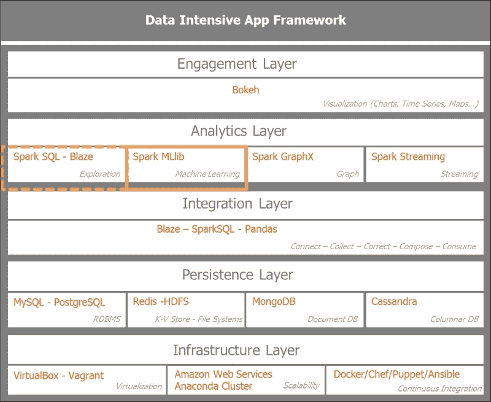
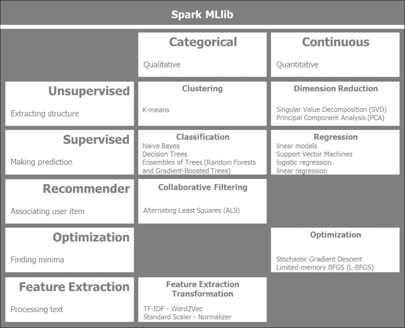
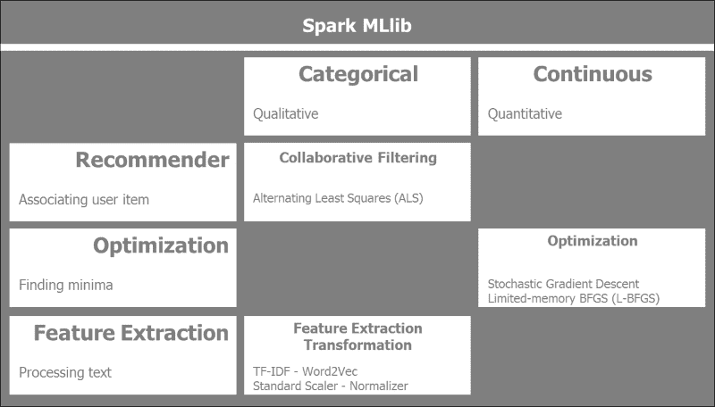
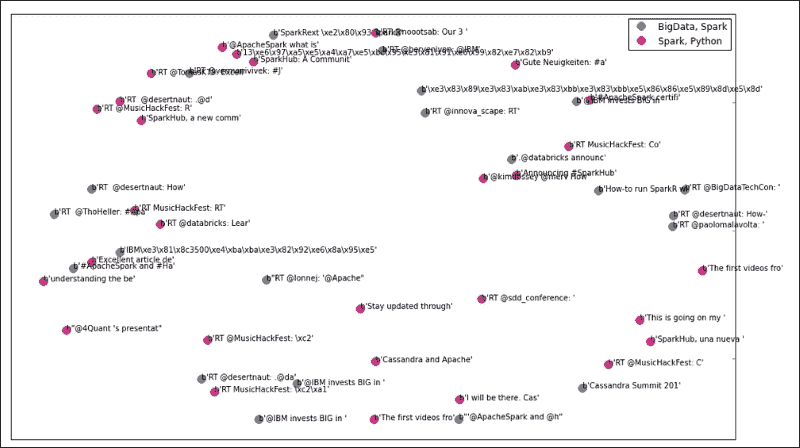
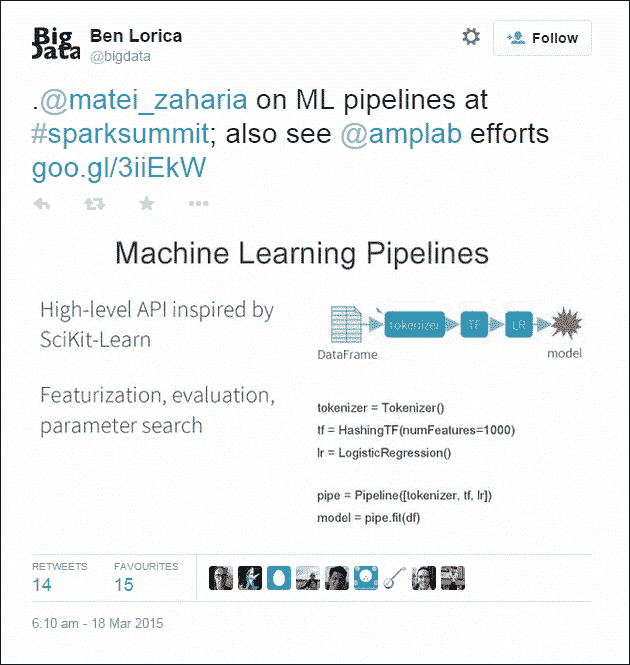

# 第 4 章：使用 Spark 从数据中学习

由于我们已经为上一章中要收集的数据奠定了基础，现在我们已经准备好从数据中学习。 机器学习是从数据中提取洞察力。 我们的目标是概述 Spark**MLlib**(**机器学习库**)，并将适当的算法应用于我们的数据集，以得出见解。 在 Twitter 数据集中，我们将应用一种无监督的聚类算法，以区分与 Apache Spark 相关的 tweet 和其他 tweet。 作为初始输入，我们有一大堆推文。 我们首先需要对数据进行预处理以提取相关特征，然后将机器学习算法应用于我们的数据集，最后对模型的结果和性能进行评估。

在本章中，我们将介绍以下几点：

*   概述了 Spark MLlib 模块及其算法和典型的机器学习工作流程。
*   对 Twitter 采集的数据集进行预处理以提取相关特征，应用无监督聚类算法来识别与*Apache Spark*相关的 tweet。 然后，对所建立的模型和所得到的结果进行评价。
*   描述 Spark 机器学习管道。

# 在应用架构中设置 Spark MLlib 的上下文

让我们首先将本章的重点放在数据密集型应用架构上。 我们将把注意力集中在分析层，更准确地说，是机器学习。 这将作为流应用的基础，因为我们希望将从数据批处理中学到的知识应用于流分析的推理规则。

下图设置了本章重点介绍的上下文，突出显示了分析层中的机器学习模块，同时使用探索性数据分析工具、Spark SQL 和 Pandas。



# Spark MLlib 算法分类

Spark MLlib 是 Spark 的一个快速演化模块，每个版本的 Spark 都会添加新的算法。

下图提供了 Spark MLlib 算法的高级概述，这些算法归入传统的广泛机器学习技术中，并遵循数据的分类或连续性质：



根据数据类型，我们将 Spark MLlib 算法分为两列，分类或连续。 我们将定性或定性的数据与定量的连续数据区分开来。 定性数据的一个例子是预测天气；考虑到大气压力、温度以及云的存在和类型，天气将是晴朗、干燥、下雨或阴天。 这些都是离散值。 另一方面，假设我们要预测房价，给定位置、面积和床位数，可以使用线性回归来预测房地产价值。 在这种情况下，我们谈论的是连续值或量化值。

水平分组反映了所使用的机器学习方法的类型。 无监督和有监督的机器学习技术取决于训练数据是否被标记。 在无监督学习挑战中，学习算法没有标签。 目标是找到其输入中隐藏的结构。 在监督学习的情况下，数据被标记。 重点是如果数据是连续的，则使用回归进行预测；如果数据是分类的，则使用分类进行预测。

机器学习的一个重要类别是推荐系统，它利用协作过滤技术。 亚马逊网络商店和 Netflix 都有非常强大的推荐系统来支持他们的推荐。

**随机梯度下降**是一种非常适合 Spark 分布式计算的机器学习优化技术。

对于处理大量文本，Spark 提供了关键的库来进行特征提取和转换，比如**TF-IDF**(简写为**Term Frequency-Inverse Document Frequency**)、word2vec、标准缩放器和规格化器。

## 有监督和无监督学习

我们在这里更深入地研究 Spark MLlib 提供的传统机器学习算法。 我们根据数据是否被标记来区分监督学习和非监督学习。 我们根据数据是离散的还是连续的来区分分类的或连续的。

下图说明了 Spark MLlib 有监督和无监督的机器学习算法和预处理技术：


Spark 目前提供以下监督和非监督 MLlib 算法和预处理技术：

*   **聚类**：这是一种无监督的机器学习技术，其中的数据是没有标签的。 目的是从数据中提取结构：
    *   **K-意味着**：这将数据划分到 K 个不同的集群中
    *   **高斯混合**：根据分量的最大后验概率分配聚类
    *   **幂迭代聚类(PIC)**：此根据成对边的相似性对图的顶点进行分组
    *   **潜在 Dirichlet 分配**(**lda**)：此用于将文本文档集合分组为主题
    *   **流式 K-意味着**：这表示使用窗口函数对传入数据进行动态群集流式数据
*   **降维**：这旨在减少考虑的特征数量。 实质上，这减少了数据中的噪音，并集中在关键功能上：
    *   **奇异值分解**(**SVD**)：这将包含数据的矩阵分解成更简单的有意义的片段。 它将初始矩阵分解为三个矩阵。
    *   **主成分分析**(**PCA**)：这用低维子空间近似高维数据集。
*   **回归和分类**：回归使用标记的训练数据预测输出值，而分类将结果分组为类。 分类具有分类或无序的因变量，而回归具有连续且有序的因变量：
    *   **线性回归模型**(线性回归、逻辑回归和支持向量机)：线性回归算法可以表示为以基于权重变量的向量最小化目标函数为目标的凸优化问题。 目标函数通过函数的正则化部分控制模型的复杂度，通过函数的损失部分控制模型的误差。
    *   **朴素贝叶斯**：这基于给定观测的标签的条件概率分布进行预测。 它假定功能彼此独立。
    *   **决策树**：这执行功能空间的递归二进制划分。 最大化树节点级别的信息增益，以便确定分区的最佳分割。
    *   **树集成**(随机森林和梯度增强树)：树集成算法组合基本决策树模型，以构建性能模型。 它们直观且非常成功用于分类和回归任务。
*   **等张回归**：此最小化给定数据和观察到的响应之间的均方误差。

## 附加学习算法

Spark MLlib提供了比监督和非监督学习算法更多的算法。 我们还有另外三种机器学习方法：推荐系统、优化算法和特征提取。



Spark 目前提供以下个附加 MLlib 算法：

*   **协作过滤**：这是推荐系统的基础。 它创建用户-项关联矩阵，旨在填补空白。 根据其他用户和项目及其评分，推荐目标用户没有评分的项目。 在分布式计算中，最成功的算法之一是**ALS**(**交替最小二乘**的缩写)：
    *   **交替最小二乘**：这种矩阵分解技术结合了隐式反馈、时间效应和置信度。 它将大用户项矩阵分解为较低维的用户和项因子。 它通过交替固定二次损失函数的因子使其最小化。
*   **特征提取和转换**：这些是大型文本文档处理的基本技术。 IT包括以下技术：
    *   **词频**：搜索引擎使用 TF-IDF 对庞大语料库中的文档相关性进行评分和排名。 它还用于机器学习，以确定单词在文档或语料库中的重要性。 术语频率统计地确定术语相对于其在语料库中的频率的权重。 词频本身可能会产生误导，因为它过度强调了*、*的、*或*和*等提供的信息很少的单词。 反向文档频率提供信息量的特异性或度量，无论该术语在语料库中的所有文档中是罕见的还是常见的。*
    *   **word2vec**：包括**Skip-Gram**和**连续包 Word**两种型号。 Skip-Gram 基于单词的滑动窗口预测给定单词的相邻单词，而连续词袋预测给定相邻单词的当前单词。
    *   **标准定标器**：作为预处理的一部分，数据集通常必须通过均值移除和方差缩放进行标准化。 我们计算训练数据的均值和标准差，并对测试数据进行同样的变换。
    *   **规格化器**：我们对样本进行缩放，使其具有单位范数。 它对于二次型(如点积或核方法)很有用。
    *   **特征选择**：这通过为模型选择最相关的特征来降低向量空间的维度。
    *   **卡方选择器**：这是一种衡量两个事件独立性的统计方法。
*   **优化**：这些特定的 Spark MLlib 优化算法侧重于梯度下降的各种技术。 Spark 在分布式计算机集群上提供了非常高效的渐变下降实现。 它通过迭代地沿着最陡峭的下坡寻找局部极小值。 它是计算密集型的，因为它遍历所有可用的数据：
    *   **随机梯度下降**：我们最小化一个目标函数，该目标函数是可微函数的和。 随机梯度下降仅使用训练数据的样本来更新特定迭代中的参数。 它用于文本分类等大规模稀疏机器学习问题。
*   **有限内存 BFGS**(**L-BFGS**)：顾名思义，L-BFGS 使用有限内存，适合 Spark MLlib 的分布式优化算法实现。

# Spark MLlib 数据类型

MLlib支持四种基本数据类型：**局部向量**、**标记点**、**局部矩阵**和**分布式矩阵**。 这些数据类型广泛用于 Spark MLlib 算法：

*   **本地向量**：此驻留在单个机器中。 它可以是密集的，也可以是稀疏的：
    *   密集向量是传统的双精度数组。 稠密向量的一个例子是`[5.0, 0.0, 1.0, 7.0]`。
    *   Sparse vector uses integer indices and double values. So the sparse representation of the vector `[5.0, 0.0, 1.0, 7.0]` would be `(4, [0, 2, 3], [5.0, 1.0, 7.0])`, where represent the dimension of the vector.

        以下是 PySpark 中局部向量的示例：

        ```py
        import numpy as np
        import scipy.sparse as sps
        from pyspark.mllib.linalg import Vectors

        # NumPy array for dense vector.
        dvect1 = np.array([5.0, 0.0, 1.0, 7.0])
        # Python list for dense vector.
        dvect2 = [5.0, 0.0, 1.0, 7.0]
        # SparseVector creation
        svect1 = Vectors.sparse(4, [0, 2, 3], [5.0, 1.0, 7.0])
        # Sparse vector using a single-column SciPy csc_matrix
        svect2 = sps.csc_matrix((np.array([5.0, 1.0, 7.0]), np.array([0, 2, 3])), shape = (4, 1))
        ```

    *   **Labeled point**. A labeled point is a dense or sparse vector with a label used in supervised learning. In the case of binary labels, 0.0 represents the negative label whilst 1.0 represents the positive value.

        以下是 PySpark 中的标签点的示例：

        ```py
        from pyspark.mllib.linalg import SparseVector
        from pyspark.mllib.regression import LabeledPoint

        # Labeled point with a positive label and a dense feature vector.
        lp_pos = LabeledPoint(1.0, [5.0, 0.0, 1.0, 7.0])

        # Labeled point with a negative label and a sparse feature vector.
        lp_neg = LabeledPoint(0.0, SparseVector(4, [0, 2, 3], [5.0, 1.0, 7.0]))
        ```

    *   **Local Matrix**: This local matrix resides in a single machine with integer-type indices and values of type double.

        以下是 PySpark 中的本地矩阵示例：

        ```py
        from pyspark.mllib.linalg import Matrix, Matrices

        # Dense matrix ((1.0, 2.0, 3.0), (4.0, 5.0, 6.0))
        dMatrix = Matrices.dense(2, 3, [1, 2, 3, 4, 5, 6])

        # Sparse matrix ((9.0, 0.0), (0.0, 8.0), (0.0, 6.0))
        sMatrix = Matrices.sparse(3, 2, [0, 1, 3], [0, 2, 1], [9, 6, 8])
        ```

    *   **分布式矩阵**：利用 RDD 的分布式成熟特性，分布式矩阵可以在机器集群中共享。 我们区分四种分布式矩阵类型：`RowMatrix`、`IndexedRowMatrix`、`CoordinateMatrix`和`BlockMatrix`：
        *   `RowMatrix`：这获取向量的 RDD，并从向量的 RDD 创建具有无意义索引的分布式行矩阵，称为`RowMatrix`。
        *   `IndexedRowMatrix`：在这种情况下，行索引是有意义的。 首先，我们使用类`IndexedRow`创建索引行的 RDD，然后创建`IndexedRowMatrix`。
        *   `CoordinateMatrix`：这对于表示非常大和非常稀疏的矩阵非常有用。 `CoordinateMatrix`是从个`MatrixEntry`点的 RDDS 创建的，由类型(long、long 或浮点数)的元组表示
        *   `BlockMatrix`：这些是从子矩阵块的 RDDS 创建的，其中子矩阵块是`((blockRowIndex, blockColIndex), sub-matrix)`。

# 机器学习工作流和数据流

除了算法，机器学习还涉及过程。 我们将讨论有监督和无监督机器学习的典型工作流和数据流。

## 有监督的机器学习工作流

在有监督机器学习中，输入训练数据集被标记。 关键的数据实践之一是将输入数据分成训练集和测试集，并相应地验证模式。

在有监督的学习中，我们通常会经历六个步骤的流程：

*   **收集数据**：这一步基本上与上一章联系在一起，并确保我们以正确的数量和粒度收集正确的数据，以便使机器学习算法能够提供可靠的答案。
*   **Preprocess the data**: This step is about checking the data quality by sampling, filling in the missing values if any, scaling and normalizing the data. We also define the feature extraction process. Typically, in the case of large text-based datasets, we apply tokenization, stop words removal, stemming, and TF-IDF.

    在有监督学习的情况下，我们将输入数据分成训练集和测试集。 出于交叉验证的目的，我们还可以实施各种采样和拆分数据集的策略。

*   **准备好数据**：在此步骤中，我们获得算法期望的格式或数据类型的数据。 在 Spark MLlib 的情况下，这包括局部向量、密集或稀疏向量、标记点、局部矩阵、带行矩阵的分布式矩阵、索引行矩阵、坐标矩阵和块矩阵。
*   **模型**：在此步骤中，我们应用适合于手头问题的算法，并在评估步骤中获得用于评估最合适算法的结果。 我们可能有多个适用于该问题的算法；在评估步骤中将对它们各自的性能进行评分，以选择最好的预成型算法。 为了达到最好的效果，我们可以实施整体或组合模型。
*   **优化**：我们可能需要对某些算法的最佳参数运行网格搜索。 这些参数在培训期间确定，并在测试和生产阶段进行微调。
*   **评估**：我们最终对模型进行评分，并在准确性、性能、可靠性和可扩展性方面选择最好的模型。 为了确定模型的预测精度，我们将性能最好的模型移动到保持不变的测试数据中进行测试。 一旦对微调的模型感到满意，我们就将其转移到生产中来处理实时数据。

受监督的机器学习工作流程和数据流如下图所示：


## 无监督机器学习工作流

由于与监督学习相反，在无监督学习的情况下，我们的初始数据没有标记，这在现实生活中最常见。 我们将使用聚类或降维算法从数据中提取结构。 在无监督学习的情况下，我们不会将数据分为训练和测试，因为我们不能做出任何预测，因为数据没有标记。 我们将按照与监督学习类似的六个步骤来训练数据。 一旦模型经过训练，我们将评估结果并对模型进行微调，然后将其发布用于生产。

无监督学习可能是监督学习的第一步。 也就是说，在开始学习阶段之前，我们考虑降低数据的维度。

无监督机器学习工作流和数据流表示如下：


# 对 Twitter 数据集进行聚类

让我们首先感受一下从 Twitter 提取的数据，并了解其数据结构，以便通过 K-Means 聚类算法进行准备和运行。 我们的攻击计划使用前面描述的流程和数据流进行无监督学习。 具体步骤如下：

1.  将所有推文文件合并到单个数据帧中。
2.  解析 tweet，删除停用的单词，提取表情符号，提取 URL，最后将单词规范化(例如，将它们映射为小写，并删除标点符号和数字)。
3.  特征提取包括以下内容：
    *   **标记化**：这会将解析的 tweet 文本分解为单独的单词或标记
    *   **TF-IDF**：它应用 TF-IDF 算法从标记化的 tweet 文本创建特征向量
    *   **散列 TF-IDF**：这将散列函数应用于令牌向量
4.  运行 K-Means 聚类算法。
5.  评估K-Means 聚类的结果：
    *   识别群集的推文成员身份
    *   使用多维缩放或主成分分析算法将维度降维到二维
    *   绘制群集图
6.  管道：
    *   微调相关簇的数量 K
    *   衡量模型成本
    *   选择最优模型

## 应用 Scikit-了解 Twitter 数据集

Python自己的 Scikit-Learning 机器学习库是目前最可靠、最直观、最健壮的工具之一。 让我们使用 Pandas 和 Scikit-Learning 进行预处理和无监督学习。 在使用 Spark MLlib 剥离集群之前，使用 Scikit-Learning 探索数据样本通常是有益的。

我们有一个包含 7540 条推文的混合包。 它包含了与Apache·斯帕克(Apache Spark)、巨蟒(Python)、以希拉里·克林顿(Hillary Clinton)和唐纳德·特朗普(Donald Trump)为主角的即将到来的总统大选有关的推文，以及与 Lady Gaga 和贾斯汀·比伯(Justin Bieber)一起与时尚和音乐有关的推文。 我们正在使用 Python Scikit 运行 K-Means 聚类算法-在收集到的 Twitter 数据集上学习。 我们首先将样本数据加载到 Pandas 数据帧中：

```py
import pandas as pd

csv_in = 'C:\\Users\\Amit\\Documents\\IPython Notebooks\\AN00_Data\\unq_tweetstxt.csv'
twts_df01 = pd.read_csv(csv_in, sep =';', encoding='utf-8')

In [24]:

twts_df01.count()
Out[24]:
Unnamed: 0    7540
id            7540
created_at    7540
user_id       7540
user_name     7538
tweet_text    7540
dtype: int64

#
# Introspecting the tweets text
#
In [82]:

twtstxt_ls01[6910:6920]
Out[82]:
['RT @deroach_Ismoke: I am NOT voting for #hilaryclinton http://t.co/jaZZpcHkkJ',
 'RT @AnimalRightsJen: #HilaryClinton What do Bernie Sanders and Donald Trump Have in Common?: He has so far been th... http://t.co/t2YRcGCh6…',
 'I understand why Bill was out banging other chicks........I mean look at what he is married to.....\n@HilaryClinton',
 '#HilaryClinton What do Bernie Sanders and Donald Trump Have in Common?: He has so far been th... http://t.co/t2YRcGCh67 #Tcot #UniteBlue']
```

我们首先从推文文本中提取特征。 我们使用具有 10,000 个特征和英语停用词的 TF-IDF 向量器将稀疏向量器应用于数据集：

```py
In [37]:

print("Extracting features from the training dataset using a sparse vectorizer")
t0 = time()
Extracting features from the training dataset using a sparse vectorizer
In [38]:

vectorizer = TfidfVectorizer(max_df=0.5, max_features=10000,
                                 min_df=2, stop_words='english',
                                 use_idf=True)
X = vectorizer.fit_transform(twtstxt_ls01)
#
# Output of the TFIDF Feature vectorizer
#
print("done in %fs" % (time() - t0))
print("n_samples: %d, n_features: %d" % X.shape)
print()
done in 5.232165s
n_samples: 7540, n_features: 6638
```

由于数据集现在被分成具有 6,638 个特征向量的 7540 个样本，我们准备将这个稀疏矩阵提供给 K-Means 聚类算法。 我们最初将选择 7 个群集和 100 个最大迭代次数：

```py
In [47]:

km = KMeans(n_clusters=7, init='k-means++', max_iter=100, n_init=1,
            verbose=1)

print("Clustering sparse data with %s" % km)
t0 = time()
km.fit(X)
print("done in %0.3fs" % (time() - t0))

Clustering sparse data with KMeans(copy_x=True, init='k-means++', max_iter=100, n_clusters=7, n_init=1,
    n_jobs=1, precompute_distances='auto', random_state=None, tol=0.0001,
    verbose=1)
Initialization complete
Iteration  0, inertia 13635.141
Iteration  1, inertia 6943.485
Iteration  2, inertia 6924.093
Iteration  3, inertia 6915.004
Iteration  4, inertia 6909.212
Iteration  5, inertia 6903.848
Iteration  6, inertia 6888.606
Iteration  7, inertia 6863.226
Iteration  8, inertia 6860.026
Iteration  9, inertia 6859.338
Iteration 10, inertia 6859.213
Iteration 11, inertia 6859.102
Iteration 12, inertia 6859.080
Iteration 13, inertia 6859.060
Iteration 14, inertia 6859.047
Iteration 15, inertia 6859.039
Iteration 16, inertia 6859.032
Iteration 17, inertia 6859.031
Iteration 18, inertia 6859.029
Converged at iteration 18
done in 1.701s
```

K-均值聚类算法在 18 次迭代后收敛。 我们在下面的结果中看到这七个聚类及其各自的关键词。 集群`0`和`6`是关于音乐和时尚的，有贾斯汀·比伯和 Lady Gaga 相关的推文。 群集`1`和`5`与唐纳德·特朗普(Donald Trump)和希拉里·克林顿(Hilary Clinton)相关的推文与美国总统大选有关。 集群`2`和`3`是我们感兴趣的，因为它们是关于 Apache Spark 和 Python 的。 群集`4`包含与泰国相关的推文：

```py
#
# Introspect top terms per cluster
#

In [49]:

print("Top terms per cluster:")
order_centroids = km.cluster_centers_.argsort()[:, ::-1]
terms = vectorizer.get_feature_names()
for i in range(7):
    print("Cluster %d:" % i, end='')
    for ind in order_centroids[i, :20]:
        print(' %s' % terms[ind], end='')
    print()
Top terms per cluster:
Cluster 0: justinbieber love mean rt follow thank hi https whatdoyoumean video wanna hear whatdoyoumeanviral rorykramer happy lol making person dream justin
Cluster 1: donaldtrump hilaryclinton rt https trump2016 realdonaldtrump trump gop amp justinbieber president clinton emails oy8ltkstze tcot like berniesanders hilary people email
Cluster 2: bigdata apachespark hadoop analytics rt spark training chennai ibm datascience apache processing cloudera mapreduce data sap https vora transforming development
Cluster 3: apachespark python https rt spark data amp databricks using new learn hadoop ibm big apache continuumio bluemix learning join open
Cluster 4: ernestsgantt simbata3 jdhm2015 elsahel12 phuketdailynews dreamintentions beyhiveinfrance almtorta18 civipartnership 9_a_6 25whu72ep0 k7erhvu7wn fdmxxxcm3h osxuh2fxnt 5o5rmb0xhp jnbgkqn0dj ovap57ujdh dtzsz3lb6x sunnysai12345 sdcvulih6g
Cluster 5: trump donald donaldtrump starbucks trumpquote trumpforpresident oy8ltkstze https zfns7pxysx silly goy stump trump2016 news jeremy coffee corbyn ok7vc8aetz rt tonight
Cluster 6: ladygaga gaga lady rt https love follow horror cd story ahshotel american japan hotel human trafficking music fashion diet queen ahs
```

我们将通过绘制群集来可视化结果。 我们有 7540 个样本，6638 个特征。 那么多维度是不可能想象的。 我们将使用**多维缩放**(**MDS**)算法将集群的多维特征分解为两个易于处理的维度，以便能够描绘它们：

```py
import matplotlib.pyplot as plt
import matplotlib as mpl
from sklearn.manifold import MDS

MDS()

#
# Bring down the MDS to two dimensions (components) as we will plot 
# the clusters
#
mds = MDS(n_components=2, dissimilarity="precomputed", random_state=1)

pos = mds.fit_transform(dist)  # shape (n_components, n_samples)

xs, ys = pos[:, 0], pos[:, 1]

In [67]:

#
# Set up colors per clusters using a dict
#
cluster_colors = {0: '#1b9e77', 1: '#d95f02', 2: '#7570b3', 3: '#e7298a', 4: '#66a61e', 5: '#9990b3', 6: '#e8888a'}

#
#set up cluster names using a dict
#
cluster_names = {0: 'Music, Pop', 
                 1: 'USA Politics, Election', 
                 2: 'BigData, Spark', 
                 3: 'Spark, Python',
                 4: 'Thailand', 
                 5: 'USA Politics, Election', 
                 6: 'Music, Pop'}
In [115]:
#
# ipython magic to show the matplotlib plots inline
#
%matplotlib inline 

#
# Create data frame which includes MDS results, cluster numbers and tweet texts to be displayed
#
df = pd.DataFrame(dict(x=xs, y=ys, label=clusters, txt=twtstxt_ls02_utf8))
ix_start = 2000
ix_stop  = 2050
df01 = df[ix_start:ix_stop]

print(df01[['label','txt']])
print(len(df01))
print()

# Group by cluster

groups = df.groupby('label')
groups01 = df01.groupby('label')

# Set up the plot

fig, ax = plt.subplots(figsize=(17, 10)) 
ax.margins(0.05) 

#
# Build the plot object
#
for name, group in groups01:
    ax.plot(group.x, group.y, marker='o', linestyle='', ms=12, 
            label=cluster_names[name], color=cluster_colors[name], 
            mec='none')
    ax.set_aspect('auto')
    ax.tick_params(\
        axis= 'x',         # settings for x-axis
        which='both',      # 
        bottom='off',      # 
        top='off',         # 
        labelbottom='off')
    ax.tick_params(\
        axis= 'y',         # settings for y-axis
        which='both',      # 
        left='off',        # 
        top='off',         # 
        labelleft='off')

ax.legend(numpoints=1)     #
#
# Add label in x,y position with tweet text
#
for i in range(ix_start, ix_stop):
    ax.text(df01.ix[i]['x'], df01.ix[i]['y'], df01.ix[i]['txt'], size=10)  

plt.show()                 # Display the plot

      label       text
2000      2       b'RT @BigDataTechCon: '
2001      3       b"@4Quant 's presentat"
2002      2       b'Cassandra Summit 201'
```

下面是用蓝点表示的 Cluster`2`、*Big Data*和*Spark*以及用红点表示的 Cluster`3`、*Spark*和*Python*的曲线图，以及与各个群集相关的一些示例 tweet：



通过使用Scikit-Learn 进行的探索和处理，我们对数据有了一些很好的见解。 我们现在将注意力集中在 Spark MLlib 上，并在 Twitter 数据集上兜风。

## 对数据集进行预处理

现在，我们将重点放在特征提取和工程上，以便为聚类算法的运行做好数据准备。 我们实例化 Spark 上下文并将 Twitter 数据集读入 Spark 数据帧。 然后，我们将依次对 tweet 文本数据进行标记化，对标记应用散列术语频率算法，最后应用反转文档频率算法并重新调整数据比例。 代码如下：

```py
In [3]:
#
# Read csv in a Panda DF
#
#
import pandas as pd
csv_in = '/home/an/spark/spark-1.5.0-bin-hadoop2.6/examples/AN_Spark/data/unq_tweetstxt.csv'
pddf_in = pd.read_csv(csv_in, index_col=None, header=0, sep=';', encoding='utf-8')

In [4]:

sqlContext = SQLContext(sc)

In [5]:

#
# Convert a Panda DF to a Spark DF
#
#

spdf_02 = sqlContext.createDataFrame(pddf_in[['id', 'user_id', 'user_name', 'tweet_text']])

In [8]:

spdf_02.show()

In [7]:

spdf_02.take(3)

Out[7]:

[Row(id=638830426971181057, user_id=3276255125, user_name=u'True Equality', tweet_text=u'ernestsgantt: BeyHiveInFrance: 9_A_6: dreamintentions: elsahel12: simbata3: JDHM2015: almtorta18: dreamintentions:\u2026 http://t.co/VpD7FoqMr0'),
 Row(id=638830426727911424, user_id=3276255125, user_name=u'True Equality', tweet_text=u'ernestsgantt: BeyHiveInFrance: PhuketDailyNews: dreamintentions: elsahel12: simbata3: JDHM2015: almtorta18: CiviPa\u2026 http://t.co/VpD7FoqMr0'),
 Row(id=638830425402556417, user_id=3276255125, user_name=u'True Equality', tweet_text=u'ernestsgantt: BeyHiveInFrance: 9_A_6: ernestsgantt: elsahel12: simbata3: JDHM2015: almtorta18: CiviPartnership: dr\u2026 http://t.co/EMDOn8chPK')]

In [9]:

from pyspark.ml.feature import HashingTF, IDF, Tokenizer

In [10]:

#
# Tokenize the tweet_text 
#
tokenizer = Tokenizer(inputCol="tweet_text", outputCol="tokens")
tokensData = tokenizer.transform(spdf_02)

In [11]:

tokensData.take(1)

Out[11]:

[Row(id=638830426971181057, user_id=3276255125, user_name=u'True Equality', tweet_text=u'ernestsgantt: BeyHiveInFrance: 9_A_6: dreamintentions: elsahel12: simbata3: JDHM2015: almtorta18: dreamintentions:\u2026 http://t.co/VpD7FoqMr0', tokens=[u'ernestsgantt:', u'beyhiveinfrance:', u'9_a_6:', u'dreamintentions:', u'elsahel12:', u'simbata3:', u'jdhm2015:', u'almtorta18:', u'dreamintentions:\u2026', u'http://t.co/vpd7foqmr0'])]

In [14]:

#
# Apply Hashing TF to the tokens
#
hashingTF = HashingTF(inputCol="tokens", outputCol="rawFeatures", numFeatures=2000)
featuresData = hashingTF.transform(tokensData)

In [15]:

featuresData.take(1)

Out[15]:

[Row(id=638830426971181057, user_id=3276255125, user_name=u'True Equality', tweet_text=u'ernestsgantt: BeyHiveInFrance: 9_A_6: dreamintentions: elsahel12: simbata3: JDHM2015: almtorta18: dreamintentions:\u2026 http://t.co/VpD7FoqMr0', tokens=[u'ernestsgantt:', u'beyhiveinfrance:', u'9_a_6:', u'dreamintentions:', u'elsahel12:', u'simbata3:', u'jdhm2015:', u'almtorta18:', u'dreamintentions:\u2026', u'http://t.co/vpd7foqmr0'], rawFeatures=SparseVector(2000, {74: 1.0, 97: 1.0, 100: 1.0, 160: 1.0, 185: 1.0, 742: 1.0, 856: 1.0, 991: 1.0, 1383: 1.0, 1620: 1.0}))]

In [16]:

#
# Apply IDF to the raw features and rescale the data
#
idf = IDF(inputCol="rawFeatures", outputCol="features")
idfModel = idf.fit(featuresData)
rescaledData = idfModel.transform(featuresData)

for features in rescaledData.select("features").take(3):
  print(features)

In [17]:

rescaledData.take(2)

Out[17]:

[Row(id=638830426971181057, user_id=3276255125, user_name=u'True Equality', tweet_text=u'ernestsgantt: BeyHiveInFrance: 9_A_6: dreamintentions: elsahel12: simbata3: JDHM2015: almtorta18: dreamintentions:\u2026 http://t.co/VpD7FoqMr0', tokens=[u'ernestsgantt:', u'beyhiveinfrance:', u'9_a_6:', u'dreamintentions:', u'elsahel12:', u'simbata3:', u'jdhm2015:', u'almtorta18:', u'dreamintentions:\u2026', u'http://t.co/vpd7foqmr0'], rawFeatures=SparseVector(2000, {74: 1.0, 97: 1.0, 100: 1.0, 160: 1.0, 185: 1.0, 742: 1.0, 856: 1.0, 991: 1.0, 1383: 1.0, 1620: 1.0}), features=SparseVector(2000, {74: 2.6762, 97: 1.8625, 100: 2.6384, 160: 2.9985, 185: 2.7481, 742: 5.5269, 856: 4.1406, 991: 2.9518, 1383: 4.694, 1620: 3.073})),
 Row(id=638830426727911424, user_id=3276255125, user_name=u'True Equality', tweet_text=u'ernestsgantt: BeyHiveInFrance: PhuketDailyNews: dreamintentions: elsahel12: simbata3: JDHM2015: almtorta18: CiviPa\u2026 http://t.co/VpD7FoqMr0', tokens=[u'ernestsgantt:', u'beyhiveinfrance:', u'phuketdailynews:', u'dreamintentions:', u'elsahel12:', u'simbata3:', u'jdhm2015:', u'almtorta18:', u'civipa\u2026', u'http://t.co/vpd7foqmr0'], rawFeatures=SparseVector(2000, {74: 1.0, 97: 1.0, 100: 1.0, 160: 1.0, 185: 1.0, 460: 1.0, 987: 1.0, 991: 1.0, 1383: 1.0, 1620: 1.0}), features=SparseVector(2000, {74: 2.6762, 97: 1.8625, 100: 2.6384, 160: 2.9985, 185: 2.7481, 460: 6.4432, 987: 2.9959, 991: 2.9518, 1383: 4.694, 1620: 3.073}))]

In [21]:

rs_pddf = rescaledData.toPandas()

In [22]:

rs_pddf.count()

Out[22]:

id             7540
user_id        7540
user_name      7540
tweet_text     7540
tokens         7540
rawFeatures    7540
features       7540
dtype: int64

In [27]:

feat_lst = rs_pddf.features.tolist()

In [28]:

feat_lst[:2]

Out[28]:

[SparseVector(2000, {74: 2.6762, 97: 1.8625, 100: 2.6384, 160: 2.9985, 185: 2.7481, 742: 5.5269, 856: 4.1406, 991: 2.9518, 1383: 4.694, 1620: 3.073}),
 SparseVector(2000, {74: 2.6762, 97: 1.8625, 100: 2.6384, 160: 2.9985, 185: 2.7481, 460: 6.4432, 987: 2.9959, 991: 2.9518, 1383: 4.694, 1620: 3.073})]
```

## 运行群集算法

我们将对 Twitter 数据集使用 K-Means 算法。 作为一个未加标签的混杂的 tweet 包，我们想看看*Apache Spark*tweet 是否分组在单个集群中。 在前面的步骤中，特征的 TF-IDF 稀疏向量被转换为 RDD，该 RDD 将作为 Spark MLlib 程序的输入。 我们使用 5 个簇、10 次迭代、10 次运行来初始化 K-Means 模型：

```py
In [32]:

from pyspark.mllib.clustering import KMeans, KMeansModel
from numpy import array
from math import sqrt

In [34]:

# Load and parse the data

in_Data = sc.parallelize(feat_lst)

In [35]:

in_Data.take(3)

Out[35]:

[SparseVector(2000, {74: 2.6762, 97: 1.8625, 100: 2.6384, 160: 2.9985, 185: 2.7481, 742: 5.5269, 856: 4.1406, 991: 2.9518, 1383: 4.694, 1620: 3.073}),
 SparseVector(2000, {74: 2.6762, 97: 1.8625, 100: 2.6384, 160: 2.9985, 185: 2.7481, 460: 6.4432, 987: 2.9959, 991: 2.9518, 1383: 4.694, 1620: 3.073}),
 SparseVector(2000, {20: 4.3534, 74: 2.6762, 97: 1.8625, 100: 5.2768, 185: 2.7481, 856: 4.1406, 991: 2.9518, 1039: 3.073, 1620: 3.073, 1864: 4.6377})]

In [37]:

in_Data.count()

Out[37]:

7540

In [38]:

# Build the model (cluster the data)

clusters = KMeans.train(in_Data, 5, maxIterations=10,
        runs=10, initializationMode="random")

In [53]:

# Evaluate clustering by computing Within Set Sum of Squared Errors

def error(point):
    center = clusters.centers[clusters.predict(point)]
    return sqrt(sum([x**2 for x in (point - center)]))

WSSSE = in_Data.map(lambda point: error(point)).reduce(lambda x, y: x + y)
print("Within Set Sum of Squared Error = " + str(WSSSE))
```

## 对模型和结果进行评估

调整群集算法的一种方法是改变群集的数量并验证输出。 让我们检查群集，了解一下到目前为止的群集结果：

```py
In [43]:

cluster_membership = in_Data.map(lambda x: clusters.predict(x))

In [54]:

cluster_idx = cluster_membership.zipWithIndex()

In [55]:

type(cluster_idx)

Out[55]:

pyspark.rdd.PipelinedRDD

In [58]:

cluster_idx.take(20)

Out[58]:

[(3, 0),
 (3, 1),
 (3, 2),
 (3, 3),
 (3, 4),
 (3, 5),
 (1, 6),
 (3, 7),
 (3, 8),
 (3, 9),
 (3, 10),
 (3, 11),
 (3, 12),
 (3, 13),
 (3, 14),
 (1, 15),
 (3, 16),
 (3, 17),
 (1, 18),
 (1, 19)]

In [59]:

cluster_df = cluster_idx.toDF()

In [65]:

pddf_with_cluster = pd.concat([pddf_in, cluster_pddf],axis=1)

In [76]:

pddf_with_cluster._1.unique()

Out[76]:

array([3, 1, 4, 0, 2])

In [79]:

pddf_with_cluster[pddf_with_cluster['_1'] == 0].head(10)

Out[79]:
  Unnamed: 0   id   created_at   user_id   user_name   tweet_text   _1   _2
6227   3   642418116819988480   Fri Sep 11 19:23:09 +0000 2015   49693598   Ajinkya Kale   RT @bigdata: Distributed Matrix Computations i...   0   6227
6257   45   642391207205859328   Fri Sep 11 17:36:13 +0000 2015   937467860   Angela Bassa   [Auto] I'm reading ""Distributed Matrix Comput...   0   6257
6297   119   642348577147064320   Fri Sep 11 14:46:49 +0000 2015   18318677   Ben Lorica   Distributed Matrix Computations in @ApacheSpar...   0   6297
In [80]:

pddf_with_cluster[pddf_with_cluster['_1'] == 1].head(10)

Out[80]:
  Unnamed: 0   id   created_at   user_id   user_name   tweet_text   _1   _2
6   6   638830419090079746   Tue Sep 01 21:46:55 +0000 2015   2241040634   Massimo Carrisi   Python:Python: Removing \xa0 from string? - I ...   1   6
15   17   638830380578045953   Tue Sep 01 21:46:46 +0000 2015   57699376   Rafael Monnerat   RT @ramalhoorg: Noite de autógrafos do Fluent ...   1   15
18   41   638830280988426250   Tue Sep 01 21:46:22 +0000 2015   951081582   Jack Baldwin   RT @cloudaus: We are 3/4 full! 2-day @swcarpen...   1   18
19   42   638830276626399232   Tue Sep 01 21:46:21 +0000 2015   6525302   Masayoshi Nakamura   PynamoDB #AWS #DynamoDB #Python http://...   1   19
20   43   638830213288235008   Tue Sep 01 21:46:06 +0000 2015   3153874869   Baltimore Python   Flexx: Python UI tookit based on web technolog...   1   20
21   44   638830117645516800   Tue Sep 01 21:45:43 +0000 2015   48474625   Radio Free Denali   Hmm, emerge --depclean wants to remove somethi...   1   21
22   46   638829977014636544   Tue Sep 01 21:45:10 +0000 2015   154915461   Luciano Ramalho   Noite de autógrafos do Fluent Python no Garoa ...   1   22
23   47   638829882928070656   Tue Sep 01 21:44:47 +0000 2015   917320920   bsbafflesbrains   @DanSWright Harper channeling Monty Python. "...   1   23
24   48   638829868679954432   Tue Sep 01 21:44:44 +0000 2015   134280898   Lannick Technology   RT @SergeyKalnish: I am #hiring: Senior Back e...   1   24
25   49   638829707484508161   Tue Sep 01 21:44:05 +0000 2015   2839203454   Joshua Jones   RT @LindseyPelas: Surviving Monty Python in Fl...   1   25
In [81]:

pddf_with_cluster[pddf_with_cluster['_1'] == 2].head(10)

Out[81]:
  Unnamed: 0   id   created_at   user_id   user_name   tweet_text   _1   _2
7280   688   639056941592014848   Wed Sep 02 12:47:02 +0000 2015   2735137484   Chris   A true gay icon when will @ladygaga @Madonna @...   2   7280
In [82]:

pddf_with_cluster[pddf_with_cluster['_1'] == 3].head(10)

Out[82]:
  Unnamed: 0   id   created_at   user_id   user_name   tweet_text   _1   _2
0   0   638830426971181057   Tue Sep 01 21:46:57 +0000 2015   3276255125   True Equality   ernestsgantt: BeyHiveInFrance: 9_A_6: dreamint...   3   0
1   1   638830426727911424   Tue Sep 01 21:46:57 +0000 2015   3276255125   True Equality   ernestsgantt: BeyHiveInFrance: PhuketDailyNews...   3   1
2   2   638830425402556417   Tue Sep 01 21:46:56 +0000 2015   3276255125   True Equality   ernestsgantt: BeyHiveInFrance: 9_A_6: ernestsg...   3   2
3   3   638830424563716097   Tue Sep 01 21:46:56 +0000 2015   3276255125   True Equality   ernestsgantt: BeyHiveInFrance: PhuketDailyNews...   3   3
4   4   638830422256816132   Tue Sep 01 21:46:56 +0000 2015   3276255125   True Equality   ernestsgantt: elsahel12: 9_A_6: dreamintention...   3   4
5   5   638830420159655936   Tue Sep 01 21:46:55 +0000 2015   3276255125   True Equality   ernestsgantt: BeyHiveInFrance: PhuketDailyNews...   3   5
7   7   638830418330980352   Tue Sep 01 21:46:55 +0000 2015   3276255125   True Equality   ernestsgantt: elsahel12: 9_A_6: dreamintention...   3   7
8   8   638830397648822272   Tue Sep 01 21:46:50 +0000 2015   3276255125   True Equality   ernestsgantt: BeyHiveInFrance: PhuketDailyNews...   3   8
9   9   638830395375529984   Tue Sep 01 21:46:49 +0000 2015   3276255125   True Equality   ernestsgantt: elsahel12: 9_A_6: dreamintention...   3   9
10   10   638830392389177344   Tue Sep 01 21:46:49 +0000 2015   3276255125   True Equality   ernestsgantt: BeyHiveInFrance: PhuketDailyNews...   3   10
In [83]:

pddf_with_cluster[pddf_with_cluster['_1'] == 4].head(10)

Out[83]:
  Unnamed: 0   id   created_at   user_id   user_name   tweet_text   _1   _2
1361   882   642648214454317056   Sat Sep 12 10:37:28 +0000 2015   27415756   Raymond Enisuoh   LA Chosen For US 2024 Olympic Bid - LA2016 See...   4   1361
1363   885   642647848744583168   Sat Sep 12 10:36:01 +0000 2015   27415756   Raymond Enisuoh   Prison See: https://t.co/x3EKAExeFi … … … … … ...   4   1363
5412   11   640480770369286144   Sun Sep 06 11:04:49 +0000 2015   3242403023   Donald Trump 2016   " igiboooy! @ Starbucks https://t.co/97wdL...   4   5412
5428   27   640477140660518912   Sun Sep 06 10:50:24 +0000 2015   3242403023   Donald Trump 2016   "  @ Starbucks https://t.co/wsEYFIefk7 " - D...   4   5428
5455   61   640469542272110592   Sun Sep 06 10:20:12 +0000 2015   3242403023   Donald Trump 2016   " starbucks @ Starbucks Mam Plaza https://t.co...   4   5455
5456   62   640469541370372096   Sun Sep 06 10:20:12 +0000 2015   3242403023   Donald Trump 2016   " Aaahhh the pumpkin spice latte is back, fall...   4   5456
5457   63   640469539524898817   Sun Sep 06 10:20:12 +0000 2015   3242403023   Donald Trump 2016   " RT kayyleighferry: Oh my goddd Harry Potter ...   4   5457
5458   64   640469537176031232   Sun Sep 06 10:20:11 +0000 2015   3242403023   Donald Trump 2016   " Starbucks https://t.co/3xYYXlwNkf " - Donald...   4   5458
5459   65   640469536119070720   Sun Sep 06 10:20:11 +0000 2015   3242403023   Donald Trump 2016   " A Starbucks is under construction in my neig...   4   5459
5460   66   640469530435813376   Sun Sep 06 10:20:10 +0000 2015   3242403023   Donald Trump 2016   " Babam starbucks'tan fotogtaf atıyor bende du...   4   5460
```

我们用一些示例 tweet 映射个簇。 群集`0`是关于 Spark 的。 集群`1`是关于 Python 的。 群集`2`是关于 Lady Gaga 的。 群集`3`是关于泰国普吉岛新闻的。 集群`4`是关于唐纳德·特朗普(Donald Trump)的。

# 构建机器学习管道

我们希望在优化最佳调整参数的同时组合特征提取、准备活动、训练、测试和预测活动，以获得最佳性能的模型。

下面这条推文用五行代码完美地捕捉到了在 Spark MLlib 中实现的一个强大的机器学习管道：



Spark ML 管道的灵感来自于 Python 的 Scikit-Learning，它为数据的连续转换创建了一条简洁的声明性语句，以便快速交付一个可调优的模型。

# 摘要

在本章中，我们概述了 Spark MLlib 不断扩展的算法库 Spark MLlib。 我们讨论了监督和非监督学习、推荐系统、优化和特征提取算法。 然后，我们将从 Twitter 获得的数据放入机器学习过程、算法和评估中，以从数据中获得洞察力。 我们将 Twitter 上收集的数据集通过 Python Scikit-Learning 和 Spark MLlib K-Means 聚类，以便分离与*Apache Spark*相关的 tweet。 我们还对该模型的性能进行了评估。

这让我们为下一章做好了准备，下一章将介绍使用 Spark 的流媒体分析。 让我们直奔主题吧。