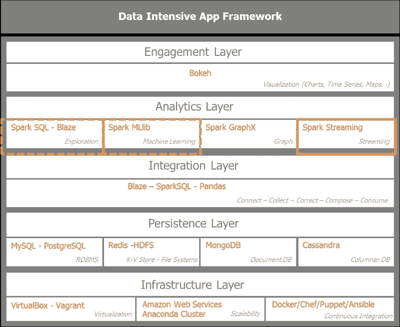
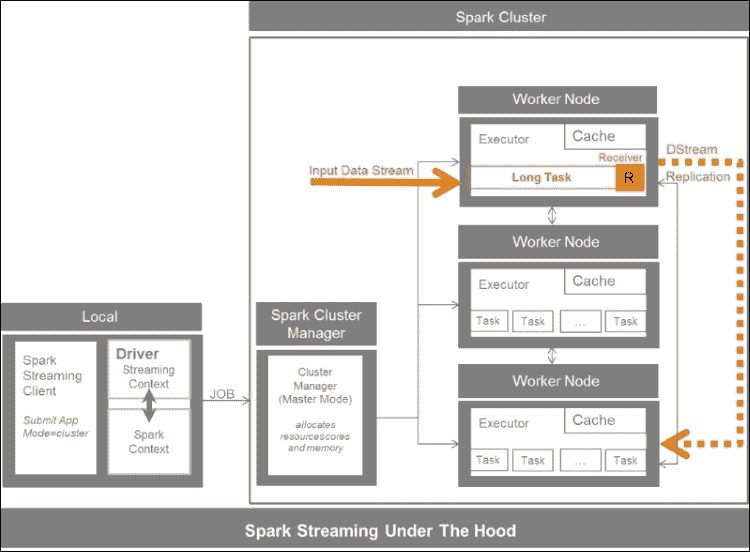
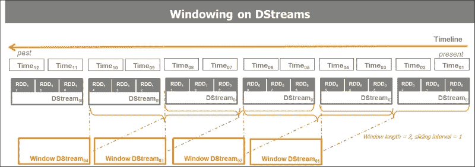
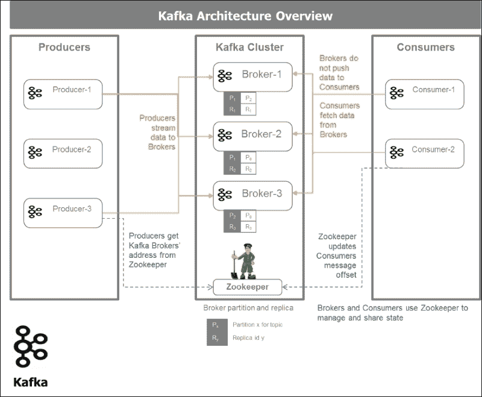
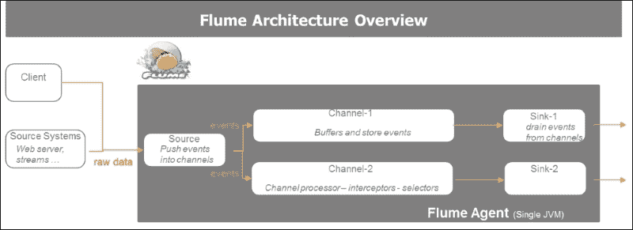
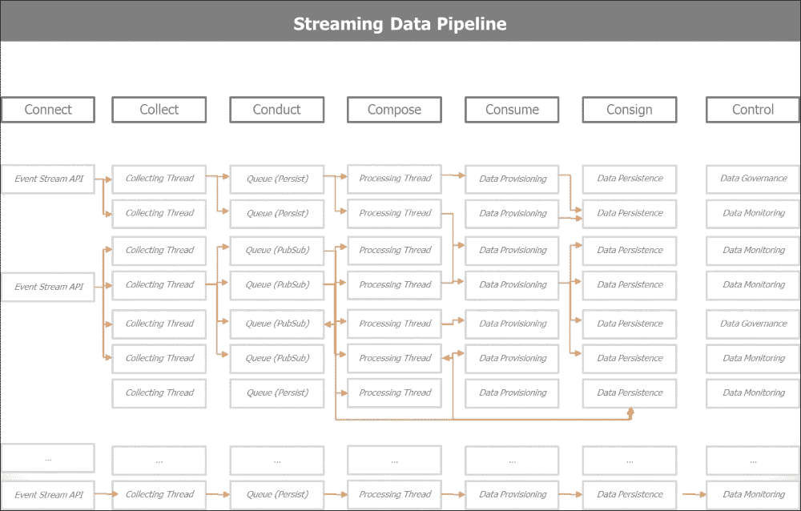
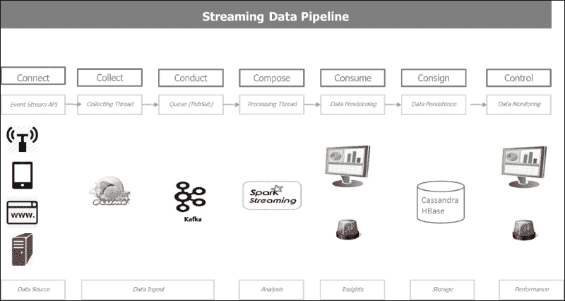
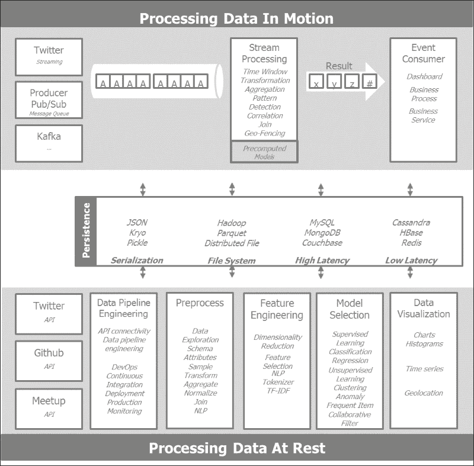
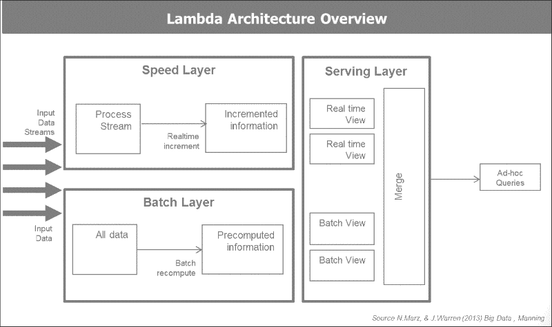

# 第 5 章：使用 Spark 流式传输实时数据

在本章中，我们将重点介绍流入 Spark 的实时流数据及其处理。 到目前为止，我们已经讨论了机器学习和批处理数据挖掘。 我们现在正在研究如何处理连续流动的数据以及动态检测事实和模式。 我们正从一个湖航行到一条河。

我们将首先调查这种动态和不断变化的环境带来的挑战。 在奠定了流应用的前提条件之后，我们将研究使用实时数据源(如 TCP 套接字到 Twitter Firehose)的各种实现，并将 Spark、Kafka 和 Flume 组合在一起，建立一个低延迟、高吞吐量和可伸缩的数据管道。

在本章中，我们将介绍以下几点：

*   分析流应用的体系结构挑战、约束和要求
*   使用 Spark Streaming 处理来自 TCP 套接字的实时数据
*   直接连接到 Twitter 防火墙以准实时解析推文
*   使用 Spark、Kafka 和 Flume 建立可靠、容错、可扩展、高吞吐量、低延迟的集成应用
*   关于 Lambda 和 Kappa 架构范例的结束语

# 为流媒体架构奠定基础

按照惯例，让我们首先回到我们最初绘制的数据密集型应用架构蓝图，并突出显示我们感兴趣的 Spark Streaming 模块。

下图通过突出显示 Spark Streaming 模块以及在整个数据密集型应用框架中与 Spark SQL 和 Spark MLlib 的交互来设置上下文。



来自股市时间序列、企业交易、交互、事件、网络流量、点击流和传感器的数据流。 所有事件都是带有时间戳的数据和紧急事件。 欺诈检测和预防、移动交叉销售和追加销售或流量警报就是这种情况。 这些数据流需要立即处理以实现监控目的，例如检测异常、离群值、垃圾邮件、欺诈和入侵；还需要提供基本的统计数据、洞察力、趋势和建议。 在某些情况下，汇总的聚合信息足以存储以供以后使用。 从体系结构范例的角度来看，我们正在从面向服务的体系结构过渡到事件驱动的体系结构。

出现了两种处理数据流的模型：

*   每次处理条传入的记录。 在处理传入记录之前，我们不会在容器中对它们进行缓冲。 Twitter 的 Storm、雅虎的 S4 和谷歌的 Millwar 就是这样的例子。
*   按小间隔进行微批处理或批处理计算，如 Spark Streaming 和 Storm Trident 执行的那样。 在这种情况下，我们根据微批处理设置中规定的时间窗口将传入记录缓冲到容器中。

Spark流经常被拿来与 Storm 相提并论。 它们是两种不同的流式数据模型。 Spark流是基于微批处理的。 Storm是基于对传入的记录进行处理的。 Storm 还提供了微批处理选项，其 Storm Trident 选项。

流应用中的驱动因素是延迟。 延迟从**RPC**(简写为**Remote Procedure Call**)的毫秒范围到Spark流等微批处理解决方案的几秒或几分钟不等。

RPC 允许请求程序之间的同步操作，这些程序等待来自远程服务器的过程的结果。 线程允许并发执行对服务器的多个 RPC 调用。

实现分布式 RPC 模型的软件示例是 Apache Storm。

Storm 使用拓扑或有向无环图来实现无约束元组的无状态亚毫秒延迟处理，这些拓扑或有向无环图将 Spout 作为数据流的来源，并将螺栓用于过滤、连接、聚合和转换等操作。 Storm 还实现了更高级别的抽象，称为**Trident**，与 Spark 类似，它以微批方式处理数据流。

因此，看看延迟连续体，从亚毫秒到秒，Storm 是一个很好的候选者。 对于几秒到几分钟的比例，Spark流和StormTrident是非常合适的。 在接下来的几分钟内，Spark 和 NoSQL 数据库(如 Cassandra 或 HBase)是足够的解决方案。 对于超过一小时且数据量很大的范围，Hadoop 是理想的竞争者。

虽然吞吐量与延迟相关，但它不是简单的逆线性关系。 如果处理一条消息需要 2 毫秒(这决定了延迟)，那么可以假设吞吐量被限制为每秒 500 条消息。 如果我们允许将消息多缓冲 8 毫秒，则批处理消息允许更高的吞吐量。 在 10ms 的延迟下，系统最多可以缓存 10000 条消息。 为了能够承受延迟的增加，我们大幅提高了吞吐量。 这就是 Spark Streaming 利用的微批处理的魔力。

## Spark流内部工作

Spark流架构利用 Spark Core架构。 它覆盖在**SparkContext**a**StreamingContext**上，作为 Stream 功能的入口点。 集群管理器将至少指定个工作节点作为接收器，它将是一个执行器，有*个长任务*来处理传入的流。 执行器从输入数据流创建离散化的流或 DStream，并在默认情况下将 DStream 复制到另一个 Worker 的缓存中。 一个接收器服务于一个输入数据流。 多个接收器提高了并行度，并生成多个数据流，Spark 可以合并或加入弹性分布式数据集(RDD)。

下图概述了 Spark Streaming 的内部工作原理。 客户端通过集群管理器与 Spark 集群交互，而 Spark Streaming 有一个专门的工作器，负责长期运行的任务，接收输入数据流，并将其转换为离散化的流或 DStream。 接收器收集、缓冲和复制数据，然后将其推送到 RDDS 流。



Spark接收器可以从许多来源接收数据。 核心输入源从 TCP 套接字和 HDFS/Amazon S3 到 Akka Actors。 其他来源包括 Apache Kafka、Apache Flume、Amazon Kinesis、ZeroMQ、Twitter 和自定义或用户定义的接收器。

我们区分了向源确认收到数据的可靠资源和用于可能重新发送的复制，以及不确认收到消息的不可靠接收方。 Spark 在工作进程、分区和接收器的数量方面进行了横向扩展。

下图概述了 Spark Streaming 及其可能的来源和持久性选项：


## 在Spark流媒体的引擎盖下

Spark流由接收器组成，由离散化的流和持久的 Spark Connector 供电。

对于Spark Core，最基本的数据结构是 RDD，Spark Stream 的基本编程抽象是离散化的 Stream 或 DStream。

下图将离散化的流作为 RDDS 的连续序列进行说明。 DStream 的批处理间隔是可配置的。


DStreams 以批处理间隔为传入数据创建快照。 这些时间步长通常在 500 毫秒到几秒之间。 DStream 的底层结构是 RDD。

DStream 实质上是 RDDS 的连续序列。 这一功能非常强大，因为它允许我们从 Spark Streaming 中利用 Spark Core 提供的所有传统功能、转换和操作，并允许我们与 Spark SQL 对话，对传入的数据流和 Spark MLlib 执行 SQL 查询。 与泛型和键-值对 RDD 上的转换类似的转换也是适用的。 DStream 受益于内部 RDDS 谱系和容错能力。 对于离散化的流操作，还存在附加的转换和输出操作。 DStream 上最常见的操作是**Transform**和**foreachRDD**。

下图概述了 DStreams 的生命周期。 从创建具体化的微批消息到应用`transformation`函数和触发 Spark 作业的动作的 RDDS。 分解图中所示的步骤，我们自上而下地阅读图：

1.  在 Input Stream 中，传入的消息根据分配给微批处理的时间窗口在容器中进行缓冲。
2.  在离散化的流步骤中，缓冲的微批次被转换为 DStream RDDS。
3.  通过将变换函数应用于原始 DStream 来获得映射的 DStream 步骤。 这前三个步骤构成了对在预定义时间窗口中接收的原始数据的转换。 由于底层数据结构是 RDD，因此我们保留了转换的数据谱系。
4.  最后一步是对 RDD 执行操作。 它会触发 Spark 作业。


转换可以是无状态的，也可以是有状态的。 *Stateless*表示程序不维护任何状态，而*Stateful*表示程序保持一种状态，在这种情况下，会记住以前的事务，并可能影响当前事务。 有状态操作会修改或要求系统的某些状态，而无状态操作则不会。

无状态转换一次处理 DStream 中的每一批。 有状态转换处理多个批次以获得结果。 有状态转换需要配置检查点目录。 检查点是 Spark Streaming 中主要的容错机制，用于定期保存有关应用的数据和元数据。

Spark Streaming 有两种类型的状态转换：`updateStateByKey`和窗口转换。

`updateStateByKey`是维护成对 RDDS 流中每个密钥的状态的转换。 它返回一个新的*状态*DStream，其中通过对键的先前状态和每个键的新值应用给定函数来更新每个键的状态。 一个例子就是推文流中给定标签的运行计数。

窗口转换在滑动窗口中的多个批次上进行。 窗口具有以时间单位指定的定义长度或持续时间。 它必须是 DStream 批处理间隔的倍数。 它定义了窗口化转换中包含多少批。

窗口具有以时间单位指定的滑动间隔或滑动持续时间。 它必须是 DStream 批处理间隔的倍数。 它定义滑动窗口的批次数或计算窗口转换的频率。

下面的模式描述了对 DStreams 进行窗口操作，以导出具有给定长度和滑动间隔的窗口 DStream：



示例函数为`countByWindow`(`windowLength`，`slideInterval`)。 它返回一个新的 DStream，其中每个 RDD 都有一个元素，该元素是通过对该 DStream 上的滑动窗口中的元素进行计数而生成的。 本例中的一个示例是每隔 60 秒的 tweet 流中给定标签的运行计数。 指定了窗口时间范围。

微比例尺窗口长度是合理的。 不建议使用小时刻度窗口长度，因为它需要大量计算和内存。 在 Cassandra 或 HBase 等数据库中聚合数据会更方便。

窗口转换根据窗口长度和窗口滑动间隔计算结果。 Spark性能主要受开窗口长度、窗口滑动间隔和持续时间的影响。

## 构建容错功能

实时流处理系统必须全天候运行。它们需要对系统中的各种故障具有弹性。 Spark 及其 RDD 抽象旨在无缝处理集群中任何工作节点的故障。

主要的Spark流容错机制是检查点、自动驱动程序重启和自动故障转移。 Spark 支持使用检查点从驱动程序故障中恢复，从而保留应用状态。

自 Spark 1.2 版起，预写日志、可靠的接收器和文件流可保证零数据丢失。 预写日志表示接收数据的容错存储。

故障需要重新计算结果。 DStream 操作只有一个语义。 转换可以重新计算多次，但会产生相同的结果。 DStream 输出操作至少有一次语义。 可以多次执行输出操作。

# 使用 TCP 套接字处理实时数据

作为全面理解流操作的垫脚石，我们将首先试验 TCP 套接字。 TCP 套接字在客户端和服务器之间建立双向通信，通过建立的连接进行数据交换。 与典型的 HTTP 连接不同，WebSocket 连接是长期存在的。 HTTP 并不意味着保持与服务器的开放连接，以持续将数据推送到 Web 浏览器。 因此，大多数 Web 应用通过频繁的**异步 JavaScript**(**AJAX**)和 XML 请求求助于长轮询。 在 HTML5 中标准化和实现的 WebSockets 正在超越 Web 浏览器，成为客户端和服务器之间实时通信的跨平台标准。

## 设置 TCP 套接字

我们通过使用命令`> nc -lk 9999`将大多数 Linux 系统中的小实用程序`netcat`作为数据服务器运行来创建TCP 套接字服务器，其中`9999`是我们要向其发送数据的端口：

```py
#
# Socket Server
#
an@an-VB:~$ nc -lk 9999
hello world
how are you
hello  world
cool it works
```

一旦 Netcat 开始运行，我们将使用 Spark Streaming 客户端打开第二个控制台来接收数据并进行处理。 Spark Streaming Client 控制台一收听，我们就开始键入要处理的单词，即`hello world`。

## 处理实时数据

我们将使用中提供的示例程序，即 Spark Streaming 的 Spark 捆绑包`network_wordcount.py`。 它可以在 giHub 存储库的[https://github.com/apache/spark/blob/master/examples/src/main/python/streaming/network_wordcount.py](https://github.com/apache/spark/blob/master/examples/src/main/python/streaming/network_wordcount.py)下找到。 代码如下：

```py
"""
 Counts words in UTF8 encoded, '\n' delimited text received from the network every second.
 Usage: network_wordcount.py <hostname> <port>
   <hostname> and <port> describe the TCP server that Spark Streaming would connect to receive data.
 To run this on your local machine, you need to first run a Netcat server
    `$ nc -lk 9999`
 and then run the example
    `$ bin/spark-submit examples/src/main/python/streaming/network_wordcount.py localhost 9999`
"""
from __future__ import print_function

import sys

from pyspark import SparkContext
from pyspark.streaming import StreamingContext

if __name__ == "__main__":
    if len(sys.argv) != 3:
        print("Usage: network_wordcount.py <hostname> <port>", file=sys.stderr)
        exit(-1)
    sc = SparkContext(appName="PythonStreamingNetworkWordCount")
    ssc = StreamingContext(sc, 1)

    lines = ssc.socketTextStream(sys.argv[1], int(sys.argv[2]))
    counts = lines.flatMap(lambda line: line.split(" "))\
                  .map(lambda word: (word, 1))\
                  .reduceByKey(lambda a, b: a+b)
    counts.pprint()

    ssc.start()
    ssc.awaitTermination()
```

这里，我们解释程序的步骤：

1.  代码首先使用以下命令初始化Spark流上下文：

    ```py
    ssc = StreamingContext(sc, 1)

    ```

2.  接下来，设置流计算。
3.  一个或多个接收数据的 DStream 对象被定义为连接到本地主机或`port 9999`上的`127.0.0.1`：

    ```py
    stream = ssc.socketTextStream("127.0.0.1", 9999)

    ```

4.  定义 DStream 计算：转换和输出操作：

    ```py
    stream.map(x: lambda (x,1))
    .reduce(a+b)
    .print()
    ```

5.  计算开始：

    ```py
    ssc.start()

    ```

6.  程序终止等待手动完成或错误处理完成：

    ```py
    ssc.awaitTermination()

    ```

7.  手动完成是已知完成条件时的一个选项：

    ```py
    ssc.stop()

    ```

我们可以通过访问 Spark 监控主页`localhost:4040`来监控 Spark 流媒体应用。

以下是运行程序并在`netcat`4 服务器控制台上输入单词的结果：

```py
#
# Socket Client
# an@an-VB:~/spark/spark-1.5.0-bin-hadoop2.6$ ./bin/spark-submit examples/src/main/python/streaming/network_wordcount.py localhost 9999
```

通过连接到`port 9999`上的套接字 localhost 来运行 Spark Streaming`network_count`程序：

```py
an@an-VB:~/spark/spark-1.5.0-bin-hadoop2.6$ ./bin/spark-submit examples/src/main/python/streaming/network_wordcount.py localhost 9999
-------------------------------------------
Time: 2015-10-18 20:06:06
-------------------------------------------
(u'world', 1)
(u'hello', 1)

-------------------------------------------
Time: 2015-10-18 20:06:07
-------------------------------------------
. . .
-------------------------------------------
Time: 2015-10-18 20:06:17
-------------------------------------------
(u'you', 1)
(u'how', 1)
(u'are', 1)

-------------------------------------------
Time: 2015-10-18 20:06:18
-------------------------------------------

. . .

-------------------------------------------
Time: 2015-10-18 20:06:26
-------------------------------------------
(u'', 1)
(u'world', 1)
(u'hello', 1)

-------------------------------------------
Time: 2015-10-18 20:06:27
-------------------------------------------
. . .
-------------------------------------------
Time: 2015-10-18 20:06:37
-------------------------------------------
(u'works', 1)
(u'it', 1)
(u'cool', 1)

-------------------------------------------
Time: 2015-10-18 20:06:38
-------------------------------------------

```

因此，我们已经通过`port 9999`上的套接字建立了连接，流式传输了`netcat`服务器发送的数据，并对发送的消息执行了字数统计。

# 实时操作 Twitter 数据

Twitter提供了两个 API。 一个搜索 API，基本上允许我们根据搜索条件检索过去的 tweet。 这就是我们在本书前几章从 Twitter 上收集数据的方式。 有趣的是，就我们目前的目的而言，Twitter 提供了一个直播流媒体 API，它允许在推文在博客圈子中发出时摄取它们。

## 实时处理来自 Twitter 防火墙的推文

以下程序连接到 Twitter 防火墙并处理传入的 tweet 以排除已删除或无效的 tweet，并只动态解析相关的 tweet 以提取`screen name`、实际 tweet 或`tweet text`、`retweet`计数、`geo-location`信息。 处理后的推文通过 Spark Streaming 方式收集到 RDD 队列中，然后每隔一秒显示在控制台上：

```py
"""
Twitter Streaming API Spark Streaming into an RDD-Queue to process tweets live

 Create a queue of RDDs that will be mapped/reduced one at a time in
 1 second intervals.

 To run this example use
    '$ bin/spark-submit examples/AN_Spark/AN_Spark_Code/s07_twitterstreaming.py'

"""
#
import time
from pyspark import SparkContext
from pyspark.streaming import StreamingContext
import twitter
import dateutil.parser
import json

# Connecting Streaming Twitter with Streaming Spark via Queue
class Tweet(dict):
    def __init__(self, tweet_in):
        super(Tweet, self).__init__(self)
        if tweet_in and 'delete' not in tweet_in:
            self['timestamp'] = dateutil.parser.parse(tweet_in[u'created_at']
                                ).replace(tzinfo=None).isoformat()
            self['text'] = tweet_in['text'].encode('utf-8')
            #self['text'] = tweet_in['text']
            self['hashtags'] = [x['text'].encode('utf-8') for x in tweet_in['entities']['hashtags']]
            #self['hashtags'] = [x['text'] for x in tweet_in['entities']['hashtags']]
            self['geo'] = tweet_in['geo']['coordinates'] if tweet_in['geo'] else None
            self['id'] = tweet_in['id']
            self['screen_name'] = tweet_in['user']['screen_name'].encode('utf-8')
            #self['screen_name'] = tweet_in['user']['screen_name']
            self['user_id'] = tweet_in['user']['id']

def connect_twitter():
    twitter_stream = twitter.TwitterStream(auth=twitter.OAuth(
        token = "get_your_own_credentials",
        token_secret = "get_your_own_credentials",
        consumer_key = "get_your_own_credentials",
        consumer_secret = "get_your_own_credentials"))
    return twitter_stream

def get_next_tweet(twitter_stream):
    stream = twitter_stream.statuses.sample(block=True)
    tweet_in = None
    while not tweet_in or 'delete' in tweet_in:
        tweet_in = stream.next()
        tweet_parsed = Tweet(tweet_in)
    return json.dumps(tweet_parsed)

def process_rdd_queue(twitter_stream):
    # Create the queue through which RDDs can be pushed to
    # a QueueInputDStream
    rddQueue = []
    for i in range(3):
        rddQueue += [ssc.sparkContext.parallelize([get_next_tweet(twitter_stream)], 5)]

    lines = ssc.queueStream(rddQueue)
    lines.pprint()

if __name__ == "__main__":
    sc = SparkContext(appName="PythonStreamingQueueStream")
    ssc = StreamingContext(sc, 1)

    # Instantiate the twitter_stream
    twitter_stream = connect_twitter()
    # Get RDD queue of the streams json or parsed
    process_rdd_queue(twitter_stream)

    ssc.start()
    time.sleep(2)
    ssc.stop(stopSparkContext=True, stopGraceFully=True)
```

当我们运行该程序时，它提供以下输出：

```py
an@an-VB:~/spark/spark-1.5.0-bin-hadoop2.6$ bin/spark-submit examples/AN_Spark/AN_Spark_Code/s07_twitterstreaming.py
-------------------------------------------
Time: 2015-11-03 21:53:14
-------------------------------------------
{"user_id": 3242732207, "screen_name": "cypuqygoducu", "timestamp": "2015-11-03T20:53:04", "hashtags": [], "text": "RT @VIralBuzzNewss: Our Distinctive Edition Holiday break Challenge Is In this article! Hooray!... -  https://t.co/9d8wumrd5v https://t.co/\u2026", "geo": null, "id": 661647303678259200}

-------------------------------------------
Time: 2015-11-03 21:53:15
-------------------------------------------
{"user_id": 352673159, "screen_name": "melly_boo_orig", "timestamp": "2015-11-03T20:53:05", "hashtags": ["eminem"], "text": "#eminem https://t.co/GlEjPJnwxy", "geo": null, "id": 661647307847409668}

-------------------------------------------
Time: 2015-11-03 21:53:16
-------------------------------------------
{"user_id": 500620889, "screen_name": "NBAtheist", "timestamp": "2015-11-03T20:53:06", "hashtags": ["tehInterwebbies", "Nutters"], "text": "See? That didn't take long or any actual effort. This is #tehInterwebbies ... #Nutters Abound! https://t.co/QS8gLStYFO", "geo": null, "id": 661647312062709761}

```

因此，我们得到了一个使用 Spark 流传输 tweet 并动态处理它们的例子。

# 构建可靠、可扩展的流媒体应用

摄取数据是从各种来源获取数据并将其存储以便立即或稍后处理的过程。 数据使用系统是分散的，在物理和体系结构上可能远离源系统。 数据摄取通常是通过脚本和基本的自动化手动实现的。 它实际上需要更高层次的框架，比如 Flume 和 Kafka。

数据摄取的挑战源于这样一个事实，即数据源在物理上是分散的，并且是暂时的，这使得集成变得脆弱。 天气、交通、社交媒体、网络活动、车间传感器、安全和监控的数据生产是持续的。 不断增加的数据量和速率，再加上不断变化的数据结构和语义，使得数据摄取变得特别且容易出错。

目标是变得更加敏捷、可靠和可伸缩。 数据接收的敏捷性、可靠性和可扩展性决定了管道的整体运行状况。 敏捷性意味着在新的源出现时集成它们，并在需要时将更改合并到现有的源中。 为了确保安全性和可靠性，我们需要保护基础设施不受数据丢失的影响，保护下游应用不受入口处静默数据损坏的影响。 可伸缩性在保持成本可控的同时避免了吸收瓶颈。

<colgroup><col style="text-align: left"> <col style="text-align: left"> <col style="text-align: left"></colgroup> 
| 

摄取模式

 | 

描述 / 描写 / 形容 / 类别

 | 

例证 / 范例 / 榜样 / 例子

 |
| --- | --- | --- |
| 手动或脚本 | 使用命令行界面或 GUI 界面复制文件 | HDFS 客户端，Cloudera Hue |
| 批量数据传输 | 使用工具的批量数据传输 | DistCp，Sqoop |
| 微量批次 | 传输小批数据 | Sqoop，Sqoop2Storm / 暴雨 / 暴雪 / 强烈的反应 |
| 管道铺设 / 流水线技术 / 管道运输 | 事件流的类似传输的流 | 水槽划线 |
| 消息队列 | PUBLISH SUBSCRIBE MESSAGE事件总线 | Kafka，卡内西斯 |

为了使事件驱动型企业能够接收多个数据流，并对其进行动态处理，并对其进行理解以快速做出决策，关键驱动因素是统一日志。

统一日志是可用于实时订阅的集中式企业结构化日志。 该组织的所有数据都放在一个中央日志中供订阅。 记录按写入顺序从零开始编号。 它也称为提交日志或日志。 *统一日志*的概念是 Kappa 架构的核心原则。

统一日志的属性如下：

*   **统一**：整个组织只有一个部署
*   **仅追加**：事件是不可变的，并且是追加的
*   **有序**：每个事件在碎片中具有唯一的偏移量
*   **分布式**：出于容错目的，统一日志以冗余方式分布在计算机群集上
*   **快速**：系统每秒接收数千条消息

## 设置Kafka

为了将数据的下游特定消费与上游数据的反复无常的排放分离，我们需要将数据的提供者与数据的接收者或消费者分离。 因为他们生活在两个不同的世界，有不同的周期和约束，Kafka将数据管道解耦。

Apache Kafka 是一个分布式发布订阅消息传递系统，重新考虑为分布式提交日志。 消息按主题存储。

Apache Kafka具有以下属性。 它支持：

*   针对大量事件馈送的高吞吐量
*   实时处理新的和派生的订阅源
*   面向线下消费的大数据积压和持久化
*   作为企业范围的消息传递系统，延迟低
*   由于其分布式特性，所以具有容错能力

消息存储在具有称为`offset`的唯一顺序 ID 的分区中。 消费者通过(`offset`，`partition`，`topic`)的元组跟踪他们的指针。

让我们更深入地研究Kafka的解剖学。

Kafka基本上有三个组成部分：*生产者*、*消费者*和*经纪人*。 生产商向经纪人推送和写入数据。 消费者从经纪人那里获取和读取数据。 经纪人不会向消费者推送信息。 消费者从经纪人那里获取信息。 该设置由 Apache ZooKeeper 分发和协调。

代理在主题中管理和存储数据。 主题在复制分区中拆分。 数据将保存在代理中，但不会在使用时删除，而是在保留期之前删除。 如果使用者出现故障，它总是可以返回到代理来获取数据。

Kafka需要Apache动物园管理员。 ZooKeeper 是一种面向分布式应用的高性能协作服务。 它集中管理配置、注册表或命名服务、组成员资格、锁定和同步，以便在服务器之间进行协调。 它提供具有元数据、监控统计数据和集群状态的分层命名空间。 动物园管理员可以在运行中引入经纪人和消费者，然后重新平衡集群。

Kafka制片人不需要动物园管理员。 Kafka经纪人使用动物园管理员提供一般状态信息，并在失败的情况下选举领导人。 Kafka消费者使用 ZooKeeper 跟踪消息偏移量。 更新版本的Kafka将节省消费者通过动物园管理员，并可以检索Kafka专题信息。 Kafka 为生产者提供自动负载均衡。

下面的图概述了 Kafka 设置：



### 安装测试Kafka

我们将从位于[http://kafka.apache.org/downloads.html](http://kafka.apache.org/downloads.html)的专用网页下载 Apache Kafka 二进制文件，并使用以下步骤在我们的计算机上安装软件：

1.  下载代码。
2.  下载 0.8.2.0 版本并`un-tar`它：

    ```py
    > tar -xzf kafka_2.10-0.8.2.0.tgz
    > cd kafka_2.10-0.8.2.0

    ```

3.  启动`zooeeper`。 Kafka 使用 ZooKeeper，所以我们需要首先启动一个 ZooKeeper 服务器。 我们将使用 Kafka 打包的便捷脚本来获取单节点 ZooKeeper 实例。

    ```py
    > bin/zookeeper-server-start.sh config/zookeeper.properties
    an@an-VB:~/kafka/kafka_2.10-0.8.2.0$ bin/zookeeper-server-start.sh config/zookeeper.properties

    [2015-10-31 22:49:14,808] INFO Reading configuration from: config/zookeeper.properties (org.apache.zookeeper.server.quorum.QuorumPeerConfig)
    [2015-10-31 22:49:14,816] INFO autopurge.snapRetainCount set to 3 (org.apache.zookeeper.server.DatadirCleanupManager)...

    ```

4.  现在启动Kafka 服务器：

    ```py
    > bin/kafka-server-start.sh config/server.properties

    an@an-VB:~/kafka/kafka_2.10-0.8.2.0$ bin/kafka-server-start.sh config/server.properties
    [2015-10-31 22:52:04,643] INFO Verifying properties (kafka.utils.VerifiableProperties)
    [2015-10-31 22:52:04,714] INFO Property broker.id is overridden to 0 (kafka.utils.VerifiableProperties)
    [2015-10-31 22:52:04,715] INFO Property log.cleaner.enable is overridden to false (kafka.utils.VerifiableProperties)
    [2015-10-31 22:52:04,715] INFO Property log.dirs is overridden to /tmp/kafka-logs (kafka.utils.VerifiableProperties) [2013-04-22 15:01:47,051] INFO Property socket.send.buffer.bytes is overridden to 1048576 (kafka.utils.VerifiableProperties)

    ```

5.  创建一个主题。 让我们创建一个名为 test 的主题，其中只有一个分区和一个副本：

    ```py
    > bin/kafka-topics.sh --create --zookeeper localhost:2181 --replication-factor 1 --partitions 1 --topic test

    ```

6.  如果我们运行`list`TOPIC 命令：

    ```py
    > bin/kafka-topics.sh --list --zookeeper localhost:2181
    Test
    an@an-VB:~/kafka/kafka_2.10-0.8.2.0$ bin/kafka-topics.sh --create --zookeeper localhost:2181 --replication-factor 1 --partitions 1 --topic test
    Created topic "test".
    an@an-VB:~/kafka/kafka_2.10-0.8.2.0$ bin/kafka-topics.sh --list --zookeeper localhost:2181
    test

    ```

    ，我们现在可以看到该主题
7.  通过创建生产者和消费者来检查 Kafka 安装。 我们首先启动`producer`并在控制台中键入一条消息：

    ```py
    an@an-VB:~/kafka/kafka_2.10-0.8.2.0$ bin/kafka-console-producer.sh --broker-list localhost:9092 --topic test
    [2015-10-31 22:54:43,698] WARN Property topic is not valid (kafka.utils.VerifiableProperties)
    This is a message
    This is another message

    ```

8.  我们然后启动一个使用者以检查我们是否收到消息：

    ```py
    an@an-VB:~$ cd kafka/
    an@an-VB:~/kafka$ cd kafka_2.10-0.8.2.0/
    an@an-VB:~/kafka/kafka_2.10-0.8.2.0$ bin/kafka-console-consumer.sh --zookeeper localhost:2181 --topic test --from-beginning
    This is a message
    This is another message

    ```

消费者适当地接收了这些消息：

1.  看看Kafka(Kafka)和Spark(Spark)流媒体消费者。 我们将使用 Spark 捆绑包中提供的 Spark Streaming Kafka 字数统计示例。 提醒一句：当我们提交 Spark 作业时，我们必须绑定 Kafka 包`--packages org.apache.spark:spark-streaming-kafka_2.10:1.5.0`。 命令如下：

    ```py
    ./bin/spark-submit --packages org.apache.spark:spark-streaming-kafka_2.10:1.5.0 \ examples/src/main/python/streaming/kafka_wordcount.py \

    localhost:2181 test

    ```

2.  当我们使用 Kafka 启动 Spark Streaming Word Count 程序时，我们得到以下输出：

    ```py
    an@an-VB:~/spark/spark-1.5.0-bin-hadoop2.6$ ./bin/spark-submit --packages org.apache.spark:spark-streaming-kafka_2.10:1.5.0 examples/src/main/python/streaming/kafka_wordcount.py 
    localhost:2181 test

    -------------------------------------------
    Time: 2015-10-31 23:46:33
    -------------------------------------------
    (u'', 1)
    (u'from', 2)
    (u'Hello', 2)
    (u'Kafka', 2)

    -------------------------------------------
    Time: 2015-10-31 23:46:34
    -------------------------------------------

    -------------------------------------------
    Time: 2015-10-31 23:46:35
    -------------------------------------------

    ```

3.  安装Kafka Python 驱动程序，以便能够以编程方式开发生产者和消费者，并使用 Python 与 Kafka 和 Spark 进行交互。 我们将使用 David Arthur(又名 GitHub 上的 Mumrah)经过道路测试的库([https://github.com/mumrah](https://github.com/mumrah))。 我们可以按如下方式进行 pip 安装：

    ```py
    > pip install kafka-python
    an@an-VB:~$ pip install kafka-python
    Collecting kafka-python
     Downloading kafka-python-0.9.4.tar.gz (63kB)
    ...
    Successfully installed kafka-python-0.9.4

    ```

### 发展中的生产者

下面的程序创建一个简单的 Kafka 生产者，它将发出消息*这是一条从 Kafka 生产者发送的消息：*五次，后跟每秒一个时间戳：

```py
#
# kafka producer
#
#
import time
from kafka.common import LeaderNotAvailableError
from kafka.client import KafkaClient
from kafka.producer import SimpleProducer
from datetime import datetime

def print_response(response=None):
    if response:
        print('Error: {0}'.format(response[0].error))
        print('Offset: {0}'.format(response[0].offset))

def main():
    kafka = KafkaClient("localhost:9092")
    producer = SimpleProducer(kafka)
    try:
        time.sleep(5)
        topic = 'test'
        for i in range(5):
            time.sleep(1)
            msg = 'This is a message sent from the kafka producer: ' \
                  + str(datetime.now().time()) + ' -- '\
                  + str(datetime.now().strftime("%A, %d %B %Y %I:%M%p"))
            print_response(producer.send_messages(topic, msg))
    except LeaderNotAvailableError:
        # https://github.com/mumrah/kafka-python/issues/249
        time.sleep(1)
        print_response(producer.send_messages(topic, msg))

    kafka.close()

if __name__ == "__main__":
    main()
```

当我们运行此程序时，将生成以下输出：

```py
an@an-VB:~/spark/spark-1.5.0-bin-hadoop2.6/examples/AN_Spark/AN_Spark_Code$ python s08_kafka_producer_01.py
Error: 0
Offset: 13
Error: 0
Offset: 14
Error: 0
Offset: 15
Error: 0
Offset: 16
Error: 0
Offset: 17
an@an-VB:~/spark/spark-1.5.0-bin-hadoop2.6/examples/AN_Spark/AN_Spark_Code$

```

它告诉我们没有错误，并给出了 Kafka 代理给出的消息的偏移量。

### 发展中的消费者

为了从Kafka经纪人那里获取消息，我们开发了一个Kafka消费者：

```py
# kafka consumer
# consumes messages from "test" topic and writes them to console.
#
from kafka.client import KafkaClient
from kafka.consumer import SimpleConsumer

def main():
  kafka = KafkaClient("localhost:9092")
  print("Consumer established connection to kafka")
  consumer = SimpleConsumer(kafka, "my-group", "test")
  for message in consumer:
    # This will wait and print messages as they become available
    print(message)

if __name__ == "__main__":
    main()
```

当我们运行此程序时，我们有效地确认消费者收到了所有消息：

```py
an@an-VB:~$ cd ~/spark/spark-1.5.0-bin-hadoop2.6/examples/AN_Spark/AN_Spark_Code/
an@an-VB:~/spark/spark-1.5.0-bin-hadoop2.6/examples/AN_Spark/AN_Spark_Code$ python s08_kafka_consumer_01.py
Consumer established connection to kafka
OffsetAndMessage(offset=13, message=Message(magic=0, attributes=0, key=None, value='This is a message sent from the kafka producer: 11:50:17.867309Sunday, 01 November 2015 11:50AM'))
...
OffsetAndMessage(offset=17, message=Message(magic=0, attributes=0, key=None, value='This is a message sent from the kafka producer: 11:50:22.051423Sunday, 01 November 2015 11:50AM'))

```

### 为Kafka开发Spark流媒体消费者

根据 Spark Streaming 捆绑包中提供的示例代码，我们将为 Kafka 创建一个 Spark Streaming 消费者，并对存储在代理中的消息执行字数统计：

```py
#
# Kafka Spark Streaming Consumer    
#
from __future__ import print_function

import sys

from pyspark import SparkContext
from pyspark.streaming import StreamingContext
from pyspark.streaming.kafka import KafkaUtils

if __name__ == "__main__":
    if len(sys.argv) != 3:
        print("Usage: kafka_spark_consumer_01.py <zk> <topic>", file=sys.stderr)
        exit(-1)

    sc = SparkContext(appName="PythonStreamingKafkaWordCount")
    ssc = StreamingContext(sc, 1)

    zkQuorum, topic = sys.argv[1:]
    kvs = KafkaUtils.createStream(ssc, zkQuorum, "spark-streaming-consumer", {topic: 1})
    lines = kvs.map(lambda x: x[1])
    counts = lines.flatMap(lambda line: line.split(" ")) \
        .map(lambda word: (word, 1)) \
        .reduceByKey(lambda a, b: a+b)
    counts.pprint()

    ssc.start()
    ssc.awaitTermination()
```

使用以下 Spark Submit 命令运行此程序：

```py
./bin/spark-submit --packages org.apache.spark:spark-streaming-kafka_2.10:1.5.0 examples/AN_Spark/AN_Spark_Code/s08_kafka_spark_consumer_01.py localhost:2181 test
```

我们得到以下输出：

```py
an@an-VB:~$ cd spark/spark-1.5.0-bin-hadoop2.6/
an@an-VB:~/spark/spark-1.5.0-bin-hadoop2.6$ ./bin/spark-submit \
>     --packages org.apache.spark:spark-streaming-kafka_2.10:1.5.0 \
>     examples/AN_Spark/AN_Spark_Code/s08_kafka_spark_consumer_01.py localhost:2181 test
...
:: retrieving :: org.apache.spark#spark-submit-parent
  confs: [default]
  0 artifacts copied, 10 already retrieved (0kB/18ms)
-------------------------------------------
Time: 2015-11-01 12:13:16
-------------------------------------------

-------------------------------------------
Time: 2015-11-01 12:13:17
-------------------------------------------

-------------------------------------------
Time: 2015-11-01 12:13:18
-------------------------------------------

-------------------------------------------
Time: 2015-11-01 12:13:19
-------------------------------------------
(u'a', 5)
(u'the', 5)
(u'11:50AM', 5)
(u'from', 5)
(u'This', 5)
(u'11:50:21.044374Sunday,', 1)
(u'message', 5)
(u'11:50:20.036422Sunday,', 1)
(u'11:50:22.051423Sunday,', 1)
(u'11:50:17.867309Sunday,', 1)
...

-------------------------------------------
Time: 2015-11-01 12:13:20
-------------------------------------------

-------------------------------------------
Time: 2015-11-01 12:13:21
-------------------------------------------
```

## 探索水槽

水槽是一个持续的摄取系统。 它最初被设计成一个日志聚合系统，但后来发展到可以处理任何类型的流事件数据。

Flume 是一个分布式、可靠、可扩展和可用的管道系统，用于高效地收集、聚合和传输大量数据。 它内置了对上下文路由、过滤复制和多路复用的支持。 它具有健壮性和容错性，具有可调的可靠性机制和许多故障转移和恢复机制。 它使用简单的可扩展数据模型，允许实时分析应用。

Flume提供以下功能：

*   保证交付语义
*   低延迟可靠数据传输
*   无需编码的声明性配置
*   可扩展和可自定义的设置
*   与最常用的端点集成

水槽的解剖结构包含以下元素：

*   **事件**：事件是由 Flume 从源传输到目的地的基本数据单位。 它就像一条消息，其字节数组有效负载对 Flume 是不透明的，可选头用于上下文路由。
*   **客户端**：客户端生成并传输事件。 客户端将 Flume 与数据使用者解耦。 它是一个生成事件并将其发送给一个或多个代理的实体。 自定义客户端或 Flume log4J 附加程序或嵌入式应用代理可以是客户端。
*   **代理**：代理是一个容器，它承载源、通道、汇和其他支持将事件从一个地方传输到另一个地方的元素。 它为托管组件提供配置、生命周期管理和监控。 代理是运行 Flume 的物理 Java 虚拟机。
*   **源**：源是 Flume 接收事件的实体。 源需要至少一个通道才能正常工作，以便主动轮询数据或被动等待向其传递数据。 各种源允许收集数据，例如 log4j 日志和 syslog。
*   **Sink**：Sink 是从通道中排出数据并将其传递到下一个目的地的实体。 各种接收器允许将数据流式传输到一系列目的地。 接收器支持按用户格式序列化。 一个例子是将事件写入 HDFS 的 HDFS 接收器。
*   **Channel**：Channel 是源和接收器之间的管道，用于缓冲传入事件，直到接收器将其排空。 源将事件送入通道，汇排出通道。 通道将上行和下行系统的阻抗解耦。 上行数据突发受到通道的抑制。 下游故障被通道透明地吸收。 调整通道容量以应对这些事件是实现这些优势的关键。 通道提供两个级别的持久性：要么是内存通道(在 JVM 崩溃时是易失性的)，要么是由预写日志(Write Ahead Log)支持的文件通道(将信息存储到磁盘)。 渠道是完全事务性的。

让我们来说明所有这些概念：



## 用 Flume、Kafka、Spark 开发数据管道

构建弹性数据管道利用了前面节的经验。 我们正在与 Flume、数据经纪公司 Flume 以及可靠而复杂的发布和订阅消息传递系统(如 Kafka)合作，共同处理数据的摄取和传输，最后使用 Spark Streaming 进行动态计算。

下图说明流数据管道的组成顺序为*连接*、*收集*、*进行*、*组成*、*消耗*、*寄存*和*控制*活动。 这些活动可根据用例进行配置：

*   Connect 与流 API 建立绑定。
*   Collect 创建收集线程。
*   Conduced 通过创建缓冲队列或发布-订阅机制将数据生产者与消费者解耦。
*   Compose 专注于处理数据。
*   消费为消费系统提供处理后的数据。 寄存负责数据持久化。
*   控制迎合了对系统、数据和应用的治理和监控。



下图说明了流数据管道的概念及其关键组件：Spark流、Kafka、Flume 和低延迟数据库。 在消费或控制应用中，我们实时监控我们的系统(由监视器描述)，或者在超过特定阈值的情况下发送实时警报(由红灯描述)。



下图展示了 Spark 在单一平台上处理动态数据和静态数据的独特能力，同时根据用例需求与多个持久化数据存储无缝对接。

这个图将到目前为止讨论过的所有概念统一到一个整体。 顶部介绍了流处理流水线。 底部介绍了批处理流水线。 它们都在图的中间共享一个共同的持久层，用来描述持久化和序列化的各种模式。



# 关于 Lambda 和 Kappa 架构的结束语

目前流行两种架构范例：Lambda 和 Kappa 架构。

Lambda 是Storm的创造者和主要承担者内森·马兹(Nathan Marz)的创意。 它本质上主张在所有数据上构建功能架构。 这个架构有两个分支。 第一种是由 Hadoop 支持的批处理 ARM，它对历史、高延迟、高吞吐量的数据进行预处理，并准备好供使用。 根据设想，实时 ARM 由 Storm 提供支持，它以增量方式处理流数据，动态获取洞察力，并将聚合信息反馈到批处理存储。

Kappa 是 Kafka 的主要贡献者之一 Jay Kreps 和他在 Confluent(以前在 LinkedIn)的同事的创意。 它正在倡导一个完整的流水线，在企业一级有效地执行前几页宣布的统一日志。

## 了解 Lambda 架构

Lambda架构将批处理和流数据结合在一起，为所有可用数据提供统一的查询机制。 Lambda 体系结构设想了三层：存储预计算信息的批处理层，将实时增量信息作为数据流处理的速度层，以及合并用于即席查询的批处理和实时视图的服务层。 下图概述了 Lambda 体系结构：



## 了解 Kappa 架构

Kappa 架构建议以流模式驱动整个企业。 Kappa 架构源于 Jay Kreps 和他当时在 LinkedIn 的同事们的批评。 从那时起，他们移动并创建了融合，Apache Kafka 作为 Kappa 架构愿景的主要推动者。 基本原则是以统一日志作为企业信息体系结构的主干，以所有流模式运行。

统一日志是可用于实时订阅的集中式企业结构化日志。 组织的所有数据都放在一个中心日志中供订阅。 记录从零开始编号，以便写入。 它也称为提交日志或日志。 统一日志的概念是 Kappa 架构的核心原则。

统一日志的属性如下：

*   **统一**：整个组织只有一个部署
*   **仅追加**：事件是不可变的，并且是追加的
*   **有序**：每个事件在碎片中都有唯一的偏移量
*   **分布式**：出于容错目的，统一日志以冗余方式分布在计算机集群上
*   **快速**：系统每秒接收数千条消息

下面的屏幕截图显示了 Jay Kreps 宣布他对 Lambda 架构的保留意见的时刻。 他对 Lambda 架构的主要保留意见是在两个不同的系统(Hadoop 和 Storm)中实现相同的工作，这两个系统各有特点，并且具有随之而来的所有复杂性。 Kappa 架构在 Apache Kafka 支持的同一框架中处理实时数据和重新处理历史数据。


# 摘要

在本章中，我们介绍了流媒体架构应用的基础，并描述了它们的挑战、限制和优势。 我们深入研究了 Spark Streaming 的内部工作原理，以及它如何与 Spark Core 以及与 Spark SQL 和 Spark MLlib 进行对话。 我们使用 TCP 套接字演示了流概念，然后直接从 Twitter 防火墙接收和处理实时 tweet。 我们讨论了使用 Kafka 将上游数据发布与下游数据订阅和消费解耦的概念，以最大限度地提高整个流媒体架构的弹性。 我们还讨论了 Flume-一个可靠、灵活且可伸缩的数据摄取和传输管道系统。 Flume、Kafka 和 Spark 的组合在不断变化的环境中提供了无与伦比的健壮性、速度和灵活性。 在结束这一章时，我们对两个流媒体架构范例--Lambda 和 Kappa 架构--进行了一些评论和观察。

Lambda 架构将批处理和流数据组合到一个通用查询前端。 最初的设想是考虑到 Hadoop 和 Storm。 Spark 有自己的批处理和流范例，它提供了一个具有公共代码库的单一环境，可以有效地实现这种架构范例。

Kappa 体系结构提出了统一日志的概念，它创建了一个面向事件的体系结构，在该体系结构中，企业中的所有事件都在一个集中式提交日志中传送，该日志可供所有消费系统实时使用。

我们现在已经准备好对到目前为止收集和处理的数据进行可视化处理。