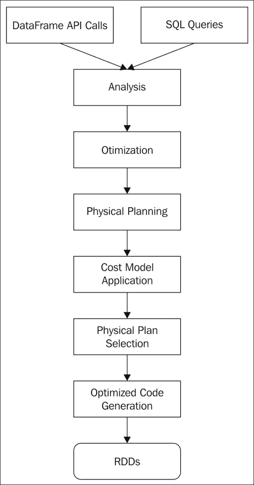
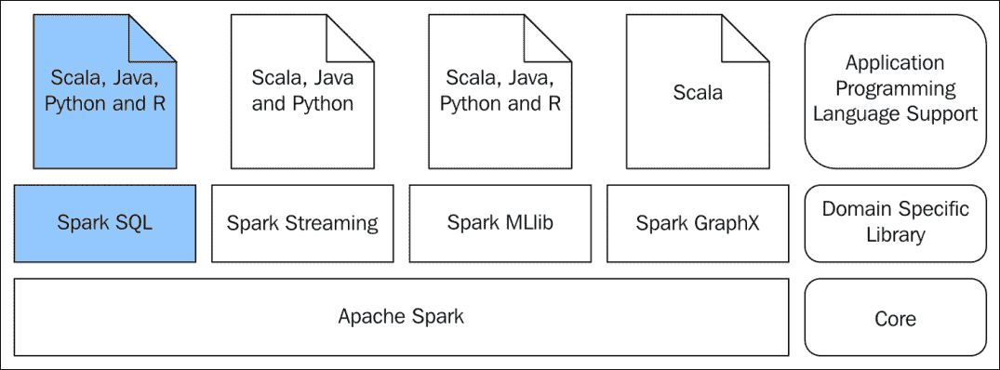

# 第三章。Spark SQL

大多数企业一直在处理大量的结构化数据。即使有太多的方法来处理非结构化数据，许多应用用例仍然必须有结构化数据。处理结构化数据和非结构化数据的主要区别是什么？如果数据源是结构化的，并且如果数据处理引擎事先知道数据结构，则数据处理引擎可以在处理数据的同时，甚至在处理数据之前进行大量优化。当数据处理量巨大且周转时间非常关键时，这一点非常关键。

企业数据的激增要求最终用户能够在简单易用的应用用户界面中查询和处理数据。关系数据库管理系统供应商联合起来，并且**结构化查询语言** ( **SQL** )作为解决方案应运而生。在过去的几十年里，每个处理数据的人即使不是超级用户，也开始熟悉 SQL。

仅举几个例子，社交网络和微博领域的大规模互联网应用产生了超出许多传统数据处理工具消耗的数据。在处理如此海量的数据时，从中挑选合适的数据变得更加重要。Spark 是一个非常流行的数据处理平台，与 Hadoop MapReduce 数据处理框架相比，它基于 RDD 的编程模型减少了数据处理工作量。但是，Spark 基于 RDD 的编程模型的初始版本仍然难以让最终用户(如数据科学家、数据分析师和业务分析师)使用 Spark。他们不能使用基于 RDD 的 Spark 编程模型的主要原因是因为它需要一些函数式编程。这个问题的解决方案是 Spark SQL。Spark SQL 是建立在 Spark 之上的一个库。它公开了 SQL 接口和数据框架 API。DataFrame API 支持编程语言 Scala、Java、Python 和 r。

如果数据的结构是预先知道的，如果数据适合行和列的模型，那么数据来自哪里并不重要，Spark SQL 可以将所有数据一起使用，并像所有数据来自单一来源一样处理它。此外，查询方言是无处不在的 SQL。

我们将在本章中讨论以下主题:

*   数据结构
*   Spark SQL
*   聚集
*   多数据源连接
*   资料组
*   数据目录

# 理解数据的结构

这里讨论的数据结构需要进一步阐明。我们所说的数据结构是什么意思？存储在关系数据库管理系统中的数据有一种将数据存储在行/列或记录/字段中的方法。每个字段都有一个数据类型，每个记录都是相同或不同数据类型的字段的集合。在 RDBMS 的早期，字段的数据类型是标量的，在最近的版本中，它扩展到包括集合数据类型或复合数据类型。因此，无论记录包含标量数据类型还是复合数据类型，这里需要注意的重要一点是底层数据有一个结构。许多数据处理范例都采用了镜像存储在关系数据库管理系统或内存中的其他存储中的底层数据结构的概念，以使数据处理变得容易。

换句话说，如果数据处理应用正在处理关系数据库管理系统表中的数据，如果程序内存中有相同的表状数据结构，那么对于最终用户和程序员来说，很容易对应用建模并查询数据。例如，假设有一组逗号分隔的数据项，每行中有固定数量的值，这些值在所有行中的特定位置有特定的数据类型。这是一个结构化数据文件。它是一个数据表，与 RDBMS 表非常相似。

在像 R 这样的编程语言中，有一个数据框架抽象，用于在内存中存储数据表。名为 Pandas 的 Python 数据分析库也有类似的数据框架概念。一旦数据结构在内存中可用，程序就可以提取数据，并根据需要对其进行切片和切割。同样的数据表概念被扩展到 Spark，即建立在 RDD 之上的 DataFrame，Spark SQL 中有一个非常全面的 API，即 DataFrame API，用于处理 DataFrame 中的数据。在数据框架抽象的基础上，还开发了类似 SQL 的查询语言，以满足最终用户查询和处理底层结构化数据的需求。总之，DataFrame 是一个分布式数据表，按行和列组织，每列都有名称。

建立在 Spark 之上的 Spark SQL 库是基于名为*“Spark SQL:Spark 中的关系数据处理”*的研究论文开发的。它谈到了Spark SQL 的四个目标，它们被逐字复制如下:

*   使用程序员友好的应用编程接口，支持 Spark 程序内(在本地 RDDs 上)和外部数据源上的关系处理
*   使用已建立的数据库管理系统技术提供高性能
*   轻松支持新数据源，包括半结构化数据和适合查询联盟的外部数据库
*   借助高级分析算法(如图形处理和机器学习)实现扩展

DataFrame 保存结构化数据，并且是分布式的。它允许选择、过滤和聚合数据。听起来很像 RDD？RDD 和数据框的主要区别在于，数据框比 RDD 存储了更多关于数据结构的信息，例如数据类型和列名。这允许数据框比Spark变换和Spark动作在 RDD 上进行处理更有效地优化处理。这里要提到的另一个最重要的方面是，所有支持的 Spark 编程语言都可以使用 Spark SQL 的 DataFrame API 来开发应用。实际上，Spark SQL 是一个分布式 SQL 引擎。

### 类型

那些在 Spark 1.3 之前工作过的人一定很熟悉 schemard，而 DataFrame 的概念正是建立在 schemard 之上的，具有 API 级的兼容性。

# 为什么是Spark SQL？

毫无疑问，SQL 是做数据分析的通用语言，而 Spark SQL 是 Spark 系列工具集中做数据分析的答案。那么，它提供了什么？它提供了在 Spark 之上运行 SQL 的能力。无论数据来自 CSV、Avro、Parquet、Hive、Cassandra 等 NoSQL 数据存储，甚至 RDBMS，Spark SQL 都可以用来分析数据，并与 Spark 程序混合使用。这里提到的许多数据源本质上受 Spark SQL 支持，许多其他数据源受外部包支持。这里要强调的最重要的方面是 Spark SQL 处理来自各种数据源的数据的能力。一旦它在 Spark 中作为数据框架可用，Spark SQL 就可以以完全分布式的方式处理数据，将来自各种数据源的数据框架组合在一起进行处理和查询，就像整个数据集来自单个数据源一样。

在前一章中，详细讨论了 RDD，并将其作为 Spark 编程模型进行了介绍。数据框架应用编程接口和 SQL 方言在 Spark SQL 中的使用是否正在取代基于 RDD 的编程模型？肯定不是！基于 RDD 的编程模型是 Spark 中的通用和基本数据处理模型。基于 RDD 的编程需要使用真正的编程技术。Spark转换和Spark动作使用了大量的函数式编程结构。尽管与 Hadoop MapReduce 或任何其他范例相比，基于 RDD 的编程模型需要编写的代码量较少，但仍然需要编写一些功能性代码。对于许多数据科学家、数据分析师和业务分析师来说，这是一个障碍，他们可能会执行主要的探索性数据分析或对数据进行一些原型制作。Spark SQL 完全消除了这些限制。简单易用的**领域特定语言** ( **DSL** )基于方法从数据源读取和写入数据，类似 SQL 的语言用于选择、过滤和聚合，以及从各种数据源读取数据的能力，使任何了解数据结构的人都能轻松使用它。

### 注

使用 RDD 最好的用例是什么，使用 Spark SQL 最好的用例是什么？答案很简单。如果数据是结构化的，如果它可以排列在表中，并且如果每个列都可以有一个名称，那么就使用 Spark SQL。这并不意味着 RDD 和数据框是两个完全不同的实体。它们的互操作性非常好。从 RDD 到数据帧的转换以及从数据帧到数据帧的转换都是非常可能的。通常应用于关系数据库的许多Spark转换和Spark动作也可以应用于数据帧。

通常，在应用设计阶段，业务分析师通常使用 SQL 对应用数据进行大量分析，并将其反馈给应用需求和测试工件。在设计大数据应用时，同样的事情也是需要的，在这种情况下，除了业务分析师，数据科学家也会在团队中。在基于 Hadoop 的生态系统中，Hive 被广泛用于大数据的数据分析。现在，Spark SQL 将这种能力带到了任何支持大量数据源的平台上。如果在商品硬件上有一个独立的 Spark 安装，可以进行许多这样的活动来分析数据。在商用硬件上以独立模式部署的基本 Spark 安装足以处理大量数据。

Hadoop 上的 SQL 策略引入了许多应用，例如 Hive 和 Impala 等，为存储在 **Hadoop 分布式文件系统** ( **HDFS** )中的底层大数据提供了类似于 SQL 的界面。Spark SQL 在那个领域适合哪里？在跳到那个之前，接触一下蜂巢和黑斑羚是个好主意。Hive 是一种基于 MapReduce 的数据仓库技术，由于使用 MapReduce 处理查询，Hive 查询在完成查询之前需要大量的 I/O 操作。Impala 想出了一个绝妙的解决方案，利用描述数据的 Hive 元存储进行内存处理。Spark SQL 使用 SQLContext 对数据进行所有操作。但是它也可以使用 HiveContext，这比 SQLContext 功能丰富和高级得多。HiveContext 可以做所有 SQLContext 可以做的事情，除此之外，它还可以从 Hive 元存储和表中读取，还可以访问 Hive 用户定义的函数。使用 HiveContext 的唯一要求显然是应该有一个现成的 Hive 设置。这样，Spark SQL 可以很容易地与 Hive 共存。

### 注

从 Spark 2.0 开始，SparkSession 是 Spark 基于 SQL 的应用的新起点，它是 SQLContext 和 HiveContext 的组合，同时支持向后兼容 SQLContext 和 HiveContext。

Spark SQL 可以比 Hive 使用其 Hive 查询语言更快地处理来自 Hive 表的数据。Spark SQL 的另一个非常有趣的特性是，它可以从不同版本的 Hive 中读取数据，这是一个很好的特性，可以实现数据源整合以进行数据处理。

### 注

公开 Spark SQL 和 DataFrame API 的库提供了可以通过 JDBC/ODBC 访问的接口。这开启了一个全新的数据分析世界。例如，一个使用 JDBC/ODBC 连接数据源的**商业智能** ( **BI** )工具可以使用 Spark SQL 支持的大量数据源。此外，商业智能工具可以将处理器密集型的连接聚合操作下推到 Spark 基础架构中的一个巨大的工作节点集群。

# Spark SQL 的剖析

与 Spark SQL 库的交互主要通过两种方法完成。一种是通过类似 SQL 的查询，另一种是通过 DataFrame API。在详细介绍基于数据框架的程序如何工作之前，最好先了解一下基于 RDD 的程序是如何工作的。

Spark转换和Spark动作被转换成 Java 函数，它们作用于关系数据库之上，关系数据库只不过是作用于数据的 Java 对象。由于 RDD 是一个纯 Java 对象，所以无论是在编译时还是在运行时，都无法知道要处理什么数据。执行引擎事先没有元数据来优化Spark转换或Spark动作。没有多个执行路径或查询计划可以提前用于处理数据，因此无法评估各种执行路径的效率。

这里，没有执行优化的查询计划，因为没有与数据相关联的模式。在数据帧的情况下，结构是预先已知的。因此，可以优化查询并预先构建数据缓存。

下面的*图 1* 给出了差不多的想法:


图 1

对数据框架进行的类似于 SQL 的查询和数据框架应用编程接口调用被转换为语言中立的表达式。对应于 SQL 查询或数据框架应用编程接口的语言中立表达式称为未解析逻辑计划。

通过对数据框元数据中的列名进行验证，未解析的逻辑计划被转换为逻辑计划。通过应用诸如表达式简化、表达式求值等标准规则以及其他优化规则来进一步优化逻辑计划，以形成优化的逻辑计划。优化后的逻辑计划被转换为多个物理计划。物理计划是通过在逻辑计划中使用特定于Spark的运算符创建的。选择最佳物理计划，并将结果查询下推到关系数据库，以对数据采取行动。因为 SQL 查询和 DataFrame API 调用被转换为语言无关的查询表达式，所以这些查询的性能在所有支持的语言中都是一致的。这也是为什么所有 Spark 支持的语言都支持 DataFrame API 的原因，比如 Scala、Java、Python 和 r .在未来，很有可能会有更多的语言因为这个原因而支持 DataFrame API 和 Spark SQL。

Spark SQL 的查询规划和优化也值得一提。通过 SQL 查询或通过数据框应用编程接口在数据框上完成的任何查询操作，在相应的操作被物理应用到底层的基本 RDD 之前，都是高度优化的。在 RDD 发生真正的行动之前，中间有许多过程。

*图 2* 给出了整个查询优化过程的一些想法:



图 2

可以对数据帧调用两种类型的查询。它们是 SQL 查询或数据框架应用编程接口调用。他们通过适当的分析，提出一个逻辑查询执行计划。然后，对逻辑查询计划进行优化，以获得优化的逻辑查询计划。根据最终优化的逻辑查询计划，制定一个或多个物理查询计划。对于每一个物理查询计划，成本模型被制定出来，并且基于最优成本，选择适当的物理查询计划，并且高度优化的代码被生成并针对 RDDs 运行。这就是数据帧上任何类型的查询性能一致的原因。这就是为什么来自所有这些不同语言(Scala、Java、Python 和 R)的数据框架应用编程接口调用提供一致的性能的原因。

让我们再次回顾更大的图景，如*图 3* 所示，在进入和使用用例之前，设置上下文并看看这里正在讨论什么:



图 3

这里将要讨论的用例将展示混合使用 SQL 查询和 Spark 程序的能力。将选择多个数据源，使用 DataFrame 从这些数据源中读取数据，并将演示统一的数据访问。用于演示的编程语言仍然是 Scala 和 Python。使用 R 来操纵数据帧是这本书的议程，并且有整整一章专门讨论这个问题。

# 数据帧编程

为阐明用数据框编程的Spark SQL 方式而选择的用例如下:

*   交易记录以逗号分隔值的形式出现。
*   只从列表中过滤掉好的交易记录。账号应以`SB`开头，交易金额应大于零。
*   查找所有交易金额大于 1000 的高价值交易记录。
*   找到所有账号不好的交易记录。
*   查找交易金额小于等于零的所有交易记录。
*   找到所有不良交易记录的合并列表。
*   找出所有交易金额的总和。
*   找出所有交易金额的最大值。
*   找出所有交易金额的最小值。
*   找到所有好的账号。

这与前一章中使用的用例完全相同，但是这里的编程模型完全不同。使用这组用例，这里演示了两种类型的编程模型。一个是使用 SQL 查询，另一个是使用数据框架 API。

## 用 SQL 编程

在 Scala REPL 提示符下，尝试以下语句:

```scala
scala> // Define the case classes for using in conjunction with DataFrames 
scala> case class Trans(accNo: String, tranAmount: Double) 
defined class Trans 
scala> // Functions to convert the sequence of strings to objects defined by the case classes 
scala> def toTrans =  (trans: Seq[String]) => Trans(trans(0), trans(1).trim.toDouble) 
toTrans: Seq[String] => Trans 
scala> // Creation of the list from where the RDD is going to be created 
scala> val acTransList = Array("SB10001,1000", "SB10002,1200", "SB10003,8000", "SB10004,400", "SB10005,300", "SB10006,10000", "SB10007,500", "SB10008,56", "SB10009,30","SB10010,7000", "CR10001,7000", "SB10002,-10") 
acTransList: Array[String] = Array(SB10001,1000, SB10002,1200, SB10003,8000, SB10004,400, SB10005,300, SB10006,10000, SB10007,500, SB10008,56, SB10009,30, SB10010,7000, CR10001,7000, SB10002,-10) 
scala> // Create the RDD 
scala> val acTransRDD = sc.parallelize(acTransList).map(_.split(",")).map(toTrans(_)) 
acTransRDD: org.apache.spark.rdd.RDD[Trans] = MapPartitionsRDD[2] at map at <console>:30 
scala> // Convert RDD to DataFrame 
scala> val acTransDF = spark.createDataFrame(acTransRDD) 
acTransDF: org.apache.spark.sql.DataFrame = [accNo: string, tranAmount: double] 
scala> // Register temporary view in the DataFrame for using it in SQL 
scala> acTransDF.createOrReplaceTempView("trans") 
scala> // Print the structure of the DataFrame 
scala> acTransDF.printSchema 
root 
 |-- accNo: string (nullable = true) 
 |-- tranAmount: double (nullable = false) 
scala> // Show the first few records of the DataFrame 
scala> acTransDF.show 
+-------+----------+ 
|  accNo|tranAmount| 
+-------+----------+ 
|SB10001|    1000.0| 
|SB10002|    1200.0| 
|SB10003|    8000.0| 
|SB10004|     400.0| 
|SB10005|     300.0| 
|SB10006|   10000.0| 
|SB10007|     500.0| 
|SB10008|      56.0| 
|SB10009|      30.0| 
|SB10010|    7000.0| 
|CR10001|    7000.0| 
|SB10002|     -10.0| 
+-------+----------+ 
scala> // Use SQL to create another DataFrame containing the good transaction records 
scala> val goodTransRecords = spark.sql("SELECT accNo, tranAmount FROM trans WHERE accNo like 'SB%' AND tranAmount > 0") 
goodTransRecords: org.apache.spark.sql.DataFrame = [accNo: string, tranAmount: double] 
scala> // Register temporary view in the DataFrame for using it in SQL 
scala> goodTransRecords.createOrReplaceTempView("goodtrans") 
scala> // Show the first few records of the DataFrame 
scala> goodTransRecords.show 
+-------+----------+ 
|  accNo|tranAmount| 
+-------+----------+ 
|SB10001|    1000.0| 
|SB10002|    1200.0| 
|SB10003|    8000.0| 
|SB10004|     400.0| 
|SB10005|     300.0| 
|SB10006|   10000.0| 
|SB10007|     500.0| 
|SB10008|      56.0| 
|SB10009|      30.0| 
|SB10010|    7000.0| 
+-------+----------+ 
scala> // Use SQL to create another DataFrame containing the high value transaction records 
scala> val highValueTransRecords = spark.sql("SELECT accNo, tranAmount FROM goodtrans WHERE tranAmount > 1000") 
highValueTransRecords: org.apache.spark.sql.DataFrame = [accNo: string, tranAmount: double] 
scala> // Show the first few records of the DataFrame 
scala> highValueTransRecords.show 
+-------+----------+ 
|  accNo|tranAmount| 
+-------+----------+ 
|SB10002|    1200.0| 
|SB10003|    8000.0| 
|SB10006|   10000.0| 
|SB10010|    7000.0| 
+-------+----------+ 
scala> // Use SQL to create another DataFrame containing the bad account records 
scala> val badAccountRecords = spark.sql("SELECT accNo, tranAmount FROM trans WHERE accNo NOT like 'SB%'") 
badAccountRecords: org.apache.spark.sql.DataFrame = [accNo: string, tranAmount: double] 
scala> // Show the first few records of the DataFrame 
scala> badAccountRecords.show 
+-------+----------+ 
|  accNo|tranAmount| 
+-------+----------+ 
|CR10001|    7000.0| 
+-------+----------+ 
scala> // Use SQL to create another DataFrame containing the bad amount records 
scala> val badAmountRecords = spark.sql("SELECT accNo, tranAmount FROM trans WHERE tranAmount < 0") 
badAmountRecords: org.apache.spark.sql.DataFrame = [accNo: string, tranAmount: double] 
scala> // Show the first few records of the DataFrame 
scala> badAmountRecords.show 
+-------+----------+ 
|  accNo|tranAmount| 
+-------+----------+ 
|SB10002|     -10.0| 
+-------+----------+ 
scala> // Do the union of two DataFrames and create another DataFrame 
scala> val badTransRecords = badAccountRecords.union(badAmountRecords) 
badTransRecords: org.apache.spark.sql.Dataset[org.apache.spark.sql.Row] = [accNo: string, tranAmount: double] 
scala> // Show the first few records of the DataFrame 
scala> badTransRecords.show 
+-------+----------+ 
|  accNo|tranAmount| 
+-------+----------+ 
|CR10001|    7000.0| 
|SB10002|     -10.0| 
+-------+----------+ 
scala> // Calculate the sum 
scala> val sumAmount = spark.sql("SELECT sum(tranAmount) as sum FROM goodtrans") 
sumAmount: org.apache.spark.sql.DataFrame = [sum: double] 
scala> // Show the first few records of the DataFrame 
scala> sumAmount.show 
+-------+ 
|    sum| 
+-------+ 
|28486.0| 
+-------+ 
scala> // Calculate the maximum 
scala> val maxAmount = spark.sql("SELECT max(tranAmount) as max FROM goodtrans") 
maxAmount: org.apache.spark.sql.DataFrame = [max: double] 
scala> // Show the first few records of the DataFrame 
scala> maxAmount.show 
+-------+ 
|    max| 
+-------+ 
|10000.0| 
+-------+ 
scala> // Calculate the minimum 
scala> val minAmount = spark.sql("SELECT min(tranAmount) as min FROM goodtrans") 
minAmount: org.apache.spark.sql.DataFrame = [min: double] 
scala> // Show the first few records of the DataFrame 
scala> minAmount.show 
+----+ 
| min| 
+----+ 
|30.0| 
+----+ 
scala> // Use SQL to create another DataFrame containing the good account numbers 
scala> val goodAccNos = spark.sql("SELECT DISTINCT accNo FROM trans WHERE accNo like 'SB%' ORDER BY accNo") 
goodAccNos: org.apache.spark.sql.DataFrame = [accNo: string] 
scala> // Show the first few records of the DataFrame 
scala> goodAccNos.show 
+-------+ 
|  accNo| 
+-------+ 
|SB10001| 
|SB10002| 
|SB10003| 
|SB10004| 
|SB10005| 
|SB10006| 
|SB10007| 
|SB10008| 
|SB10009| 
|SB10010| 
+-------+ 
scala> // Calculate the aggregates using mixing of DataFrame and RDD like operations 
scala> val sumAmountByMixing = goodTransRecords.map(trans => trans.getAs[Double]("tranAmount")).reduce(_ + _) 
sumAmountByMixing: Double = 28486.0 
scala> val maxAmountByMixing = goodTransRecords.map(trans => trans.getAs[Double]("tranAmount")).reduce((a, b) => if (a > b) a else b) 
maxAmountByMixing: Double = 10000.0 
scala> val minAmountByMixing = goodTransRecords.map(trans => trans.getAs[Double]("tranAmount")).reduce((a, b) => if (a < b) a else b) 
minAmountByMixing: Double = 30.0 

```

零售银行业务交易记录带有账号、交易金额，并使用 SparkSQL 进行处理，以获得预期的用例结果。以下是前面脚本所做工作的总结:

*   Scala 案例类被定义来描述要被输入到数据框架中的事务记录的结构。
*   数组是用必要的事务记录定义的。
*   从数组中创建一个 RDD，拆分逗号分隔的值，使用脚本中第一步定义的 Scala case 类将其映射为创建对象，然后将 RDD 转换为数据帧。这是 RDD 和数据框之间互操作性的一个用例。
*   一个表用一个名称向数据框注册。该表的注册名称可以在 SQL 语句中使用。
*   然后，所有其他活动只是使用`spark.sql`方法发布 SQL 语句。这里的Spark对象属于Spark会话类型。
*   所有这些 SQL 语句的结果都存储为数据帧，就像 RDD 的`collect`操作一样，数据帧的 show 方法用于将值提取到 Spark 驱动程序中。
*   总值的计算有两种不同的方式。一种是用 SQL 语句的方式，这是最简单的方式。另一种是使用常规的 RDD 风格的Spark变换和Spark动作。这是为了表明，即使是数据框也可以像 RDD 一样操作，并且Spark变换和Spark动作可以应用于数据框之上。
*   有时，通过使用函数的函数式操作，很容易进行一些数据操作。因此，这里可以灵活地混合使用 SQL、RDD 和 DataFrame，以便有一个非常方便的编程模型来处理数据。
*   使用数据框的`show`方法，数据框内容以表格格式显示。
*   使用`printSchema`方法显示数据框结构的详细视图。这类似于数据库表的`describe`命令。

在 Python REPL 提示符下，尝试以下语句:

```scala
>>> from pyspark.sql import Row 
>>> # Creation of the list from where the RDD is going to be created 
>>> acTransList = ["SB10001,1000", "SB10002,1200", "SB10003,8000", "SB10004,400", "SB10005,300", "SB10006,10000", "SB10007,500", "SB10008,56", "SB10009,30","SB10010,7000", "CR10001,7000", "SB10002,-10"] 
>>> # Create the DataFrame 
>>> acTransDF = sc.parallelize(acTransList).map(lambda trans: trans.split(",")).map(lambda p: Row(accNo=p[0], tranAmount=float(p[1]))).toDF() 
>>> # Register temporary view in the DataFrame for using it in SQL 
>>> acTransDF.createOrReplaceTempView("trans") 
>>> # Print the structure of the DataFrame 
>>> acTransDF.printSchema() 
root 
 |-- accNo: string (nullable = true) 
 |-- tranAmount: double (nullable = true) 
>>> # Show the first few records of the DataFrame 
>>> acTransDF.show() 
+-------+----------+ 
|  accNo|tranAmount| 
+-------+----------+ 
|SB10001|    1000.0| 
|SB10002|    1200.0| 
|SB10003|    8000.0| 
|SB10004|     400.0| 
|SB10005|     300.0| 
|SB10006|   10000.0| 
|SB10007|     500.0| 
|SB10008|      56.0| 
|SB10009|      30.0| 
|SB10010|    7000.0| 
|CR10001|    7000.0| 
|SB10002|     -10.0| 
+-------+----------+ 
>>> # Use SQL to create another DataFrame containing the good transaction records 
>>> goodTransRecords = spark.sql("SELECT accNo, tranAmount FROM trans WHERE accNo like 'SB%' AND tranAmount > 0") 
>>> # Register temporary table in the DataFrame for using it in SQL 
>>> goodTransRecords.createOrReplaceTempView("goodtrans") 
>>> # Show the first few records of the DataFrame 
>>> goodTransRecords.show() 
+-------+----------+ 
|  accNo|tranAmount| 
+-------+----------+ 
|SB10001|    1000.0| 
|SB10002|    1200.0| 
|SB10003|    8000.0| 
|SB10004|     400.0| 
|SB10005|     300.0| 
|SB10006|   10000.0| 
|SB10007|     500.0| 
|SB10008|      56.0| 
|SB10009|      30.0| 
|SB10010|    7000.0| 
+-------+----------+ 
>>> # Use SQL to create another DataFrame containing the high value transaction records 
>>> highValueTransRecords = spark.sql("SELECT accNo, tranAmount FROM goodtrans WHERE tranAmount > 1000") 
>>> # Show the first few records of the DataFrame 
>>> highValueTransRecords.show() 
+-------+----------+ 
|  accNo|tranAmount| 
+-------+----------+ 
|SB10002|    1200.0| 
|SB10003|    8000.0| 
|SB10006|   10000.0| 
|SB10010|    7000.0| 
+-------+----------+ 
>>> # Use SQL to create another DataFrame containing the bad account records 
>>> badAccountRecords = spark.sql("SELECT accNo, tranAmount FROM trans WHERE accNo NOT like 'SB%'") 
>>> # Show the first few records of the DataFrame 
>>> badAccountRecords.show() 
+-------+----------+ 
|  accNo|tranAmount| 
+-------+----------+ 
|CR10001|    7000.0| 
+-------+----------+ 
>>> # Use SQL to create another DataFrame containing the bad amount records 
>>> badAmountRecords = spark.sql("SELECT accNo, tranAmount FROM trans WHERE tranAmount < 0") 
>>> # Show the first few records of the DataFrame 
>>> badAmountRecords.show() 
+-------+----------+ 
|  accNo|tranAmount| 
+-------+----------+ 
|SB10002|     -10.0| 
+-------+----------+ 
>>> # Do the union of two DataFrames and create another DataFrame 
>>> badTransRecords = badAccountRecords.union(badAmountRecords) 
>>> # Show the first few records of the DataFrame 
>>> badTransRecords.show() 
+-------+----------+ 
|  accNo|tranAmount| 
+-------+----------+ 
|CR10001|    7000.0| 
|SB10002|     -10.0| 
+-------+----------+ 
>>> # Calculate the sum 
>>> sumAmount = spark.sql("SELECT sum(tranAmount)as sum FROM goodtrans") 
>>> # Show the first few records of the DataFrame 
>>> sumAmount.show() 
+-------+ 
|    sum| 
+-------+ 
|28486.0| 
+-------+ 
>>> # Calculate the maximum 
>>> maxAmount = spark.sql("SELECT max(tranAmount) as max FROM goodtrans") 
>>> # Show the first few records of the DataFrame 
>>> maxAmount.show() 
+-------+ 
|    max| 
+-------+ 
|10000.0| 
+-------+ 
>>> # Calculate the minimum 
>>> minAmount = spark.sql("SELECT min(tranAmount)as min FROM goodtrans") 
>>> # Show the first few records of the DataFrame 
>>> minAmount.show() 
+----+ 
| min| 
+----+ 
|30.0| 
+----+ 
>>> # Use SQL to create another DataFrame containing the good account numbers 
>>> goodAccNos = spark.sql("SELECT DISTINCT accNo FROM trans WHERE accNo like 'SB%' ORDER BY accNo") 
>>> # Show the first few records of the DataFrame 
>>> goodAccNos.show() 
+-------+ 
|  accNo| 
+-------+ 
|SB10001| 
|SB10002| 
|SB10003| 
|SB10004| 
|SB10005| 
|SB10006| 
|SB10007| 
|SB10008| 
|SB10009| 
|SB10010| 
+-------+ 
>>> # Calculate the sum using mixing of DataFrame and RDD like operations 
>>> sumAmountByMixing = goodTransRecords.rdd.map(lambda trans: trans.tranAmount).reduce(lambda a,b : a+b) 
>>> sumAmountByMixing 
28486.0 
>>> # Calculate the maximum using mixing of DataFrame and RDD like operations 
>>> maxAmountByMixing = goodTransRecords.rdd.map(lambda trans: trans.tranAmount).reduce(lambda a,b : a if a > b else b) 
>>> maxAmountByMixing 
10000.0 
>>> # Calculate the minimum using mixing of DataFrame and RDD like operations 
>>> minAmountByMixing = goodTransRecords.rdd.map(lambda trans: trans.tranAmount).reduce(lambda a,b : a if a < b else b) 
>>> minAmountByMixing 
30.0 

```

在前面的 Python 代码片段中，除了一些特定于语言的构造，如导入库和 lambda 函数的定义，大多数情况下，编程风格与 Scala 代码几乎相同。这就是 Spark 统一编程模型的优势。如前所述，当业务分析师或数据分析师提供用于数据访问的 SQL 时，很容易将其与 Spark 中的数据处理代码集成在一起。这种统一的编程风格对于组织使用他们选择的语言在 Spark 中开发数据处理应用非常有用。

### 类型

在数据帧上，如果应用了适用的Spark转换，则返回数据集而不是数据帧。数据集的概念将在本章的最后介绍。数据框和数据集之间有着非常密切的关系，这在涉及数据集的章节中有所解释。开发应用时，在这种情况下必须小心谨慎。例如，在前面的代码片段中，如果在 Scala REPL 中尝试以下转换，它将返回一个数据集:`val amount = goodTransRecords.map(trans => trans.getAs[Double]("tranAmount"))amount: org.apache.spark.sql.Dataset[Double] = [value: double]`

## 使用数据帧应用编程接口编程

在本节中，代码片段将以适当的语言 REPLs 运行，作为上一节的延续，这样就不会重复数据的设置和其他初始化。像前面的代码片段一样，最初，给出了一些特定于数据框的基本命令。这些经常用于查看内容，并对数据框及其内容进行一些健全性测试。这些命令通常用于数据分析的探索阶段，通常是为了更深入地了解底层数据的结构和内容。

在 Scala REPL 提示符下，尝试以下语句:

```scala
scala> acTransDF.show 
+-------+----------+ 
|  accNo|tranAmount| 
+-------+----------+ 
|SB10001|    1000.0| 
|SB10002|    1200.0| 
|SB10003|    8000.0| 
|SB10004|     400.0| 
|SB10005|     300.0| 
|SB10006|   10000.0| 
|SB10007|     500.0| 
|SB10008|      56.0| 
|SB10009|      30.0| 
|SB10010|    7000.0| 
|CR10001|    7000.0| 
|SB10002|     -10.0| 
+-------+----------+ 
scala> // Create the DataFrame using API for the good transaction records 
scala> val goodTransRecords = acTransDF.filter("accNo like 'SB%'").filter("tranAmount > 0") 
goodTransRecords: org.apache.spark.sql.Dataset[org.apache.spark.sql.Row] = [accNo: string, tranAmount: double] 
scala> // Show the first few records of the DataFrame 
scala> goodTransRecords.show 
+-------+----------+ 
|  accNo|tranAmount| 
+-------+----------+ 
|SB10001|    1000.0| 
|SB10002|    1200.0| 
|SB10003|    8000.0| 
|SB10004|     400.0| 
|SB10005|     300.0| 
|SB10006|   10000.0| 
|SB10007|     500.0| 
|SB10008|      56.0| 
|SB10009|      30.0| 
|SB10010|    7000.0| 
+-------+----------+ 
scala> // Create the DataFrame using API for the high value transaction records 
scala> val highValueTransRecords = goodTransRecords.filter("tranAmount > 1000") 
highValueTransRecords: org.apache.spark.sql.Dataset[org.apache.spark.sql.Row] = [accNo: string, tranAmount: double] 
scala> // Show the first few records of the DataFrame 
scala> highValueTransRecords.show 
+-------+----------+ 
|  accNo|tranAmount| 
+-------+----------+ 
|SB10002|    1200.0| 
|SB10003|    8000.0| 
|SB10006|   10000.0| 
|SB10010|    7000.0| 
+-------+----------+ 
scala> // Create the DataFrame using API for the bad account records 
scala> val badAccountRecords = acTransDF.filter("accNo NOT like 'SB%'") 
badAccountRecords: org.apache.spark.sql.Dataset[org.apache.spark.sql.Row] = [accNo: string, tranAmount: double] 
scala> // Show the first few records of the DataFrame 
scala> badAccountRecords.show 
+-------+----------+ 
|  accNo|tranAmount| 
+-------+----------+ 
|CR10001|    7000.0| 
+-------+----------+ 
scala> // Create the DataFrame using API for the bad amount records 
scala> val badAmountRecords = acTransDF.filter("tranAmount < 0") 
badAmountRecords: org.apache.spark.sql.Dataset[org.apache.spark.sql.Row] = [accNo: string, tranAmount: double] 
scala> // Show the first few records of the DataFrame 
scala> badAmountRecords.show 
+-------+----------+ 
|  accNo|tranAmount| 
+-------+----------+ 
|SB10002|     -10.0| 
+-------+----------+ 
scala> // Do the union of two DataFrames 
scala> val badTransRecords = badAccountRecords.union(badAmountRecords) 
badTransRecords: org.apache.spark.sql.Dataset[org.apache.spark.sql.Row] = [accNo: string, tranAmount: double] 
scala> // Show the first few records of the DataFrame 
scala> badTransRecords.show 
+-------+----------+ 
|  accNo|tranAmount| 
+-------+----------+ 
|CR10001|    7000.0| 
|SB10002|     -10.0| 
+-------+----------+ 
scala> // Calculate the aggregates in one shot 
scala> val aggregates = goodTransRecords.agg(sum("tranAmount"), max("tranAmount"), min("tranAmount")) 
aggregates: org.apache.spark.sql.DataFrame = [sum(tranAmount): double, max(tranAmount): double ... 1 more field] 
scala> // Show the first few records of the DataFrame 
scala> aggregates.show 
+---------------+---------------+---------------+ 
|sum(tranAmount)|max(tranAmount)|min(tranAmount)| 
+---------------+---------------+---------------+ 
|        28486.0|        10000.0|           30.0| 
+---------------+---------------+---------------+ 
scala> // Use DataFrame using API for creating the good account numbers 
scala> val goodAccNos = acTransDF.filter("accNo like 'SB%'").select("accNo").distinct().orderBy("accNo") 
goodAccNos: org.apache.spark.sql.Dataset[org.apache.spark.sql.Row] = [accNo: string] 
scala> // Show the first few records of the DataFrame 
scala> goodAccNos.show 
+-------+ 
|  accNo| 
+-------+ 
|SB10001| 
|SB10002| 
|SB10003| 
|SB10004| 
|SB10005| 
|SB10006| 
|SB10007| 
|SB10008| 
|SB10009| 
|SB10010| 
+-------+ 
scala> // Persist the data of the DataFrame into a Parquet file 
scala> acTransDF.write.parquet("scala.trans.parquet") 
scala> // Read the data into a DataFrame from the Parquet file 
scala> val acTransDFfromParquet = spark.read.parquet("scala.trans.parquet") 
acTransDFfromParquet: org.apache.spark.sql.DataFrame = [accNo: string, tranAmount: double] 
scala> // Show the first few records of the DataFrame 
scala> acTransDFfromParquet.show 
+-------+----------+ 
|  accNo|tranAmount| 
+-------+----------+ 
|SB10002|    1200.0| 
|SB10003|    8000.0| 
|SB10005|     300.0| 
|SB10006|   10000.0| 
|SB10008|      56.0| 
|SB10009|      30.0| 
|CR10001|    7000.0| 
|SB10002|     -10.0| 
|SB10001|    1000.0| 
|SB10004|     400.0| 
|SB10007|     500.0| 
|SB10010|    7000.0| 
+-------+----------+

```

以下是前面的脚本从数据框架应用编程接口角度所做的总结:

*   此处使用包含前一节中使用的数据超集的数据帧。
*   接下来演示记录的过滤。这里，需要注意的最重要的方面是，过滤器谓词的给出与 SQL 语句中的谓词完全一样。过滤器可以被链接。
*   聚合方法在结果数据框中一次性计算为三列。
*   这个集合中的最终语句在一个单独的链式语句中进行选择、筛选、选择不同的记录和排序。
*   最后，交易记录以拼花格式保存，从拼花商店读取并创建一个数据帧。关于持久性格式的更多细节将在下一节中介绍。
*   在这个代码片段中，拼花格式数据存储在当前目录中，相应的 REPL 从该目录中被调用。当它作为Spark程序运行时，该目录将再次成为调用Spark提交的当前目录。

在 Python REPL 提示符下，尝试以下语句:

```scala
>>> acTransDF.show() 
+-------+----------+ 
|  accNo|tranAmount| 
+-------+----------+ 
|SB10001|    1000.0| 
|SB10002|    1200.0| 
|SB10003|    8000.0| 
|SB10004|     400.0| 
|SB10005|     300.0| 
|SB10006|   10000.0| 
|SB10007|     500.0| 
|SB10008|      56.0| 
|SB10009|      30.0| 
|SB10010|    7000.0| 
|CR10001|    7000.0| 
|SB10002|     -10.0| 
+-------+----------+ 
>>> # Print the structure of the DataFrame 
>>> acTransDF.printSchema() 
root 
 |-- accNo: string (nullable = true) 
 |-- tranAmount: double (nullable = true) 
>>> # Create the DataFrame using API for the good transaction records 
>>> goodTransRecords = acTransDF.filter("accNo like 'SB%'").filter("tranAmount > 0") 
>>> # Show the first few records of the DataFrame 
>>> goodTransRecords.show() 
+-------+----------+ 
|  accNo|tranAmount| 
+-------+----------+ 
|SB10001|    1000.0| 
|SB10002|    1200.0| 
|SB10003|    8000.0| 
|SB10004|     400.0| 
|SB10005|     300.0| 
|SB10006|   10000.0| 
|SB10007|     500.0| 
|SB10008|      56.0| 
|SB10009|      30.0| 
|SB10010|    7000.0| 
+-------+----------+ 
>>> # Create the DataFrame using API for the high value transaction records 
>>> highValueTransRecords = goodTransRecords.filter("tranAmount > 1000") 
>>> # Show the first few records of the DataFrame 
>>> highValueTransRecords.show() 
+-------+----------+ 
|  accNo|tranAmount| 
+-------+----------+ 
|SB10002|    1200.0| 
|SB10003|    8000.0| 
|SB10006|   10000.0| 
|SB10010|    7000.0| 
+-------+----------+ 
>>> # Create the DataFrame using API for the bad account records 
>>> badAccountRecords = acTransDF.filter("accNo NOT like 'SB%'") 
>>> # Show the first few records of the DataFrame 
>>> badAccountRecords.show() 
+-------+----------+ 
|  accNo|tranAmount| 
+-------+----------+ 
|CR10001|    7000.0| 
+-------+----------+ 
>>> # Create the DataFrame using API for the bad amount records 
>>> badAmountRecords = acTransDF.filter("tranAmount < 0") 
>>> # Show the first few records of the DataFrame 
>>> badAmountRecords.show() 
+-------+----------+ 
|  accNo|tranAmount| 
+-------+----------+ 
|SB10002|     -10.0| 
+-------+----------+ 
>>> # Do the union of two DataFrames and create another DataFrame 
>>> badTransRecords = badAccountRecords.union(badAmountRecords) 
>>> # Show the first few records of the DataFrame 
>>> badTransRecords.show() 
+-------+----------+ 
|  accNo|tranAmount| 
+-------+----------+ 
|CR10001|    7000.0| 
|SB10002|     -10.0| 
+-------+----------+ 
>>> # Calculate the sum 
>>> sumAmount = goodTransRecords.agg({"tranAmount": "sum"}) 
>>> # Show the first few records of the DataFrame 
>>> sumAmount.show() 
+---------------+ 
|sum(tranAmount)| 
+---------------+ 
|        28486.0| 
+---------------+ 
>>> # Calculate the maximum 
>>> maxAmount = goodTransRecords.agg({"tranAmount": "max"}) 
>>> # Show the first few records of the DataFrame 
>>> maxAmount.show() 
+---------------+ 
|max(tranAmount)| 
+---------------+ 
|        10000.0| 
+---------------+ 
>>> # Calculate the minimum 
>>> minAmount = goodTransRecords.agg({"tranAmount": "min"}) 
>>> # Show the first few records of the DataFrame 
>>> minAmount.show() 
+---------------+ 
|min(tranAmount)| 
+---------------+ 
|           30.0| 
+---------------+ 
>>> # Create the DataFrame using API for the good account numbers 
>>> goodAccNos = acTransDF.filter("accNo like 'SB%'").select("accNo").distinct().orderBy("accNo") 
>>> # Show the first few records of the DataFrame 
>>> goodAccNos.show() 
+-------+ 
|  accNo| 
+-------+ 
|SB10001| 
|SB10002| 
|SB10003| 
|SB10004| 
|SB10005| 
|SB10006| 
|SB10007| 
|SB10008| 
|SB10009| 
|SB10010| 
+-------+ 
>>> # Persist the data of the DataFrame into a Parquet file 
>>> acTransDF.write.parquet("python.trans.parquet") 
>>> # Read the data into a DataFrame from the Parquet file 
>>> acTransDFfromParquet = spark.read.parquet("python.trans.parquet") 
>>> # Show the first few records of the DataFrame 
>>> acTransDFfromParquet.show() 
+-------+----------+ 
|  accNo|tranAmount| 
+-------+----------+ 
|SB10002|    1200.0| 
|SB10003|    8000.0| 
|SB10005|     300.0| 
|SB10006|   10000.0| 
|SB10008|      56.0| 
|SB10009|      30.0| 
|CR10001|    7000.0| 
|SB10002|     -10.0| 
|SB10001|    1000.0| 
|SB10004|     400.0| 
|SB10007|     500.0| 
|SB10010|    7000.0| 
+-------+----------+ 

```

在前面的 Python 代码片段中，除了聚合计算中的极少数变化之外，编程结构几乎与 Scala 相似。

前面 Scala 和 Python 部分的最后几个语句是关于将数据帧内容保存到媒体中的。在任何一种数据处理操作中，读写操作都是非常需要的，但是大多数工具并没有统一的读写方式。Spark SQL 不一样。数据框架应用编程接口附带了一套丰富的持久性机制。将数据框的内容写入许多支持的持久性存储非常容易。所有这些写和读操作都有非常简单的 DSL 风格的接口。以下是一些内置的数据帧读写格式。

除此之外，通过第三方包还支持许多其他外部数据源:

*   JSON
*   镶木地板
*   储备
*   关系型数据库
*   一种数据库系统
*   HDFS
*   纯文本
*   亚马逊 S3
*   妖魔
*   JDBC

前面的代码片段已经演示了数据帧的读写。前面所有固有支持的数据存储都有非常简单的 DSL 风格语法用于持久化和读回，这使得编程风格再次统一。数据框架应用编程接口参考是了解处理这些数据存储细节的一个很好的来源。

本章中的示例代码以 Parquet 和 JSON 格式保存数据。选择的数据存储位置名称有`python.trans.parquet`、`scala.trans.parquet`等。这只是为了指示使用哪种编程语言以及数据的格式。这不是一个恰当的惯例，而是一种便利。当程序的一次运行完成时，这些目录就已经创建好了。下次运行相同的程序时，它将尝试创建相同的程序，并将导致错误。解决方法是在后续运行之前手动删除目录，然后继续。正确的错误处理机制和精细编程的其他细微差别会冲淡重点，因此被故意排除在本书之外。

# 理解Spark SQL 中的聚合

在 SQL 中，数据的聚合非常灵活。Spark SQL 也是如此。这里，Spark SQL 可以在分布式数据源上执行相同的操作，而不是在位于单台机器上的单个数据源上运行 SQL 语句。在前一章中，我们讨论了一个 MapReduce 用例来进行数据聚合，这里也使用了相同的用例来演示 Spark SQL 的聚合能力。在这一节中，我们还以 SQL 查询和数据框架应用编程接口的方式来处理用例。

这里为阐明 MapReduce 类型的数据处理而选择的用例如下所示:

*   零售银行业务交易记录的账号和交易金额用逗号分隔
*   查找所有交易的帐户级别汇总，以获取帐户余额

在 Scala REPL 提示符下，尝试以下语句:

```scala
scala> // Define the case classes for using in conjunction with DataFrames 
scala> case class Trans(accNo: String, tranAmount: Double) 
defined class Trans 
scala> // Functions to convert the sequence of strings to objects defined by the case classes 
scala> def toTrans =  (trans: Seq[String]) => Trans(trans(0), trans(1).trim.toDouble) 
toTrans: Seq[String] => Trans 
scala> // Creation of the list from where the RDD is going to be created 
scala> val acTransList = Array("SB10001,1000", "SB10002,1200","SB10001,8000", "SB10002,400", "SB10003,300", "SB10001,10000","SB10004,500","SB10005,56", "SB10003,30","SB10002,7000","SB10001,-100", "SB10002,-10") 
acTransList: Array[String] = Array(SB10001,1000, SB10002,1200, SB10001,8000, SB10002,400, SB10003,300, SB10001,10000, SB10004,500, SB10005,56, SB10003,30, SB10002,7000, SB10001,-100, SB10002,-10) 
scala> // Create the DataFrame 
scala> val acTransDF = sc.parallelize(acTransList).map(_.split(",")).map(toTrans(_)).toDF() 
acTransDF: org.apache.spark.sql.DataFrame = [accNo: string, tranAmount: double] 
scala> // Show the first few records of the DataFrame 
scala> acTransDF.show 
+-------+----------+ 
|  accNo|tranAmount| 
+-------+----------+ 
|SB10001|    1000.0| 
|SB10002|    1200.0| 
|SB10001|    8000.0| 
|SB10002|     400.0| 
|SB10003|     300.0| 
|SB10001|   10000.0| 
|SB10004|     500.0| 
|SB10005|      56.0| 
|SB10003|      30.0| 
|SB10002|    7000.0| 
|SB10001|    -100.0| 
|SB10002|     -10.0| 
+-------+----------+ 
scala> // Register temporary view in the DataFrame for using it in SQL 
scala> acTransDF.createOrReplaceTempView("trans") 
scala> // Use SQL to create another DataFrame containing the account summary records 
scala> val acSummary = spark.sql("SELECT accNo, sum(tranAmount) as TransTotal FROM trans GROUP BY accNo") 
acSummary: org.apache.spark.sql.DataFrame = [accNo: string, TransTotal: double] 
scala> // Show the first few records of the DataFrame 
scala> acSummary.show 
+-------+----------+ 
|  accNo|TransTotal| 
+-------+----------+ 
|SB10005|      56.0| 
|SB10004|     500.0| 
|SB10003|     330.0| 
|SB10002|    8590.0| 
|SB10001|   18900.0| 
+-------+----------+ 
scala> // Create the DataFrame using API for the account summary records 
scala> val acSummaryViaDFAPI = acTransDF.groupBy("accNo").agg(sum("tranAmount") as "TransTotal") 
acSummaryViaDFAPI: org.apache.spark.sql.DataFrame = [accNo: string, TransTotal: double] 
scala> // Show the first few records of the DataFrame 
scala> acSummaryViaDFAPI.show 
+-------+----------+ 
|  accNo|TransTotal| 
+-------+----------+ 
|SB10005|      56.0| 
|SB10004|     500.0| 
|SB10003|     330.0| 
|SB10002|    8590.0| 
|SB10001|   18900.0| 
+-------+----------+

```

在这个代码片段中，一切都与前面部分的代码非常相似。唯一的区别是，在这里，聚合被用在了 SQL 查询和数据框架应用编程接口中。

在 Python REPL 提示符下，尝试以下语句:

```scala
>>> from pyspark.sql import Row 
>>> # Creation of the list from where the RDD is going to be created 
>>> acTransList = ["SB10001,1000", "SB10002,1200", "SB10001,8000","SB10002,400", "SB10003,300", "SB10001,10000","SB10004,500","SB10005,56","SB10003,30","SB10002,7000", "SB10001,-100","SB10002,-10"] 
>>> # Create the DataFrame 
>>> acTransDF = sc.parallelize(acTransList).map(lambda trans: trans.split(",")).map(lambda p: Row(accNo=p[0], tranAmount=float(p[1]))).toDF() 
>>> # Register temporary view in the DataFrame for using it in SQL 
>>> acTransDF.createOrReplaceTempView("trans") 
>>> # Use SQL to create another DataFrame containing the account summary records 
>>> acSummary = spark.sql("SELECT accNo, sum(tranAmount) as transTotal FROM trans GROUP BY accNo") 
>>> # Show the first few records of the DataFrame 
>>> acSummary.show()     
+-------+----------+ 
|  accNo|transTotal| 
+-------+----------+ 
|SB10005|      56.0| 
|SB10004|     500.0| 
|SB10003|     330.0| 
|SB10002|    8590.0| 
|SB10001|   18900.0| 
+-------+----------+ 
>>> # Create the DataFrame using API for the account summary records 
>>> acSummaryViaDFAPI = acTransDF.groupBy("accNo").agg({"tranAmount": "sum"}).selectExpr("accNo", "`sum(tranAmount)` as transTotal") 
>>> # Show the first few records of the DataFrame 
>>> acSummaryViaDFAPI.show() 
+-------+----------+ 
|  accNo|transTotal| 
+-------+----------+ 
|SB10005|      56.0| 
|SB10004|     500.0| 
|SB10003|     330.0| 
|SB10002|    8590.0| 
|SB10001|   18900.0| 
+-------+----------+

```

在 Python 的数据框架应用编程接口中，与 Scala 相比，有一些微小的语法差异。

# 了解多数据源加入 SparkSQL

在前一章中，已经讨论了基于密钥的多个关系数据库的连接。在本节中，使用 Spark SQL 实现了相同的用例。这里给出了使用一个键来说明多个数据集连接的用例。

第一个数据集包含零售银行主记录摘要，包括账号、名字和姓氏。第二个数据集包含带有账号和余额的零售银行账户余额。这两个数据集的关键是账号。将两个数据集连接起来，创建一个包含账号、名字、姓氏和余额的数据集。从这份报告中，选出余额最多的三个账户。

在本节中，还将演示连接来自多个数据源的数据的概念。首先，从两个阵列创建数据帧。它们以拼花和 JSON 格式保存。然后从磁盘中读取它们以形成数据帧，并将它们连接在一起。

在 Scala REPL 提示符下，尝试以下语句:

```scala
scala> // Define the case classes for using in conjunction with DataFrames 
scala> case class AcMaster(accNo: String, firstName: String, lastName: String) 
defined class AcMaster 
scala> case class AcBal(accNo: String, balanceAmount: Double) 
defined class AcBal 
scala> // Functions to convert the sequence of strings to objects defined by the case classes 
scala> def toAcMaster =  (master: Seq[String]) => AcMaster(master(0), master(1), master(2)) 
toAcMaster: Seq[String] => AcMaster 
scala> def toAcBal =  (bal: Seq[String]) => AcBal(bal(0), bal(1).trim.toDouble) 
toAcBal: Seq[String] => AcBal 
scala> // Creation of the list from where the RDD is going to be created 
scala> val acMasterList = Array("SB10001,Roger,Federer","SB10002,Pete,Sampras", "SB10003,Rafael,Nadal","SB10004,Boris,Becker", "SB10005,Ivan,Lendl") 
acMasterList: Array[String] = Array(SB10001,Roger,Federer, SB10002,Pete,Sampras, SB10003,Rafael,Nadal, SB10004,Boris,Becker, SB10005,Ivan,Lendl) 
scala> // Creation of the list from where the RDD is going to be created 
scala> val acBalList = Array("SB10001,50000", "SB10002,12000","SB10003,3000", "SB10004,8500", "SB10005,5000") 
acBalList: Array[String] = Array(SB10001,50000, SB10002,12000, SB10003,3000, SB10004,8500, SB10005,5000) 
scala> // Create the DataFrame 
scala> val acMasterDF = sc.parallelize(acMasterList).map(_.split(",")).map(toAcMaster(_)).toDF() 
acMasterDF: org.apache.spark.sql.DataFrame = [accNo: string, firstName: string ... 1 more field] 
scala> // Create the DataFrame 
scala> val acBalDF = sc.parallelize(acBalList).map(_.split(",")).map(toAcBal(_)).toDF() 
acBalDF: org.apache.spark.sql.DataFrame = [accNo: string, balanceAmount: double] 
scala> // Persist the data of the DataFrame into a Parquet file 
scala> acMasterDF.write.parquet("scala.master.parquet") 
scala> // Persist the data of the DataFrame into a JSON file 
scala> acBalDF.write.json("scalaMaster.json") 
scala> // Read the data into a DataFrame from the Parquet file 
scala> val acMasterDFFromFile = spark.read.parquet("scala.master.parquet") 
acMasterDFFromFile: org.apache.spark.sql.DataFrame = [accNo: string, firstName: string ... 1 more field] 
scala> // Register temporary view in the DataFrame for using it in SQL 
scala> acMasterDFFromFile.createOrReplaceTempView("master") 
scala> // Read the data into a DataFrame from the JSON file 
scala> val acBalDFFromFile = spark.read.json("scalaMaster.json") 
acBalDFFromFile: org.apache.spark.sql.DataFrame = [accNo: string, balanceAmount: double] 
scala> // Register temporary view in the DataFrame for using it in SQL 
scala> acBalDFFromFile.createOrReplaceTempView("balance") 
scala> // Show the first few records of the DataFrame 
scala> acMasterDFFromFile.show 
+-------+---------+--------+ 
|  accNo|firstName|lastName| 
+-------+---------+--------+ 
|SB10001|    Roger| Federer| 
|SB10002|     Pete| Sampras| 
|SB10003|   Rafael|   Nadal| 
|SB10004|    Boris|  Becker| 
|SB10005|     Ivan|   Lendl| 
+-------+---------+--------+ 
scala> acBalDFFromFile.show 
+-------+-------------+ 
|  accNo|balanceAmount| 
+-------+-------------+ 
|SB10001|      50000.0| 
|SB10002|      12000.0| 
|SB10003|       3000.0| 
|SB10004|       8500.0| 
|SB10005|       5000.0| 
+-------+-------------+ 
scala> // Use SQL to create another DataFrame containing the account detail records 
scala> val acDetail = spark.sql("SELECT master.accNo, firstName, lastName, balanceAmount FROM master, balance WHERE master.accNo = balance.accNo ORDER BY balanceAmount DESC") 
acDetail: org.apache.spark.sql.DataFrame = [accNo: string, firstName: string ... 2 more fields] 
scala> // Show the first few records of the DataFrame 
scala> acDetail.show 
+-------+---------+--------+-------------+ 
|  accNo|firstName|lastName|balanceAmount| 
+-------+---------+--------+-------------+ 
|SB10001|    Roger| Federer|      50000.0| 
|SB10002|     Pete| Sampras|      12000.0| 
|SB10004|    Boris|  Becker|       8500.0| 
|SB10005|     Ivan|   Lendl|       5000.0| 
|SB10003|   Rafael|   Nadal|       3000.0| 
+-------+---------+--------+-------------+

```

从同一个 Scala REPL 会话继续，下面几行代码通过数据框架应用编程接口得到了相同的结果:

```scala
scala> // Create the DataFrame using API for the account detail records 
scala> val acDetailFromAPI = acMasterDFFromFile.join(acBalDFFromFile, acMasterDFFromFile("accNo") === acBalDFFromFile("accNo"), "inner").sort($"balanceAmount".desc).select(acMasterDFFromFile("accNo"), acMasterDFFromFile("firstName"), acMasterDFFromFile("lastName"), acBalDFFromFile("balanceAmount")) 
acDetailFromAPI: org.apache.spark.sql.DataFrame = [accNo: string, firstName: string ... 2 more fields] 
scala> // Show the first few records of the DataFrame 
scala> acDetailFromAPI.show 
+-------+---------+--------+-------------+ 
|  accNo|firstName|lastName|balanceAmount| 
+-------+---------+--------+-------------+ 
|SB10001|    Roger| Federer|      50000.0| 
|SB10002|     Pete| Sampras|      12000.0| 
|SB10004|    Boris|  Becker|       8500.0| 
|SB10005|     Ivan|   Lendl|       5000.0| 
|SB10003|   Rafael|   Nadal|       3000.0| 
+-------+---------+--------+-------------+ 
scala> // Use SQL to create another DataFrame containing the top 3 account detail records 
scala> val acDetailTop3 = spark.sql("SELECT master.accNo, firstName, lastName, balanceAmount FROM master, balance WHERE master.accNo = balance.accNo ORDER BY balanceAmount DESC").limit(3) 
acDetailTop3: org.apache.spark.sql.Dataset[org.apache.spark.sql.Row] = [accNo: string, firstName: string ... 2 more fields] 
scala> // Show the first few records of the DataFrame 
scala> acDetailTop3.show 
+-------+---------+--------+-------------+ 
|  accNo|firstName|lastName|balanceAmount| 
+-------+---------+--------+-------------+ 
|SB10001|    Roger| Federer|      50000.0| 
|SB10002|     Pete| Sampras|      12000.0| 
|SB10004|    Boris|  Becker|       8500.0| 
+-------+---------+--------+-------------+

```

代码前面部分中选择的联接类型是内部联接。除此之外，还可以使用任何其他类型的连接，无论是通过 SQL 查询方式还是通过 DataFrame API 方式。在这个特定的用例中，可以看到数据框架应用编程接口变得有点笨拙，而 SQL 查询看起来非常简单。这里的要点是，根据情况，在应用代码中，可以混合使用 SQL 查询方式和 DataFrame API 方式来产生所需的结果。以下脚本中给出的数据框`acDetailTop3`就是一个例子。

在 Python REPL 提示符下，尝试以下语句:

```scala
>>> from pyspark.sql import Row 
>>> # Creation of the list from where the RDD is going to be created 
>>> AcMaster = Row('accNo', 'firstName', 'lastName') 
>>> AcBal = Row('accNo', 'balanceAmount') 
>>> acMasterList = ["SB10001,Roger,Federer","SB10002,Pete,Sampras", "SB10003,Rafael,Nadal","SB10004,Boris,Becker", "SB10005,Ivan,Lendl"] 
>>> acBalList = ["SB10001,50000", "SB10002,12000","SB10003,3000", "SB10004,8500", "SB10005,5000"] 
>>> # Create the DataFrame 
>>> acMasterDF = sc.parallelize(acMasterList).map(lambda trans: trans.split(",")).map(lambda r: AcMaster(*r)).toDF() 
>>> acBalDF = sc.parallelize(acBalList).map(lambda trans: trans.split(",")).map(lambda r: AcBal(r[0], float(r[1]))).toDF() 
>>> # Persist the data of the DataFrame into a Parquet file 
>>> acMasterDF.write.parquet("python.master.parquet") 
>>> # Persist the data of the DataFrame into a JSON file 
>>> acBalDF.write.json("pythonMaster.json") 
>>> # Read the data into a DataFrame from the Parquet file 
>>> acMasterDFFromFile = spark.read.parquet("python.master.parquet") 
>>> # Register temporary table in the DataFrame for using it in SQL 
>>> acMasterDFFromFile.createOrReplaceTempView("master") 
>>> # Register temporary table in the DataFrame for using it in SQL 
>>> acBalDFFromFile = spark.read.json("pythonMaster.json") 
>>> # Register temporary table in the DataFrame for using it in SQL 
>>> acBalDFFromFile.createOrReplaceTempView("balance") 
>>> # Show the first few records of the DataFrame 
>>> acMasterDFFromFile.show() 
+-------+---------+--------+ 
|  accNo|firstName|lastName| 
+-------+---------+--------+ 
|SB10001|    Roger| Federer| 
|SB10002|     Pete| Sampras| 
|SB10003|   Rafael|   Nadal| 
|SB10004|    Boris|  Becker| 
|SB10005|     Ivan|   Lendl| 
+-------+---------+--------+ 
>>> # Show the first few records of the DataFrame 
>>> acBalDFFromFile.show() 
+-------+-------------+ 
|  accNo|balanceAmount| 
+-------+-------------+ 
|SB10001|      50000.0| 
|SB10002|      12000.0| 
|SB10003|       3000.0| 
|SB10004|       8500.0| 
|SB10005|       5000.0| 
+-------+-------------+ 
>>> # Use SQL to create another DataFrame containing the account detail records 
>>> acDetail = spark.sql("SELECT master.accNo, firstName, lastName, balanceAmount FROM master, balance WHERE master.accNo = balance.accNo ORDER BY balanceAmount DESC") 
>>> # Show the first few records of the DataFrame 
>>> acDetail.show() 
+-------+---------+--------+-------------+ 
|  accNo|firstName|lastName|balanceAmount| 
+-------+---------+--------+-------------+ 
|SB10001|    Roger| Federer|      50000.0| 
|SB10002|     Pete| Sampras|      12000.0| 
|SB10004|    Boris|  Becker|       8500.0| 
|SB10005|     Ivan|   Lendl|       5000.0| 
|SB10003|   Rafael|   Nadal|       3000.0| 
+-------+---------+--------+-------------+ 
>>> # Create the DataFrame using API for the account detail records 
>>> acDetailFromAPI = acMasterDFFromFile.join(acBalDFFromFile, acMasterDFFromFile.accNo == acBalDFFromFile.accNo).sort(acBalDFFromFile.balanceAmount, ascending=False).select(acMasterDFFromFile.accNo, acMasterDFFromFile.firstName, acMasterDFFromFile.lastName, acBalDFFromFile.balanceAmount) 
>>> # Show the first few records of the DataFrame 
>>> acDetailFromAPI.show() 
+-------+---------+--------+-------------+ 
|  accNo|firstName|lastName|balanceAmount| 
+-------+---------+--------+-------------+ 
|SB10001|    Roger| Federer|      50000.0| 
|SB10002|     Pete| Sampras|      12000.0| 
|SB10004|    Boris|  Becker|       8500.0| 
|SB10005|     Ivan|   Lendl|       5000.0| 
|SB10003|   Rafael|   Nadal|       3000.0| 
+-------+---------+--------+-------------+ 
>>> # Use SQL to create another DataFrame containing the top 3 account detail records 
>>> acDetailTop3 = spark.sql("SELECT master.accNo, firstName, lastName, balanceAmount FROM master, balance WHERE master.accNo = balance.accNo ORDER BY balanceAmount DESC").limit(3) 
>>> # Show the first few records of the DataFrame 
>>> acDetailTop3.show() 
+-------+---------+--------+-------------+ 
|  accNo|firstName|lastName|balanceAmount| 
+-------+---------+--------+-------------+ 
|SB10001|    Roger| Federer|      50000.0| 
|SB10002|     Pete| Sampras|      12000.0| 
|SB10004|    Boris|  Becker|       8500.0| 
+-------+---------+--------+-------------+ 

```

在前面几节中，已经演示了 RDD 操作在数据帧上的应用。这显示了 Spark SQL 与关系数据库进行互操作的能力，反之亦然。同样，可以混合使用 SQL 查询和数据框架应用编程接口，以便在解决应用中的实际用例时，能够灵活地使用最简单的计算方法。

# 引入数据集

在开发数据处理应用时，Spark 编程范例有许多抽象可供选择。Spark 编程的基础从可以轻松处理非结构化、半结构化和结构化数据的 rdd 开始。Spark SQL 库在处理结构化数据时提供了高度优化的性能。这使得基本的 rdd 在性能方面显得逊色。为了填补这个空白，从 Spark 1.6 开始，引入了一个名为 Dataset 的新抽象，它补充了基于 RDD 的 Spark 编程模型。在Spark转换和Spark动作方面，它的工作方式与 RDD 非常相似，同时，它也像Spark SQL 一样进行了高度优化。在编写程序时，数据集应用编程接口提供了强大的编译时类型安全性，因此，数据集应用编程接口仅在 Scala 和 Java 中可用。

在涵盖 Spark 编程模型的章节中讨论的事务银行用例在这里再次被用来阐明基于数据集的编程模型，因为该编程模型与基于 RDD 的编程非常相似。用例主要处理一组银行交易记录，并对这些记录进行各种处理，从中提取各种信息。这里不再重复用例描述，通过查看注释和代码不难理解。

下面的代码片段演示了用于创建数据集的方法及其用法、RDD 到数据框的转换以及数据框到数据集的转换。RDD 到数据帧的转换已经讨论过了，但这里再次捕获，以保持概念的上下文。这主要是为了证明 Spark 中的各种编程模型和数据抽象具有很高的互操作性。

在 Scala REPL 提示符下，尝试以下语句:

```scala
scala> // Define the case classes for using in conjunction with DataFrames and Dataset 
scala> case class Trans(accNo: String, tranAmount: Double)  
defined class Trans 
scala> // Creation of the list from where the Dataset is going to be created using a case class. 
scala> val acTransList = Seq(Trans("SB10001", 1000), Trans("SB10002",1200), Trans("SB10003", 8000), Trans("SB10004",400), Trans("SB10005",300), Trans("SB10006",10000), Trans("SB10007",500), Trans("SB10008",56), Trans("SB10009",30),Trans("SB10010",7000), Trans("CR10001",7000), Trans("SB10002",-10)) 
acTransList: Seq[Trans] = List(Trans(SB10001,1000.0), Trans(SB10002,1200.0), Trans(SB10003,8000.0), Trans(SB10004,400.0), Trans(SB10005,300.0), Trans(SB10006,10000.0), Trans(SB10007,500.0), Trans(SB10008,56.0), Trans(SB10009,30.0), Trans(SB10010,7000.0), Trans(CR10001,7000.0), Trans(SB10002,-10.0)) 
scala> // Create the Dataset 
scala> val acTransDS = acTransList.toDS() 
acTransDS: org.apache.spark.sql.Dataset[Trans] = [accNo: string, tranAmount: double] 
scala> acTransDS.show() 
+-------+----------+ 
|  accNo|tranAmount| 
+-------+----------+ 
|SB10001|    1000.0| 
|SB10002|    1200.0| 
|SB10003|    8000.0| 
|SB10004|     400.0| 
|SB10005|     300.0| 
|SB10006|   10000.0| 
|SB10007|     500.0| 
|SB10008|      56.0| 
|SB10009|      30.0| 
|SB10010|    7000.0| 
|CR10001|    7000.0| 
|SB10002|     -10.0| 
+-------+----------+ 
scala> // Apply filter and create another Dataset of good transaction records 
scala> val goodTransRecords = acTransDS.filter(_.tranAmount > 0).filter(_.accNo.startsWith("SB")) 
goodTransRecords: org.apache.spark.sql.Dataset[Trans] = [accNo: string, tranAmount: double] 
scala> goodTransRecords.show() 
+-------+----------+ 
|  accNo|tranAmount| 
+-------+----------+ 
|SB10001|    1000.0| 
|SB10002|    1200.0| 
|SB10003|    8000.0| 
|SB10004|     400.0| 
|SB10005|     300.0| 
|SB10006|   10000.0| 
|SB10007|     500.0| 
|SB10008|      56.0| 
|SB10009|      30.0| 
|SB10010|    7000.0| 
+-------+----------+ 
scala> // Apply filter and create another Dataset of high value transaction records 
scala> val highValueTransRecords = goodTransRecords.filter(_.tranAmount > 1000) 
highValueTransRecords: org.apache.spark.sql.Dataset[Trans] = [accNo: string, tranAmount: double] 
scala> highValueTransRecords.show() 
+-------+----------+ 
|  accNo|tranAmount| 
+-------+----------+ 
|SB10002|    1200.0| 
|SB10003|    8000.0| 
|SB10006|   10000.0| 
|SB10010|    7000.0| 
+-------+----------+ 
scala> // The function that identifies the bad amounts 
scala> val badAmountLambda = (trans: Trans) => trans.tranAmount <= 0 
badAmountLambda: Trans => Boolean = <function1> 
scala> // The function that identifies bad accounts 
scala> val badAcNoLambda = (trans: Trans) => trans.accNo.startsWith("SB") == false 
badAcNoLambda: Trans => Boolean = <function1> 
scala> // Apply filter and create another Dataset of bad amount records 
scala> val badAmountRecords = acTransDS.filter(badAmountLambda) 
badAmountRecords: org.apache.spark.sql.Dataset[Trans] = [accNo: string, tranAmount: double] 
scala> badAmountRecords.show() 
+-------+----------+ 
|  accNo|tranAmount| 
+-------+----------+ 
|SB10002|     -10.0| 
+-------+----------+ 
scala> // Apply filter and create another Dataset of bad account records 
scala> val badAccountRecords = acTransDS.filter(badAcNoLambda) 
badAccountRecords: org.apache.spark.sql.Dataset[Trans] = [accNo: string, tranAmount: double] 
scala> badAccountRecords.show() 
+-------+----------+ 
|  accNo|tranAmount| 
+-------+----------+ 
|CR10001|    7000.0| 
+-------+----------+ 
scala> // Do the union of two Dataset and create another Dataset 
scala> val badTransRecords  = badAmountRecords.union(badAccountRecords) 
badTransRecords: org.apache.spark.sql.Dataset[Trans] = [accNo: string, tranAmount: double] 
scala> badTransRecords.show() 
+-------+----------+ 
|  accNo|tranAmount| 
+-------+----------+ 
|SB10002|     -10.0| 
|CR10001|    7000.0| 
+-------+----------+ 
scala> // Calculate the sum 
scala> val sumAmount = goodTransRecords.map(trans => trans.tranAmount).reduce(_ + _) 
sumAmount: Double = 28486.0 
scala> // Calculate the maximum 
scala> val maxAmount = goodTransRecords.map(trans => trans.tranAmount).reduce((a, b) => if (a > b) a else b) 
maxAmount: Double = 10000.0 
scala> // Calculate the minimum 
scala> val minAmount = goodTransRecords.map(trans => trans.tranAmount).reduce((a, b) => if (a < b) a else b) 
minAmount: Double = 30.0 
scala> // Convert the Dataset to DataFrame 
scala> val acTransDF = acTransDS.toDF() 
acTransDF: org.apache.spark.sql.DataFrame = [accNo: string, tranAmount: double] 
scala> acTransDF.show() 
+-------+----------+ 
|  accNo|tranAmount| 
+-------+----------+ 
|SB10001|    1000.0| 
|SB10002|    1200.0| 
|SB10003|    8000.0| 
|SB10004|     400.0| 
|SB10005|     300.0| 
|SB10006|   10000.0| 
|SB10007|     500.0| 
|SB10008|      56.0| 
|SB10009|      30.0| 
|SB10010|    7000.0| 
|CR10001|    7000.0| 
|SB10002|     -10.0| 
+-------+----------+ 
scala> // Use Spark SQL to find out invalid transaction records 
scala> acTransDF.createOrReplaceTempView("trans") 
scala> val invalidTransactions = spark.sql("SELECT accNo, tranAmount FROM trans WHERE (accNo NOT LIKE 'SB%') OR tranAmount <= 0") 
invalidTransactions: org.apache.spark.sql.DataFrame = [accNo: string, tranAmount: double] 
scala> invalidTransactions.show() 
+-------+----------+ 
|  accNo|tranAmount| 
+-------+----------+ 
|CR10001|    7000.0| 
|SB10002|     -10.0| 
+-------+----------+ 
scala> // Interoperability of RDD, DataFrame and Dataset 
scala> // Create RDD 
scala> val acTransRDD = sc.parallelize(acTransList) 
acTransRDD: org.apache.spark.rdd.RDD[Trans] = ParallelCollectionRDD[206] at parallelize at <console>:28 
scala> // Convert RDD to DataFrame 
scala> val acTransRDDtoDF = acTransRDD.toDF() 
acTransRDDtoDF: org.apache.spark.sql.DataFrame = [accNo: string, tranAmount: double] 
scala> // Convert the DataFrame to Dataset with the type checking 
scala> val acTransDFtoDS = acTransRDDtoDF.as[Trans] 
acTransDFtoDS: org.apache.spark.sql.Dataset[Trans] = [accNo: string, tranAmount: double] 
scala> acTransDFtoDS.show() 
+-------+----------+ 
|  accNo|tranAmount| 
+-------+----------+ 
|SB10001|    1000.0| 
|SB10002|    1200.0| 
|SB10003|    8000.0| 
|SB10004|     400.0| 
|SB10005|     300.0| 
|SB10006|   10000.0| 
|SB10007|     500.0| 
|SB10008|      56.0| 
|SB10009|      30.0| 
|SB10010|    7000.0| 
|CR10001|    7000.0| 
|SB10002|     -10.0| 
+-------+----------+

```

很明显，基于数据集的编程在许多数据处理用例中具有良好的适用性；同时，它与 Spark 本身内部的其他数据处理抽象具有很高的互操作性。

### 类型

在前面的代码片段中，数据帧被转换为具有类型规范`acTransRDDToDF.as[Trans]`的数据集。当从外部数据源(如 JSON、Avro 或 Parquet 文件)读取数据时，确实需要这种类型的转换。这就是需要强类型检查的时候。通常，结构化数据被读入到数据框中，并可以通过像这样的强类型安全检查转换为数据集:`spark.read.json("/transaction.json").as[Trans]`

如果检查本章中的 Scala 代码片段，当在数据框上调用某些方法时，不是返回数据框对象，而是返回类型为`org.apache.spark.sql.Dataset[org.apache.spark.sql.Row]`的对象。这是数据框和数据集之间的重要关系。换句话说，数据框是`org.apache.spark.sql.Row`类型的数据集。如果需要，可以使用`toDF()`方法将类型为`org.apache.spark.sql.Dataset[org.apache.spark.sql.Row]`的对象显式转换为数据帧。

太多的选择让每个人都困惑。在 Spark 编程模型中，也可以看到同样的问题。但它不像许多其他编程范例那样令人困惑。无论何时需要以非常高的数据处理要求灵活性处理任何类型的数据，并具有最低的应用编程接口级别控制(如库开发)，基于 RDD 的编程模型都是理想的。无论何时需要灵活处理结构化数据，以便在所有支持的编程语言中以优化的性能访问和处理数据，基于数据框架的 Spark SQL 编程模型都是理想的选择。

每当需要处理具有优化性能要求以及编译时类型安全性但不是非常复杂的 Spark 转换和 Spark 操作使用要求的非结构化数据时，基于数据集的编程模型是理想的。在数据处理应用开发级别，如果选择的编程语言允许，最好使用 dataset 和 DataFrame 以获得更好的性能。

# 了解数据目录

本章的前几节介绍了带有数据框架和数据集的编程模型。这两种编程模型都可以处理结构化数据。结构化数据带有元数据或描述数据结构的数据。Spark SQL 为数据处理应用提供了称为目录应用接口的极简应用接口，以查询和使用应用中的元数据。目录应用编程接口公开了一个包含许多数据库的目录抽象。对于常规的 SparkSession，它只有一个数据库，即默认数据库。但是如果 Spark 与 Hive 一起使用，那么整个 Hive 元存储将通过目录应用编程接口可用。下面的代码片段演示了 Scala 和 Python 中目录应用编程接口的用法。

从同一个 Scala REPL 提示符继续，尝试以下语句:

```scala
scala> // Get the catalog object from the SparkSession object
scala> val catalog = spark.catalog
catalog: org.apache.spark.sql.catalog.Catalog = org.apache.spark.sql.internal.CatalogImpl@14b8a751
scala> // Get the list of databases
scala> val dbList = catalog.listDatabases()
dbList: org.apache.spark.sql.Dataset[org.apache.spark.sql.catalog.Database] = [name: string, description: string ... 1 more field]
scala> // Display the details of the databases
scala> dbList.select("name", "description", "locationUri").show()**+-------+----------------+--------------------+**
**| name| description| locationUri|**
**+-------+----------------+--------------------+**
**|default|default database|file:/Users/RajT/...|**
**+-------+----------------+--------------------+**
scala> // Display the details of the tables in the database
scala> val tableList = catalog.listTables()
tableList: org.apache.spark.sql.Dataset[org.apache.spark.sql.catalog.Table] = [name: string, database: string ... 3 more fields]
scala> tableList.show()**+-----+--------+-----------+---------+-----------+**
 **| name|database|description|tableType|isTemporary|**
**+-----+--------+-----------+---------+-----------+**
**|trans| null| null|TEMPORARY| true|**
**+-----+--------+-----------+---------+-----------+**
scala> // The above list contains the temporary view that was created in the Dataset use case discussed in the previous section
// The views created in the applications can be removed from the database using the Catalog APIscala> catalog.dropTempView("trans")
// List the available tables after dropping the temporary viewscala> val latestTableList = catalog.listTables()
latestTableList: org.apache.spark.sql.Dataset[org.apache.spark.sql.catalog.Table] = [name: string, database: string ... 3 more fields]
scala> latestTableList.show()**+----+--------+-----------+---------+-----------+**
**|name|database|description|tableType|isTemporary|**
**+----+--------+-----------+---------+-----------+**
**+----+--------+-----------+---------+-----------+** 

```

同样，目录应用编程接口也可以从 Python 代码中使用。由于数据集示例在 Python 中不适用，表列表将为空。在 Python REPL 提示符下，尝试以下语句:

```scala
>>> #Get the catalog object from the SparkSession object
>>> catalog = spark.catalog
>>> #Get the list of databases and their details.
>>> catalog.listDatabases()   [Database(name='default', description='default database', locationUri='file:/Users/RajT/source-code/spark-source/spark-2.0/spark-warehouse')]
// Display the details of the tables in the database
>>> catalog.listTables()
>>> []

```

当编写能够基于元存储中的内容动态处理数据的数据处理应用时，目录应用编程接口非常方便，尤其是当它与 Hive 结合使用时。

# 参考文献

有关更多信息，您可以参考:

*   [https://amplab . cs . Berkeley . edu/WP-content/uploads/2015/03/spark SQL sigmod 2015 . pdf](https://amplab.cs.berkeley.edu/wp-content/uploads/2015/03/SparkSQLSigmod2015.pdf)
*   [http://pandas.pydata.org/](http://pandas.pydata.org/)

# 总结

Spark SQL 是一个非常有用的库，位于 Spark 核心基础设施之上。这个库使 Spark 编程对更广泛的程序员群体更具包容性，这些程序员精通命令式编程风格，但在函数式编程方面不那么胜任。除此之外，Spark SQL 是 Spark 系列数据处理库中处理结构化数据的最佳库。Spark 基于 SQL 的数据处理应用可以用类似 SQL 的查询或者 DataFrame API 的 DSL 风格的命令程序来编写。本章还演示了混合 RDD 和数据框架、混合类似 SQL 的查询和数据框架应用编程接口的各种策略。这为应用开发人员提供了惊人的灵活性，他们可以用自己最熟悉的方式编写数据处理程序，或者更适合用例，同时又不会影响性能。

数据集应用编程接口是 Spark 中基于数据集的下一代编程模型，提供了优化的性能和编译时类型安全。

目录应用编程接口是一个非常方便的工具，可以根据元存储的内容动态处理数据。

r 是数据科学家的语言。在 Spark SQL 中，R 作为一种编程语言得到支持之前，主要的分布式数据处理对他们来说并不容易。现在，使用 R 作为选择的语言，他们可以无缝地编写分布式数据处理应用，就好像他们正在使用来自他们各自机器的 R 数据帧一样。下一章将讨论在 Spark SQL 中使用 R 进行数据处理。