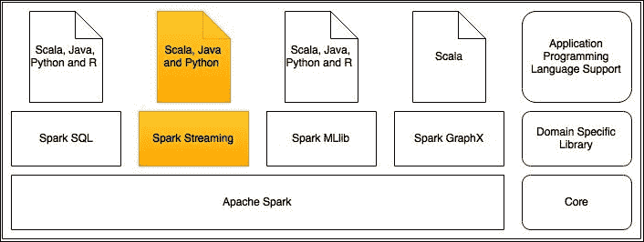
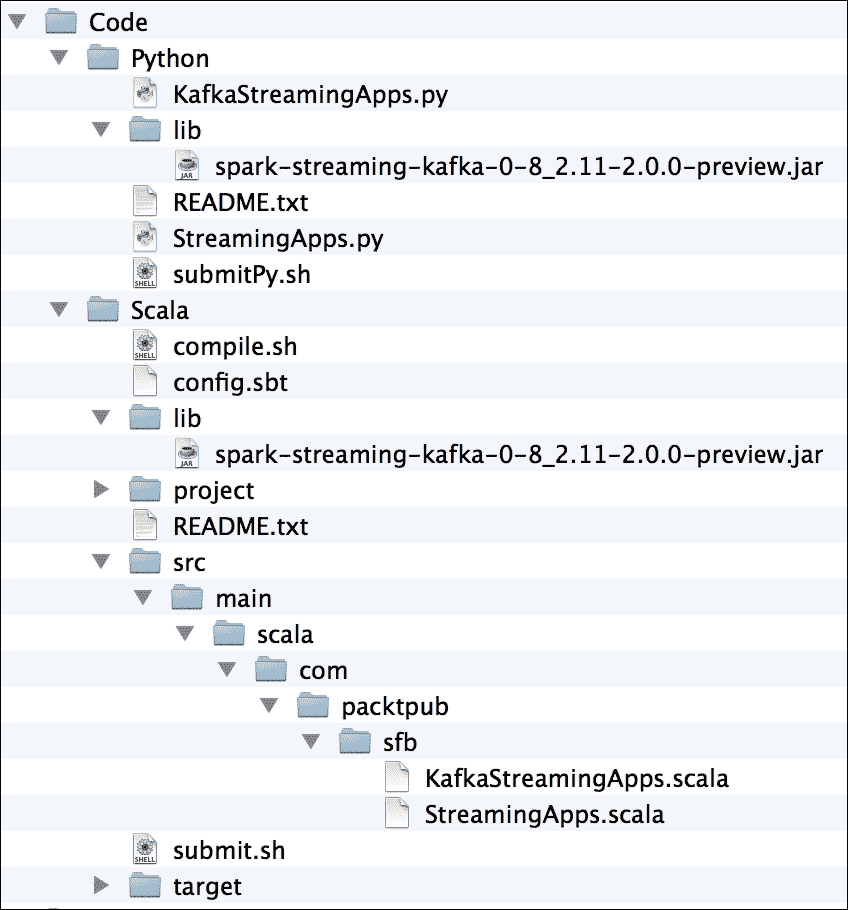
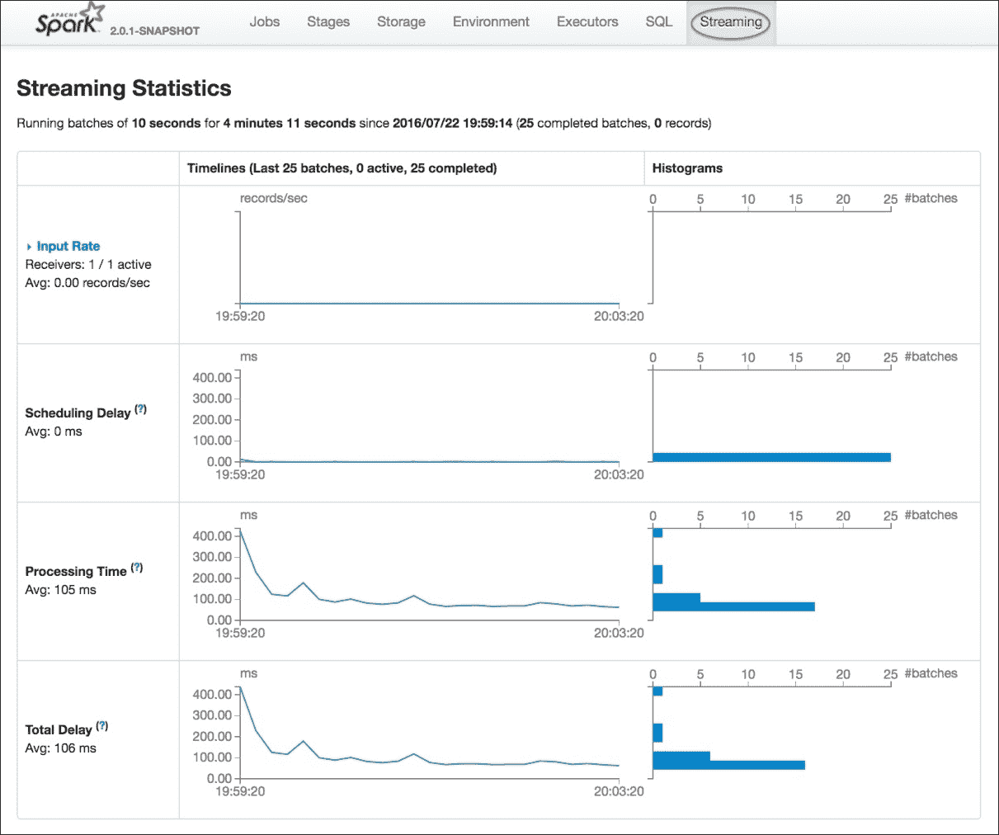

# 六、Spark流处理

数据处理用例主要可以分为两种类型。第一种类型是用例，其中数据是静态的，处理作为一个工作单元整体完成，或者将其分成更小的批次。在进行数据处理时，底层数据集不会改变，新数据集也不会添加到处理单元中。这是批处理。

第二种类型是用例，其中数据像流一样生成，处理在数据生成时完成。这就是流处理。在本书的前几章中，所有的数据处理用例都属于前一种类型。本章将重点讨论后者。

我们将在本章中讨论以下主题:

*   数据流处理
*   微批量数据处理
*   日志事件处理器
*   窗口数据处理和其他选项
*   卡夫卡流处理
*   使用 Spark 流式作业

# 数据流处理

数据源像流一样生成数据，许多真实的用例要求实时处理它们。*实时*的含义可以从一个用例变成另一个用例。对于给定的用例，定义什么是实时的主要参数是多久需要处理一次摄取的数据，或者从上一个时间间隔开始所有摄取的数据需要处理的频繁时间间隔。例如，当重大体育赛事发生时，消费比分赛事并将它们发送给订阅用户的应用应该以最快的速度处理数据。越快发送越好。

但是这里*快*的定义是什么？在评分事件发生后一小时内处理评分数据可以吗？可能不会。评分事件发生后一分钟内处理数据可以吗？绝对比一个小时后处理好。分数事件发生后一秒内处理数据可以吗？可能是的，而且比早期的数据处理时间间隔好得多。

在任何数据流处理用例中，这个时间间隔都非常重要。数据处理框架应该能够在选择的适当时间间隔内处理数据流，以提供良好的业务价值。

当以选择的规则间隔处理流数据时，从时间间隔的开始到结束收集数据，分组为微批，并对该批数据进行数据处理。在很长一段时间内，数据处理应用会处理许多这样的小批量数据。在这种类型的处理中，数据处理应用将只能看到在给定时间点正在处理的特定微批次。换句话说，应用将无法看到或访问已经处理的微批次数据。

现在，这种处理还有另一个方面。假设一个给定的用例要求每分钟处理一次数据，但同时，在处理一个给定微批处理的数据时，需要查看在过去 15 分钟内已经处理过的数据。零售银行交易处理应用的欺诈检测模块就是这种特定业务需求的一个很好的例子。毫无疑问，零售银行交易将在发生后的几毫秒内得到处理。在处理自动柜员机提现交易时，最好查看是否有人试图连续提现，如果发现，则发送适当的警报。为此，当处理给定的提现交易时，应用会检查在过去 15 分钟内是否有任何其他人使用同一张卡从同一台自动取款机中提现。业务规则是，当此类交易在过去 15 分钟内超过两次时，发送警报。在这个用例中，欺诈检测应用应该能够看到在 15 分钟内发生的所有交易。

一个好的流数据处理框架应该能够在任何给定的时间间隔内处理数据，并且能够在一个滑动的时间窗口内窥视所接收的数据。在 Spark 之上工作的 Spark Streaming 库是拥有这两种能力的最佳数据流处理框架之一。

再次查看*图 1* 中给出的 Spark 库堆栈的大图，以设置上下文，并查看在开始使用用例之前这里讨论的内容。



图 1

# 微批量数据处理

每个Spark流数据处理应用将持续运行，直到被终止。这个应用将不断地*监听*数据源以接收输入的数据流。Spark流数据处理应用将具有配置的批处理间隔。在每个批处理间隔结束时，它将产生一个名为**离散流** ( **数据流**)的数据抽象，其工作原理与 Spark 的 RDD 非常相似。就像 RDD 一样，数据流支持常用Spark变换和Spark动作的等效方法。

### 类型

就像 RDD 一样，数据流也是不可变和分布式的。

*图 2* 显示了数据流是如何在Spark流数据处理应用中产生的。


图 2

*图 2* 描述了Spark流应用最重要的元素。对于配置的批处理间隔，应用生成一个数据流。每个数据流都是由该批处理间隔内收集的数据组成的关系数据的集合。给定批次间隔内数据流中的 rdd 数量会有所不同。

### 类型

由于 Spark Streaming 应用是连续运行的收集数据的应用，因此在本章中，将讨论完整的应用，包括编译、打包和运行的指令，而不是在 REPL 运行代码。

Spark编程模型在[第 2 章](2.html "Chapter 2. Spark Programming Model")、*Spark编程模型*中进行了讨论。

## 用数据流编程

在 Spark Streaming 数据处理应用中使用数据流进行编程也遵循非常相似的模型，因为数据流由一个或多个 rdd 组成。当在数据流上调用Spark转换或Spark动作等方法时，等效操作将应用于构成数据流的所有关系数据库。

### 注

这里需要注意的重要一点是，并非所有在 RDD 上工作的 Spark 转换和 Spark 动作在数据流上都不受支持。另一个值得注意的变化是不同编程语言之间的能力差异。

Spark流的 Scala 和 Java APIs 在Spark流数据处理应用开发支持的功能数量方面领先于 Python API。

*图 3* 描述了应用于数据流的方法如何应用于底层关系数据库。在数据流上使用任何方法之前，应参考Spark流编程指南。Spark Streaming 编程指南在 Python API 偏离其 Scala 或 Java 对应物的地方标有包含文本 *Python API* 的特殊标注。

假设，对于Spark流数据处理应用中的给定批处理间隔，生成由多个 rdd 组成的数据流。当一个过滤方法被应用在那个数据流上时，它是如何被转换成底层的关系数据库的。*图 3* 显示了应用于具有两个 RDD 的数据流的过滤变换，由于过滤条件，导致另一个数据流只包含一个 RDD:


图 3

# 日志事件处理器

如今，在许多企业中，拥有应用日志事件的中央存储库是非常常见的。此外，日志事件被实时流式传输到数据处理应用，以便实时监控正在运行的应用的性能，从而可以采取及时的补救措施。这里讨论这样一个用例，以演示使用 Spark Streaming 数据处理应用对日志事件的实时处理。在这个用例中，实时应用日志事件被写入一个 TCP 套接字。Spark流数据处理应用持续监听给定主机上的给定端口，以收集日志事件流。

## 准备好 Netcat 服务器

大多数 UNIX 安装附带的 Netcat 实用程序在这里用作数据服务器。要确保系统中安装了 Netcat，请键入以下脚本中给出的手动命令，并在退出后运行该命令，确保没有错误消息。一旦服务器启动并运行，出于简单和演示的目的，在 Netcat 服务器控制台的标准输入中键入的任何内容都被视为应用日志事件。从终端提示符运行的以下命令将在本地主机端口`9999`上启动 Netcat 数据服务器:

```scala
$ man nc
 NC(1)          BSD General Commands Manual
NC(1) 
NAME
     nc -- arbitrary TCP and UDP connections and listens 
SYNOPSIS
     nc [-46AcDCdhklnrtUuvz] [-b boundif] [-i interval] [-p source_port] [-s source_ip_address] [-w timeout] [-X proxy_protocol] [-x proxy_address[:port]]
        [hostname] [port[s]]
 DESCRIPTION
     The nc (or netcat) utility is used for just about anything under the sun involving TCP or UDP.  It can open TCP connections, send UDP packets, listen on
     arbitrary TCP and UDP ports, do port scanning, and deal with both IPv4 and IPv6.  Unlike telnet(1), nc scripts nicely, and separates error messages onto
     standard error instead of sending them to standard output, as telnet(1) does with some. 
     Common uses include: 
           o   simple TCP proxies
           o   shell-script based HTTP clients and servers
           o   network daemon testing
           o   a SOCKS or HTTP ProxyCommand for ssh(1)
           o   and much, much more
$ nc -lk 9999

```

一旦完成了前面的步骤，Netcat 服务器就准备好了，Spark Streaming 数据处理应用将处理在前面的控制台窗口中键入的所有行。离开这个控制台窗口；以下所有 shell 命令将在不同的终端窗口中运行。

由于不同编程语言之间缺乏 Spark Streaming 特性的一致性，Scala 代码被用来解释所有的 Spark Streaming 概念和用例。之后，给出 Python 代码，如果缺乏对 Python 中讨论的任何特性的支持，也将捕获这些代码。

Scala 和 Python 代码的组织方式如图 4 所示。对于代码的编译、打包和运行，使用 bash 脚本，以便读者可以轻松地运行它们来产生一致的结果。这里讨论了这些脚本文件的每一个内容。

## 整理文件

在下面的文件夹树中，`project`和`target`文件夹是在运行时创建的。本书附带的源代码可以直接复制到系统中一个方便的文件夹中:



图 4

编译和打包使用 **Scala 构建工具** ( **sbt** )。为了确保 sbt 正常工作，在终端窗口的*图 4* 中从树的`Scala`文件夹运行以下命令。这是为了确保 sbt 工作正常，代码正在编译:

```scala
$ cd Scala
$ sbt
> compile
 [success] Total time: 1 s, completed 24 Jul, 2016 8:39:04 AM 
 > exit
	  $

```

下表捕获了文件的代表性示例列表，以及每个文件在这里讨论的 Spark Streaming 数据处理应用的上下文中的用途。

<colgroup><col> <col></colgroup> 
| **文件名** | **目的** |
| `README.txt` | 运行应用的说明。一个用于 Scala 应用，另一个用于 Python 应用。 |
| `submitPy.sh` | 向 Spark 集群提交 Python 作业的 Bash 脚本。 |
| `compile.sh` | Bash 脚本来编译 Scala 代码。 |
| `submit.sh` | 向 Spark 集群提交 Scala 作业的 Bash 脚本。 |
| `config.sbt` | sbt 配置文件。 |
| `*.scala` | Scala 中的Spark流数据处理应用代码。 |
| `*.py` | Python 中的 Spark Streaming 数据处理应用代码。 |
| `*.jar` | 需要下载并放置在`lib`文件夹下的Spark流和卡夫卡集成 JAR 文件，以便应用正常运行。这在`submit.sh`和`submitPy.sh`中用于向集群提交作业。 |

## 将作业提交到Spark集群

为了正确运行应用，某些配置取决于运行它的系统。它们将在`submit.sh`文件和`submitPy.sh`文件中编辑。无论哪里需要这样的编辑，注释都带有 `[FILLUP]`标签。其中最重要的是Spark安装目录和Spark主配置的设置，它们可能因系统而异。前面脚本`submit.sh`文件的来源如下:

```scala
#!/bin/bash
	  #-----------
	  # submit.sh
	  #-----------
	  # IMPORTANT - Assumption is that the $SPARK_HOME and $KAFKA_HOME environment variables are already set in the system that is running the application
	  # [FILLUP] Which is your Spark master. If monitoring is needed, use the desired Spark master or use local
	  # When using the local mode. It is important to give more than one cores in square brackets
	  #SPARK_MASTER=spark://Rajanarayanans-MacBook-Pro.local:7077
	  SPARK_MASTER=local[4]
	  # [OPTIONAL] Your Scala version
	  SCALA_VERSION="2.11"
	  # [OPTIONAL] Name of the application jar file. You should be OK to leave it like that
	  APP_JAR="spark-for-beginners_$SCALA_VERSION-1.0.jar"
	  # [OPTIONAL] Absolute path to the application jar file
	  PATH_TO_APP_JAR="target/scala-$SCALA_VERSION/$APP_JAR"
	  # [OPTIONAL] Spark submit commandSPARK_SUBMIT="$SPARK_HOME/bin/spark-submit"
	  # [OPTIONAL] Pass the application name to run as the parameter to this script
	  APP_TO_RUN=$1
	  sbt package
	  if [ $2 -eq 1 ]
	  then
	  $SPARK_SUBMIT --class $APP_TO_RUN --master $SPARK_MASTER --jars $KAFKA_HOME/libs/kafka-clients-0.8.2.2.jar,$KAFKA_HOME/libs/kafka_2.11-0.8.2.2.jar,$KAFKA_HOME/libs/metrics-core-2.2.0.jar,$KAFKA_HOME/libs/zkclient-0.3.jar,./lib/spark-streaming-kafka-0-8_2.11-2.0.0-preview.jar $PATH_TO_APP_JAR
	  else
	  $SPARK_SUBMIT --class $APP_TO_RUN --master $SPARK_MASTER --jars $PATH_TO_APP_JAR $PATH_TO_APP_JAR
	  fi

```

前面的脚本文件`submitPy.sh`的来源如下:

```scala
 #!/usr/bin/env bash
	  #------------
	  # submitPy.sh
	  #------------
	  # IMPORTANT - Assumption is that the $SPARK_HOME and $KAFKA_HOME environment variables are already set in the system that is running the application
	  # Disable randomized hash in Python 3.3+ (for string) Otherwise the following exception will occur
	  # raise Exception("Randomness of hash of string should be disabled via PYTHONHASHSEED")
	  # Exception: Randomness of hash of string should be disabled via PYTHONHASHSEED
	  export PYTHONHASHSEED=0
	  # [FILLUP] Which is your Spark master. If monitoring is needed, use the desired Spark master or use local
	  # When using the local mode. It is important to give more than one cores in square brackets
	  #SPARK_MASTER=spark://Rajanarayanans-MacBook-Pro.local:7077
	  SPARK_MASTER=local[4]
	  # [OPTIONAL] Pass the application name to run as the parameter to this script
	  APP_TO_RUN=$1
	  # [OPTIONAL] Spark submit command
	  SPARK_SUBMIT="$SPARK_HOME/bin/spark-submit"
	  if [ $2 -eq 1 ]
	  then
	  $SPARK_SUBMIT --master $SPARK_MASTER --jars $KAFKA_HOME/libs/kafka-clients-0.8.2.2.jar,$KAFKA_HOME/libs/kafka_2.11-0.8.2.2.jar,$KAFKA_HOME/libs/metrics-core-2.2.0.jar,$KAFKA_HOME/libs/zkclient-0.3.jar,./lib/spark-streaming-kafka-0-8_2.11-2.0.0-preview.jar $APP_TO_RUN
	  else
	  $SPARK_SUBMIT --master $SPARK_MASTER $APP_TO_RUN
	  fi

```

## 监控正在运行的应用

如[第 2 章](2.html "Chapter 2. Spark Programming Model")、 *Spark 编程模型*所述，Spark 安装带有强大的 Spark web UI，用于监控正在运行的 Spark 应用。

对于正在运行的Spark流作业，还有其他可视化工具可供使用。

以下脚本启动 Spark 主节点和工作节点，并启用监控。这里的假设是，读者已经进行了[第 2 章](2.html "Chapter 2. Spark Programming Model")、 *Spark 编程模型*中建议的所有配置更改，以启用 Spark 应用监控。如果没有这样做，应用仍然可以运行。唯一要做的更改是将案例放在`submit.sh`文件和`submitPy.sh`文件中，以确保使用类似`local[4]`的东西来代替 Spark 主网址。在终端窗口上运行以下命令:

```scala
 $ cd $SPARK_HOME
	  $ ./sbin/start-all.sh
       starting org.apache.spark.deploy.master.Master, logging to /Users/RajT/source-code/spark-source/spark-2.0/logs/spark-RajT-org.apache.spark.deploy.master.Master-1-Rajanarayanans-MacBook-Pro.local.out 
 localhost: starting org.apache.spark.deploy.worker.Worker, logging to /Users/RajT/source-code/spark-source/spark-2.0/logs/spark-RajT-org.apache.spark.deploy.worker.Worker-1-Rajanarayanans-MacBook-Pro.local.out

```

通过访问`http://localhost:8080/`，确保Spark网络用户界面已启动并运行。

## 在 Scala 中实现应用

以下代码片段是日志事件处理应用的 Scala 代码:

```scala
 /**
	  The following program can be compiled and run using SBT
	  Wrapper scripts have been provided with this
	  The following script can be run to compile the code
	  ./compile.sh
	  The following script can be used to run this application in Spark
	  ./submit.sh com.packtpub.sfb.StreamingApps
	  **/
	  package com.packtpub.sfb
	  import org.apache.spark.sql.{Row, SparkSession}
	  import org.apache.spark.streaming.{Seconds, StreamingContext}
	  import org.apache.spark.storage.StorageLevel
	  import org.apache.log4j.{Level, Logger}
	  object StreamingApps{
	  def main(args: Array[String]) 
	  {
	  // Log level settings
	  	  LogSettings.setLogLevels()
	  	  // Create the Spark Session and the spark context	  
	  	  val spark = SparkSession
	  	  .builder
	  	  .appName(getClass.getSimpleName)
	  	  .getOrCreate()
	     // Get the Spark context from the Spark session for creating the streaming context
	  	  val sc = spark.sparkContext   
	      // Create the streaming context
	      val ssc = new StreamingContext(sc, Seconds(10))
	      // Set the check point directory for saving the data to recover when 
       there is a crash   ssc.checkpoint("/tmp")
	      println("Stream processing logic start")
	      // Create a DStream that connects to localhost on port 9999
	      // The StorageLevel.MEMORY_AND_DISK_SER indicates that the data will be 
       stored in memory and if it overflows, in disk as well
	      val appLogLines = ssc.socketTextStream("localhost", 9999, 
       StorageLevel.MEMORY_AND_DISK_SER)
	      // Count each log message line containing the word ERROR
	      val errorLines = appLogLines.filter(line => line.contains("ERROR"))
	      // Print the elements of each RDD generated in this DStream to the 
        console   errorLines.print()
		   // Count the number of messages by the windows and print them
		   errorLines.countByWindow(Seconds(30), Seconds(10)).print()
		   println("Stream processing logic end")
		   // Start the streaming   ssc.start()   
		   // Wait till the application is terminated             
		   ssc.awaitTermination()    }
		}object LogSettings{
		  /** 
		   Necessary log4j logging level settings are done 
		  */  def setLogLevels() {
		    val log4jInitialized = 
         Logger.getRootLogger.getAllAppenders.hasMoreElements
		     if (!log4jInitialized) {
		        // This is to make sure that the console is clean from other INFO 
            messages printed by Spark
			       Logger.getRootLogger.setLevel(Level.WARN)
			    }
			  }
			}

```

在前面的代码片段中，有两个 Scala 对象。一个是设置适当的日志记录级别，以确保控制台上不会显示不需要的消息。`StreamingApps` Scala 对象保存流处理的逻辑。以下列表抓住了功能的本质:

*   将使用应用名称创建Spark配置。
*   创建一个 Spark `StreamingContext`对象，这是流处理的核心。`StreamingContext`构造函数的第二个参数是批处理间隔，为 10 秒。包含`ssc.socketTextStream`的行在每个批处理间隔(这里是 10 秒)创建数据流，包含在 Netcat 控制台中键入的行。
*   接着在数据流上应用一个过滤变换，使其只有包含单词`ERROR`的行。过滤器转换创建只包含过滤行的新数据流。
*   下一行将数据流内容打印到控制台。换句话说，对于每个批处理间隔，如果有包含单词`ERROR`的行，这些行会显示在控制台中。
*   在该数据处理逻辑结束时，给定的`StreamingContext`被启动并将运行直到它被终止。

在前面的代码片段中，没有告诉应用重复直到运行的应用终止的循环构造。这是通过 Spark Streaming 库本身实现的。从数据处理应用开始到终止，所有语句都运行一次。数据流上的所有操作(在内部)对于每一批都是重复的。如果仔细检查前一个应用的输出，println()语句的输出在控制台中只会出现一次，即使这些语句是在`StreamingContext`的初始化和终止之间。这是因为*魔术循环*只对包含原始和派生数据流的语句重复。

由于在 Spark Streaming 应用中实现的循环的特殊性质，在应用代码的流逻辑中给出打印语句和日志语句是徒劳的，就像代码片段中给出的那样。如果这是必须的，那么这些日志记录语句将在传递给数据流的函数中进行检测，以便进行转换和操作。

### 类型

如果处理过的数据需要持久性，那么有许多输出操作可用于数据流，就像 rdd 一样。

## 编译和运行应用

在终端窗口上运行以下命令来编译和运行应用。除了使用`./compile.sh`，也可以使用简单的 sbt 编译命令。

### 注

请注意，如前所述，在执行这些命令之前，Netcat 服务器必须正在运行。

```scala
 $ cd Scala
			$ ./compile.sh

      [success] Total time: 1 s, completed 24 Jan, 2016 2:34:48 PM

	$ ./submit.sh com.packtpub.sfb.StreamingApps

      Stream processing logic start    

      Stream processing logic end  

      -------------------------------------------                                     

      Time: 1469282910000 ms

      -------------------------------------------

      -------------------------------------------

      Time: 1469282920000 ms

      ------------------------------------------- 

```

如果没有显示错误消息，并且显示的结果与之前的输出一致，则表明 Spark Streaming 数据处理应用已正常启动。

## 处理输出

请注意，打印语句的输出先于数据流输出打印。到目前为止，在 Netcat 控制台中没有键入任何内容，因此，没有要处理的内容。

现在转到之前启动的 Netcat 控制台，输入以下几行日志事件消息，间隔几秒钟，以确保输出到多个批处理，其中批处理大小为 10 秒钟:

```scala
 [Fri Dec 20 01:46:23 2015] [ERROR] [client 1.2.3.4.5.6] Directory index forbidden by rule: /home/raj/
	  [Fri Dec 20 01:46:23 2015] [WARN] [client 1.2.3.4.5.6] Directory index forbidden by rule: /home/raj/
	  [Fri Dec 20 01:54:34 2015] [ERROR] [client 1.2.3.4.5.6] Directory index forbidden by rule: /apache/web/test
	  [Fri Dec 20 01:54:34 2015] [WARN] [client 1.2.3.4.5.6] Directory index forbidden by rule: /apache/web/test
	  [Fri Dec 20 02:25:55 2015] [ERROR] [client 1.2.3.4.5.6] Client sent malformed Host header
	  [Fri Dec 20 02:25:55 2015] [WARN] [client 1.2.3.4.5.6] Client sent malformed Host header
	  [Mon Dec 20 23:02:01 2015] [ERROR] [client 1.2.3.4.5.6] user test: authentication failure for "/~raj/test": Password Mismatch
	  [Mon Dec 20 23:02:01 2015] [WARN] [client 1.2.3.4.5.6] user test: authentication failure for "/~raj/test": Password Mismatch 

```

一旦将日志事件消息输入到 Netcat 控制台窗口，以下结果将开始显示在 Spark Streaming 数据处理应用中，仅过滤包含关键字 ERROR 的日志事件消息。

```scala
	  -------------------------------------------
	  Time: 1469283110000 ms
	  -------------------------------------------
	  [Fri Dec 20 01:46:23 2015] [ERROR] [client 1.2.3.4.5.6] Directory index
      forbidden by rule: /home/raj/
	  -------------------------------------------
	  Time: 1469283190000 ms
	  -------------------------------------------
	  -------------------------------------------
	  Time: 1469283200000 ms
	  -------------------------------------------
	  [Fri Dec 20 01:54:34 2015] [ERROR] [client 1.2.3.4.5.6] Directory index
      forbidden by rule: /apache/web/test
	  -------------------------------------------
	  Time: 1469283250000 ms
	  -------------------------------------------
	  -------------------------------------------
	  Time: 1469283260000 ms
	  -------------------------------------------
	  [Fri Dec 20 02:25:55 2015] [ERROR] [client 1.2.3.4.5.6] Client sent 
      malformed Host header
	  -------------------------------------------
	  Time: 1469283310000 ms
	  -------------------------------------------
	  [Mon Dec 20 23:02:01 2015] [ERROR] [client 1.2.3.4.5.6] user test:
      authentication failure for "/~raj/test": Password Mismatch
	  -------------------------------------------
	  Time: 1453646710000 ms
	  -------------------------------------------

```

Spark web UI ( `http://localhost:8080/`)已经启用，图 5 和图 6 显示了 Spark 应用和统计数据。

在主页面(访问网址`http://localhost:8080/`后)，点击正在运行的 Spark Streaming 数据处理应用的名称链接，调出常规监控页面。在该页面中，单击**流**选项卡，显示包含流统计信息的页面。

要单击的链接和选项卡用红色圈起来:


图 5

从*图 5* 所示页面，点击圈出的应用链接；它会带你到相关的页面。在该页面中，一旦点击**流**选项卡，包含流统计的页面将显示为在*图 6* 中捕获的状态:



图 6

从这些 Spark web UI 页面中可以获得大量的应用统计数据，广泛探索它们是一个好主意，可以更深入地了解 Spark Streaming 提交的数据处理应用的行为。

### 类型

在启用对流式应用的监控时必须小心，因为它不应该影响应用本身的性能。

## 用 Python 实现应用

同样的用例在 Python 中实现，下面保存在`StreamingApps.py`中的代码片段用于实现这一点:

```scala
 # The following script can be used to run this application in Spark
	  # ./submitPy.sh StreamingApps.py
	  from __future__ import print_function
	  import sys
	  from pyspark import SparkContext
	  from pyspark.streaming import StreamingContext
	  if __name__ == "__main__":
	      # Create the Spark context
	      sc = SparkContext(appName="PythonStreamingApp")
	      # Necessary log4j logging level settings are done 
	      log4j = sc._jvm.org.apache.log4j
	      log4j.LogManager.getRootLogger().setLevel(log4j.Level.WARN)
	      # Create the Spark Streaming Context with 10 seconds batch interval
	      ssc = StreamingContext(sc, 10)
	      # Set the check point directory for saving the data to recover when
        there is a crash
		    ssc.checkpoint("\tmp")
		    # Create a DStream that connects to localhost on port 9999
		    appLogLines = ssc.socketTextStream("localhost", 9999)
		    # Count each log messge line containing the word ERROR
		    errorLines = appLogLines.filter(lambda appLogLine: "ERROR" in appLogLine)
		    # // Print the elements of each RDD generated in this DStream to the console 
		    errorLines.pprint()
		    # Count the number of messages by the windows and print them
		    errorLines.countByWindow(30,10).pprint()
		    # Start the streaming
		    ssc.start()
		    # Wait till the application is terminated   
		    ssc.awaitTermination()
```

在终端窗口上运行以下命令，从下载代码的目录中运行 Python Spark Streaming 数据处理应用。在运行应用之前，以与修改用于运行 Scala 应用的脚本相同的方式，还必须更改`submitPy.sh`文件以指向正确的 Spark 安装目录并配置 Spark 主文件。如果启用了监控，并且提交指向正确的 Spark 主文件，那么相同的 Spark web UI 也将捕获 Python Spark Streaming 数据处理应用的统计信息。

在终端窗口上运行以下命令来运行 Python 应用:

```scala
 $ cd Python
		$ ./submitPy.sh StreamingApps.py 

```

一旦 Scala 实现中使用的相同日志事件消息被输入 Netcat 控制台窗口，以下结果将开始显示在流应用中，仅过滤包含关键字`ERROR`的日志事件消息:

```scala
		-------------------------------------------
		Time: 2016-07-23 15:21:50
		-------------------------------------------
		-------------------------------------------
		Time: 2016-07-23 15:22:00
		-------------------------------------------
		[Fri Dec 20 01:46:23 2015] [ERROR] [client 1.2.3.4.5.6] 
		Directory index forbidden by rule: /home/raj/
		-------------------------------------------
		Time: 2016-07-23 15:23:50
		-------------------------------------------
		[Fri Dec 20 01:54:34 2015] [ERROR] [client 1.2.3.4.5.6] 
		Directory index forbidden by rule: /apache/web/test
		-------------------------------------------
		Time: 2016-07-23 15:25:10
		-------------------------------------------
		-------------------------------------------
		Time: 2016-07-23 15:25:20
		-------------------------------------------
		[Fri Dec 20 02:25:55 2015] [ERROR] [client 1.2.3.4.5.6] 
		Client sent malformed Host header
		-------------------------------------------
		Time: 2016-07-23 15:26:50
		-------------------------------------------
		[Mon Dec 20 23:02:01 2015] [ERROR] [client 1.2.3.4.5.6] 
		user test: authentication failure for "/~raj/test": Password Mismatch
		-------------------------------------------
		Time: 2016-07-23 15:26:50
		-------------------------------------------

```

如果您同时查看 Scala 和 Python 程序的输出，您可以清楚地看到在给定的批处理间隔中是否有任何包含单词`ERROR`的日志事件消息。一旦数据被处理，应用就丢弃处理过的数据，而不保留它们以备将来使用。

换句话说，应用永远不会保留或记住以前批处理间隔中的任何日志事件消息。如果需要捕获错误消息的数量，比如说在最后 5 分钟左右，那么之前的方法将不起作用。我们将在下一节讨论这个问题。

# 窗口化数据处理

在上一节讨论的 Spark Streaming 数据处理应用中，假设需要统计前三批中包含关键字 ERROR 的日志事件消息的数量。换句话说，应该能够在三个批次的窗口中统计此类事件消息的数量。在任何给定的时间点，当新的一批数据可用时，窗口应该随着时间滑动。这里讨论了三个重要的术语，*图 7* 解释了它们。它们是:

*   批处理间隔:产生数据流的时间间隔
*   窗口长度:需要查看批次间隔中产生的所有数据流的批次间隔数的持续时间
*   滑动间隔:执行窗口操作(如计数事件消息)的间隔


图 7

在*图 7* 中，在给定的时间点，用于要执行的操作的数据流被包围在一个矩形中。

在每个批处理间隔中，都会生成一个新的数据流。这里，窗口长度为 3，在窗口中要执行的操作是计算该窗口中事件消息的数量。滑动间隔保持与批处理间隔相同，以便在生成新数据流时完成计数操作，从而使计数始终正确。

在 **t2** 时刻，对在 **t0** 、 **t1** 和 **t2** 时刻生成的数据流进行计数操作。在时间 **t3** 时，由于滑动窗口保持与批处理间隔相同，因此再次进行计数操作，并且这次对在时间 **t1** 、 **t2** 和 **t3** 生成的数据流进行事件计数。在 **t4** 时刻，再次进行计数操作，对在 **t2** 、 **t3** 和 **t4** 时刻生成的数据流进行事件计数。操作以这种方式继续，直到应用终止。

## 正在计算 Scala 中处理的日志事件消息的数量

在前一节中，讨论了日志事件消息的处理。在打印包含单词`ERROR`的日志事件消息后的同一应用代码中，在 Scala 应用中包含以下代码行:

```scala
errorLines.print()errorLines.countByWindow(Seconds(30), Seconds(10)).print()
```

第一个参数是窗口长度，第二个参数是滑动窗口间隔。一旦在 Netcat 控制台中键入以下行，这条神奇的行将打印已处理的日志事件消息的计数:

```scala
[Fri Dec 20 01:46:23 2015] [ERROR] [client 1.2.3.4.5.6] Directory index forbidden by rule: /home/raj/[Fri Dec 20 01:46:23 2015] [WARN] [client 1.2.3.4.5.6] Directory index forbidden by rule: /home/raj/[Fri Dec 20 01:54:34 2015] [ERROR] [client 1.2.3.4.5.6] Directory index forbidden by rule: /apache/web/test

```

Scala 中相同的 Spark Streaming 数据处理应用，加上额外的代码行，会产生以下输出:

```scala
-------------------------------------------
Time: 1469284630000 ms
-------------------------------------------
[Fri Dec 20 01:46:23 2015] [ERROR] [client 1.2.3.4.5.6] Directory index 
      forbidden by rule: /home/raj/
-------------------------------------------
Time: 1469284630000 ms
      -------------------------------------------
1
-------------------------------------------
Time: 1469284640000 ms
-------------------------------------------
[Fri Dec 20 01:54:34 2015] [ERROR] [client 1.2.3.4.5.6] Directory index 
      forbidden by rule: /apache/web/test
-------------------------------------------
Time: 1469284640000 ms
-------------------------------------------
2
-------------------------------------------
Time: 1469284650000 ms
-------------------------------------------
2
-------------------------------------------
Time: 1469284660000 ms
-------------------------------------------
1
-------------------------------------------
Time: 1469284670000 ms
-------------------------------------------
0

```

如果对输出进行了适当的研究，可以注意到，在第一批时间间隔中，处理了一个日志事件消息。显然，显示的计数是该批次间隔的`1`。在下一个批处理间隔中，还会处理一条日志事件消息。该批次间隔显示的计数为`2`。在下一个批处理间隔中，不处理任何日志事件消息。但是那个窗口的计数仍然是`2`。多一个窗口，计数显示为`2`。然后降为`1`，然后为 0。

这里需要注意的最重要的一点是，在 Scala 和 Python 的应用代码中，在 StreamingContext 创建之后，需要立即插入以下代码行来指定检查点目录:

```scala
ssc.checkpoint("/tmp") 

```

## 统计 Python 中处理的日志事件消息数

在 Python 应用代码中，打印包含单词 ERROR 的日志事件消息后，在 Scala 应用中包含以下代码行:

```scala
errorLines.pprint()
errorLines.countByWindow(30,10).pprint()
```

第一个参数是窗口长度，第二个参数是滑动窗口间隔。一旦在 Netcat 控制台中键入以下行，这条神奇的行将打印已处理的日志事件消息的计数:

```scala
[Fri Dec 20 01:46:23 2015] [ERROR] [client 1.2.3.4.5.6] 
Directory index forbidden by rule: /home/raj/
[Fri Dec 20 01:46:23 2015] [WARN] [client 1.2.3.4.5.6] 
Directory index forbidden by rule: /home/raj/
[Fri Dec 20 01:54:34 2015] [ERROR] [client 1.2.3.4.5.6] 
Directory index forbidden by rule: /apache/web/test

```

Python 中相同的 Spark Streaming 数据处理应用，加上额外的代码行，会产生以下输出:

```scala
------------------------------------------- 
Time: 2016-07-23 15:29:40 
------------------------------------------- 
[Fri Dec 20 01:46:23 2015] [ERROR] [client 1.2.3.4.5.6] Directory index forbidden by rule: /home/raj/ 
------------------------------------------- 
Time: 2016-07-23 15:29:40 
------------------------------------------- 
1 
------------------------------------------- 
Time: 2016-07-23 15:29:50 
------------------------------------------- 
[Fri Dec 20 01:54:34 2015] [ERROR] [client 1.2.3.4.5.6] Directory index forbidden by rule: /apache/web/test 
------------------------------------------- 
Time: 2016-07-23 15:29:50 
------------------------------------------- 
2 
------------------------------------------- 
Time: 2016-07-23 15:30:00 
------------------------------------------- 
------------------------------------------- 
Time: 2016-07-23 15:30:00 
------------------------------------------- 
2 
------------------------------------------- 
Time: 2016-07-23 15:30:10 
------------------------------------------- 
------------------------------------------- 
Time: 2016-07-23 15:30:10 
------------------------------------------- 
1 
------------------------------------------- 
Time: 2016-07-23 15:30:20 
------------------------------------------- 
------------------------------------------- 
Time: 2016-07-23 15:30:20 
-------------------------------------------

```

Python 应用的输出模式也与 Scala 应用非常相似。

# 更多处理选项

除了窗口中的计数操作之外，还有更多的操作可以结合窗口在数据流上完成。下表列出了重要的转换。所有这些转换都作用于选定的窗口，并返回一个数据流。

<colgroup><col> <col></colgroup> 
| **转化** | **描述** |
| `window(windowLength, slideInterval)` | 返回在窗口中计算的数据流 |
| `countByWindow(windowLength, slideInterval)` | 返回元素的计数 |
| `reduceByWindow(func, windowLength, slideInterval)` | 通过应用聚合函数返回一个元素 |
| `reduceByKeyAndWindow(func, windowLength, slideInterval, [numTasks])` | 对每个键的多个值应用聚合函数后，每个键返回一个键/值对 |
| `countByValueAndWindow(windowLength, slideInterval, [numTasks])` | 在对每个键应用多个值的计数后，每个键返回一个键/计数对 |

流处理最重要的步骤之一是将流数据保存到二级存储中。由于 Spark Streaming 数据处理应用中的数据速度将非常高，任何一种在整个过程中引入额外延迟的持久性机制都不是明智的解决方案。

在批处理场景中，向 HDFS 和其他基于文件系统的存储写入数据是可以的。但是当涉及到流输出的存储时，根据用例，应该选择一个理想的流数据存储机制。

卡珊德拉等 NoSQL 数据存储支持时态数据的快速写入。读取存储的数据以便进一步分析也是理想的。Spark流库支持数据流上的许多输出方法。它们包括将流数据保存为文本文件、对象文件、Hadoop 文件等的选项。除此之外，还有许多第三方驱动程序可以将数据保存到各种数据存储中。

# 卡夫卡流加工

本章中介绍的日志事件处理器示例正在侦听一个 TCP 套接字，以获取将由 Spark Streaming 数据处理应用处理的消息流。但是在现实世界的用例中，情况不会是这样的。

具有发布-订阅功能的消息排队系统通常用于处理消息。由于大规模数据处理应用需要每秒处理大量消息，传统的消息排队系统无法运行。

Kafka 是一个发布-订阅消息系统，许多物联网应用使用它来处理大量消息。卡夫卡的以下功能使其成为最广泛使用的信息系统之一:

*   速度极快:Kafka 可以在短时间间隔内处理许多应用客户端的读写操作，从而处理大量数据
*   高度可扩展:Kafka 旨在使用商用硬件进行纵向扩展和横向扩展以形成集群
*   持久化大量的消息:到达卡夫卡主题的消息被持久化到二级存储器中，同时它处理流过的大量消息

### 注

对卡夫卡的详细论述超出了本书的范围。假设读者对卡夫卡很熟悉并且有工作知识。从 Spark Streaming 数据处理应用的角度来看，无论是 TCP 套接字还是被用作消息源的 Kafka，都没有真正的区别。但是，使用卡夫卡作为消息生产者来开发一个有趣的用例，将会很好地理解企业大量使用的工具集。*学习Apache卡夫卡* *-第二版**尼尚特·加尔格*([https://www . packtpub . com/big-data-and-business-intelligence/Learning-Apache-卡夫卡-第二版](https://www.packtpub.com/big-data-and-business-intelligence/learning-apache-kafka-second-edition))是了解更多卡夫卡的好参考书。

以下是卡夫卡的一些重要元素，是在进一步研究之前需要理解的术语:

*   制作人:消息的真正来源，如天气传感器或手机网络
*   经纪人:卡夫卡集群，它接收并保存各种制作人发布给它的主题的信息
*   消费者:订阅卡夫卡主题的数据处理应用消费发布到主题的消息

上一节中讨论的相同日志事件处理应用用例在这里被再次使用，以阐明 Kafka 与 Spark Streaming 的用法。这里，Spark Streaming 数据处理应用将充当 Kafka 主题的使用者，并使用发布到该主题的消息，而不是从 TCP 套接字收集日志事件消息。

Spark Streaming 数据处理应用使用 Kafka 的 0.8.2.2 版本作为消息代理，假设阅读器已经安装了 Kafka，至少在独立模式下是这样。要执行以下活动，以确保 Kafka 准备好处理制作人制作的消息，并且 Spark Streaming 数据处理应用可以使用这些消息:

1.  启动卡夫卡装置附带的动物园管理员。
2.  启动卡夫卡服务器。
3.  为生产者创建一个发送消息的主题。
4.  拿起一个卡夫卡制作人，开始向新创建的主题发布日志事件消息。
5.  使用Spark流数据处理应用处理发布到新创建主题的日志事件。

## 首发动物园管理员和卡夫卡

以下脚本从单独的终端窗口运行，以便启动 Zookeeper 和 Kafka 代理，并创建所需的 Kafka 主题:

```scala
$ cd $KAFKA_HOME 
$ $KAFKA_HOME/bin/zookeeper-server-start.sh 
$KAFKA_HOME/config/zookeeper.properties  
[2016-07-24 09:01:30,196] INFO binding to port 0.0.0.0/0.0.0.0:2181 (org.apache.zookeeper.server.NIOServerCnxnFactory) 
$ $KAFKA_HOME/bin/kafka-server-start.sh $KAFKA_HOME/config/server.properties  

[2016-07-24 09:05:06,381] INFO 0 successfully elected as leader 
(kafka.server.ZookeeperLeaderElector) 
[2016-07-24 09:05:06,455] INFO [Kafka Server 0], started 
(kafka.server.KafkaServer) 
$ $KAFKA_HOME/bin/kafka-topics.sh --create --zookeeper localhost:2181 
--replication-factor 1 --partitions 1 --topic sfb 
Created topic "sfb". 
$ $KAFKA_HOME/bin/kafka-console-producer.sh --broker-list 
localhost:9092 --topic sfb

```

### 类型

确保环境变量`$KAFKA_HOME`指向安装卡夫卡的目录。此外，在单独的终端窗口中启动 Zookeeper、Kafka 服务器、Kafka 生产者和 Spark Streaming 日志事件数据处理应用也非常重要。

卡夫卡消息生成器可以是能够向卡夫卡主题发布消息的任何应用。在这里，卡夫卡附带的`kafka-console-producer`被用作选择的生产者。一旦生成器开始运行，无论在控制台窗口中键入什么，都将被视为发布到所选卡夫卡主题的消息。在启动`kafka-console-producer`时，卡夫卡主题作为命令行参数给出。

使用 Kafka 生成器生成的日志事件消息的 Spark Streaming 数据处理应用的提交与上一节中介绍的应用略有不同。在这里，数据处理需要许多卡夫卡 jar 文件。由于它们不是 Spark 基础架构的一部分，因此必须提交给 Spark 集群。成功运行此应用需要以下 jar 文件:

*   `$KAFKA_HOME/libs/kafka-clients-0.8.2.2.jar`
*   `$KAFKA_HOME/libs/kafka_2.11-0.8.2.2.jar`
*   `$KAFKA_HOME/libs/metrics-core-2.2.0.jar`
*   `$KAFKA_HOME/libs/zkclient-0.3.jar`
*   `Code/Scala/lib/spark-streaming-kafka-0-8_2.11-2.0.0-preview.jar`
*   `Code/Python/lib/spark-streaming-kafka-0-8_2.11-2.0.0-preview.jar`

在前面的 jar 文件列表中，`spark-streaming-kafka-0-8_2.11-2.0.0-preview.jar`的 maven 存储库坐标是`"org.apache.spark" %% "spark-streaming-kafka-0-8" % "2.0.0-preview"`。这个特定的 jar 文件必须被下载并放置在图 4 中给出的目录结构的 lib 文件夹中。它正在`submit.sh`和`submitPy.sh`脚本中使用，这两个脚本将应用提交给 Spark 集群。本章的参考部分给出了这个 jar 文件的下载网址。

在`submit.sh`和`submitPy.sh`文件中，最后几行包含一个条件语句，寻找第二个参数值 1 来标识这个应用，并将所需的 jar 文件发送到 Spark 集群。

### 类型

提交作业时，可以通过使用 sbt 创建程序集 jar 来使用它，而不是将这些单独的 jar 文件分别发送到 Spark 集群。

## 在 Scala 中实现应用

下面的代码片段是用于日志事件处理应用的 Scala 代码，该应用处理由 Kafka 生产者产生的消息。该应用的用例与上一节中讨论的关于窗口操作的用例相同:

```scala
/** 
The following program can be compiled and run using SBT 
Wrapper scripts have been provided with this 
The following script can be run to compile the code 
./compile.sh 

The following script can be used to run this application in Spark. The second command line argument of value 1 is very important. This is to flag the shipping of the kafka jar files to the Spark cluster 
./submit.sh com.packtpub.sfb.KafkaStreamingApps 1 
**/ 
package com.packtpub.sfb 

import java.util.HashMap 
import org.apache.spark.streaming._ 
import org.apache.spark.sql.{Row, SparkSession} 
import org.apache.spark.streaming.kafka._ 
import org.apache.kafka.clients.producer.{ProducerConfig, KafkaProducer, ProducerRecord} 

object KafkaStreamingApps { 
  def main(args: Array[String]) { 
   // Log level settings 
   LogSettings.setLogLevels() 
   // Variables used for creating the Kafka stream 
   //The quorum of Zookeeper hosts 
    val zooKeeperQuorum = "localhost" 
   // Message group name 
   val messageGroup = "sfb-consumer-group" 
   //Kafka topics list separated by coma if there are multiple topics to be listened on 
   val topics = "sfb" 
   //Number of threads per topic 
   val numThreads = 1 
   // Create the Spark Session and the spark context            
   val spark = SparkSession 
         .builder 
         .appName(getClass.getSimpleName) 
         .getOrCreate() 
   // Get the Spark context from the Spark session for creating the streaming context 
   val sc = spark.sparkContext    
   // Create the streaming context 
   val ssc = new StreamingContext(sc, Seconds(10)) 
    // Set the check point directory for saving the data to recover when there is a crash 
   ssc.checkpoint("/tmp") 
   // Create the map of topic names 
    val topicMap = topics.split(",").map((_, numThreads.toInt)).toMap 
   // Create the Kafka stream 
    val appLogLines = KafkaUtils.createStream(ssc, zooKeeperQuorum, messageGroup, topicMap).map(_._2) 
   // Count each log messge line containing the word ERROR 
    val errorLines = appLogLines.filter(line => line.contains("ERROR")) 
   // Print the line containing the error 
   errorLines.print() 
   // Count the number of messages by the windows and print them 
   errorLines.countByWindow(Seconds(30), Seconds(10)).print() 
   // Start the streaming 
    ssc.start()    
   // Wait till the application is terminated             
    ssc.awaitTermination()  
  } 
} 

```

与前面部分中的 Scala 代码相比，主要的区别在于创建流的方式。

## 用 Python 实现应用

下面的代码片段是用于日志事件处理应用的 Python 代码，该应用处理卡夫卡制作人制作的消息。该应用的用例也与上一节中讨论的关于窗口操作的用例相同:

```scala
 # The following script can be used to run this application in Spark 
# ./submitPy.sh KafkaStreamingApps.py 1 

from __future__ import print_function 
import sys 
from pyspark import SparkContext 
from pyspark.streaming import StreamingContext 
from pyspark.streaming.kafka import KafkaUtils 

if __name__ == "__main__": 
    # Create the Spark context 
    sc = SparkContext(appName="PythonStreamingApp") 
    # Necessary log4j logging level settings are done  
    log4j = sc._jvm.org.apache.log4j 
    log4j.LogManager.getRootLogger().setLevel(log4j.Level.WARN) 
    # Create the Spark Streaming Context with 10 seconds batch interval 
    ssc = StreamingContext(sc, 10) 
    # Set the check point directory for saving the data to recover when there is a crash 
    ssc.checkpoint("\tmp") 
    # The quorum of Zookeeper hosts 
    zooKeeperQuorum="localhost" 
    # Message group name 
    messageGroup="sfb-consumer-group" 
    # Kafka topics list separated by coma if there are multiple topics to be listened on 
    topics = "sfb" 
    # Number of threads per topic 
    numThreads = 1     
    # Create a Kafka DStream 
    kafkaStream = KafkaUtils.createStream(ssc, zooKeeperQuorum, messageGroup, {topics: numThreads}) 
    # Create the Kafka stream 
    appLogLines = kafkaStream.map(lambda x: x[1]) 
    # Count each log messge line containing the word ERROR 
    errorLines = appLogLines.filter(lambda appLogLine: "ERROR" in appLogLine) 
    # Print the first ten elements of each RDD generated in this DStream to the console 
    errorLines.pprint() 
    errorLines.countByWindow(30,10).pprint() 
    # Start the streaming 
    ssc.start() 
    # Wait till the application is terminated    
    ssc.awaitTermination()

```

在终端窗口上运行以下命令来运行 Scala 应用:

```scala
 $ cd Scala
	$ ./submit.sh com.packtpub.sfb.KafkaStreamingApps 1

```

在终端窗口上运行以下命令来运行 Python 应用:

```scala
 $ cd Python
	$ 
	./submitPy.sh KafkaStreamingApps.py 1

```

当前面两个程序都在运行时，无论在 Kafka 控制台生成器的控制台窗口中键入什么日志事件消息，并使用下面的命令和输入进行调用，都将由应用进行处理。该程序的输出将非常类似于上一节中给出的输出:

```scala
	$ $KAFKA_HOME/bin/kafka-console-producer.sh --broker-list localhost:9092 
	--topic sfb 
	[Fri Dec 20 01:46:23 2015] [ERROR] [client 1.2.3.4.5.6] Directory index forbidden by rule: /home/raj/ 
	[Fri Dec 20 01:46:23 2015] [WARN] [client 1.2.3.4.5.6] Directory index forbidden by rule: /home/raj/ 
	[Fri Dec 20 01:54:34 2015] [ERROR] [client 1.2.3.4.5.6] Directory index forbidden by rule: 
	/apache/web/test 

```

Spark 提供了两种处理卡夫卡流的方法。第一种是前面讨论过的基于接收者的方法，第二种是直接方法。

这种直接处理卡夫卡消息的方法是一种简化的方法，其中 Spark Streaming 使用卡夫卡的所有可能功能，就像任何卡夫卡主题使用者一样，并轮询特定主题中的消息，以及按消息的偏移量进行划分。根据 Spark Streaming 数据处理应用的批处理间隔，它从 Kafka 集群中拾取一定数量的偏移，并且该偏移范围作为批处理进行处理。这是非常高效的，非常适合处理要求只处理一次的消息。该方法还减少了 Spark Streaming 库执行额外工作来实现消息处理的一次性语义的需要，并将该职责委托给 Kafka。这种方法的编程结构在用于数据处理的 API 中略有不同。详情请参考相应的参考资料。

前面几节介绍了 Spark Streaming 库的概念，并讨论了一些真实的用例。从部署的角度来看，为处理静态批处理数据而开发的 Spark 数据处理应用和为处理动态流数据而开发的应用之间有很大的区别。数据处理应用处理数据流的可用性必须是恒定的。换句话说，这样的应用不应该有单点故障的组件。下一节将讨论这个话题。

# 生产中的Spark流作业

当 Spark Streaming 应用正在处理传入的数据时，拥有不间断的数据处理能力非常重要，这样所有接收到的数据都会得到处理。在关键业务流应用中，大多数情况下，即使丢失一条数据也会产生巨大的业务影响。为了应对这种情况，避免应用基础架构中的单点故障非常重要。

从 Spark Streaming 应用的角度来看，了解生态系统中的底层组件是如何布局的很好，这样就可以采取适当的措施来避免单点故障。

部署在集群中的Spark流应用(如 Hadoop 纱、Mesos 或Spark独立模式)有两个主要组件，与任何其他类型的Spark应用非常相似:

*   **Spark驱动**:包含用户编写的应用代码
*   **执行器**:执行Spark驱动提交的作业的执行器

但是执行器有一个额外的组件叫做接收器，它接收作为流获取的数据，并将其作为数据块保存在内存中。当一个接收器正在接收数据并形成数据块时，它们被复制到另一个执行器以实现容错。换句话说，数据块的内存复制是在不同的执行器上完成的。在每个批处理间隔结束时，这些数据块被组合成一个数据流，并被发送到下游进行进一步处理。

*图 8* 描述了在集群中部署的 Spark Streaming 应用基础设施中协同工作的组件:


图 8

在*图 8* 中，有两个执行人。接收器组件故意不显示在第二个执行器中，以表明它没有使用接收器，而是从另一个执行器收集复制的数据块。但是当需要时，例如在第一个执行器发生故障时，第二个执行器中的接收器可以开始工作。

## 在Spark流数据处理应用中实现容错

Spark Streaming 数据处理应用基础架构有许多活动部分。它们中的任何一个都可能发生故障，导致数据处理中断。通常故障会发生在Spark驱动器或执行器上。

### 注

本节不打算详细介绍在生产环境中以容错方式运行 Spark Streaming 应用。目的是让读者了解在生产中部署 Spark Streaming 数据处理应用时应采取的预防措施。

当执行器失败时，由于数据的复制定期进行，接收数据流的任务将由复制数据的执行器接管。存在这样一种情况，当执行器失败时，所有未处理的数据都将丢失。为了避免这个问题，有一种方法可以将数据块以预写日志的形式保存到 HDFS 或亚马逊 S3。

### 类型

不需要在一个基础架构中同时进行数据块和预写日志的内存复制。根据需要，只保留其中一个。

当 Spark 驱动程序失败时，被驱动程序停止，所有执行器失去连接，它们停止运行。这是最危险的情况。为了应对这种情况，需要进行一些配置和代码更改。

Spark驱动程序必须配置为自动驱动程序重启，这是由集群管理器支持的。这包括更改 Spark 作业提交方法，使集群模式处于集群管理器模式。当驱动程序重启时，为了从崩溃的地方开始，必须在驱动程序中实现检查点机制。这已经在使用的代码示例中完成。下面几行代码可以完成这项工作:

```scala
 ssc = StreamingContext(sc, 10) 
    ssc.checkpoint("\tmp")

```

### 类型

在示例应用中，可以使用本地系统目录作为检查点目录。但是在生产环境中，如果是 Hadoop，最好将此检查点目录作为 HDFS 位置，如果是亚马逊云，最好将其作为 S3 位置。

从应用编码的角度来看，`StreamingContext`的创建方式略有不同。不是每次都创建一个新的`StreamingContext`，而是将`StreamingContext`的工厂方法`getOrCreate`与一个函数一起使用，如下代码段所示。如果这样做了，当驱动程序重新启动时，工厂方法将检查检查点目录，查看是否使用了更早的`StreamingContext`，如果在检查点数据中找到，则创建它。否则，创建一个新的`StreamingContext`。

下面的代码片段给出了可以与`StreamingContext`的`getOrCreate`工厂方法一起使用的函数的定义。如前所述，对这些方面的详细论述超出了本书的范围:

```scala
	 /** 
  * The following function has to be used when the code is being restructured to have checkpointing and driver recovery 
  * The way it should be used is to use the StreamingContext.getOrCreate with this function and do a start of that 
  */ 
  def sscCreateFn(): StreamingContext = { 
   // Variables used for creating the Kafka stream 
   // The quorum of Zookeeper hosts 
    val zooKeeperQuorum = "localhost" 
   // Message group name 
   val messageGroup = "sfb-consumer-group" 
   //Kafka topics list separated by coma if there are multiple topics to be listened on 
   val topics = "sfb" 
   //Number of threads per topic 
   val numThreads = 1      
   // Create the Spark Session and the spark context            
   val spark = SparkSession 
         .builder 
         .appName(getClass.getSimpleName) 
         .getOrCreate() 
   // Get the Spark context from the Spark session for creating the streaming context 
   val sc = spark.sparkContext    
   // Create the streaming context 
   val ssc = new StreamingContext(sc, Seconds(10)) 
   // Create the map of topic names 
    val topicMap = topics.split(",").map((_, numThreads.toInt)).toMap 
   // Create the Kafka stream 
    val appLogLines = KafkaUtils.createStream(ssc, zooKeeperQuorum, messageGroup, topicMap).map(_._2) 
   // Count each log messge line containing the word ERROR 
    val errorLines = appLogLines.filter(line => line.contains("ERROR")) 
   // Print the line containing the error 
   errorLines.print() 
   // Count the number of messages by the windows and print them 
   errorLines.countByWindow(Seconds(30), Seconds(10)).print() 
   // Set the check point directory for saving the data to recover when there is a crash 
   ssc.checkpoint("/tmp") 
   // Return the streaming context 
   ssc 
  } 

```

在数据源级别，构建并行性以实现更快的数据处理是一个好主意，根据数据源的不同，这可以通过不同的方式来实现。Kafka 本质上支持主题级别的分区，这种横向扩展机制支持大量的并行性。作为卡夫卡主题的消费者，Spark Streaming 数据处理应用可以通过创建多个流来拥有多个接收器，这些流生成的数据可以通过对卡夫卡流的联合操作进行组合。

Spark Streaming 数据处理应用的生产部署将完全基于所使用的应用类型来完成。之前给出的一些指导原则本质上只是介绍性和概念性的。没有解决生产部署问题的灵丹妙药，它们必须随着应用的开发而发展。

## 结构化流

在到目前为止已经介绍的数据流用例中，在构建结构数据和实现应用的容错方面，有许多开发人员的任务。到目前为止，数据流应用中处理的数据是非结构化数据。就像批处理数据处理用例一样，即使在流用例中，如果有处理结构化数据的能力，这是一个很大的优势，并且可以避免大量的预处理。数据流处理应用是连续运行的应用，它们必然会出现故障或中断。在这种情况下，必须在数据流应用中建立容错。

在任何数据流应用中，数据都在不断被获取，如果需要查询在任何给定时间点接收的数据，应用开发人员必须将处理后的数据保存到支持查询的数据存储中。在 Spark 2.0 中，结构化流概念是围绕这些方面构建的，从头开始构建这一全新功能背后的整个想法是缓解应用开发人员的这些痛点。在编写本章时，有一个参考号为 SPARK-8360 的功能正在构建中，可以通过访问相应的页面来监控其进度。

结构化流概念可以用一个真实的用例来解释，比如我们之前看到的银行交易用例。假设包含账号和交易金额的逗号分隔的交易记录以流的形式出现。在结构化流处理方法中，所有这些数据项被摄取到一个无界的表或数据帧中，该表或数据帧支持使用 Spark SQL 进行查询。换句话说，由于数据是在数据帧中累积的，所以使用数据帧进行任何可能的数据处理对于流数据也是可能的。这减轻了应用开发人员的负担，他们可以专注于应用的业务逻辑，而不是与基础架构相关的方面。

# 参考文献

有关更多信息，请访问:

*   [https://spark . Apache . org/docs/latest/streaming-programming-guide . html](https://spark.apache.org/docs/latest/streaming-programming-guide.html)
*   http://Kaka . Apache . org/
*   [http://spark . Apache . org/docs/latest/streaming-Kafka-integration . html](http://spark.apache.org/docs/latest/streaming-kafka-integration.html)
*   [https://www . packtpub . com/大数据与商业智能/学习-Apache-Kafka-第二版](https://www.packtpub.com/big-data-and-business-intelligence/learning-apache-kafka-second-edition)
*   [http://search.maven.org/remotecontent?file path = org/Apache/spark/spark-streaming-Kafka-0-8 _ 2.11/2 . 0 . 0-preview/spark-streaming-Kafka-0-8 _ 2.11-2 . 0 . 0-preview . jar](http://search.maven.org/remotecontent?filepath=org/apache/spark/spark-streaming-kafka-0-8_2.11/2.0.0-preview/spark-streaming-kafka-0-8_2.11-2.0.0-preview.jar)
*   [https://issues.apache.org/jira/browse/SPARK-836](https://issues.apache.org/jira/browse/SPARK-836)

# 总结

Spark 在 Spark 核心之上提供了一个非常强大的库，用于处理高速获取的数据流。本章介绍了 Spark Streaming 库的基础知识，并使用两种类型的数据源开发了一个简单的日志事件消息处理系统:一种使用 TCP 数据服务器，另一种使用 Kafka。在本章的最后，简要介绍了 Spark stream 数据处理应用的生产部署，并讨论了在 Spark stream 数据处理应用中实现容错的可能方法。

Spark 2.0 带来了在流式应用中处理和查询结构化数据的能力，并引入了这一概念，它使应用开发人员无需预处理非结构化数据，无需构建容错机制，也无需查询正在以接近实时的方式被摄取的数据。

应用数学家和统计学家基于已经在现有数据库上完成的*学习，已经想出了回答与新数据相关的问题的方法和途径。通常，这些问题包括但不限于:这条数据是否符合给定的模型，这条数据是否可以以某种方式分类，以及这条数据是否属于任何组或集群？*

有很多算法可用于*训练*一个数据模型，并向这个*模型*询问关于新数据的问题。这一快速发展的数据科学分支在数据处理方面有巨大的适用性，并被普遍称为机器学习。下一章将讨论 Spark 的机器学习库。