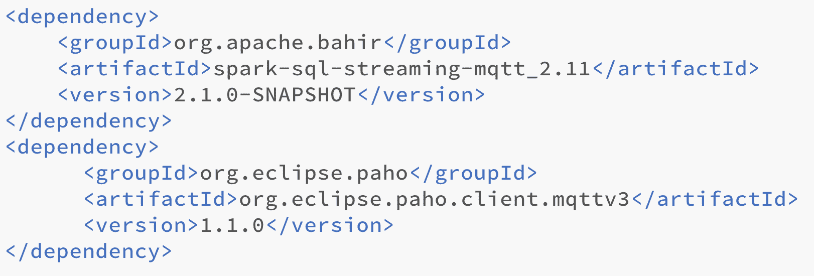
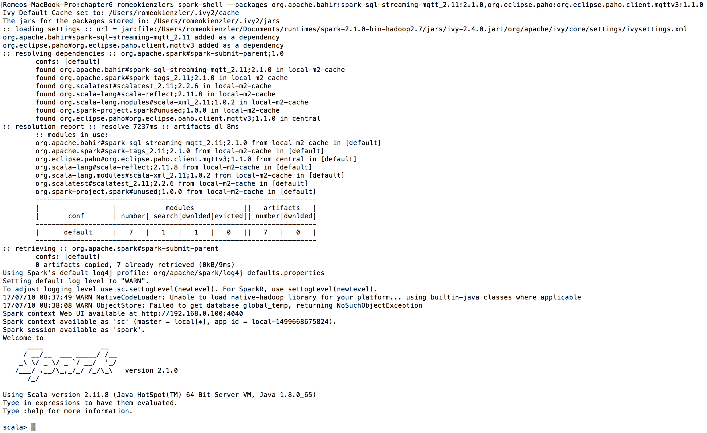
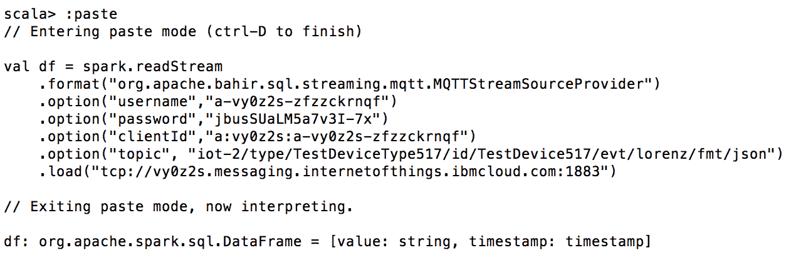
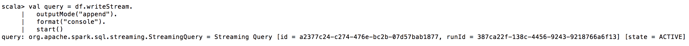
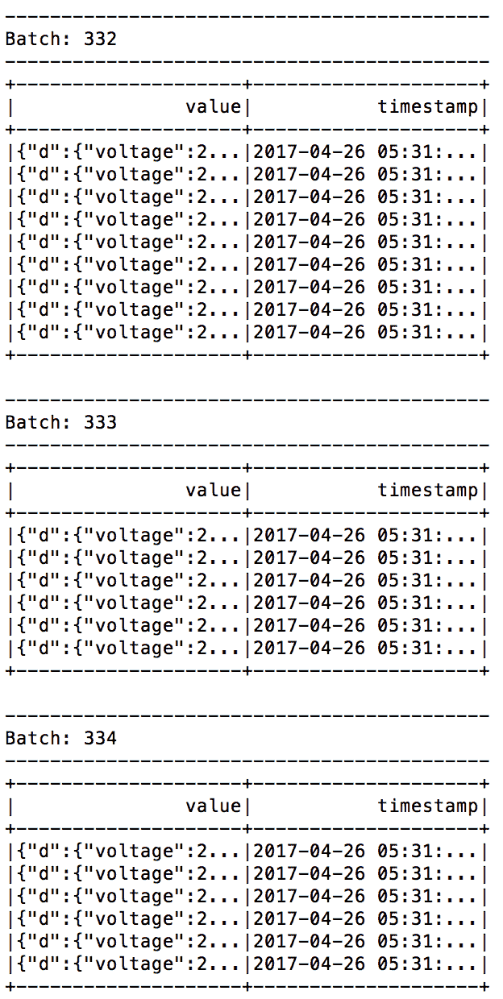

# 结构化流

从前面几章中，您可能已经了解到，Apache Spark 目前正在从基于 RDD 的数据处理过渡到更结构化的数据处理，并以数据框架和数据集为后盾，以便让 Catalyst 和 wow 实现性能优化。这意味着社区目前使用双轨方法。虽然非结构化的 API 仍然受到支持——它们甚至还没有被标记为不推荐使用，而且它们是否会被推荐使用也值得怀疑——但是已经为 Apache Spark V 2.0 的各种组件引入了一组新的结构化 API，这对 Spark Streaming 来说也是如此。结构化汽蒸在 Apache Spark V 2.2 中被标记为稳定。请注意，从 Apache Spark V 2.1 开始，当...

# 连续应用的概念

流媒体应用的复杂性往往会增加。流式计算不是孤立运行的；它们与存储系统、批处理应用程序和机器学习库交互。因此，与批处理相反，连续应用程序的概念出现了，它基本上意味着批处理和实时流处理的组合，流部分是应用程序的主要驱动因素，只是访问由批处理创建或处理的数据以进一步增强。连续应用程序从不停止，并随着新数据的到来不断产生数据。

# 真正的统一-相同的代码，相同的引擎

因此，连续的应用程序也可以在关系数据库和数据流的基础上实现，但是需要使用两种不同的 API。在 Apache Spark 结构化流中，API 是统一的。这种统一是通过将结构化流视为一个没有边界的关系表来实现的，在该关系表中，新数据被连续地追加到它的底部。在使用关系应用编程接口或 SQL 对数据帧进行批处理时，会创建中间数据帧。由于流和批处理计算在 Apache SparkSQL 引擎上是统一的，当使用结构化流时，会创建没有边界的中间关系表。

It is important to note that one can mix (join) static and incremental ...

# 开窗术

IBM Streams、Apache Storm 或 Apache Flink 等开源和商业流媒体引擎正在使用 windows 的概念。

Windows specify the granularity or number of subsequent records, which are taken into account when executing aggregation functions on streams.

# 流媒体引擎如何使用窗口

在两个维度中存在五个不同的属性，这就是如何定义窗口，其中每个窗口定义需要使用每个维度的一个属性。

第一个属性是可以创建连续元组流的后续窗口的模式:滑动和翻转。

第二是必须指定落入窗口的元组数量:基于计数、基于时间或基于会话。

让我们看看它们的含义:

*   **滑动窗口**:每当新的元组有资格被包括时，滑动窗口就从其中移除元组。
*   **滚动窗口**:每当有足够多的元组到达以创建新窗口时，滚动窗口会从其中移除所有元组。
*   **基于计数...**

# Apache Spark 如何改进窗口

Apache Spark 结构化流在窗口处理模型中更加灵活。由于流实际上被视为连续追加的表，并且这种表中的每一行都有时间戳，因此可以在查询本身中指定对窗口的操作，并且每个查询可以定义不同的窗口。此外，如果静态数据中存在时间戳，还可以定义窗口操作，从而形成非常灵活的流处理模型。

换句话说，Apache Spark 窗口只是时间戳列上的一种特殊类型的分组。这使得处理延迟到达的数据变得非常容易，因为 Apache Spark 可以将其包含在适当的窗口中，并在某个数据项延迟到达时在该窗口上重新运行计算。这个特性是高度可配置的。

**Event time versus processing time**: In time series analysis and especially in stream computing, each record is assigned to a particular timestamp. One way of creating such a timestamp is the arrival time at the stream-processing engine. Often, this is not what you want. Usually, you want to assign an event time for each record at that particular point in time when it was created, for example, when a measurement on an IoT device took place. This allows coping with latency between creating and processing of an event, for example, when an IoT sensor was offline for a certain amount of time, or network congestion caused a delay of data delivery.

当使用事件时间而不是处理时间来为每个元组分配唯一的时间戳时，后期数据的概念很有趣。例如，事件时间是发生特定测量的时间戳。Apache Spark 结构化流可以透明地自动处理稍后到达的数据子集。

**Late data**: If a record arrives at any streaming engine, it is processed immediately. Here, Apache Spark streaming doesn't differ from other engines. However, Apache Spark has the capability of determining the corresponding windows a certain tuple belongs to at any time. If for whatever reason, a tuple arrives late, all affected windows will be updated and all affected aggregate operations based on these updated windows are rerun. This means that results are allowed to change over time in case late data arrives. This is supported out of the box without the programmer worrying about it. Finally, since Apache Spark V2.1, it is possible to specify the amount of time that the system accepts late data using the `withWatermark` method.

水印基本上是阈值，用于定义延迟到达的数据点被允许有多老，以便仍然被包括在相应的窗口中。同样，考虑 HTTP 服务器日志文件在一分钟的时间窗口内工作。如果，无论出于什么原因，一个超过 4 小时的数据元组到达，那么将它包含在窗口中可能没有意义，例如，如果这个应用程序被用来创建一个以小时为基础的时间序列预测模型，以向集群提供或取消提供额外的 HTTP 服务器。一个四小时前的数据点处理起来毫无意义，即使它可以改变决定，因为决定已经做出。

# 与老朋友一起提高性能

正如在用于批处理的 Apache SparkSQL 中一样，由于 Apache Spark 结构化流是 Apache SparkSQL 的一部分，计划程序(催化剂)也为小批处理创建增量执行计划。这意味着整个流模型是基于批处理的。这就是为什么可以实现流和批处理的统一应用编程接口的原因。我们付出的代价是，当涉及到非常低的延迟要求(亚秒，在几十毫秒的范围内)时，Apache Spark 流有时会有缺点。正如“结构化流”和“数据帧和数据集的使用”这一名称所暗示的那样，我们还受益于钨项目带来的性能提升，钨项目已在之前的项目中引入...

# 如何实现透明的容错和一次性交付保证

Apache Spark 结构化流支持完全崩溃容错和一次性交付保证，无需用户处理任何特定的错误处理例程。这不是很神奇吗？那么这是如何实现的呢？

Full crash fault tolerance and exactly-once delivery guarantee are terms of systems theory. Full crash fault tolerance means that you can basically pull the power plug of the whole data center at any point in time, and no data is lost or left in an inconsistent state. Exactly-once delivery guarantee means, even if the same power plug is pulled, it is guaranteed that each tuple- end-to-end from the data source to the data sink - is delivered - only, and exactly, once. Not zero times and also not more than one time. Of course, those concepts must also hold in case a single node fails or misbehaves (for example- starts throttling).

首先，单个批次之间的状态和偏移范围(在源流中的位置)保存在内存中，但由容错文件系统(如 HDFS)中的**提前写日志** ( **WAL** )支持。WAL 基本上是一个日志文件，它以主动的方式反映了整个流处理状态。这意味着在通过操作符转换数据之前，数据首先以崩溃后可以恢复的方式永久存储在 WAL 中。因此，换句话说，在处理单个小批量的过程中，工作内存的区域以及流源的位置偏移被保存到磁盘上。如果系统出现故障，必须恢复，它可以从源重新请求数据块。当然，这只有在源代码支持这种语义的情况下才有可能。

# 可重放源可以从给定的偏移重放流

端到端一次传送保证要求流源在请求的位置支持某种类型的流重放。例如，对于文件源和 Apache Kafka 以及 IBM Watson 物联网平台来说，情况就是如此，本章中的以下示例将基于该平台。

# 幂等接收器防止数据重复

端到端一次性交付保证的另一个关键是幂等汇。这基本上意味着接收器知道过去哪个特定的写操作成功了。这意味着这种智能接收器可以在出现故障时重新请求数据，也可以在同一数据被多次发送时丢弃数据。

# 状态版本保证了重新运行后的一致结果

国家呢？想象一下，一个机器学习算法为所有工人维护一个计数变量。如果您两次重放完全相同的数据，最终会多次计算数据。因此，查询规划器还在工作器中维护一个版本化的键值映射，这些工作器依次将它们的状态保存到 HDFS，这是设计容错的。

因此，在出现故障的情况下，如果数据必须被替换，计划人员确保工人使用正确版本的键值映射。

# 示例-连接到 MQTT 消息代理

所以，让我们从一个示例用例开始。让我们连接到一个**物联网** ( **物联网**)传感器数据流。由于我们到目前为止还没有涉及机器学习，所以我们不分析数据，我们只是展示概念。

我们正在使用 IBM Watson 物联网平台作为流源。沃森物联网平台的核心是一个 **MQTT** ( **消息队列遥测传输**)消息代理。MQTT 是 IBM 于 1999 年发明的一种轻量级遥测协议，并于 2013 年成为一个名为 **OASIS** ( **结构化信息标准推进组织**，一个致力于开发、融合和采用安全、物联网、能源、内容技术、应急管理和其他领域标准的全球非营利联盟)标准，是物联网数据集成的事实标准。

Messaging between applications can be backed by a message queue which is a middleware system supporting asynchronous point to point channels in various delivery modes like **first-in-first-out** (**FIFO**), **last-in-first-out** (**LIFO**) or **Priority Queue** (where each message can be re-ordered by certain criteria).

这已经是一个非常好的特性，但是仍然以某种方式耦合应用程序，因为一旦消息被读取，它就对其他人不可用。

This way N to N communication is hard (but not impossible) to achieve. In a publish/subscribe model applications are completely de-coupled. There doesn't exist any queues anymore but the notion of topics is introduced. Data providers publish messages on specific topics and data consumers subscribe to those topics. This way N to N communication is very straightforward to achieve since it is reflected by the underlying message delivery model. Such a middleware is called a Message Broker in contrast to a Message Queue.

由于云服务往往会不断变化，而云通常会在本书后面介绍，下面的教程将解释如何在云中设置测试数据生成器并连接到远程 MQTT 消息代理。在这个例子中，我们将使用 IBM Watson IoT 平台，这是一个在云中可用的 MQTT 消息代理。或者，你可以安装一个开源的消息代理，比如 MOSQUITTO，它也在以下网址上提供一个公开的测试安装:[http://test.mosquitto.org/](http://test.mosquitto.org/)。

为了复制该示例，以下步骤(1)和(2)是必要的，如下教程所述:[https://www . IBM . com/developer works/library/IOT-cognitive-IOT-app-machine-learning/index . html](https://www.ibm.com/developerworks/library/iot-cognitive-iot-app-machine-learning/index.html)。在执行本教程时，请务必记下`http_host`、`org`、`apiKey`和`apiToken`。为了使用 Apache Spark 结构化流订阅数据，稍后需要这些。

由于 IBM Watson 物联网平台使用开放 MQTT 标准，因此无需特殊的 IBM 组件来连接到该平台。相反，我们使用 MQTT 和 Apache Bahir 作为 MQTT 和 Apache Spark 结构化流之间的连接器。

The goal of the Apache Bahir project is to provide a set of source and sink connectors for various data processing engines including Apache Spark and Apache Flink since they are lacking those connectors. In this case, we will use the Apache Bahir MQTT data source for MQTT.

为了使用 Apache Bahir，我们需要向本地 maven 存储库添加两个依赖项。本章下载部分提供了完整的`pom.xml`文件。我们来看看`pom.xml`的依赖部分:



我们基本上获得了 Apache Bahir 的 MQTT Apache 结构化流适配器和一个用于低级 MQTT 处理的依赖包。`pom.xml`文件目录中的一个简单的`mvn dependency:resolve`命令将所需的依赖项拉入我们的本地 maven 存储库中，在那里它们可以被 Apache Spark 驱动程序访问并自动传输给 Apache Spark 工作人员。

解决依赖关系的另一种方法是使用下面的命令来启动一个 spark-shell (spark-submit 也是这样工作的)；必要的依赖关系会自动分配给工作人员:



现在我们需要前面获得的 MQTT 凭据。让我们在这里设置值:

```scala
val mqtt_host = "pcoyha.messaging.internetofthings.ibmcloud.com"
val org = "pcoyha"
val apiKey = "a-pcoyha-oaigc1k8ub"
val apiToken = "&wuypVX2yNgVLAcLr8"
var randomSessionId = scala.util.Random.nextInt(10000)
```

现在我们可以开始创建一个连接到 MQTT 消息代理的流。我们告诉 Apache Spark 使用 Apache Bahir MQTT 流源:

```scala
val df = spark.readStream.format("org.apache.bahir.sql.streaming.mqtt.MQTTStreamSourceProvider")
```

我们需要指定凭据，如`username`、`password`、`clientId`，以便从 MQTT 消息代理中提取数据；前面提到的教程的链接解释了如何获得这些:

```scala
    .option("username",apiKey)
    .option("password",apiToken)
    .option("clientId","a:"+org+":"+apiKey)
```

当我们使用发布/订阅消息传递模型时，我们必须提供我们订阅的主题——这个主题由您之前部署到云中的测试数据生成器使用:

```scala
.option("topic", "iot-2/type/WashingMachine/id/Washer01/evt/voltage/fmt/json")
```

一旦在配置端设置了所有内容，我们就必须提供端点主机和端口来创建流:

```scala
   .load("tcp://"+mqtt_host+":1883")
```

有趣的是，从下面的截图中可以看出，这导致了数据帧的创建:



请注意，模式是固定的`[String, Timestamp]`，在流创建期间不能更改——这是 Apache Bahir 库的一个限制。但是，使用丰富的数据框架应用编程接口，您可以解析该值，例如 JSON 字符串，并创建新的列。

如前所述，这是 Apache Spark 结构化流的强大功能之一，因为现在可以使用完全相同的数据框架(和数据集)应用编程接口来处理历史和实时数据。因此，让我们通过将它写入控制台来看看这个流的内容:

```scala
val query = df.writeStream.
outputMode("append").
format("console").
start()
```

作为输出模式，我们选择`append`来强制增量显示，避免历史流的完整内容被一次又一次地写入控制台。作为`format`，我们指定`console`，因为我们只想调试流中发生的事情:



最后，`start`方法启动查询处理，如下图所示:



# 控制连续应用

一旦一个连续的应用程序(即使是一个简单的应用程序，不考虑历史数据)被启动并运行，它必须以某种方式被控制，因为对`start`方法的调用会立即开始处理，但也会返回而不会阻塞。如果您希望您的程序在这个阶段一直阻塞到应用程序完成，可以使用如下的`awaitTermination`方法:

```scala
query.awaitTermination()
```

这在预编译代码和使用`spark-submit`命令时尤为重要。使用`spark-shell`时，无论如何应用不会终止。

# 关于流生命周期管理的更多信息

流式倾向于用于创建连续的应用程序。这意味着进程在后台运行，与批处理相反，没有明确的停止时间；因此，由流源支持的数据帧和数据集支持各种流生命周期管理方法，解释如下:

*   `start`:这开始连续应用。这个方法不会阻塞。如果这不是你想要的，使用`awaitTermination`。
*   `stop`:这终止了连续申请。
*   `awaitTermination`:如前所述，使用`start`方法启动流会立即返回，这意味着调用没有阻塞。有时你想等到流被终止，要么是别人在上面调用`stop`要么是一个错误。
*   `exception`:如果一个流因为错误而停止，可以用这个方法读取原因。
*   `sourceStatus`:这是为了获取流媒体源的实时元信息。
*   `sinkStatus`:这是为了获取流宿上的实时元信息。

Apache Spark 流中的接收器是智能的，因为它们支持容错和端到端的一次性交付保证，如前所述。此外，Apache Spark 需要它们支持不同的输出方法。目前，以下三种输出方法:`append`、`update`和`complete`，显著改变了底层语义。以下段落包含了不同输出方法的更多细节。

接收器的不同输出模式:可以指定接收器以不同的方式处理输出。这就是所谓的`outputMode`。天真的选择是使用增量方法，因为无论如何我们都在用流处理增量数据。这种模式被称为`append`。然而，存在这样的要求，即接收器已经处理的数据必须被改变。一个例子是某个时间窗口中丢失数据的延迟到达问题，一旦重新计算该特定时间窗口的计算，就会导致结果发生变化。这种模式叫做`complete`。

Since Version 2.1 of Apache Spark, the `update` mode was introduced that behaves similarly to the `complete` mode but only changes rows that have been altered, therefore saving processing resources and improving speed. Some types of modes do not support all query types. As this is constantly changing, it is best to refer to the latest documentation at [http://spark.apache.org/docs/latest/streaming-programming-guide.html.](http://spark.apache.org/docs/latest/streaming-programming-guide.html)

# 摘要

那么，为什么我们在同一个数据处理框架中有两个不同的流引擎呢？我们希望在阅读本章后，您会同意基于经典数据流的引擎的主要痛点已经得到解决。以前，基于事件时间的处理是不可能的，只考虑数据的到达时间。然后，由于只能使用处理时间，所以后期数据只是用错误的时间戳进行了处理。此外，批处理和流处理需要使用两种不同的 API:RDDs 和 DStreams。虽然 API 相似，但不完全相同；因此，在两个范例之间来回切换时，代码的重写是必要的。最后，端到端的交付保证很难...