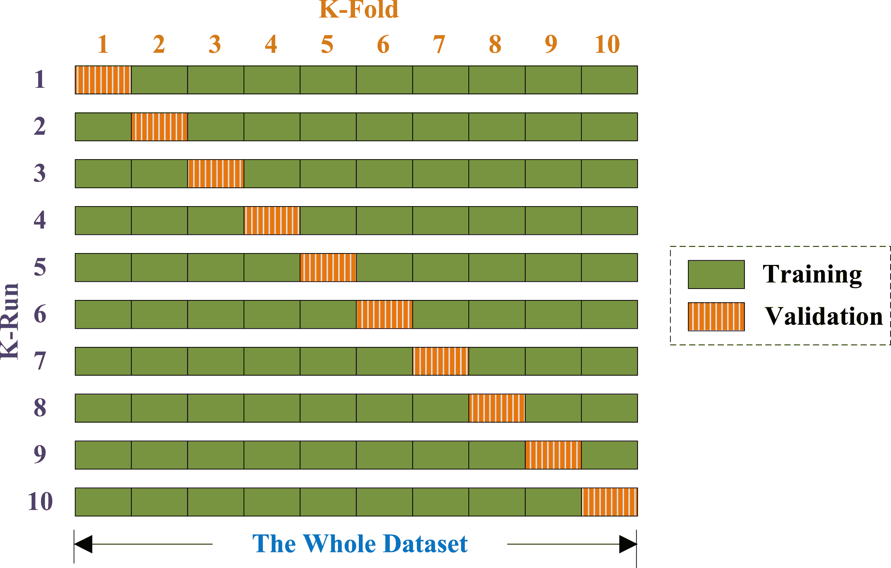
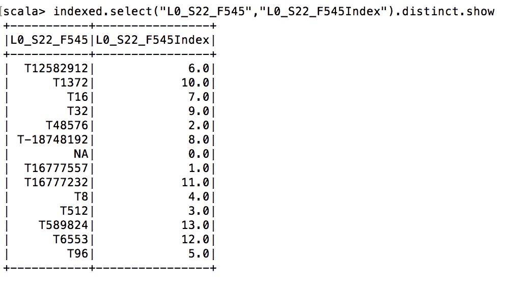
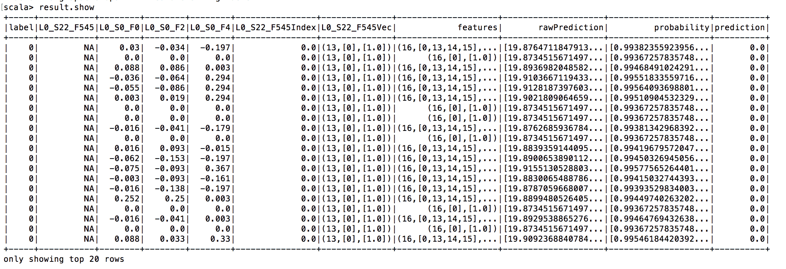

# 阿帕奇闪耀

那么既然你已经了解了很多关于 MLlib 的知识，为什么还要再来一个 ML API 呢？首先，使用多种框架和 ML 库是数据科学中的一项常见任务，因为总有优点和缺点；大多数情况下，这是性能和功能之间的权衡。例如，R 在功能上是王者——有超过 6000 个 R 附加包。然而，R 也是数据科学最慢的执行环境之一。另一方面，SparkML 目前功能相对有限，但却是最快的库之一。为什么会这样？这就引出了 SparkML 存在的第二个原因。

一方面是 RDD，另一方面是数据框架和数据集，这两者之间的二元性就像本书中的一条红线，并没有停止对机器学习章节的影响。由于 MLlib 被设计为在 RDDs 之上工作，SparkML 在数据框架和数据集之上工作，因此利用了 Catalyst 和钨带来的所有新的性能优势。

我们将在本章中讨论以下主题:

*   sparkle api 简介
*   管道的概念
*   变压器和估算器
*   一个实例

# 新的 API 是什么样子的？

说到 Apache Spark 上的机器学习，我们习惯于将数据转换成适当的格式和数据类型，然后再将它们实际输入到我们的算法中。全球的机器学习从业者发现，机器学习项目的预处理任务通常遵循相同的模式:

*   数据准备
*   培养
*   评价
*   超参数调谐

因此，新的 ApacheSparkML 应用编程接口开箱即用地支持这个过程。它被称为**管道**，灵感来自 scikit-learn[http://scikit-learn.org](http://scikit-learn.org)，一个非常流行的 Python 编程语言机器学习库。中央数据结构是一个数据框架，所有操作都在它上面运行。

# 管道的概念

ApacheSparkML 管道包含以下组件:

*   **数据框**:这是中央数据存储，所有的原始数据和中间结果都存储在里面。
*   **Transformer** :顾名思义，在大多数情况下，一个 Transformer 通过添加额外的(特征)列将一个数据帧转换成另一个数据帧。变压器是无状态的，这意味着它们没有任何内部内存，每次使用时行为完全相同；这是您在使用 RDDs 的 map 函数时可能熟悉的一个概念。
*   **估计器**:在大多数情况下，估计器是某种机器学习模型。与变压器相反，估计器包含内部状态表示，并且高度依赖于它已经看到的数据的历史。
*   **管道**:这是将前面的组件，数据框、转换器和评估器连接在一起的胶水。
*   **参数**:机器学习算法有很多旋钮可以调整。这些被称为**超参数**，由机器学习算法学习以拟合数据的值被称为参数。通过标准化超参数的表达方式，ApacheSparkML 打开了任务自动化的大门，我们将在后面看到。

# 变形金刚(电影名)

让我们从简单的事情开始。机器学习数据准备中最常见的任务之一是字符串索引和分类值的热门编码。让我们看看这是如何做到的。

# 字符串索引器

让我们假设我们有一个数据框`df`，它包含一个名为分类标签颜色的列——红色、绿色和蓝色。我们希望将它们编码为整数值或浮点值。这就是`org.apache.spark.ml.feature.StringIndexer`开始的地方。它自动确定类别集的基数，并为每个类别集分配不同的值。所以在我们的例子中，红、红、绿、红、蓝、绿等类别的列表应该转换为 1、1、2、1、3、2:

```scala
import org.apache.spark.ml.feature.StringIndexer
var indexer = new StringIndexer()
  .setInputCol("colors")
  .setOutputCol("colorsIndexed")

var indexed = indexer.fit(df).transform(df)
```

这种转换的结果是一个名为 indexed 的 DataFrame，除了 String 类型的 colors 列之外，现在还包含一个名为`colorsIndexed`的 double 类型的列。

# OneHotEncoder

我们才进行到一半。尽管机器学习算法能够利用`colorsIndexed`列，但如果我们对其进行一次热编码，它们会表现得更好。这实际上意味着，与其有一个包含 1 到 3 个标签索引的`colorsIndexed`列，不如我们有三个列——每种颜色一个——约束条件是每行只允许将这些列中的一个设置为 1，否则为零。让我们开始吧:

```scala
var encoder = new OneHotEncoder()  .setInputCol("colorIndexed")  .setOutputCol("colorVec")var encoded = encoder.transform(indexed)
```

直观地说，我们期望在编码的数据帧中获得三个额外的列，例如，`colorIndexedRed`、`colorIndexedGreen`和`colorIndexedBlue ...`

# VectorAssembler

在我们开始实际的机器学习算法之前，我们需要应用一个最终的转换。我们必须创建一个额外的`feature`列，包含我们希望机器学习算法考虑的列的所有信息。这是由`org.apache.spark.ml.feature.VectorAssembler`完成的，如下所示:

```scala
import org.apache.spark.ml.feature.VectorAssembler
vectorAssembler = new VectorAssembler()
        .setInputCols(Array("colorVec", "field2", "field3","field4"))
        .setOutputCol("features")
```

该转换器仅向生成的数据帧添加一列名为**的特征**，属于`org.apache.spark.ml.linalg.Vector`类型。换句话说，这个名为 features 的新列是由`VectorAssembler`创建的，它包含所有已定义的列(在本例中为`colorVec`、`field2`、`field3`和`field4`)，这些列编码在每行的一个向量对象中。这是 Apache SparkML 算法喜欢的格式。

# 管道

在我们深入评估之前——我们已经在`StringIndexer`中使用了一个——让我们首先理解管道的概念。正如您可能已经注意到的，转换器只向 DataFrame 添加了一个单独的列，并且基本上省略了所有没有明确指定为输入列的其他列；它们只能与`org.apache.spark.ml.Pipeline`结合使用，后者将单个变压器(和估计器)粘合在一起，形成一个完整的数据分析过程。让我们为我们的两个`Pipeline`阶段做这个:

```scala
var transformers = indexer :: encoder :: vectorAssembler :: Nilvar pipeline = new Pipeline().setStages(transformers).fit(df)var transformed = pipeline.transform(df)
```

现在获得的名为**的数据帧转换后的**包含所有的...

# 估计量

我们以前在`StringIndexer`中使用过估算器。我们已经说过，估计器在某种程度上包含了在查看数据时发生变化的状态，然而对于变压器来说却不是这样。那么`StringIndexer`为什么是一个估计量呢？这是因为它需要记住所有以前看到的字符串，并维护字符串和标签索引之间的映射表。

In machine learning, it is common to use at least a training and testing subset of your available training data. It can happen that an estimator in the pipeline, such as `StringIndexer`, has not seen all the string labels while looking at the training dataset. Therefore, you'll get an exception when evaluating the model using the test dataset as the `StringIndexer` now encounters labels that it has not seen before. This is, in fact, a very rare case and basically could mean that the sample function you use to separate the training and testing datasets is not working; however, there is an option called `setHandleInvalid("skip")` and your problem is solved.

另一种区分估计量和变压器的简单方法是在估计量上的附加方法`fit`。Fit 实际上是基于给定数据集填充估计器的内部数据管理结构，在`StringIndexer`的情况下，它是标签字符串和标签索引之间的映射表。现在让我们看看另一个估计器，一个实际的机器学习算法。

# 随机应变分类器

假设我们处于二元分类问题设置中，想要使用`RandomForestClassifier`。所有的 SparkML 算法都有一个兼容的 API，所以它们可以互换使用。所以我们用哪个真的不重要，但是`RandomForestClassifier`比逻辑回归等更简单的模型有更多的(超)参数。在后面的阶段，我们将使用 Apache SparkML 中内置的(超)参数调整。因此，使用可以调整更多旋钮的算法是有意义的。给我们的`Pipeline`添加这样一个二元分类器非常简单:

```scala
import org.apache.spark.ml.classification.RandomForestClassifiervar rf = new RandomForestClassifier()   .setLabelCol("label") .setFeaturesCol("features") ...
```

# 模型评估

如前所述，模型评估内置于 ApacheSparkML 中，您将在`org.apache.spark.ml.evaluation`包中找到所有您需要的东西。让我们继续我们的二元分类。这意味着我们将不得不使用`org.apache.spark.ml.evaluation.BinaryClassificationEvaluator`:

```scala
import org.apache.spark.ml.evaluation.BinaryClassificationEvaluator
val evaluator = new BinaryClassificationEvaluator()

import org.apache.spark.ml.param.ParamMap
var evaluatorParamMap = ParamMap(evaluator.metricName -> "areaUnderROC")
var aucTraining = evaluator.evaluate(result, evaluatorParamMap)
```

对先前初始化的`BinaryClassificationEvaluator`函数进行编码，并告诉它计算`areaUnderROC`，这是评估机器学习算法预测性能的许多可能指标之一。

由于我们在名为`result`的数据帧中有实际的标签和预测，计算这个分数很简单，使用下面一行代码来完成:

```scala
var aucTraining = evaluator.evaluate(result, evaluatorParamMap)
```

# 交叉验证和超参数调整

我们将看到`CrossValidation`和超参数调谐各一个例子。我们来看看`CrossValidation`。

# 交互效度分析

如前所述，我们已经使用了机器学习算法的默认参数，我们不知道它们是否是一个好的选择。此外，`CrossValidation`可能是一个更好的选择，因为它确保最终所有的数据都被机器学习算法看到，而不是简单地将你的数据分成训练和测试，或者训练、测试和验证集。

`CrossValidation` basically splits your complete available training data into a number of **k** folds. This parameter **k** can be specified. Then, the whole `Pipeline` is run once for every fold and one machine learning model is trained for each fold. Finally, the different machine learning models obtained are joined. This is done by a voting scheme for classifiers or by averaging for regression.

下图十重`CrossValidation`:



# 超参数调谐

`CrossValidation`经常与所谓的(超)参数调谐结合使用。什么是超参数？这些是你可以在机器学习算法上调整的各种旋钮。例如，以下是随机森林分类器的一些参数:

*   树木数量
*   特征子集策略
*   不纯
*   最大箱数
*   最大树深

设置这些参数会对训练好的分类器的性能产生重大影响。通常，没有办法根据一个明确的配方来选择它们——当然，经验会有所帮助——但是超参数调整被认为是黑魔法。我们就不能选择很多不同的参数，测试一下预测性能吗？当然可以。这个特点...

# 用 apache sparkle 赢得一场 kaggle 比赛

赢得 Kaggle 竞赛本身就是一门艺术，但我们只想向您展示如何有效地使用 Apache SparkML 工具来做到这一点。

我们将使用德国跨国工程和电子公司博世(BOSCH)提供的关于生产线性能数据的存档竞争。比赛数据详见[https://www . ka ggle . com/c/bosch-生产线-性能/数据](https://www.kaggle.com/c/bosch-production-line-performance/data)。

# 数据准备

挑战数据有三个 ZIP 包，但我们只使用其中的两个。一个包含分类数据，一个包含连续数据，最后一个包含测量的时间戳，我们暂时忽略。

如果你提取数据，你会得到三个大的 CSV 文件。因此，我们要做的第一件事是将它们重新编码到拼花地板中，以提高空间效率:

```scala
def convert(filePrefix : String) = {   val basePath = "yourBasePath"   var df = spark              .read              .option("header",true)              .option("inferSchema", "true")              .csv("basePath+filePrefix+".csv")    df = df.repartition(1)    df.write.parquet(basePath+filePrefix+".parquet")}convert("train_numeric")convert("train_date")convert("train_categorical")
```

首先，我们定义一个函数...

# 特征工程

现在是时候运行第一个转换器了(它实际上是一个估计器)。它是`StringIndexer`，需要跟踪字符串和索引之间的内部映射表。因此，它不是一个变压器，而是一个估算器:

```scala
import org.apache.spark.ml.feature.{OneHotEncoder, StringIndexer}

var indexer = new StringIndexer()
  .setHandleInvalid("skip")
  .setInputCol("L0_S22_F545")
  .setOutputCol("L0_S22_F545Index")

var indexed = indexer.fit(df_notnull).transform(df_notnull)
indexed.printSchema
```

从下图中我们可以清楚地看到，已经创建了一个名为`L0_S22_F545Index`的附加列:


最后，让我们检查一下新创建的列的一些内容，并将其与源列进行比较。

我们可以清楚地看到类别字符串是如何转换成浮点索引的:



现在我们想应用`OneHotEncoder`，这是一个变压器，以便为我们的机器学习模型生成更好的特征:

```scala
var encoder = new OneHotEncoder()
  .setInputCol("L0_S22_F545Index")
  .setOutputCol("L0_S22_F545Vec")

var encoded = encoder.transform(indexed)
```

如下图所示，新创建的列`L0_S22_F545Vec`包含`org.apache.spark.ml.linalg.SparseVector`对象，这是稀疏向量的压缩表示:


**Sparse vector representations**: The `OneHotEncoder`, as many other algorithms, returns a sparse vector of the `org.apache.spark.ml.linalg.SparseVector` type as, according to the definition, only one element of the vector can be one, the rest has to remain zero. This gives a lot of opportunity for compression as only the position of the elements that are non-zero has to be known. Apache Spark uses a sparse vector representation in the following format: *(l,[p],[v])*, where *l* stands for length of the vector, *p* for position (this can also be an array of positions), and *v* for the actual values (this can be an array of values). So if we get (13,[10],[1.0]), as in our earlier example, the actual sparse vector looks like this: (0.0,0.0,0.0,0.0,0.0,0.0,0.0,0.0,0.0,1.0,0.0,0.0,0.0).

现在我们已经完成了我们的特征工程，我们想要创建一个包含机器学习者所有必要列的整体稀疏向量。这是使用`VectorAssembler`完成的:

```scala
import org.apache.spark.ml.feature.VectorAssembler
import org.apache.spark.ml.linalg.Vectors

var vectorAssembler = new VectorAssembler()
        .setInputCols(Array("L0_S22_F545Vec", "L0_S0_F0", "L0_S0_F2","L0_S0_F4"))
        .setOutputCol("features")

var assembled = vectorAssembler.transform(encoded)
```

我们基本上只定义了一个列名列表和一个目标列，剩下的就交给我们了:


由于`features`列的视图被挤压了一点，让我们更详细地检查特征字段的一个实例:


我们可以清楚地看到，我们正在处理长度为 16 的稀疏向量，其中位置 0、13、14 和 15 是非零的，并且包含以下值:`1.0`、`0.03`、`-0.034`和`-0.197`。搞定了。让我们用这些组件创建一个`Pipeline`。

# 测试功能工程管道

让我们用我们的变压器和估算器创建一个`Pipeline`:

```scala
import org.apache.spark.ml.Pipelineimport org.apache.spark.ml.PipelineModel//Create an array out of individual pipeline stagesvar transformers = Array(indexer,encoder,assembled)var pipeline = new Pipeline().setStages(transformers).fit(df_notnull)var transformed = pipeline.transform(df_notnull)
```

注意`Pipeline`的`setStages`方法只需要一个我们之前创建的`transformers`和`estimators`的数组。由于部分`Pipeline`包含估算器，我们必须首先在我们的`DataFrame`上运行`fit`。获得的`Pipeline`对象采用`transform`方法中的`DataFrame`，并返回转换结果:

不出所料，...

# 训练机器学习模型

现在是时候给`Pipeline`添加另一个组件了:实际的机器学习算法——RandomForest；

```scala
import org.apache.spark.ml.classification.RandomForestClassifier
var rf = new RandomForestClassifier() 
  .setLabelCol("label")
  .setFeaturesCol("features")

var model = new Pipeline().setStages(transformers :+ rf).fit(df_notnull)

var result = model.transform(df_notnull)
```

这段代码非常简单。首先，我们必须实例化我们的算法，并在`rf`中获取它作为参考。我们本可以为模型设置额外的参数，但是我们将在后面的`CrossValidation`步骤中以自动化的方式进行设置。然后，我们只需将舞台添加到我们的`Pipeline`中，使其适合，最后进行转换。除了运行所有上游阶段外，`fit`方法还调用`RandomForestClassifier`上的 fit 来训练它。训练好的模型现在包含在`Pipeline`中，`transform`方法实际上创建了我们的预测栏:



如我们所见，我们现在已经获得了一个名为预测的额外列，其中包含`RandomForestClassifier`模型的输出。当然，我们只使用了非常有限的可用特性/列的子集，并且还没有调整模型，所以我们不期望做得很好；但是，让我们看看如何使用 Apache SparkML 轻松评估我们的模型。

# 模型评估

没有评估，一个模型毫无价值，因为我们不知道它的表现有多准确。因此，我们现在将使用内置的`BinaryClassificationEvaluator`来评估预测性能和一个广泛使用的度量标准`areaUnderROC`(这里的详细描述超出了本书的范围):

```scala
import org.apache.spark.ml.evaluation.BinaryClassificationEvaluatorval evaluator = new BinaryClassificationEvaluator()import org.apache.spark.ml.param.ParamMapvar evaluatorParamMap = ParamMap(evaluator.metricName -> "areaUnderROC")var aucTraining = evaluator.evaluate(result, evaluatorParamMap)
```

我们可以看到，有一个内置类叫做`org.apache.spark.ml.evaluation.BinaryClassificationEvaluator`，还有一些其他的...

# 交叉验证和超参数调整

如前所述，机器学习的一个常见步骤是使用测试数据与训练数据交叉验证模型，并调整机器学习算法的旋钮。让我们使用 Apache SparkML 来为我们做这件事，完全自动化！

首先，我们要配置参数图和`CrossValidator`:

```scala
import org.apache.spark.ml.tuning.{CrossValidator, ParamGridBuilder}
var paramGrid = new ParamGridBuilder()
    .addGrid(rf.numTrees, 3 :: 5 :: 10 :: 30 :: 50 :: 70 :: 100 :: 150 :: Nil)
    .addGrid(rf.featureSubsetStrategy, "auto" :: "all" :: "sqrt" :: "log2" :: "onethird" :: Nil)
    .addGrid(rf.impurity, "gini" :: "entropy" :: Nil)    
    .addGrid(rf.maxBins, 2 :: 5 :: 10 :: 15 :: 20 :: 25 :: 30 :: Nil)
    .addGrid(rf.maxDepth, 3 :: 5 :: 10 :: 15 :: 20 :: 25 :: 30 :: Nil)
    .build()

var crossValidator = new CrossValidator()
      .setEstimator(new Pipeline().setStages(transformers :+ rf))
      .setEstimatorParamMaps(paramGrid)
      .setNumFolds(5)
.setEvaluator(evaluator)
var crossValidatorModel = crossValidator.fit(df_notnull)
var newPredictions = crossValidatorModel.transform(df_notnull)
```

使用`org.apache.spark.ml.tuning.ParamGridBuilder`来定义`CrossValidator`必须搜索的超参数空间，最后，`org.apache.spark.ml.tuning.CrossValidator`将我们的`Pipeline`、我们的随机森林分类器的超参数空间和`CrossValidation`的折叠数作为参数。现在，像往常一样，我们只需要在`CrossValidator`上调用 fit 和 transform，它基本上会多次运行我们的`Pipeline`，并返回一个表现最好的模型。你知道训练了多少不同的模型吗？好吧，我们在`CrossValidation`上有五个折叠，五维超参数空间基数在 2 和 8 之间，那么我们来算一下:5 * 8 * 5 * 2 * 7 * 7 = 19600 次！

# 使用评估器评估交叉验证和调整模型的质量

现在我们已经以全自动方式优化了`Pipeline`，让我们看看如何获得最佳模型:

```scala
var bestPipelineModel = crossValidatorModel.bestModel.asInstanceOf[PipelineModel]    var stages = bestPipelineModel.stagesimport org.apache.spark.ml.classification.RandomForestClassificationModel    val rfStage = stages(stages.length-1).asInstanceOf[RandomForestClassificationModel]rfStage.getNumTreesrfStage.getFeatureSubsetStrategyrfStage.getImpurityrfStage.getMaxBinsrfStage.getMaxDepth
```

`crossValidatorModel.bestModel`代码基本返回最佳`Pipeline`。现在我们使用`bestPipelineModel.stages`获得单个阶段并获得调整后的`RandomForestClassificationModel ...`

# 摘要

您已经了解到，与许多其他地方一样，`DataFrames`的引入导致了不再直接使用 rdd 的补充框架的开发。机器学习也是如此，但还有更多。`Pipeline`实际上将 Apache Spark 中的机器学习提升到了一个新的水平，因为它极大地提高了数据科学家的工作效率。

所有中间对象和经过深思熟虑的概念之间的兼容性非常棒。太好了。最后，我们应用了我们在 Kaggle 竞赛的真实数据集上讨论的概念，这是您自己的 Apache SparkML 机器学习项目的一个非常好的起点。下一章将介绍 Apache SystemML，这是一个针对 Apache Spark 的第三方机器学习库。让我们看看它为什么有用，对 SparkML 有什么不同。