# 十、基于 Scala 的 Spark 实用机器学习

在本章中，我们将介绍:

*   将 IntelliJ 配置为使用 Spark 并运行 Spark ML 示例代码
*   从 Spark 运行一个样本 ML 代码
*   识别实际机器学习的数据源
*   使用 Apache Spark 2.0 和 IntelliJ 集成开发环境运行您的第一个程序
*   如何向您的 Spark 程序添加图形

# 介绍

随着最近集群计算的发展和大数据的兴起，机器学习领域被推到了计算的前沿。长期以来，对能够大规模实现数据科学的互动平台的需求一直是一个梦想，现在已经成为现实。

以下三个领域共同促成并加速了交互式数据科学的大规模发展:

*   **Apache Spark** :数据科学的统一技术平台，将快速计算引擎和容错数据结构结合到精心设计和集成的产品中
*   **机器学习**:人工智能的一个领域，使机器能够模仿一些最初只留给人脑的任务
*   **Scala** :一种基于 JVM 的现代语言，它建立在传统语言的基础上，但是将功能性和面向对象的概念结合在一起，没有其他语言的冗长

首先，我们需要设置开发环境，它将由以下组件组成:

*   Spark
*   IntelliJ 社区版 IDE
*   斯卡拉

本章中的方法将为您提供安装和配置 IntelliJ IDE、Scala 插件和 Spark 的详细说明。开发环境设置好之后，我们将继续运行其中一个 Spark ML 示例代码来测试设置。

# ApacheSpark

Apache Spark 正在成为大数据分析事实上的平台和交易语言，并作为 **Hadoop** 范例的补充。Spark 使数据科学家能够以最有利于其工作流程的方式开箱即用地工作。Spark 的方法是以完全分布式的方式处理工作负载，而不需要 **MapReduce** ( **MR** )或将中间结果重复写入磁盘。

Spark 在统一的技术堆栈中提供了一个易于使用的分布式框架，这使得它成为数据科学项目的首选平台，这些项目通常需要迭代算法，最终合并成一个解决方案。由于这些算法的内部工作原理，它们会产生大量的...

# 机器学习

机器学习的目的是生产能够模仿人类智能的机器和设备，并自动完成传统上留给人脑的一些任务。机器学习算法被设计成在相对较短的时间内处理非常大的数据集，并获得人类需要更长时间才能处理的近似答案。

机器学习领域可以分为多种形式，在高层次上，可以分为监督学习和非监督学习。监督学习算法是一类 ML 算法，它使用训练集(即标记数据)来计算概率分布或图形模型，进而允许它们在没有进一步人工干预的情况下对新数据点进行分类。无监督学习是一种机器学习算法，用于从由输入数据组成的数据集得出推论，而无需标记响应。

开箱即用，Spark 提供了一套丰富的 ML 算法，可以部署在大型数据集上，无需任何进一步的编码。下图将 Spark 的 MLlib 算法描述为思维导图。Spark 的 MLlib 旨在利用并行性，同时具有容错分布式数据结构。Spark 指的是**弹性分布式数据集**或**关系数据库**这样的数据结构:


# 斯卡拉

**Scala** 是一种现代编程语言，正在成为传统编程语言的替代品，如 **Java** 和 **C++** 。Scala 是一种基于 JVM 的语言，它不仅提供了简洁的语法，而没有传统的样板代码，而且将面向对象和函数式编程结合到一种非常简洁和非常强大的类型安全语言中。

Scala 采用了一种灵活且富有表现力的方法，这使得它非常适合与 Spark 的 MLlib 进行交互。Spark 本身是用 Scala 编写的这一事实提供了一个强有力的证据，证明 Scala 语言是一种全服务的编程语言，可以用来创建具有繁重性能需求的复杂系统代码。

Scala 建立在 Java 的传统之上...

# 本书使用的软件版本和库

下表提供了本书中使用的软件版本和库的详细列表。如果您遵循本章中的安装说明，它将包括此处列出的大多数项目。特定配方可能需要的任何其他 JAR 或库文件将通过相应配方中的附加安装说明进行介绍:

| **核心系统** | **版本** |
| Spark | 2.0.0 |
| Java 语言(一种计算机语言，尤用于创建网站) | One point eight |
| IntelliJ IDEA | 2016.2.4 |
| Scala-sdk | 2.11.8 |

需要的其他 JARs 如下:

| **杂坛** | **版本** |
| `bliki-core` | 3.0.19 |
| `breeze-viz` | Zero point one two |
| `Cloud9` | 1.5.0 |
| `Hadoop-streaming` | 2.2.0 |
| `JCommon` | 1.0.23 |
| `JFreeChart` | 1.0.19 |
| `lucene-analyzers-common` | 6.0.0 |
| `Lucene-Core` | 6.0.0 |
| `scopt` | 3.3.0 |
| `spark-streaming-flume-assembly` | 2.0.0 |
| `spark-streaming-kafka-0-8-assembly` | 2.0.0 |

我们已经在 Spark 2.1.1 上额外测试了本书中的所有食谱，并发现程序按预期执行。出于学习目的，建议您使用这些表中列出的软件版本和库。

为了跟上快速变化的 Spark 环境和文档，本书中提到的 Spark 文档的 API 链接指向最新版本的 Spark 2.x.x，但是配方中的 API 引用明确是针对 Spark 2.0.0 的。

本书提供的所有 Spark 文档链接都指向 Spark 网站上的最新文档。如果您更喜欢查找特定版本的 Spark 的文档(例如，Spark 2.0.0)，请使用以下网址在 Spark 网站上查找相关文档:

[https://spark.apache.org/documentation.html](https://spark.apache.org/documentation.html)

为了清晰起见，我们尽可能地简化了代码，而不是演示 Scala 的高级特性。

# 将 IntelliJ 配置为使用 Spark 并运行 Spark ML 示例代码

我们需要运行一些配置来确保项目设置是正确的，然后才能运行由 Spark 或本书中列出的任何程序提供的示例。

# 准备好

在配置项目结构和全局库时，我们需要特别小心。在我们设置好一切之后，我们继续运行 Spark 团队提供的示例 ML 代码来验证设置。示例代码可以在 Spark 目录下找到，也可以通过下载带有示例的 Spark 源代码获得。

# 怎么做...

以下是将 IntelliJ 配置为使用 Spark MLlib 以及在示例目录中运行 Spark 提供的示例 ML 代码的步骤。示例目录可以在您的 Spark 主目录中找到。使用 Scala 示例继续:

1.  单击项目结构...选项来配置项目设置，如下图所示:

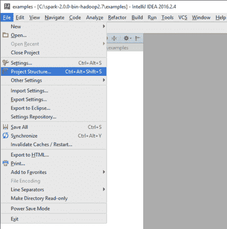

2.  验证设置:

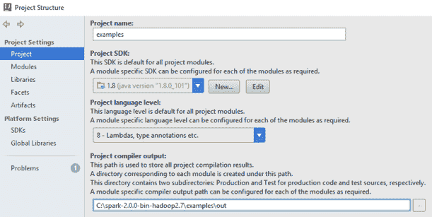

3.  配置全局库。选择 Scala SDK 作为您的全局库:

4.  为新的 Scala SDK 选择 JARs，并让下载...

# 还有更多...

在 Spark 2.0 之前，我们需要谷歌的另一个名为**番石榴**的库，以方便输入/输出，并提供一套丰富的方法来定义表，然后让 Spark 在集群中广播它们。由于难以解决的依赖性问题，Spark 2.0 不再使用番石榴库。如果您使用的是 2.0 之前的 Spark 版本(1.5.2 版本中需要)，请确保使用番石榴库。可以通过以下网址访问番石榴图书馆:

[https://github . com/Google/guava/wiki](https://github.com/google/guava/wiki)

您可能想使用番石榴 15.0 版本，可以在这里找到:

[https://mvnrepository . com/artifact/com . Google . guava/guava/15.0](https://mvnrepository.com/artifact/com.google.guava/guava/15.0)

如果您使用的是以前博客中的安装说明，请确保从安装集中排除番石榴库。

# 请参见

如果完成 Spark 安装需要其他第三方库或 JARs，您可以在以下 Maven 存储库中找到这些库或 JARs:

[https://repo1.maven.org/maven2/org/apache/spark/](https://repo1.maven.org/maven2/org/apache/spark/)

# 从 Spark 运行一个样本 ML 代码

我们可以通过简单地从 Spark 源代码树中下载示例代码并将其导入 IntelliJ 以确保其运行来验证设置。

# 准备好

我们将首先运行样本中的逻辑回归代码来验证安装。在下一节中，我们继续编写相同程序的自己的版本，并检查输出，以便理解它是如何工作的。

# 怎么做...

1.  转到源目录，选择一个要运行的 ML 示例代码文件。我们选择了逻辑回归的例子。

If you cannot find the source code in your directory, you can always download the Spark source, unzip, and then extract the examples directory accordingly.

2.  选择示例后，选择编辑配置...，如下图所示:

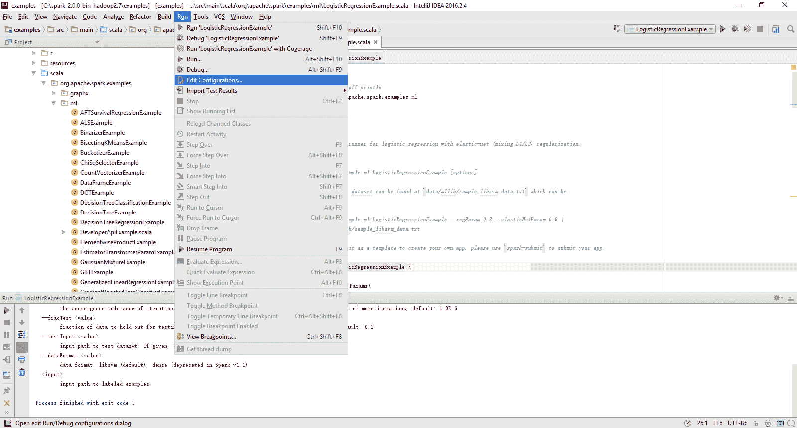

3.  在“配置”选项卡中，定义以下选项:
    *   虚拟机选项:显示的选项允许您运行独立的 Spark 集群
    *   程序参数:我们应该传递到程序中的内容


4.  运行逻辑回归，方法是运行“逻辑回归示例”，如下图所示:

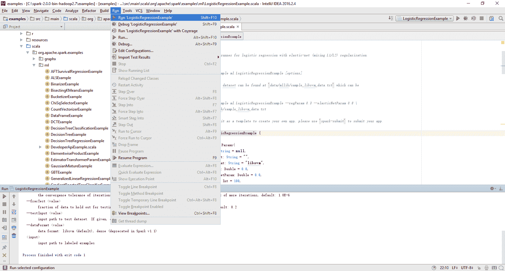

5.  验证退出代码，并确保它如下面的屏幕截图所示:

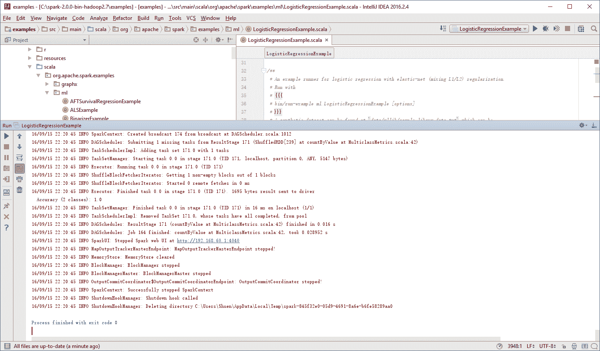

# 识别实际机器学习的数据源

在过去，为机器学习项目获取数据是一项挑战。然而，现在有一套丰富的公共数据源专门适用于机器学习。

# 准备好

除了大学和政府来源，还有许多其他开放的数据来源，可以用来学习和编写自己的例子和项目。我们将列出数据源，并向您展示如何最好地获取和下载每章的数据。

# 怎么做...

如果您想开发该领域的应用，以下是值得探索的开源数据列表:

*   *UCI 机器学习资源库*:这是一个具有搜索功能的扩展库。在撰写本报告时，共有 350 多个数据集。您可以点击[https://archive.ics.uci.edu/ml/index.html](https://archive.ics.uci.edu/ml/index.html)链接查看所有数据集，或者使用简单的搜索来查找特定的数据集( *Ctrl* + *F* )。
*   *Kaggle 数据集*:你需要创建一个账号，但是你可以下载任何一套用于学习以及参加机器学习比赛。[https://www.kaggle.com/competitions](https://www.kaggle.com/competitions)链接提供了探索和学习更多关于卡格尔和机器学习竞赛内部工作的细节。...

# 请参见

机器学习数据的其他来源:

*   短信垃圾邮件数据:[http://www . dt . fee . uniamp . br/~ tiago/smtphost collection/](http://www.dt.fee.unicamp.br/~tiago/smsspamcollection/)
*   来自借贷俱乐部[https://www.lendingclub.com/info/download-data.action](https://www.lendingclub.com/info/download-data.action)的金融数据集
*   来自雅虎[http://webscope.sandbox.yahoo.com/index.php](http://webscope.sandbox.yahoo.com/index.php)的研究数据
*   亚马逊 AWS 公共数据集[http://aws.amazon.com/public-data-sets/](http://aws.amazon.com/public-data-sets/)
*   来自影像网[http://www.image-net.org](http://www.image-net.org)的标注视觉数据
*   人口普查数据集[http://www.census.gov](http://www.census.gov)
*   整理了 YouTube 数据集[http://netsg.cs.sfu.ca/youtubedata/](http://netsg.cs.sfu.ca/youtubedata/)
*   从电影频道网站[http://grouplens.org/datasets/movielens/](http://grouplens.org/datasets/movielens/)收集评级数据
*   公众可获得的安然数据集[http://www.cs.cmu.edu/~enron/](http://www.cs.cmu.edu/~enron/)
*   统计学习经典书籍元素数据集
*   电影数据集[http://www.imdb.com/interfaces](http://www.imdb.com/interfaces)
*   百万歌曲数据集[http://labrosa.ee.columbia.edu/millionsong/](http://labrosa.ee.columbia.edu/millionsong/)
*   语音和音频数据集[http://labrosa.ee.columbia.edu/projects/](http://labrosa.ee.columbia.edu/projects/)
*   人脸识别数据[http://www.face-rec.org/databases/](http://www.face-rec.org/databases/)
*   社会科学数据[http://www.icpsr.umich.edu/icpsrweb/ICPSR/studies](http://www.icpsr.umich.edu/icpsrweb/ICPSR/studies)
*   来自康乃尔大学[http://arxiv.org/help/bulk_data_s3](http://arxiv.org/help/bulk_data_s3)的大量数据集
*   古腾堡项目数据集[http://www.gutenberg.org/wiki/Gutenberg:Offline_Catalogs](http://www.gutenberg.org/wiki/Gutenberg:Offline_Catalogs)
*   来自世界银行[http://data.worldbank.org](http://data.worldbank.org)的数据集
*   来自世界网[http://wordnet.princeton.edu](http://wordnet.princeton.edu)的词汇数据库
*   来自 NYPD[http://nypd.openscrape.com/#/](http://nypd.openscrape.com/#/)的碰撞数据
*   国会行呼叫和其他的数据集[http://voteview.com/dwnl.htm](http://voteview.com/dwnl.htm)
*   来自斯坦福[http://snap.stanford.edu/data/index.html](http://snap.stanford.edu/data/index.html)的大型图形数据集
*   来自数据中心[https://datahub.io/dataset](https://datahub.io/dataset)的丰富数据集
*   Yelp 的学术数据集[https://www.yelp.com/academic_dataset](https://www.yelp.com/academic_dataset)
*   数据来源于 GitHub[https://github.com/caesar0301/awesome-public-datasets](https://github.com/caesar0301/awesome-public-datasets)
*   来自 Reddit[https://www.reddit.com/r/datasets/](https://www.reddit.com/r/datasets/)的数据集档案

您可能会对一些专门的数据集(例如，西班牙语的文本分析以及 gene 和 IMF 数据)感兴趣:

*   来自哥伦比亚的数据集(西班牙语):[http://www.datos.gov.co/frm/buscador/frmBuscador.aspx](http://www.datos.gov.co/frm/buscador/frmBuscador.aspx)
*   癌症研究数据集[http://www.broadinstitute.org/cgi-bin/cancer/datasets.cgi](http://www.broadinstitute.org/cgi-bin/cancer/datasets.cgi)
*   来自皮尤[http://www.pewinternet.org/datasets/](http://www.pewinternet.org/datasets/)的研究数据
*   来自美国伊利诺伊州[https://data.illinois.gov](https://data.illinois.gov)的数据
*   数据来自 freebase.com[http://www.freebase.com](http://www.freebase.com)
*   来自联合国及其相关机构的数据集[http://data.un.org](http://data.un.org)
*   国际货币基金组织数据集[http://www.imf.org/external/data.htm](http://www.imf.org/external/data.htm)
*   英国政府数据[https://data.gov.uk](https://data.gov.uk)
*   爱沙尼亚[http://pub.stat.ee/px-web.2001/Dialog/statfile1.asp](http://pub.stat.ee/px-web.2001/Dialog/statfile1.asp)公开数据
*   R 中的很多 ML 库包含可以导出为 CSV 的数据[https://www.r-project.org](https://www.r-project.org)
*   基因表达数据集[http://www.ncbi.nlm.nih.gov/geo/](http://www.ncbi.nlm.nih.gov/geo/)

# 使用 Apache Spark 2.0 和 IntelliJ 集成开发环境运行您的第一个程序

该程序的目的是让您能够使用刚刚设置的 Spark 2.0 开发环境轻松编译和运行配方。我们将在后面的章节中探讨组件和步骤。

我们将编写我们自己版本的 Spark 2.0.0 程序，并检查输出，以便了解它是如何工作的。需要强调的是，这个简短的食谱只是一个简单的 RDD 程序，带有 Scala sugar 语法，以确保您在开始处理更复杂的食谱之前已经正确设置了您的环境。

# 怎么做...

1.  在 IntelliJ 或您选择的 IDE 中启动一个新项目。确保包含必要的 JAR 文件。
2.  下载该书的示例代码，找到`myFirstSpark20.scala`文件，将代码放入以下目录。

我们在 Windows 机器上的`C:\spark-2.0.0-bin-hadoop2.7\`目录中安装了 Spark 2.0。

3.  将`myFirstSpark20.scala`文件放入`C:\spark-2.0.0-bin-hadoop2.7\examples\src\main\scala\spark\ml\cookbook\chapter1`目录:


Mac 用户注意到，我们在一台 Mac 机器上的`/Users/USERNAME/spark/spark-2.0.0-bin-hadoop2.7/`目录下安装了 Spark 2.0。

将`myFirstSpark20.scala`文件放入`/Users/USERNAME/spark/spark-2.0.0-bin-hadoop2.7/examples/src/main/scala/spark/ml/cookbook/chapter1`目录。

4.  设置程序将驻留的包位置:

```scala
package spark.ml.cookbook.chapter1 
```

5.  导入 Spark 会话所需的包以访问集群并`log4j.Logger`减少 Spark 产生的输出量:

```scala
import org.apache.spark.sql.SparkSession 
import org.apache.log4j.Logger 
import org.apache.log4j.Level 
```

6.  将输出级别设置为`ERROR`以减少 Spark 的日志输出:

```scala
Logger.getLogger("org").setLevel(Level.ERROR) 
```

7.  通过使用构建器模式指定配置来初始化 Spark 会话，从而为 Spark 集群提供入口点:

```scala
val spark = SparkSession 
.builder 
.master("local[*]")
 .appName("myFirstSpark20") 
.config("spark.sql.warehouse.dir", ".") 
.getOrCreate() 
```

`myFirstSpark20`对象将以本地模式运行。前面的代码块是开始创建`SparkSession`对象的典型方式。

8.  然后我们创建两个数组变量:

```scala
val x = Array(1.0,5.0,8.0,10.0,15.0,21.0,27.0,30.0,38.0,45.0,50.0,64.0) 
val y = Array(5.0,1.0,4.0,11.0,25.0,18.0,33.0,20.0,30.0,43.0,55.0,57.0) 
```

9.  然后，我们让 Spark 基于之前创建的阵列创建两个 rdd:

```scala
val xRDD = spark.sparkContext.parallelize(x) 
val yRDD = spark.sparkContext.parallelize(y) 
```

10.  接下来，我们让 Spark 对`RDD`进行操作；`zip()`功能将从前面提到的两个 rdd 创建一个新的`RDD`:

```scala
val zipedRDD = xRDD.zip(yRDD) 
zipedRDD.collect().foreach(println) 
```

在运行时的控制台输出中(有关如何在 IntelliJ IDE 中运行程序的更多详细信息，请参见以下步骤)，您将看到:

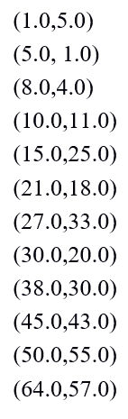

11.  现在，我们对`xRDD`和`yRDD`的值求和，并计算新的`zipedRDD`和值。我们还计算了`zipedRDD`的项目数:

```scala
val xSum = zipedRDD.map(_._1).sum() 
val ySum = zipedRDD.map(_._2).sum() 
val xySum= zipedRDD.map(c => c._1 * c._2).sum() 
val n= zipedRDD.count() 
```

12.  我们在控制台中打印出之前计算的值:

```scala
println("RDD X Sum: " +xSum) 
println("RDD Y Sum: " +ySum) 
println("RDD X*Y Sum: "+xySum) 
println("Total count: "+n) 
```

控制台输出如下:

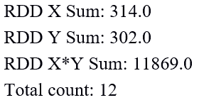

13.  我们通过停止 Spark 会话来关闭程序:

```scala
spark.stop() 
```

14.  一旦程序完成，IntelliJ 项目浏览器中`myFirstSpark20.scala`的布局将如下所示:

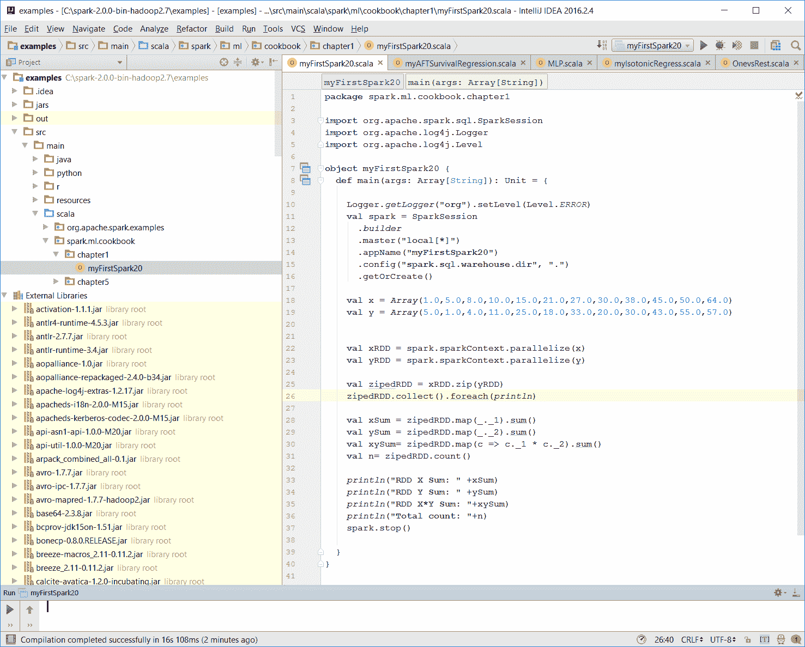

15.  确保没有编译错误。您可以通过重建项目来测试这一点:

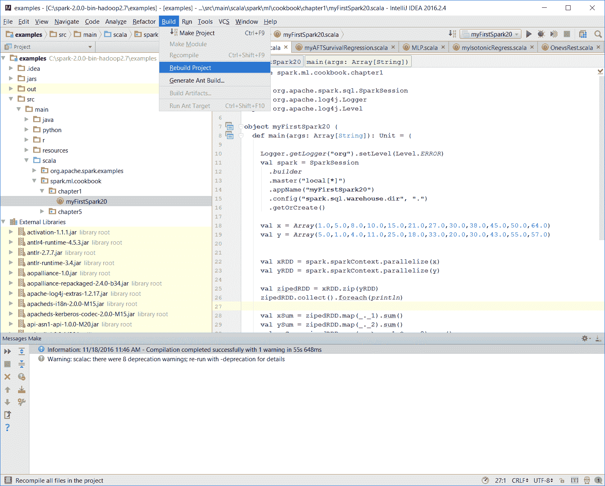

重建完成后，控制台上将显示一条构建完成消息:

```scala
Information: November 18, 2016, 11:46 AM - Compilation completed successfully with 1 warning in 55s 648ms
```

16.  您可以通过右键单击项目浏览器中的`the myFirstSpark20`对象并选择名为`Run myFirstSpark20`的上下文菜单选项(如下一个截图所示)来运行上一个程序。

You can also use the Run menu from the menu bar to perform the same action.

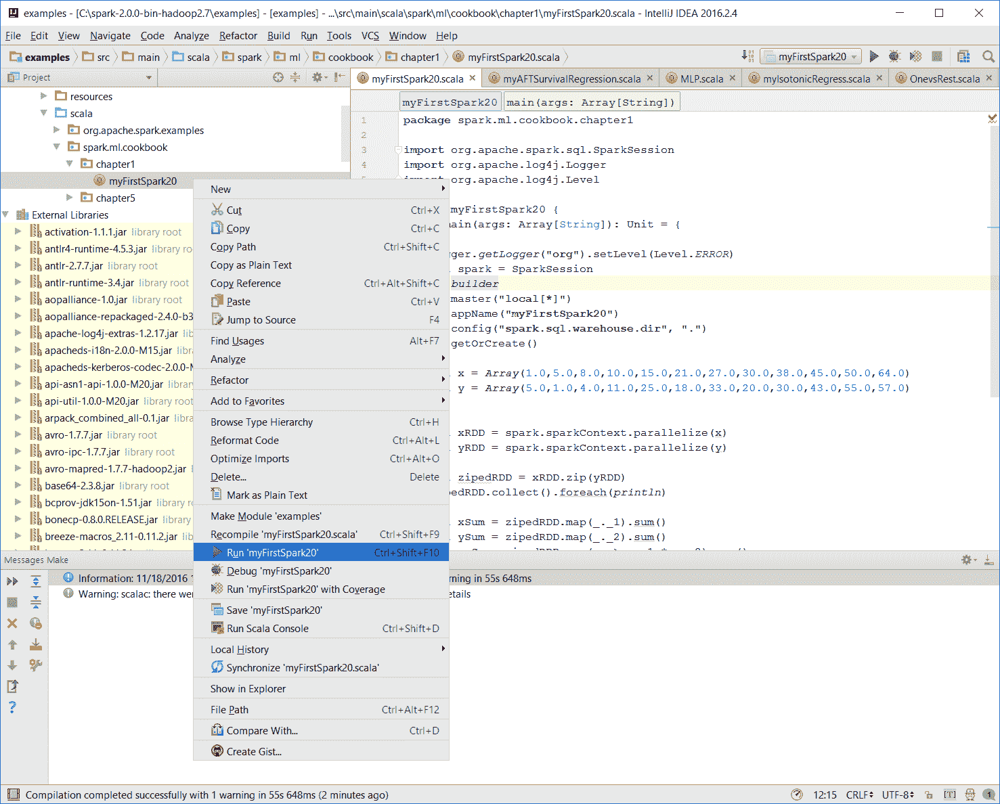

17.  程序成功执行后，您将看到以下消息:

```scala
Process finished with exit code 0
```

这也显示在下面的截图中:

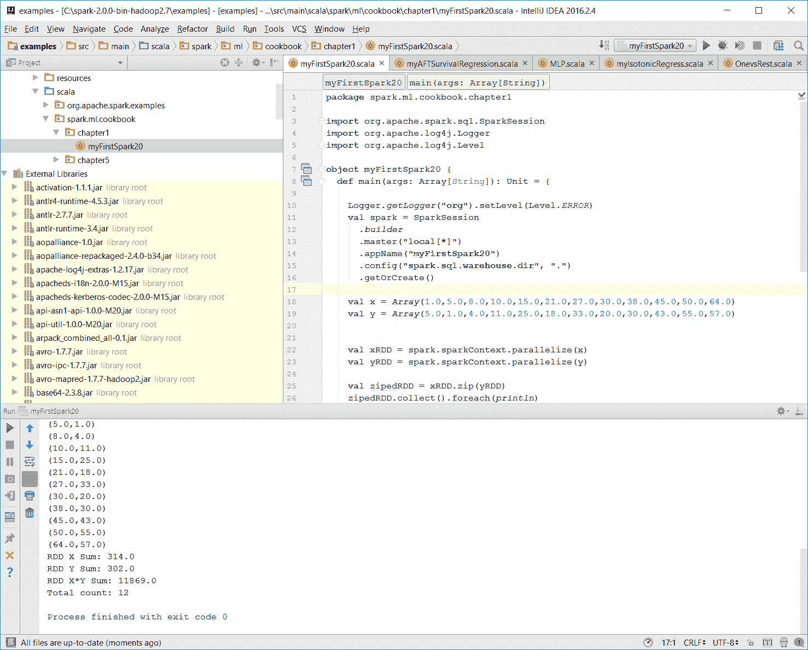

18.  使用 IntelliJ 的 Mac 用户将能够使用相同的上下文菜单执行此操作。

Place the code in the correct path.

# 它是如何工作的...

在这个例子中，我们编写了第一个 Scala 程序`myFirstSpark20.scala`，并显示了在 IntelliJ 中执行该程序的步骤。我们将代码放在 Windows 和 Mac 的步骤中描述的路径中。

在`myFirstSpark20`代码中，我们看到了一种创建`SparkSession`对象的典型方法，以及如何使用`master()`功能将其配置为在本地模式下运行。我们从数组对象中创建了两个关系数据库，并使用一个简单的`zip()`函数创建了一个新的 RDD。

我们还对创建的 rdd 进行了简单的求和计算，然后在控制台中显示结果。最后，我们通过调用`spark.stop()`退出并释放资源。

# 还有更多...

Spark 可以从[http://spark.apache.org/downloads.html](http://spark.apache.org/downloads.html)下载。

与 RDD 相关的 Spark 2.0 文档可在[http://Spark . Apache . org/docs/latest/programming-guide . html # rdd-operations](http://spark.apache.org/docs/latest/programming-guide.html#rdd-operations)上找到。

# 请参见

*   更多关于捷脑智能的信息可以在[https://www.jetbrains.com/idea/](https://www.jetbrains.com/idea/)找到。

# 如何向您的 Spark 程序添加图形

在本食谱中，我们将讨论如何使用 JFreeChart 向您的 Spark 2.0.0 程序中添加图形图表。

# 怎么做...

1.  设置 JFreeChart 库。JFreeChart JARs 可以从[https://sourceforge.net/projects/jfreechart/files/](https://sourceforge.net/projects/jfreechart/files/)网站下载。

2.  我们在本书中介绍的 JFreeChart 版本是 JFreeChart 1.0.19，可以在下面的截图中看到。可以从[https://sourceforge.net/projects/jfreechart/files/1.下载% 20 jfreechart/1 . 0 . 19/jfreechart-1 . 0 . 19 . zip/下载](https://sourceforge.net/projects/jfreechart/files/1.%20JFreeChart/1.0.19/jfreechart-1.0.19.zip/download)网站:


3.  下载完 ZIP 文件后，提取它。我们为一台 Windows 机器提取了`C:\`下的 ZIP 文件，然后继续在提取的目标目录下找到`lib`目录。
4.  然后我们找到我们需要的两个库(JFreeChart...

# 它是如何工作的...

在这个例子中，我们写了`MyChart.scala`并看到了在 IntelliJ 中执行程序的步骤。我们在 Windows 和 Mac 的步骤中描述的路径中放置了代码。

在代码中，我们看到了创建`SparkSession`对象的典型方式以及如何使用`master()`功能。我们用 1 到 15 范围内的随机整数数组创建了一个 RDD，并用索引压缩了它。

然后，我们使用 JFreeChart 构建了一个包含简单的 *x* 和 *y* 轴的基本图表，并为该图表提供了我们在前面步骤中从原始 RDD 生成的数据集。

我们为图表设置了模式，并在 JFreeChart 中调用`show()`函数来显示一个框架，其中 *x* 和 *y* 轴显示为线性图形图表。

最后，我们通过调用`spark.stop()`退出并释放资源。

# 还有更多...

有关 JFreeChart 的更多信息，请访问:

*   [http://www.jfree.org/jfreechart/](http://www.jfree.org/jfreechart/)
*   [http://www.jfree.org/jfreechart/api/javadoc/index.html](http://www.jfree.org/jfreechart/api/javadoc/index.html)

# 请参见

关于 JFreeChart 特性和功能的其他示例可在以下网站上找到:

[http://www.jfree.org/jfreechart/samples.html](http://www.jfree.org/jfreechart/samples.html)