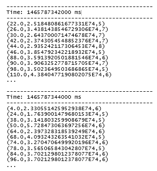

# Spark流和机器学习库

在本章中，我们将介绍以下食谱:

*   用于近实时机器学习的结构化流
*   用于实时机器学习的流式数据帧
*   用于实时机器学习的流式数据集
*   使用 queueStream 流传输数据和调试
*   下载并理解著名的 Iris 数据，用于无监督分类
*   用于实时在线分类器的流式知识管理
*   下载葡萄酒质量数据进行流回归
*   实时回归的流式线性回归
*   下载 Pima 糖尿病数据进行监督分类
*   在线分类器的流逻辑回归

# 介绍

Spark streaming 是一个不断发展的过程，旨在实现 API 的统一和结构化，以解决批处理和流的问题。从 Spark 1.3 开始，Spark 流就可以使用**离散流** ( **数据流**)。新的方向是使用无界表模型来抽象底层框架，在这种模型中，用户可以使用 SQL 或函数编程来查询表，并以多种模式(完整、增量和追加输出)将输出写入另一个输出表。Spark SQL Catalyst 优化器和钨(堆外内存管理器)现在是Spark流的一个固有部分，这导致了更有效的执行。

在本章中，我们不仅介绍了 Spark 的流媒体工具...

# 用于近实时机器学习的结构化流

在这个食谱中，我们探索了 Spark 2.0 中引入的新的结构化流范例。我们探索使用套接字和结构化流应用编程接口的实时流来投票，并相应地将投票制成表格。

我们还通过模拟随机生成的投票流来挑选最不受欢迎的漫画反派来探索新引入的子系统。

There are two distinct programs (`VoteCountStream.scala` and `CountStreamproducer.scala`) that make up this recipe.

# 怎么做...

1.  在 IntelliJ 或您选择的 IDE 中启动一个新项目。确保包含必要的 JAR 文件。

2.  设置程序将驻留的包位置:

```scala
package spark.ml.cookbook.chapter13
```

3.  为 Spark 上下文导入必要的包以访问集群并`log4j.Logger`减少 Spark 产生的输出量:

```scala
import org.apache.log4j.{Level, Logger}import org.apache.spark.sql.SparkSessionimport java.io.{BufferedOutputStream, PrintWriter}import java.net.Socketimport java.net.ServerSocketimport java.util.concurrent.TimeUnitimport scala.util.Randomimport org.apache.spark.sql.streaming.ProcessingTime
```

4.  定义一个 Scala 类来生成客户端套接字上的投票数据:

```scala
class CountSreamThread(socket: ...
```

# 它是如何工作的...

在这个食谱中，我们创建了一个简单的数据生成服务器来模拟一个投票数据流，然后对投票进行计数。下图提供了这个概念的高级描述:


首先，我们从执行数据生成服务器开始。其次，我们定义了一个套接字数据源，它允许我们连接到数据生成服务器。第三，我们构造了一个简单的 Spark 表达式，按反派(也就是坏超级英雄)分组，统计当前收到的所有选票。最后，我们配置了 10 秒的阈值触发器来执行我们的流查询，该查询将累积的结果转储到控制台上。

这个食谱包括两个简短的程序:

*   `CountStreamproducer.scala`:
    *   生产者数据生成服务器
    *   模拟投票并广播
*   `VoteCountStream.scala`:
    *   消费者消费并汇总/制表数据
    *   接收和计算反派超级英雄的选票

# 还有更多...

如何在 Spark 中使用 Spark 流和结构化流进行编程的主题不在本书的讨论范围内，但是我们觉得有必要在深入研究 Spark 的 ML 流产品之前分享一些程序来介绍概念。

有关流媒体的详细介绍，请参考以下关于 Spark 的文档:

*   Spark 2.0+结构化流的信息可在[https://Spark . Apache . org/docs/latest/structured-streaming-programming-guide . html # API-use-dataset-and-data frames](https://spark.apache.org/docs/latest/structured-streaming-programming-guide.html#api-using-datasets-and-dataframes)上获得
*   Spark 1.6 流媒体的信息可在[https://Spark . Apache . org/docs/latest/streaming-programming-guide . html](https://spark.apache.org/docs/latest/streaming-programming-guide.html)获得

# 请参见

*   结构化流的文档可在[https://spark . Apache . org/docs/latest/API/Scala/index . html # org . Apache . spark . SQL . streaming . package](https://spark.apache.org/docs/latest/api/scala/index.html#org.apache.spark.sql.streaming.package)获得
*   DStream(Spark 2.0 之前)的文档可在[https://Spark . Apache . org/docs/latest/API/Scala/index . html # org . Apache . Spark . streaming . DStream . DStream](https://spark.apache.org/docs/latest/api/scala/index.html#org.apache.spark.streaming.dstream.DStream)获得
*   `DataStreamReader`的文档可在[上获得](https://spark.apache.org/docs/latest/api/scala/index.html#org.apache.spark.sql.streaming.DataStreamReader)
*   `DataStreamWriter`的文档可在[上获得](https://spark.apache.org/docs/latest/api/scala/index.html#org.apache.spark.sql.streaming.DataStreamWriter)
*   `StreamingQuery`的文档可在[上获得](https://spark.apache.org/docs/latest/api/scala/index.html#org.apache.spark.sql.streaming.StreamingQuery)

# 用于实时机器学习的流式数据帧

在本食谱中，我们探讨了流式数据帧的概念。我们创建了一个包含个人姓名和年龄的数据帧，我们将通过一条线对其进行流式传输。流式数据帧是一种与 Spark ML 一起使用的流行技术，因为在编写本文时，Spark 结构化 ML 之间还没有完全集成。

我们将该方法限制在演示流式数据帧的范围内，并让读者自行调整以适应他们自己的定制 ML 管道。虽然 Spark 2.1.0 中没有现成的流式数据帧，但在 Spark 的更高版本中看到它将是一种自然的发展。

# 怎么做...

1.  在 IntelliJ 或您选择的 IDE 中启动一个新项目。确保包含必要的 JAR 文件。

2.  设置程序将驻留的包位置:

```scala
package spark.ml.cookbook.chapter13
```

3.  导入必要的包:

```scala
import java.util.concurrent.TimeUnit
import org.apache.log4j.{Level, Logger}
import org.apache.spark.sql.SparkSession
import org.apache.spark.sql.streaming.ProcessingTime
```

4.  创建一个`SparkSession`作为Spark簇的入口点:

```scala
val spark = SparkSession
.builder.master("local[*]")
.appName("DataFrame Stream")
.config("spark.sql.warehouse.dir", ".")
.getOrCreate()

```

5.  日志消息的交错导致输出难以读取，因此将日志级别设置为警告:

```scala
Logger.getLogger("org").setLevel(Level.ERROR)
Logger.getLogger("akka").setLevel(Level.ERROR)
```

6.  接下来，加载 person 数据文件来推断数据模式，而无需手工编码结构类型:

```scala
val df = spark.read .format("json")
.option("inferSchema", "true")
.load("../data/sparkml2/chapter13/person.json")
df.printSchema()
```

从控制台，您将看到以下输出:

```scala
root
|-- age: long (nullable = true)
|-- name: string (nullable = true)
```

7.  现在配置一个流式数据帧来接收数据:

```scala
val stream = spark.readStream
.schema(df.schema)
.json("../data/sparkml2/chapter13/people/")
```

8.  让我们通过过滤大于`60`的年龄来执行一个简单的数据转换:

```scala
val people = stream.select("name", "age").where("age > 60")
```

9.  我们现在将转换后的流数据输出到控制台，它将每秒触发一次:

```scala
val query = people.writeStream
.outputMode("append")
.trigger(ProcessingTime(1, TimeUnit.SECONDS))
.format("console")
```

10.  我们开始我们定义的流查询，等待数据出现在流中:

```scala
query.start().awaitTermination()
```

11.  最后，我们的流查询结果将出现在控制台中:


# 它是如何工作的...

在这个方法中，我们首先使用快速方法(使用 JSON 对象)发现一个 person 对象的底层模式，如步骤 6 所述。生成的数据帧将知道我们随后强加给流输入的模式(通过流传输文件来模拟)，并被视为流数据帧，如步骤 7 所示。

将流视为数据帧并使用函数或 SQL 范例对其进行操作的能力是一个强大的概念，可以在步骤 8 中看到。然后，我们使用`append`模式和 1 秒的批次间隔触发来输出结果。

# 还有更多...

数据框架和结构化编程的结合是一个强大的概念，它帮助我们将数据层从流中分离出来，这使得编程变得更加容易。DStream(Spark 2.0 之前的版本)的最大缺点之一是无法将用户与 stream/RDD 实现的底层细节隔离开来。

数据帧的文档:

*   `DataFrameReader`:[https://spark . Apache . org/docs/latest/API/Scala/index . html # org . Apache . spark . SQL . data frame reader](https://spark.apache.org/docs/latest/api/scala/index.html#org.apache.spark.sql.DataFrameReader)
*   `DataFrameWriter`:[https://spark . Apache . org/docs/latest/API/Scala/index . html # org . Apache . spark . SQL . data frame writer](https://spark.apache.org/docs/latest/api/scala/index.html#org.apache.spark.sql.DataFrameWriter)

# 请参见

Spark数据流读取器和写入器的文档:

*   数据流阅读器:[https://spark . Apache . org/docs/latest/API/Scala/index . html # org . Apache . spark . SQL . streaming .数据流阅读器](https://spark.apache.org/docs/latest/api/scala/index.html#org.apache.spark.sql.streaming.DataStreamReader)
*   DataStreamWriter:[https://spark . Apache . org/docs/latest/API/Scala/index . html # org . Apache . spark . SQL . streaming . DataStreamWriter](https://spark.apache.org/docs/latest/api/scala/index.html#org.apache.spark.sql.streaming.DataStreamWriter)

# 用于实时机器学习的流式数据集

在本食谱中，我们创建了一个流式数据集，以演示使用 Spark 2.0 结构化编程范式的数据集。我们使用数据集从文件中流式传输股票价格，并应用过滤器来选择当天收盘超过 100 美元的股票。

该配方演示了如何使用简单的结构化流编程模型来使用流来过滤和处理传入的数据。虽然它类似于数据帧，但在语法上有一些不同。配方是以通用的方式编写的，因此用户可以为自己的 Spark ML 编程项目定制它。

# 怎么做...

1.  在 IntelliJ 或您选择的 IDE 中启动一个新项目。确保包含必要的 JAR 文件。

2.  设置程序将驻留的包位置:

```scala
package spark.ml.cookbook.chapter13
```

3.  导入必要的包:

```scala
import java.util.concurrent.TimeUnitimport org.apache.log4j.{Level, Logger}import org.apache.spark.sql.SparkSessionimport org.apache.spark.sql.streaming.ProcessingTime
```

4.  定义一个 Scala `case class`来建模流数据:

```scala
case class StockPrice(date: String, open: Double, high: Double, low: Double, close: Double, volume: Integer, adjclose: Double)
```

5.  创建`SparkSession`用作Spark簇的入口点:

```scala
val spark = SparkSession.builder.master("local[*]").appName("Dataset ...
```

# 它是如何工作的...

在本食谱中，我们将利用追溯至 1972 年的**通用电气** ( **通用电气**)收盘价的市场数据。为了简化数据，我们对这个配方进行了预处理。我们使用与上一个方法相同的方法，即*实时机器学习的流数据帧*，通过窥视 JSON 对象来发现模式(步骤 7)，我们在步骤 8 中将其应用于流。

下面的代码显示了如何使用模式使流看起来像一个简单的表，您可以动态地从中读取。这是一个强大的概念，使得更多的程序员可以访问流编程。需要以下代码片段中的`schema(s.schema)`和`as[StockPrice]` 来创建流数据集，该数据集具有与之相关联的模式:

```scala
val streamDataset = spark.readStream
            .schema(s.schema)
            .option("sep", ",")
            .option("header", "true")
            .csv("../data/sparkml2/chapter13/ge").as[StockPrice]
```

# 还有更多...

数据集[下提供的所有应用程序接口的文档，网址为 https://spark . Apache . org/docs/latest/API/Scala/index . html # org . Apache . spark . SQL .数据集](https://spark.apache.org/docs/latest/api/scala/index.html#org.apache.spark.sql.Dataset)网站[。](https://spark.apache.org/docs/latest/api/scala/index.html#org.apache.spark.sql.Dataset)

# 请参见

以下文档有助于探索流式数据集概念:

*   `StreamReader`:[https://spark . Apache . org/docs/latest/API/Scala/index . html # org . Apache . spark . SQL . streaming . datastreamreader](https://spark.apache.org/docs/latest/api/scala/index.html#org.apache.spark.sql.streaming.DataStreamReader)
*   `StreamWriter`:[https://spark . Apache . org/docs/latest/API/Scala/index . html # org . Apache . spark . SQL . streaming . datastreamwriter](https://spark.apache.org/docs/latest/api/scala/index.html#org.apache.spark.sql.streaming.DataStreamWriter)
*   `StreamQuery`:[https://spark . Apache . org/docs/latest/API/Scala/index . html # org . Apache . spark . SQL . streaming . streaming query](https://spark.apache.org/docs/latest/api/scala/index.html#org.apache.spark.sql.streaming.StreamingQuery)

# 使用 queueStream 流传输数据和调试

在这个食谱中，我们探索了`queueStream()`*的概念，这是一个有价值的工具，同时试图让流媒体程序在开发周期中工作。我们发现`queueStream()`应用编程接口非常有用，并认为其他开发人员可以从充分展示其用法的配方中受益。*

 *我们首先使用程序`ClickGenerator.scala`模拟用户浏览与不同网页相关的各种网址，然后使用`ClickStream.scala`程序对数据(用户行为/访问)进行消费和制表:


我们将 Spark 的流 API 与`Dstream()`一起使用，这将需要使用...

# 怎么做...

1.  在 IntelliJ 或您选择的 IDE 中启动一个新项目。确保包含必要的 JAR 文件。

2.  设置程序将驻留的包位置:

```scala
package spark.ml.cookbook.chapter13
```

3.  导入必要的包:

```scala
import java.time.LocalDateTime
import scala.util.Random._
```

4.  定义一个 Scala `case class`来为用户点击事件建模，它包含用户标识符、IP 地址、事件时间、网址和 HTTP 状态代码:

```scala
case class ClickEvent(userId: String, ipAddress: String, time: String, url: String, statusCode: String)
```

5.  定义生成的状态代码:

```scala
val statusCodeData = Seq(200, 404, 500)
```

6.  定义要生成的网址:

```scala
val urlData = Seq("http://www.fakefoo.com",
 "http://www.fakefoo.com/downloads",
 "http://www.fakefoo.com/search",
 "http://www.fakefoo.com/login",
 "http://www.fakefoo.com/settings",
 "http://www.fakefoo.com/news",
 "http://www.fakefoo.com/reports",
 "http://www.fakefoo.com/images",
 "http://www.fakefoo.com/css",
 "http://www.fakefoo.com/sounds",
 "http://www.fakefoo.com/admin",
 "http://www.fakefoo.com/accounts" )
```

7.  定义要生成的 IP 地址范围:

```scala
val ipAddressData = generateIpAddress()
def generateIpAddress(): Seq[String] = {
 for (n <- 1 to 255) yield s"127.0.0.$n" }
```

8.  定义生成的时间戳范围:

```scala
val timeStampData = generateTimeStamp()

 def generateTimeStamp(): Seq[String] = {
 val now = LocalDateTime.now()
 for (n <- 1 to 1000) yield LocalDateTime.*of*(now.toLocalDate,
 now.toLocalTime.plusSeconds(n)).toString
 }
```

9.  定义要生成的用户标识符范围:

```scala
val userIdData = generateUserId()

 def generateUserId(): Seq[Int] = {
 for (id <- 1 to 1000) yield id
 }
```

10.  定义一个函数来生成一个或多个伪随机事件:

```scala
def generateClicks(clicks: Int = 1): Seq[String] = {
 0.until(clicks).map(i => {
 val statusCode = statusCodeData(nextInt(statusCodeData.size))
 val ipAddress = ipAddressData(nextInt(ipAddressData.size))
 val timeStamp = timeStampData(nextInt(timeStampData.size))
 val url = urlData(nextInt(urlData.size))
 val userId = userIdData(nextInt(userIdData.size))

 s"$userId,$ipAddress,$timeStamp,$url,$statusCode" })
 }
```

11.  定义一个从字符串中解析伪随机`ClickEvent`的函数:

```scala
def parseClicks(data: String): ClickEvent = {
val fields = data.split(",")
new ClickEvent(fields(0), fields(1), fields(2), fields(3), fields(4))
 }
```

12.  创建Spark的配置和持续时间为 1 秒的Spark流上下文:

```scala
val spark = SparkSession
.builder.master("local[*]")
 .appName("Streaming App")
 .config("spark.sql.warehouse.dir", ".")
 .config("spark.executor.memory", "2g")
 .getOrCreate()
val ssc = new StreamingContext(spark.sparkContext, Seconds(1))
```

13.  日志消息的交错导致输出难以读取，因此将日志级别设置为警告:

```scala
Logger.getRootLogger.setLevel(Level.WARN)
```

14.  创建一个可变队列，将我们生成的数据附加到:

```scala
val rddQueue = new Queue[RDD[String]]()
```

15.  从传入数据队列引用的流上下文创建一个 Spark 队列流:

```scala
val inputStream = ssc.queueStream(rddQueue)
```

16.  处理队列流接收到的任何数据，并统计用户点击的每个特定链接的总数:

```scala
val clicks = inputStream.map(data => ClickGenerator.parseClicks(data))
 val clickCounts = clicks.map(c => c.url).countByValue()
```

17.  打印出`12`网址及其总数:

```scala
clickCounts.print(12)
```

18.  启动我们的流上下文以接收微批次:

```scala
ssc.start()
```

19.  循环 10 次，在每次迭代中生成 100 个伪随机事件，并将它们附加到我们的可变队列中，以便它们在流队列抽象中具体化:

```scala
for (i <- 1 to 10) {
 rddQueue += ssc.sparkContext.parallelize(ClickGenerator.*generateClicks*(100))
 Thread.sleep(1000)
 }
```

20.  我们通过停止Spark流上下文来关闭程序:

```scala
ssc.stop()
```

# 它是如何工作的...

有了这个配方，我们引入了 Spark Streaming，使用了一种很多人忽略的技术，它允许我们利用 Spark 的`QueueInputDStream`类创建一个流应用程序。`QueueInputDStream`类不仅是理解 Spark 流的有益工具，也是开发周期中的调试工具。在开始的步骤中，我们设置了一些数据结构，以便为后期的流处理生成伪随机`clickstream`事件数据。

应该注意的是，在步骤 12 中，我们创建了一个流上下文，而不是一个 SparkContext。流上下文是我们用于 Spark 流应用程序的上下文。接下来，创建一个队列和队列流来接收流数据。现在开始...

# 请参见

从本质上来说，`queueStream()`只是 Spark streaming(2.0 之前)进入 RDD 后我们拥有的一个 rdd 队列:

*   结构化流的文档(Spark 2.0+):[https://Spark . Apache . org/docs/2 . 1 . 0/结构化流-编程-指南. html](https://spark.apache.org/docs/2.1.0/structured-streaming-programming-guide.html)

*   流媒体文档(Spark 2.0 之前):[https://Spark . Apache . org/docs/latest/streaming-programming-guide . html](https://spark.apache.org/docs/latest/streaming-programming-guide.html)

# 下载并理解著名的 Iris 数据，用于无监督分类

在这个配方中，我们下载并检查了众所周知的 Iris 数据集，为即将到来的流 KMeans 配方做准备，该配方让您可以实时看到分类/聚类。

数据存储在 UCI 机器学习存储库中，这是算法原型的一个很好的数据源。你会注意到 R 博主倾向于喜欢这个数据集。

# 怎么做...

1.  您可以从使用以下两个命令之一下载数据集开始:

```scala
wget https://archive.ics.uci.edu/ml/machine-learning-databases/iris/iris.data
```

您也可以使用以下命令:

```scala
curl https://archive.ics.uci.edu/ml/machine-learning-databases/iris/iris.data -o iris.data
```

您也可以使用以下命令:

```scala
https://archive.ics.uci.edu/ml/machine-learning-databases/iris/iris.data
```

2.  现在，我们通过检查`iris.data`中的数据是如何格式化的来开始数据探索的第一步:

```scala
head -5 iris.data
5.1,3.5,1.4,0.2,Iris-setosa
4.9,3.0,1.4,0.2,Iris-setosa
4.7,3.2,1.3,0.2,Iris-setosa
4.6,3.1,1.5,0.2,Iris-setosa
5.0,3.6,1.4,0.2,Iris-setosa
```

3.  现在我们看一下 iris 数据，了解它是如何格式化的:

```scala
tail -5 iris.data
6.3,2.5,5.0,1.9,Iris-virginica
6.5,3.0,5.2,2.0,Iris-virginica
6.2,3.4,5.4,2.3,Iris-virginica
5.9,3.0,5.1,1.8,Iris-virginica
```

# 它是如何工作的...

这些数据是由 150 个观测值组成的。每个观察由四个数字特征(以厘米为单位)和一个标签组成，该标签表示每个 Iris 属于哪个类别:

**特征/属性**:

*   萼片长厘米
*   萼片宽度厘米
*   花瓣长度(厘米)
*   花瓣宽度(厘米)

**标签/类别**:

*   伊里斯·濑户沙
*   杂色鸢尾
*   弗吉尼亚鸢尾

# 还有更多...

下图描绘了一朵带有花瓣和萼片的鸢尾花，为清晰起见进行了标记:


# 请参见

以下链接更详细地探讨了 Iris 数据集:

[https://en . Wikipedia . org/wiki/iris _ flower _ data _ set](https://en.wikipedia.org/wiki/Iris_flower_data_set)

# 用于实时在线分类器的流式知识管理

在这个食谱中，我们探索了 Spark 中用于无监督学习方案的流版本的 KMeans。流 KMeans 算法的目的是根据相似性因子将一组数据点分类或分组到多个聚类中。

KMeans 分类方法有两种实现方式，一种用于静态/离线数据，另一种用于连续到达的实时更新数据。

我们将流式传输 iris 数据集聚类，作为新的数据流进入我们的流式传输环境。

# 怎么做...

1.  在 IntelliJ 或您选择的 IDE 中启动一个新项目。确保包含必要的 JAR 文件。

2.  设置程序将驻留的包位置:

```scala
package spark.ml.cookbook.chapter13
```

3.  导入必要的包:

```scala
import org.apache.spark.mllib.linalg.Vectorsimport org.apache.spark.mllib.regression.LabeledPointimport org.apache.spark.rdd.RDDimport org.apache.spark.SparkContextimport scala.collection.mutable.Queue
```

4.  我们首先定义一个函数，将 iris 数据加载到内存中，过滤掉空行，为每个元素附加一个标识符，最后返回一个类型为 string 和 long 的元组:

```scala
def readFromFile(sc: SparkContext) = { sc.textFile("../data/sparkml2/chapter13/iris.data") .filter(s ...
```

# 它是如何工作的...

在本食谱中，我们首先加载虹膜数据集，并使用`zip()`应用编程接口将具有唯一标识符的数据与用于生成*标记点*数据结构的数据配对，以便与 KMeans 算法一起使用。

接下来，创建可变队列和`QueueInputDStream`来追加数据以模拟流。一旦`QueueInputDStream`开始接收数据，则流式 k 均值聚类开始动态聚类数据并打印出结果。您将在这里注意到的有趣的事情是，我们在一个队列流上流式传输训练数据集，在另一个队列流上流式传输测试数据。当我们将数据添加到队列中时，KMeans 聚类算法正在处理我们的传入数据并动态生成聚类。

# 还有更多...

*流的文档:*

*   `StreamingKMeans`:[https://spark . Apache . org/docs/latest/API/Scala/index . html # org . Apache . spark . mllib . clustering . streamingkmeans](https://spark.apache.org/docs/latest/api/scala/index.html#org.apache.spark.mllib.clustering.StreamingKMeans)

*   `StreamingKMeansModel`:[https://spark . Apache . org/docs/latest/API/Scala/index . html # org . Apache . spark . mllib . clustering . streamingkmeansmodel](https://spark.apache.org/docs/latest/api/scala/index.html#org.apache.spark.mllib.clustering.StreamingKMeansModel)

# 请参见

通过构建器模式或`streamingKMeans`定义的超参数有:

```scala
setDecayFactor()
setK()
setRandomCenters(,)
```

# 下载葡萄酒质量数据进行流回归

在这个配方中，我们从 UCI 机器学习存储库中下载并检查葡萄酒质量数据集，为来自 MLlib 的 Spark 流式线性回归算法准备数据。

# 怎么做...

您需要以下命令行工具之一`curl`或`wget`来检索指定的数据:

1.  您可以从使用以下三个命令之一下载数据集开始。第一个如下:

```scala
wget http://archive.ics.uci.edu/ml/machine-learning-databases/wine-quality/winequality-white.csv
```

您也可以使用以下命令:

```scala
curl http://archive.ics.uci.edu/ml/machine-learning-databases/wine-quality/winequality-white.csv -o winequality-white.csv
```

该命令是执行相同操作的第三种方法:

```scala
http://archive.ics.uci.edu/ml/machine-learning-databases/wine-quality/winequality-white.csv
```

2.  现在我们开始数据探索的第一步，看看`winequality-white.csv`中的数据是如何格式化的:

```scala
head -5 winequality-white.csv

"fixed acidity";"volatile acidity";"citric acid";"residual sugar";"chlorides";"free sulfur dioxide";"total sulfur dioxide";"density";"pH";"sulphates";"alcohol";"quality"
7;0.27;0.36;20.7;0.045;45;170;1.001;3;0.45;8.8;6
6.3;0.3;0.34;1.6;0.049;14;132;0.994;3.3;0.49;9.5;6
8.1;0.28;0.4;6.9;0.05;30;97;0.9951;3.26;0.44;10.1;6
7.2;0.23;0.32;8.5;0.058;47;186;0.9956;3.19;0.4;9.9;6
```

3.  现在我们来看看葡萄酒质量数据，了解它是如何格式化的:

```scala
tail -5 winequality-white.csv
6.2;0.21;0.29;1.6;0.039;24;92;0.99114;3.27;0.5;11.2;6
6.6;0.32;0.36;8;0.047;57;168;0.9949;3.15;0.46;9.6;5
6.5;0.24;0.19;1.2;0.041;30;111;0.99254;2.99;0.46;9.4;6
5.5;0.29;0.3;1.1;0.022;20;110;0.98869;3.34;0.38;12.8;7
6;0.21;0.38;0.8;0.02;22;98;0.98941;3.26;0.32;11.8;6
```

# 它是如何工作的...

数据由 1599 种红葡萄酒和 4898 种白葡萄酒组成，有 11 个特征和一个输出标签，可以在培训期间使用。

以下是功能/属性列表:

*   固定酸度
*   挥发性酸度
*   柠檬酸
*   残糖
*   氯化物
*   游离二氧化硫
*   二氧化硫总量
*   密度
*   pH 值
*   硫酸盐
*   酒精

以下是输出标签:

*   质量(0 到 10 之间的数值)

# 还有更多...

以下链接列出了流行的机器学习算法的数据集。可以根据需要选择新的数据集进行实验。

备选数据集可在[https://en . Wikipedia . org/wiki/List _ of _ dataset _ for _ machine _ learning _ research](https://en.wikipedia.org/wiki/List_of_datasets_for_machine_learning_research)获得。

我们选择了 Iris 数据集，因此我们可以使用连续的数字特征进行线性回归模型。

# 实时回归的流式线性回归

在本食谱中，我们将使用来自 UCI 的葡萄酒质量数据集和来自 MLlib 的 Spark 流式线性回归算法，根据一组葡萄酒特征来预测葡萄酒的质量。

这种配方与我们之前看到的传统回归配方的区别在于，使用 Spark ML 流来使用线性回归模型对葡萄酒的质量进行实时评分。

# 怎么做...

1.  在 IntelliJ 或您选择的 IDE 中启动一个新项目。确保包含必要的 JAR 文件。

2.  设置程序将驻留的包位置:

```scala
package spark.ml.cookbook.chapter13
```

3.  导入必要的包:

```scala
import org.apache.log4j.{Level, Logger}
 import org.apache.spark.mllib.linalg.Vectors
 import org.apache.spark.mllib.regression.LabeledPoint
 import org.apache.spark.mllib.regression.StreamingLinearRegressionWithSGD
 import org.apache.spark.rdd.RDD
 import org.apache.spark.sql.{Row, SparkSession}
 import org.apache.spark.streaming.{Seconds, StreamingContext}
 import scala.collection.mutable.Queue
```

4.  创建 Spark 的配置和流上下文:

```scala
val spark = SparkSession
 .builder.master("local[*]")
 .appName("Regression Streaming App")
 .config("spark.sql.warehouse.dir", ".")
 .config("spark.executor.memory", "2g")
 .getOrCreate()

 import spark.implicits._

 val ssc = new StreamingContext(spark.sparkContext, *Seconds*(2))
```

5.  日志消息的交错导致输出难以读取，因此将日志级别设置为警告:

```scala
Logger.getRootLogger.setLevel(Level.WARN)
```

6.  使用数据框将葡萄酒质量 CSV 加载到数据框中:

```scala
val rawDF = spark.read
 .format("com.databricks.spark.csv")
 .option("inferSchema", "true")
 .option("header", "true")
 .option("delimiter", ";")
 .load("../data/sparkml2/chapter13/winequality-white.csv")
```

7.  将数据帧转换为`rdd`和`zip`唯一标识符:

```scala
val rdd = rawDF.rdd.zipWithUniqueId()
```

8.  构建一个查找图，以便稍后将预测质量与实际质量值进行比较:

```scala
val lookupQuality = rdd.map{ case (r: Row, id: Long)=> (id, r.getInt(11))}.collect().toMap
```

9.  将葡萄酒质量转换为标签点，用于机器学习库:

```scala
val labelPoints = rdd.map{ case (r: Row, id: Long)=> LabeledPoint(id,
 Vectors.dense(r.getDouble(0), r.getDouble(1), r.getDouble(2), r.getDouble(3), r.getDouble(4),
 r.getDouble(5), r.getDouble(6), r.getDouble(7), r.getDouble(8), r.getDouble(9), r.getDouble(10))
 )}
```

10.  创建一个可变队列，用于将数据追加到:

```scala
val trainQueue = new Queue[RDD[LabeledPoint]]()
val testQueue = new Queue[RDD[LabeledPoint]]()
```

11.  创建Spark流队列以接收流数据:

```scala
val trainingStream = ssc.queueStream(trainQueue)
val testStream = ssc.queueStream(testQueue)
```

12.  配置流式线性回归模型:

```scala
val numFeatures = 11
 val model = new StreamingLinearRegressionWithSGD()
 .setInitialWeights(Vectors.zeros(numFeatures))
 .setNumIterations(25)
 .setStepSize(0.1)
 .setMiniBatchFraction(0.25)
```

13.  训练回归模型并预测最终值:

```scala
model.trainOn(trainingStream)
val result = model.predictOnValues(testStream.map(lp => (lp.label, lp.features)))
result.map{ case (id: Double, prediction: Double) => (id, prediction, lookupQuality(id.asInstanceOf[Long])) }.print()

```

14.  启动Spark流上下文:

```scala
ssc.start()
```

15.  将标签点数据分为训练集和测试集:

```scala
val Array(trainData, test) = labelPoints.randomSplit(Array(.80, .20))
```

16.  将数据追加到训练数据队列中进行处理:

```scala
trainQueue += trainData
 Thread.sleep(4000)
```

17.  现在将测试数据分成两半，并追加到队列中进行处理:

```scala
val testGroups = test.randomSplit(*Array*(.50, .50))
 testGroups.foreach(group => {
 testQueue += group
 Thread.sleep(2000)
 })
```

18.  一旦队列流接收到数据，您将看到以下输出:



19.  通过停止Spark流上下文来关闭程序:

```scala
ssc.stop()
```

# 它是如何工作的...

我们首先通过 Databrick 的`spark-csv`库将葡萄酒质量数据集加载到数据框中。下一步是为数据集中的每一行附加一个唯一的标识符，以便以后将预测的质量与实际质量相匹配。原始数据被转换为标记点，因此可以用作流式线性回归算法的输入。在步骤 9 和 10 中，我们创建了可变队列和 Spark 的`QueueInputDStream`类的实例，用作回归算法的管道。

然后，我们创建了流式线性回归模型，它将为我们的最终结果预测葡萄酒质量。我们通常从原始数据创建训练和测试数据集，并将它们附加到适当的队列中开始...

# 还有更多...

`StreamingLinearRegressionWithSGD()` : [文档:](https://spark.apache.org/docs/latest/api/scala/index.html#org.apache.spark.mllib.regression.StreamingLinearRegressionWithSGD)

# 请参见

`StreamingLinearRegressionWithSGD()` *的超级参数:*

*   `setInitialWeights(Vectors.*zeros*())`
*   `setNumIterations()`
*   `setStepSize()`
*   `setMiniBatchFraction()`

还有一个`StreamingLinearRegression()` API 不使用**随机梯度下降** ( **SGD** )版本:

[https://spark . Apache . org/docs/latest/API/Scala/index . html # org . Apache . spark . mllib . rejection . streaminglinearalgorithm](https://spark.apache.org/docs/latest/api/scala/index.html#org.apache.spark.mllib.regression.StreamingLinearAlgorithm)

以下链接为线性回归提供了快速参考:

[https://en.wikipedia.org/wiki/Linear_regression](https://en.wikipedia.org/wiki/Linear_regression)

# 下载 Pima 糖尿病数据进行监督分类

在本食谱中，我们从 UCI 机器学习存储库中下载并检查皮马糖尿病数据集。稍后，我们将使用 Spark 的流逻辑回归算法来使用数据集。

# 怎么做...

您将需要以下命令行工具之一`curl`或`wget`来检索指定的数据:

1.  您可以从使用以下两个命令之一下载数据集开始。第一个命令如下:

```scala
http://archive.ics.uci.edu/ml/machine-learning-databases/pima-indians-diabetes/pima-indians-diabetes.data
```

这是您可以使用的替代方案:

```scala
wget http://archive.ics.uci.edu/ml/machine-learning-databases/pima-indians-diabetes/pima-indians-diabetes.data -o pima-indians-diabetes.data
```

2.  现在我们开始数据探索的第一步，看看`pima-indians-diabetes.data`中的数据是如何格式化的(从 Mac 或 Linux 终端):

```scala
head -5 pima-indians-diabetes.data6,148,72,35,0,33.6,0.627,50,11,85,66,29,0,26.6,0.351,31,0 ...
```

# 它是如何工作的...

我们对数据集进行了 768 次观察。每条线/记录由 10 个特征和一个可用于监督学习模型(即逻辑回归)的标签值组成。标签/类别要么是`1`，表示糖尿病检测呈阳性，要么是`0`，如果检测结果呈阴性。

**特征/属性:**

*   怀孕次数
*   口服葡萄糖耐量试验中 2 小时的血浆葡萄糖浓度
*   舒张压(毫米汞柱)
*   三头肌皮肤褶皱厚度(mm)
*   2 小时血清胰岛素(微克/毫升)
*   体重指数(以千克为单位的体重/(m)^2 的身高)
*   糖尿病谱系功能
*   年龄(岁)
*   类变量(0 或 1)

```scala
    Label/Class:
               1 - tested positive
               0 - tested negative
```

# 还有更多...

我们发现普林斯顿大学的以下备选数据集非常有帮助:

[http://data.princeton.edu/wws509/datasets](http://data.princeton.edu/wws509/datasets)

# 请参见

您可以用来探索该食谱的数据集必须以标签(预测类)必须是二进制(糖尿病检测阳性/阴性)的方式构建。

# 在线分类器的流逻辑回归

在本食谱中，我们将使用我们在之前的食谱中下载的 Pima 糖尿病数据集和带有 SGD 的 Spark 流式逻辑回归算法来预测具有各种特征的 Pima 是否会被检测为糖尿病阳性。它是一个在线分类器，基于流式数据进行学习和预测。

# 怎么做...

1.  在 IntelliJ 或您选择的 IDE 中启动一个新项目。确保包含必要的 JAR 文件。

2.  设置程序将驻留的包位置:

```scala
package spark.ml.cookbook.chapter13
```

3.  导入必要的包:

```scala
import org.apache.log4j.{Level, Logger}
import org.apache.spark.mllib.classification.StreamingLogisticRegressionWithSGD
import org.apache.spark.mllib.linalg.Vectors
import org.apache.spark.mllib.regression.LabeledPoint
import org.apache.spark.rdd.RDD
import org.apache.spark.sql.{Row, SparkSession}
import org.apache.spark.streaming.{Seconds, StreamingContext}
import scala.collection.mutable.Queue

```

4.  创建一个`SparkSession`对象作为集群的入口点和一个`StreamingContext`:

```scala
val spark = SparkSession
 .builder.master("local[*]")
 .appName("Logistic Regression Streaming App")
 .config("spark.sql.warehouse.dir", ".")
 .getOrCreate()

 import spark.implicits._

 val ssc = new StreamingContext(spark.sparkContext, *Seconds*(2))
```

5.  日志消息的交错导致输出难以读取，因此将日志级别设置为警告:

```scala
Logger.getLogger("org").setLevel(Level.ERROR)
```

6.  将 Pima 数据文件加载到字符串类型的数据集:

```scala
val rawDS = spark.read
.text("../data/sparkml2/chapter13/pima-indians- diabetes.data").as[String]
```

7.  通过在记录中生成一个由最后一项组成的元组作为标签，其他所有内容作为序列，从原始数据集构建一个 RDD:

```scala
val buffer = rawDS.rdd.map(value => {
val data = value.split(",")
(data.init.toSeq, data.last)
})
```

8.  将预处理数据转换为标签点，用于机器学习库:

```scala
val lps = buffer.map{ case (feature: Seq[String], label: String) =>
val featureVector = feature.map(_.toDouble).toArray[Double]
LabeledPoint(label.toDouble, Vectors.dense(featureVector))
}

```

9.  创建可变队列，用于将数据追加到:

```scala
val trainQueue = new Queue[RDD[LabeledPoint]]()
val testQueue = new Queue[RDD[LabeledPoint]]()
```

10.  创建Spark流队列以接收流数据:

```scala
val trainingStream = ssc.queueStream(trainQueue)
val testStream = ssc.queueStream(testQueue)
```

11.  配置流逻辑回归模型:

```scala
val numFeatures = 8
val model = new StreamingLogisticRegressionWithSGD()
.setInitialWeights(Vectors.*zeros*(numFeatures))
.setNumIterations(15)
.setStepSize(0.5)
.setMiniBatchFraction(0.25)
```

12.  训练回归模型并预测最终值:

```scala
model.trainOn(trainingStream)
val result = model.predictOnValues(testStream.map(lp => (lp.label,
lp.features)))
 result.map{ case (label: Double, prediction: Double) => (label, prediction) }.print()
```

13.  启动Spark流上下文:

```scala
ssc.start()
```

14.  将标签点数据分为训练集和测试集:

```scala
val Array(trainData, test) = lps.randomSplit(*Array*(.80, .20))
```

15.  将数据追加到训练数据队列中进行处理:

```scala
trainQueue += trainData
 Thread.sleep(4000)
```

16.  现在将测试数据分成两半，并追加到队列中进行处理:

```scala
val testGroups = test.randomSplit(*Array*(.50, .50))
 testGroups.foreach(group => {
 testQueue += group
 Thread.sleep(2000)
 })
```

17.  一旦队列流接收到数据，您将看到以下输出:

```scala
-------------------------------------------
Time: 1488571098000 ms
-------------------------------------------
(1.0,1.0)
(1.0,1.0)
(1.0,0.0)
(0.0,1.0)
(1.0,0.0)
(1.0,1.0)
(0.0,0.0)
(1.0,1.0)
(0.0,1.0)
(0.0,1.0)
...
-------------------------------------------
Time: 1488571100000 ms
-------------------------------------------
(1.0,1.0)
(0.0,0.0)
(1.0,1.0)
(1.0,0.0)
(0.0,1.0)
(0.0,1.0)
(0.0,1.0)
(1.0,0.0)
(0.0,0.0)
(1.0,1.0)
...
```

18.  通过停止Spark流上下文来关闭程序:

```scala
ssc.stop()
```

# 它是如何工作的...

首先，我们将 Pima 糖尿病数据集加载到一个 Dataset 中，并通过将除最后一个元素之外的每个元素作为一个特征(我们将最后一个元素用作标签)将其解析为一个元组。第二，我们将元组的 RDD 变形为标记点，以便它可以用作流逻辑回归算法的输入。第三，我们创建了可变队列和 Spark 的`QueueInputDStream`类的实例，作为进入逻辑算法的途径。

第四，我们创建了流逻辑回归模型，它将为我们的最终结果预测葡萄酒质量。最后，我们通常根据原始数据创建训练和测试数据集，并将其附加到适当的队列中，以触发模型对流数据的处理。决赛...

# 还有更多...

`StreamingLogisticRegressionWithSGD()`的文档可在[https://spark . Apache . org/docs/latest/API/Scala/index . html # org . Apache . spark . mllib . classification . streaminglogisticrejectionwithsgd](https://spark.apache.org/docs/latest/api/scala/index.html#org.apache.spark.mllib.classification.StreamingLogisticRegressionWithSGD)上获得

# 请参见

模型的超级参数:

*   `setInitialWeights()`
*   `setNumIterations()`
*   `setStepSize()`
*   `setMiniBatchFraction()`*