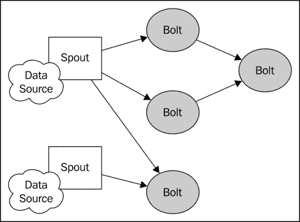
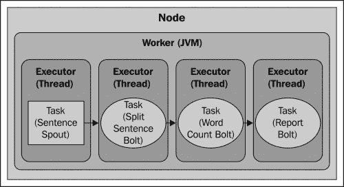
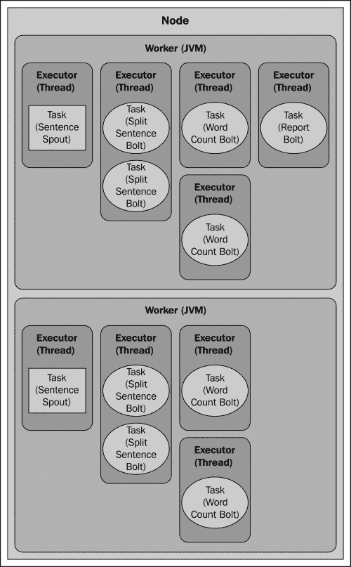
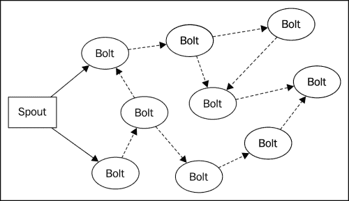

# [ Chapter 1 .加密 Word 伯爵

在本章中，我们将向您介绍使用 Storm 创建分布式流处理应用所涉及的核心概念。 我们通过构建一个简单的应用来实现这一点，该应用根据连续的句子流计算运行字数。 字数统计示例涉及更复杂的计算所需的许多结构、技术和模式，但它很简单，很容易理解。

我们将从 Storm 的数据结构概述开始，然后继续实现组成一个成熟的 Storm 应用的组件。 在本章结束时，您将对 Storm 计算的结构、开发环境的设置以及 Storm 应用的开发和调试技术有一个基本的了解。

本章涵盖以下主题：

*   Storm 的基本结构-拓扑、溪流、喷口和螺栓
*   设置 Storm 开发环境
*   实现基本的字数统计应用
*   并行化与容错
*   通过并行化计算任务进行伸缩

# 介绍 Storm 拓扑的元素-溪流、喷口和螺栓

在 Storm 中，分布式计算的结构被称为**拓扑**，由数据流、输出(流生成器)和螺栓(操作)组成。 Storm 拓扑大致类似于批处理系统(如Hadoop)中的作业。 但是，尽管批处理作业明确定义了开始点和结束点，但 Storm 拓扑将永远运行，直到显式终止或取消部署。



Storm拓扑

## ♪嘿，♪

Storm 中的核心数据结构是*元组*。 元组只是命名值(键-值对)的列表，而流是一个无界的元组序列。 如果您熟悉**复杂事件处理**(**CEP**)，则可以将 Storm Tuples视为*事件*。

## 喷嘴

SPOUTS表示进入 Storm 拓扑的数据的主要入口点。 SPOUT 充当适配器，连接到数据源，将数据转换为元组，并将元组作为流发出。

正如您将看到的，Storm 为实现 Spout 提供了一个简单的 API。 开发 Spout 在很大程度上是编写从原始源或 API 消费数据所需的代码。 潜在的数据源包括：

*   从基于 Web 的应用或移动应用单击数据流
*   Twitter 或其他社交网络订阅源
*   传感器输出
*   应用日志事件

由于 SPOUT 通常不实现任何特定的业务逻辑，因此它们通常可以跨多个拓扑重用。

## 螺栓

螺栓可以被认为是计算的*运算符*或*函数*的。 它们接受任意数量的流作为输入，处理数据，并可选地发出一个或多个流。 螺栓可以订阅由喷嘴或其他螺栓发出的流，这使得创建流变换的复杂网络成为可能。

螺栓可以执行任何可以想象到的处理，就像 Spout API 一样，螺栓界面简单明了。 螺栓执行的典型功能包括：

*   过滤元组
*   联接和聚合
*   计算
*   数据库读/写

# 介绍字数统计拓扑数据流

我们的字数拓扑(如下图所示)将由连接到三个下游螺栓的单个喷嘴组成。


字数统计拓扑

## 句子喷嘴

`SentenceSpout`类将简单地发出一个具有键名`"sentence"`和字符串值(语句)的单值元组流，如以下代码所示：

```scala
{ "sentence":"my dog has fleas" }
```

为简单起见，我们的数据来源将是循环遍历的静态句子列表，为每个句子发出一个元组。 在真实的应用中，Spout 通常会连接到动态源，比如从 Twitter API 检索的 tweet。

### 介绍分句螺栓

拆分句子螺栓将订阅句子输出的元组流。 对于接收到的每个元组，它将查找`"sentence"`对象的值，将值分割为单词，并为每个单词发出一个元组：

```scala
{ "word" : "my" }
{ "word" : "dog" }
{ "word" : "has" }
{ "word" : "fleas" }
```

### 介绍字数统计螺栓

单词计数螺栓订阅`SplitSentenceBolt`类的输出，保持它看到特定单词的次数的连续计数。 每当它接收到元组时，它就会递增与某个单词相关联的计数器，并发出一个包含该单词和当前计数的元组：

```scala
{ "word" : "dog", "count" : 5 }
```

### 介绍报表螺栓

报告螺栓订阅`WordCountBolt`类的输出，并维护一个表，其中包含所有单词及其对应的计数，就像`WordCountBolt`一样。 当它接收到元组时，它会更新表并将内容打印到控制台。

# 实现字数统计拓扑

既然我们已经介绍了基本 Storm 概念，我们就可以开始开发一个简单的应用了。 目前，我们将在本地模式下开发和运行 Storm 拓扑。 Storm 的本地模式在单个 JVM 实例中模拟 Storm 集群，这使得在本地开发环境或 IDE 中开发和调试 Storm 拓扑变得很容易。 在后面的章节中，我们将向您展示如何采用在本地模式下开发的 Storm 拓扑，并将它们部署到一个完全集群的环境中。

## 设置开发环境

创建一个新的Storm 项目只需将 Storm 库及其依赖项添加到 Java 类路径即可。 但是，正如您将在[第 2 章](02.html "Chapter 2. Configuring Storm Clusters")，*配置 Storm Clusters*中了解到的，将 Storm 拓扑部署到集群环境需要对编译的类和依赖项进行特殊打包。 因此，强烈建议您使用构建管理工具，如 Apache Maven、Gradle 或 Leinengen。 对于分布式字数统计示例，我们将使用 Maven。

让我们从创建一个新的 Maven 项目开始：

```scala
$ mvn archetype:create -DgroupId=storm.blueprints 
-DartifactId=Chapter1 -DpackageName=storm.blueprints.chapter1.v1

```

接下来，编辑`pom.xml`文件并添加 Storm 依赖项：

```scala
<dependency>
    <groupId>org.apache.storm</groupId>
    <artifactId>storm-core</artifactId>
    <version>0.9.1-incubating</version>
</dependency>
```

然后，通过使用以下命令构建项目来测试 Maven 配置：

```scala
$ mvn install

```

### 备注

**下载示例代码**

您可以从您的帐户[http://www.packtpub.com](http://www.packtpub.com)下载购买的所有 Packt 图书的示例代码文件。 如果您在其他地方购买了本书，您可以访问[http://www.packtpub.com/Support](http://www.packtpub.com/ support)并注册，以便将文件通过电子邮件直接发送给您。

Maven 将下载 Storm 库及其所有依赖项。 项目设置完成后，我们现在就可以开始编写 Storm 应用了。

## 实施句子喷嘴

为了使事情简单，我们的`SentenceSpout`实现将通过创建一个被迭代的静态语句列表来模拟一个数据源。 每个句子都作为单个字段元组发出。 完整的喷嘴实现在*示例 1.1*中列出。

**示例 1.1：SentenceSpout.java**

```scala
public class SentenceSpout extends BaseRichSpout {

    private SpoutOutputCollector collector;
    private String[] sentences = {
        "my dog has fleas",
        "i like cold beverages",
        "the dog ate my homework",
        "don't have a cow man",
        "i don't think i like fleas"
    };
    private int index = 0;

    public void declareOutputFields(OutputFieldsDeclarer declarer) {
        declarer.declare(new Fields("sentence"));
    }

    public void open(Map config, TopologyContext context, 
            SpoutOutputCollector collector) {
        this.collector = collector;
    }

    public void nextTuple() {
        this.collector.emit(new Values(sentences[index]));
        index++;
        if (index >= sentences.length) {
            index = 0;
        }
        Utils.waitForMillis(1);
    }
}
```

`BaseRichSpout`类是`ISpout`和`IComponent`接口的一个方便的实现，并为本例中不需要的方法提供了默认实现。 使用这个类可以让我们只关注我们需要的方法。

`declareOutputFields()`方法在所有 Storm 组件(喷嘴和螺栓)都必须实现的`IComponent`接口中定义，用于告诉 Storm 组件将发出哪些流以及每个流的元组将包含的字段。 在本例中，我们声明我们的 spout 将发出包含单个字段(`"sentence"`)的单个(默认)元组流。

`open()`方法在`ISpout`接口中定义，每当喷嘴组件初始化时都会调用该方法。 `open()`方法接受三个参数：包含 Storm 配置的映射、提供有关拓扑中放置的组件的信息的`TopologyContext`对象和提供发射元组的方法的`SpoutOutputCollector`对象。 在本例中，我们不需要在初始化方面执行太多操作，因此`open()`实现只将对`SpoutOutputCollector`对象的引用存储在一个实例变量中。

`nextTuple()`方法表示任何 spout实现的核心。 Storm 调用此方法来请求输出向输出收集器发出元组。 在这里，我们只发出当前索引的语句，并递增索引。

## 实现分句螺栓

`SplitSentenceBolt`实现在*示例 1.2*中列出。

**示例 1.2-SplitSentenceBolt.java**

```scala
public class SplitSentenceBolt extends BaseRichBolt{
    private OutputCollector collector;

    public void prepare(Map config, TopologyContext context,
 OutputCollector collector) {
        this.collector = collector;
    }

    public void execute(Tuple tuple) {
        String sentence = tuple.getStringByField("sentence");
        String[] words = sentence.split(" ");
        for(String word : words){
            this.collector.emit(new Values(word));
        }
    }

    public void declareOutputFields(OutputFieldsDeclarer declarer) {
        declarer.declare(new Fields("word"));
    }
}
```

`BaseRichBolt`类是另一个实现`IComponent`和`IBolt`接口的便利类。 扩展这个类使我们不必实现我们不关心的方法，并让我们专注于所需的功能。

由`IBolt`接口定义的`prepare()`方法类似于`ISpout`的`open()`方法。 这是您在螺栓初始化期间准备资源(如数据库连接)的地方。 与`SentenceSpout`类一样，`SplitSentenceBolt`类在初始化方面不需要太多，因此`prepare()`方法只保存对`OutputCollector`对象的引用。

在`declareOutputFields()`方法中，`SplitSentenceBolt`类声明单个元组流，每个元组包含一个字段(`"word"`)。

`SplitSentenceBolt`类的核心功能包含在`IBolt`定义的`execute()`方法中。 每次螺栓从它订阅的流接收元组时都会调用此方法。 在本例中，它将传入元组的`"sentence"`字段的值作为字符串查找，将该值拆分成单个单词，并为每个单词发出一个新的元组。

## 实现字数统计螺栓

`WordCountBolt`类(示例 1.3)是实际维护字数的拓扑组件。 在螺栓的`prepare()`方法中，我们实例化了一个`HashMap<String, Long>`实例，该实例将存储所有单词及其对应的计数。 在`prepare()`方法中实例化大多数实例变量是常见的做法。 此模式背后的原因在于，当部署拓扑时，其组件插口和螺栓被序列化并通过网络发送。 如果插口或螺栓在序列化之前实例化了任何不可序列化的实例变量(例如，在构造函数中创建)，则将抛出`NotSerializableException`，拓扑将无法部署。 在本例中，因为`HashMap<String, Long>`是可序列化的，所以我们可以在构造函数中安全地实例化它。 不过，一般来说，最好将构造函数参数限制为基元和可序列化对象，并在`prepare()`方法中实例化不可序列化对象。

在`declareOutputFields()`方法中，`WordCountBolt`类声明了一个元组流，它将包含接收到的单词和相应的计数。 在`execute()`方法中，我们查找接收到的单词的计数(如有必要，将其初始化为`0`)，递增并存储计数，然后发出一个由单词和当前计数组成的新元组。 将计数作为流发出允许拓扑中的其他螺栓订阅该流并执行附加处理。

**示例 1.3-WordCountBolt.java**

```scala
public class WordCountBolt extends BaseRichBolt{
    private OutputCollector collector;
    private HashMap<String, Long> counts = null;

    public void prepare(Map config, TopologyContext context, 
            OutputCollector collector) {
        this.collector = collector;
        this.counts = new HashMap<String, Long>();
    }

    public void execute(Tuple tuple) {
        String word = tuple.getStringByField("word");
        Long count = this.counts.get(word);
        if(count == null){
            count = 0L;
        }
        count++;
        this.counts.put(word, count);
        this.collector.emit(new Values(word, count));
    }

    public void declareOutputFields(OutputFieldsDeclarer declarer) {
        declarer.declare(new Fields("word", "count"));
    }
}
```

## 实现报表螺栓

`ReportBolt`类的目的是为每个字生成计数报告。 与`WordCountBolt`类一样，它使用一个`HashMap<String, Long>`对象来记录计数，但在本例中，它只存储从计数器螺栓接收到的计数。

报告螺栓与我们到目前为止编写的其他螺栓之间的一个不同之处在于，它是终端螺栓-它只接收元组。 因为它不发出任何流，所以`declareOutputFields()`方法保留为空。

报表螺栓还引入了`IBolt`接口中定义的`cleanup()`方法。 当螺栓即将关闭时，Storm 调用此方法。 在这里，我们利用`cleanup()`方法作为在拓扑关闭时输出最终计数的便捷方法，但通常，`cleanup()`方法用于释放螺栓使用的资源，如打开的文件或数据库连接。

在编写螺栓时，关于`IBolt.cleanup()`方法需要记住的一件重要事情是，不能保证当拓扑在集群上运行时 Storm 会调用它。 我们将在下一章讨论 Storm 的容错机制时讨论这背后的原因。 但在本例中，我们将在开发模式下运行 Storm，在该模式下，保证调用`cleanup()`方法。

示例 1.4 中列出了`ReportBolt`类的完整源代码。

**示例 1.4-ReportBolt.java**

```scala
public class ReportBolt extends BaseRichBolt {

    private HashMap<String, Long> counts = null;

    public void prepare(Map config, TopologyContext context, OutputCollector collector) {
        this.counts = new HashMap<String, Long>();
    }

    public void execute(Tuple tuple) {
        String word = tuple.getStringByField("word");
        Long count = tuple.getLongByField("count");
        this.counts.put(word, count);
    }

    public void declareOutputFields(OutputFieldsDeclarer declarer) {
        // this bolt does not emit anything
    }

    public void cleanup() {
        System.out.println("--- FINAL COUNTS ---");
        List<String> keys = new ArrayList<String>();
        keys.addAll(this.counts.keySet());
        Collections.sort(keys);
        for (String key : keys) {
            System.out.println(key + " : " + this.counts.get(key));
        }
        System.out.println("--------------");
    }
}
```

## 实现字数统计拓扑

既然我们已经定义了将组成我们的计算的管口和螺栓，我们就可以将它们连接到一个可运行的拓扑中(参见*示例 1.5*)。

**示例 1.5-WordCountTopology.java**

```scala
public class WordCountTopology {

    private static final String SENTENCE_SPOUT_ID = "sentence-spout";
    private static final String SPLIT_BOLT_ID = "split-bolt";
    private static final String COUNT_BOLT_ID = "count-bolt";
    private static final String REPORT_BOLT_ID = "report-bolt";
    private static final String TOPOLOGY_NAME = "word-count-topology";

    public static void main(String[] args) throws Exception {

        SentenceSpout spout = new SentenceSpout();
        SplitSentenceBolt splitBolt = new SplitSentenceBolt();
        WordCountBolt countBolt = new WordCountBolt();
        ReportBolt reportBolt = new ReportBolt();

        TopologyBuilder builder = new TopologyBuilder();

        builder.setSpout(SENTENCE_SPOUT_ID, spout);
        // SentenceSpout --> SplitSentenceBolt
        builder.setBolt(SPLIT_BOLT_ID, splitBolt)
                .shuffleGrouping(SENTENCE_SPOUT_ID);
        // SplitSentenceBolt --> WordCountBolt
        builder.setBolt(COUNT_BOLT_ID, countBolt)
                .fieldsGrouping(SPLIT_BOLT_ID, new Fields("word"));
        // WordCountBolt --> ReportBolt
        builder.setBolt(REPORT_BOLT_ID, reportBolt)
                .globalGrouping(COUNT_BOLT_ID);

        Config config = new Config();

        LocalCluster cluster = new LocalCluster();

        cluster.submitTopology(TOPOLOGY_NAME, config, builder.createTopology());
        waitForSeconds(10);
        cluster.killTopology(TOPOLOGY_NAME);
        cluster.shutdown();
    }
}
```

Storm拓扑通常以 Java`main()`方法定义和运行(如果拓扑部署到集群，则提交)。 在本例中，我们从定义字符串常量开始，这些常量将用作 Storm 组件的唯一标识符。 我们通过实例化喷嘴和螺栓并创建`TopologyBuilder`的实例开始`main()`方法。 `TopologyBuilder`类提供了一个流畅风格的 API，用于定义拓扑中组件之间的数据流。 我们首先注册语句 spout，并为其分配一个唯一的 ID：

```scala
builder.setSpout(SENTENCE_SPOUT_ID, spout);
```

下一步是注册`SplitSentenceBolt`并建立对`SentenceSpout`类发出的流的订阅：

```scala
builder.setBolt(SPLIT_BOLT_ID, splitBolt)
                .shuffleGrouping(SENTENCE_SPOUT_ID);
```

`setBolt()`方法向`TopologyBuilder`类注册螺栓，并返回`BoltDeclarer`的实例，该实例公开了定义螺栓输入源的方法。 在这里，我们将为`SentenceSpout`对象定义的唯一 ID 传递给建立关系的`shuffleGrouping()`方法。 `shuffleGrouping()`方法告诉 Storm 对`SentenceSpout`类发出的元组进行置乱，并在`SplitSentenceBolt`对象的实例之间均匀分配它们。 我们将在讨论 Storm 中的并行性时详细解释流分组。

下一行在`SplitSentenceBolt`类和`WordCountBolt`类之间建立连接：

```scala
builder.setBolt(COUNT_BOLT_ID, countBolt)
                .fieldsGrouping(SPLIT_BOLT_ID, new Fields("word"));
```

正如您将了解到的，有时必须将包含特定数据的元组路由到某个螺栓的特定实例。 这里，我们使用`BoltDeclarer`类的`fieldsGrouping()`方法来确保包含相同`"word"`值的所有元组都被路由到相同的`WordCountBolt`实例。

定义数据流的最后一步是将`WordCountBolt`实例发出的元组流路由到`ReportBolt`类。 在本例中，我们希望将`WordCountBolt`发出的所有元组发送到单个`ReportBolt`任务。 此行为由`globalGrouping()`方法提供，如下所示：

```scala
builder.setBolt(REPORT_BOLT_ID, reportBolt)
                .globalGrouping(COUNT_BOLT_ID);
```

定义了数据流之后，运行字数计算的最后一步是构建拓扑并将其提交给集群：

```scala
Config config = new Config();

LocalCluster cluster = new LocalCluster();

        cluster.submitTopology(TOPOLOGY_NAME, config, builder.createTopology());
        waitForSeconds(10);
        cluster.killTopology(TOPOLOGY_NAME);
        cluster.shutdown();
```

在这里，我们使用 Storm 的`LocalCluster`类在本地模式下运行 Storm，以在本地开发环境中模拟一个成熟的 Storm 集群。 本地模式是开发和测试 Storm 应用的便捷方式，无需部署到分布式群集的开销。 本地模式还允许您在 IDE 中运行 Storm 拓扑，设置断点、暂停执行、检查变量和分析应用，这些在部署到 Storm 群集时会耗时很多，甚至几乎是不可能的。

在本例中，我们创建了一个`LocalCluster`实例，并使用拓扑名、`backtype.storm.Config`的一个实例以及`TopologyBuilder`类的`createTopology()`方法返回的`Topology`对象调用`submitTopology()`方法。 正如您将在下一章中看到的，用于在本地模式下部署拓扑的`submitTopology()`方法与在远程(分布式)模式下部署拓扑的方法具有相同的签名。

Storm 的`Config`类是的简单扩展，它定义了许多 Storm 特定的常量和方便的方法，用于配置拓扑的运行时行为。 提交拓扑时，Storm 会将其预定义的默认配置值与传递给`submitTopology()`方法的`Config`实例的内容合并，结果将分别传递给拓扑喷嘴和螺栓的`open()`和`prepare()`方法。 从这个意义上说，`Config`对象表示一组配置参数，这些参数对拓扑中的所有组件都是全局的。

我们现在可以运行`WordCountTopology`类了。 `main()`方法将提交拓扑，在运行时等待 10 秒钟，终止(取消部署)拓扑，最后关闭本地集群。 程序运行完成后，您应该会看到类似以下内容的控制台输出：

```scala
--- FINAL COUNTS ---
a : 1426
ate : 1426
beverages : 1426
cold : 1426
cow : 1426
dog : 2852
don't : 2851
fleas : 2851
has : 1426
have : 1426
homework : 1426
i : 4276
like : 2851
man : 1426
my : 2852
the : 1426
think : 1425
-------------- 
```

# 在 Storm 中引入并行性

回想一下简介，Storm 通过将计算划分为多个独立的*任务*，这些任务在集群中并行执行，从而允许计算在多台机器上水平扩展。 在 Storm 中，任务只是运行在集群上某处的喷嘴或螺栓的实例。

要了解并行性的工作原理，我们必须首先解释在 Storm 群集中执行拓扑所涉及的四个主要组件：

*   **节点(机器)**：这些是简单的机器，它们被配置为参与 Storm 集群并执行拓扑的一部分。 Storm群集包含一个或多个执行工作的节点。
*   **工作进程(JVM)**：这些是在节点上运行的独立 JVM 进程。 每个节点配置为运行一个或多个工作器。 拓扑可能会请求为其分配一个或多个工作进程。
*   **执行器(线程)**：这些是在工作 JVM 进程中运行的个 Java 线程。 可以将多个任务分配给单个执行器。 除非显式覆盖，否则 Storm 将为每个执行者分配一个任务。
*   **任务(螺栓/喷嘴实例)**：任务是喷嘴和螺栓的实例，它们的`nextTuple()`和`execute()`方法由执行器线程调用。

## WordCountTopology 并行性

到目前为止，在我们的 wordcount 示例中，我们还没有显式使用 Storm 的任何并行 API；相反，我们允许 Storm 使用其默认设置。 在大多数情况下，除非被覆盖，否则 Storm 会将大多数并行度设置默认为一倍。

在更改拓扑的并行度设置之前，让我们先考虑一下在默认设置下拓扑将如何执行。 假设我们有一台计算机(节点)，为拓扑分配了一个工作进程，并允许 Storm 在每个执行器上执行一项任务，我们的拓扑执行将如下所示：



拓扑执行

如您所见，我们拥有的唯一的并行性是在线程级别。 每个任务在单个 JVM 内的单独线程上运行。 我们如何提高并行度，以便更有效地利用我们可支配的硬件？ 让我们从增加分配给运行拓扑的工作器和执行器的数量开始。

### 将工作进程添加到拓扑

分配额外的个工作器是向拓扑添加计算能力的一种简单方法，Storm 通过其 API 和纯配置提供了实现这一目的的方法。 无论我们选择哪种方法，我们的组件喷嘴和螺栓都不需要更改，并且可以按原样重复使用。

在字数统计拓扑的前一个版本中，我们引入了`Config`对象，该对象在部署时传递给`submitTopology()`方法，但在很大程度上没有使用它。 要增加分配给拓扑的工作进程数，我们只需调用`Config`对象的`setNumWorkers()`方法：

```scala
    Config config = new Config();
    config.setNumWorkers(2);
```

这会将两个工作进程分配给我们的拓扑，而不是默认的一个。 虽然这会将计算资源添加到我们的拓扑中，但为了有效地利用这些资源，我们还需要调整拓扑中的执行器数量以及每个执行器的任务数量。

### 配置执行器和任务

正如我们已经看到的，Storm默认情况下为拓扑中定义的每个组件创建一个任务，并为每个任务分配一个执行器。 Storm 的并行度 API 允许您设置每个任务的执行器数量以及每个执行器的任务数量，从而提供对此行为的控制。

通过在定义流分组时设置并行度提示来配置分配给给定组件的执行器数量。 为了说明此功能，让我们修改拓扑定义以并行化`SentenceSpout`，以便为其分配两个任务，并为每个任务分配其自己的执行器线程：

```scala
builder.setSpout(SENTENCE_SPOUT_ID, spout, 2);
```

如果我们使用一个工作进程，则拓扑的执行现在如下所示：


两个喷嘴任务

接下来，我们将设置拆分语句螺栓以使用两个执行器执行四个任务。 每个执行器线程将被分配两个要执行的任务(4/2=2)。 我们还将把单词计数螺栓配置为作为四个任务运行，每个任务都有自己的执行器线程：

```scala
builder.setBolt(SPLIT_BOLT_ID, splitBolt, 2)
              .setNumTasks(4)
                .shuffleGrouping(SENTENCE_SPOUT_ID);

builder.setBolt(COUNT_BOLT_ID, countBolt, 4)
                .fieldsGrouping(SPLIT_BOLT_ID, new Fields("word"));
```

有了两个工作进程，拓扑的执行现在将如下图所示：



具有多个工作进程的并行度

随着拓扑并行度的增加，运行更新的`WordCountTopology`类应该会为每个单词产生更高的总计数：

```scala
--- FINAL COUNTS ---
a : 2726
ate : 2722
beverages : 2723
cold : 2723
cow : 2726
dog : 5445
don't : 5444
fleas : 5451
has : 2723
have : 2722
homework : 2722
i : 8175
like : 5449
man : 2722
my : 5445
the : 2727
think : 2722
--------------
```

由于 SPOUT 会无限期地发出数据，并且只有在拓扑终止时才会停止，因此实际计数会根据您的计算机速度以及计算机上正在运行的其他进程而有所不同，但您应该会看到发出和处理的字数总体上有所增加。

需要指出的是，在本地模式下运行拓扑时，增加工作进程数没有任何影响。 在本地模式下运行的拓扑始终在单个 JVM 进程中运行，因此只有任务和执行器并行度设置才有效。 Storm 的本地模式非常接近集群行为，对开发非常有用，但在转移到生产环境之前，您应该始终在真正的集群环境中测试您的应用。

# 了解流分组

基于前面的示例，您可能想知道为什么我们没有费心增加的并行度`ReportBolt`。 答案是，这样做没有任何意义。 要了解原因，您需要了解 Storm 中的流分组概念。

流分组定义了流的元组如何在拓扑中的螺栓任务之间分布。 例如，在字数统计拓扑的并行版本中，在拓扑中为`SplitSentenceBolt`类分配了四个任务。 流分组确定这些任务中的哪一个将接收给定的元组。

Storm 定义了七个内置的流分组：

*   **Shuffle Grouping**：这个在目标螺栓的任务中随机分布个元组，以便每个螺栓接收相等数量的元组。
*   **字段分组**：此根据分组中指定的字段值将元组路由到螺栓任务。 例如，如果流在`"word"`字段上分组，则`"word"`字段具有相同值的元组将始终被路由到相同的螺栓任务。
*   **all grouping**：此跨所有螺栓任务复制元组流，以便每个任务都将收到元组的副本。
*   **全局分组**：此将流中的所有元组路由到单个任务，选择具有最低任务 ID 值的任务。 请注意，在使用全局分组时在螺栓上设置并行度提示或任务数量是没有意义的，因为所有元组都将被路由到同一螺栓任务。 全局分组应该谨慎使用，因为它会将所有元组路由到单个 JVM 实例，这可能会造成瓶颈或使集群中的特定 JVM/计算机不堪重负。
*   **NONE GROUPING**：NONE GROUPING在功能上等同于随机分组。 它已被保留以备将来使用。
*   **直接分组**：使用直接分组，源流通过调用`emitDirect()`方法决定哪个组件将接收给定的元组。 它只能用于已声明为直接流的流。
*   **本地或混洗分组**：本地或混洗分组类似于混洗分组，但将在同一工作进程中运行的螺栓任务之间混洗元组(如果有的话)。 否则，它将退回到随机分组行为。 根据拓扑的并行度，本地或随机分组可以通过限制网络传输来提高拓扑性能。

除了预定义的分组外，您还可以通过实现`CustomStreamGrouping`接口定义自己的流分组：

```scala
public interface CustomStreamGrouping extends Serializable {

void prepare(WorkerTopologyContext context, 
GlobalStreamId stream, List<Integer> targetTasks);

List<Integer> chooseTasks(int taskId, List<Object> values); 
}
```

在运行时调用`prepare()`方法，使用分组实现可以用来决定如何对接收任务的元组进行分组的信息来启动分组。 `WorkerTopologyContext`对象提供有关拓扑的上下文信息，`GlobalStreamId`对象提供有关分组的流的元数据。 最有用的参数是`targetTasks`，它是分组需要考虑的所有任务标识符的列表。 您通常希望将`targetTasks`参数存储为实例变量，以便在实现`chooseTasks()`方法时引用。

`chooseTasks()`方法返回元组应该发送到的任务标识符列表。 它的参数是发出元组的组件的任务标识符和元组的值。

为了说明流分组的重要性，让我们在拓扑中引入一个 bug。 首先修改`SentenceSpout`的`nextTuple()`方法，使其每句话只发出一次：

```scala
public void nextTuple() {
        if(index < sentences.length){
            this.collector.emit(new Values(sentences[index]));
            index++;
        }
        Utils.waitForMillis(1);
    }
```

现在运行拓扑以获得以下输出：

```scala
--- FINAL COUNTS ---
a : 2
ate : 2
beverages : 2
cold : 2
cow : 2
dog : 4
don't : 4
fleas : 4
has : 2
have : 2
homework : 2
i : 6
like : 4
man : 2
my : 4
the : 2
think : 2
--------------
```

现在，将`CountBolt`参数上的字段分组更改为随机分组，然后重新运行拓扑：

```scala
builder.setBolt(COUNT_BOLT_ID, countBolt, 4)
                .shuffleGrouping(SPLIT_BOLT_ID);
```

输出应如下所示：

```scala
--- FINAL COUNTS ---
a : 1
ate : 2
beverages : 1
cold : 1
cow : 1
dog : 2
don't : 2
fleas : 1
has : 1
have : 1
homework : 1
i : 3
like : 1
man : 1
my : 1
the : 1
think : 1
--------------
```

我们的计数是关闭的，因为`CountBolt`参数是有状态的：它为它看到的每个单词维护一个计数。 在这种情况下，我们计算的准确性取决于当组件被并行化时基于元组内容进行分组的能力。 我们引入的错误仅在`CountBolt`参数的并行度大于 1 时才会显现。 这突出了测试具有各种并行性配置的拓扑的重要性。

### 提示

通常，您应该避免将状态信息存储在螺栓中，因为每当工人出现故障和/或重新分配其任务时，这些信息都会丢失。 一种解决方案是定期将状态信息的快照保存到持久存储(如数据库)中，以便在重新分配任务时可以恢复该快照。

# 保证处理

Storm 提供了一个 API，它允许保证 Spout 发出的元组得到完全处理。 到目前为止，在我们的示例中，我们还没有担心失败。 我们已经看到，喷流可以拆分，并且可以在拓扑中生成任意数量的流，这取决于下游螺栓的行为。 如果出现故障，会发生什么情况？ 举个例子，考虑一个基于数据库将信息持久化到元组数据的螺栓。 我们如何处理数据库更新失败的情况？

## 喷嘴的可靠性

在 Storm 中，Assured消息处理从喷嘴开始。 支持有保证处理的输出需要一种方法来跟踪它已经发出的元组，并准备好在元组或任何子元组的下游处理失败时重新发出该元组。 可以将子元组视为作为源自喷嘴的元组的结果而发出的任何元组。 看待它的另一种方式是将喷嘴的流视为元组树的主干(如下图所示)：



元组树

在上图中，实线表示喷嘴发出的原始主干元组，虚线表示从原始元组派生的元组。 结果图表示元组**树**。 有了有保证的处理，树中的每个螺栓都可以确认(`ack`)或使元组失败。 如果树中的所有螺栓都确认从主干元组派生的元组，则将调用 Spout 的`ack`方法以指示消息处理完成。 如果树中的任何螺栓显式地使元组失败，或者如果元组树的处理超过超时周期，则将调用 Spout 的`fail`方法。

Storm 的`ISpout`接口定义了可靠性 API 中涉及的三个方法：`nextTuple`、`ack`和`fail`。

```scala
public interface ISpout extends Serializable {
    void open(Map conf, TopologyContext context, SpoutOutputCollector collector);
    void close();
    void nextTuple();
    void ack(Object msgId);
    void fail(Object msgId);
}
```

正如我们以前看到的，当 Storm 请求 Spout 发出一个元组时，它会调用`nextTuple()`方法。 实现保证处理的第一步是为出站元组分配一个唯一的 ID，并将该值传递给`SpoutOutputCollector`的`emit()`方法：

```scala
collector.emit(new Values("value1", "value2") , msgId);
```

为元组分配一个消息 ID 告诉 Storm，当元组树完成或在任何时候失败时，Spout 希望接收通知。 如果处理成功，将使用分配给元组的消息 ID 调用 spout 的`ack()`方法。 如果处理失败或超时，将调用 spout 的`fail`方法。

## 螺栓的可靠性

实现参与保证处理的螺栓涉及两个步骤：

1.  在发出派生元组时锚定到传入元组。
2.  分别确认或失败已成功或未成功处理的元组。

锚定到元组意味着我们在传入的元组和派生的元组之间创建链接，以便任何下游螺栓都可以通过确认元组、使元组失败或允许其超时来参与元组树。

通过调用`OutputCollector`的重载`emit`方法之一，可以锚定到元组(或元组列表)：

```scala
collector.emit(tuple, new Values(word));
```

在这里，我们锚定到传入的元组，并发出下游螺栓应该确认或失败的新元组。 另一种形式的`emit`方法将发出未锚定的元组：

```scala
collector.emit(new Values(word));));
```

未锚定的元组不参与流的可靠性。 如果未锚定的元组在下游失败，则不会导致重播原始根元组。

在成功处理元组并可选地发出新的或派生的元组之后，处理可靠流的螺栓应该确认入站元组：

```scala
this.collector.ack(tuple);
```

如果元组处理失败的方式导致喷嘴必须重放(重新发射)元组，则螺栓应该显式地使元组失败：

```scala
this.collector.fail(tuple)
```

如果 tuple处理因超时或通过显式的调用而失败，则会通知`OutputCollector.fail()`方法(发出原始元组的输出)，允许它重新发出元组，您很快就会看到这一点。

## 可靠的字数统计

为了进一步说明的可靠性，让我们从增强`SentenceSpout`类开始，使其支持有保证的交付。 它需要跟踪发出的所有元组，并为每个元组分配一个唯一的 ID。我们将使用一个`HashMap<UUID, Values>`对象来存储挂起的元组。 对于我们发出的每个元组，我们将分配一个唯一的标识符，并将其存储在挂起的元组映射中。 当我们收到确认消息时，我们将从挂起列表中删除该元组。 如果失败，我们将重放元组：

```scala
public class SentenceSpout extends BaseRichSpout {

    private ConcurrentHashMap<UUID, Values> pending;
    private SpoutOutputCollector collector;
    private String[] sentences = {
        "my dog has fleas",
        "i like cold beverages",
        "the dog ate my homework",
        "don't have a cow man",
        "i don't think i like fleas"
    };
    private int index = 0;

    public void declareOutputFields(OutputFieldsDeclarer declarer) {
        declarer.declare(new Fields("sentence"));
    }

    public void open(Map config, TopologyContext context, 
            SpoutOutputCollector collector) {
        this.collector = collector;
        this.pending = new ConcurrentHashMap<UUID, Values>();
    }

    public void nextTuple() {
        Values values = new Values(sentences[index]);
        UUID msgId = UUID.randomUUID();
        this.pending.put(msgId, values);
        this.collector.emit(values, msgId);
        index++;
        if (index >= sentences.length) {
            index = 0;
        }
        Utils.waitForMillis(1);
    }

    public void ack(Object msgId) {
        this.pending.remove(msgId);
    }

    public void fail(Object msgId) {
        this.collector.emit(this.pending.get(msgId), msgId);
    }    
}
```

将螺栓修改为提供有保证的处理只涉及将个出站元组锚定到传入元组，然后确认入站元组：

```scala
public class SplitSentenceBolt extends BaseRichBolt{
    private OutputCollector collector;

    public void prepare(Map config, TopologyContext context, OutputCollector collector) {
        this.collector = collector;
    }

    public void execute(Tuple tuple) {
        String sentence = tuple.getStringByField("sentence");
        String[] words = sentence.split(" ");
        for(String word : words){
            this.collector.emit(tuple, new Values(word));
        }
        this.collector.ack(tuple);
    }

    public void declareOutputFields(OutputFieldsDeclarer declarer) {
        declarer.declare(new Fields("word"));
    }
}
```

# 摘要

在本章中，我们使用 Storm 的核心 API 构建了一个简单的分布式计算应用，并涵盖了 Storm 的大部分功能集，所有这些都无需安装 Storm 或设置集群。 Storm 的本地模式在生产力和易开发性方面非常强大，但是要了解 Storm 的真正功能和水平可伸缩性，您需要将应用部署到真正的集群。

在下一章中，我们将介绍安装和设置集群 Storm 环境以及在分布式环境中部署拓扑的过程。