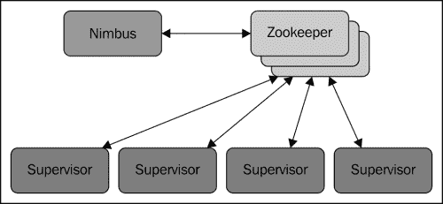
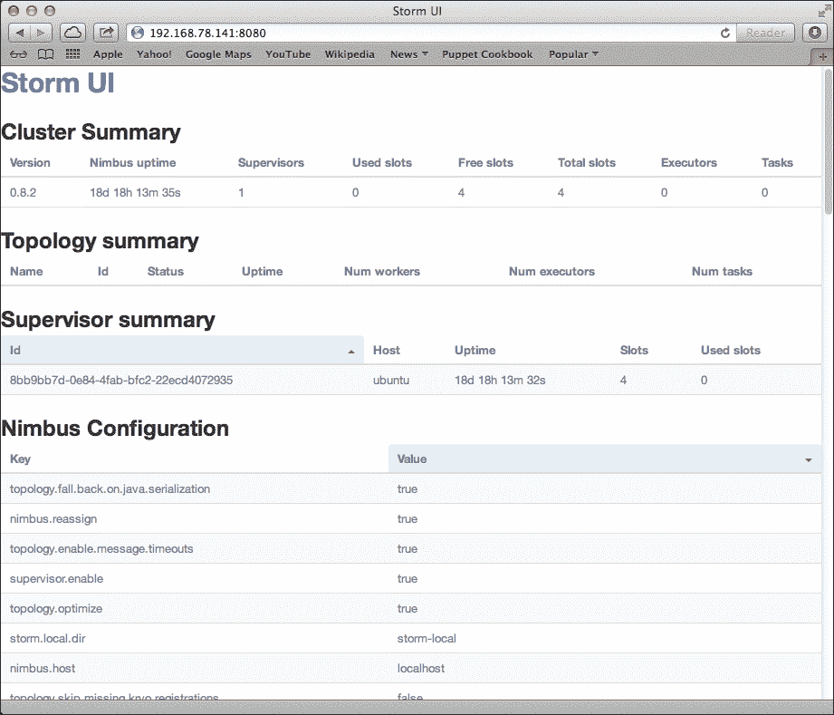
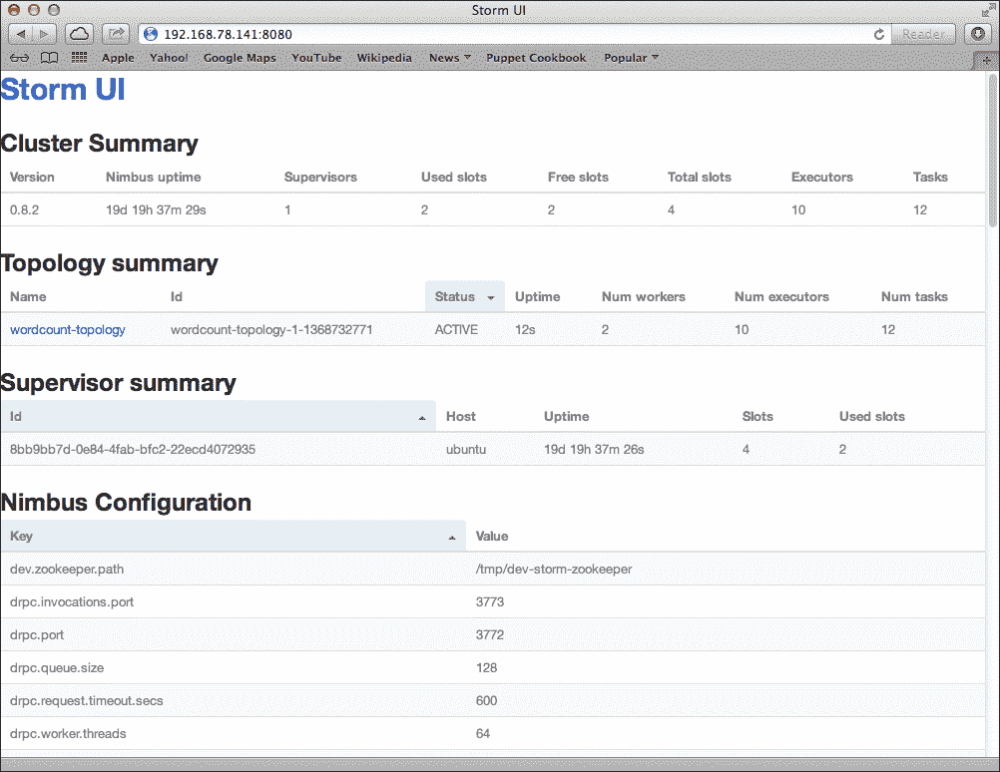
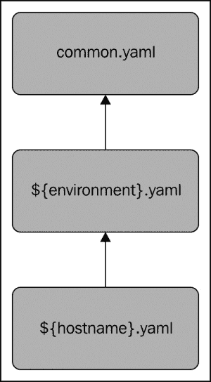

# ρ2.11-13 章配置风暴集群

在本章中，您将深入了解 Storm 技术堆栈、其软件依赖项，以及将其设置和部署到 Storm 集群的过程。

我们将首先在伪分布式模式下安装 Storm，其中所有组件都并置在同一台计算机上，而不是分布在多台计算机上。 一旦您了解了安装和配置 Storm 所涉及的基本步骤，我们将继续使用 Pupet Provisioning Tool 自动执行这些流程，这将极大地减少设置多节点群集所需的时间和精力。

具体而言，我们将涵盖以下内容：

*   组成群集的各种组件和服务
*   暴风技术堆栈
*   在 Linux 上安装和配置 Storm
*   Storm 的配置参数
*   Storm 的命令行界面
*   使用 Pupet Provisioning Tool 自动执行安装

# 介绍风暴群的解剖

Storm Clusters遵循主/从体系结构，类似于 Hadoop 等分布式计算技术，但语义略有不同。 在主/从体系结构中，通常有一个主节点，它要么通过配置静态分配，要么在运行时动态选举。 Storm 使用前一种方法。 虽然主/从体系结构可能会被批评为引入单点故障的设置，但我们将展示 Storm 对主节点故障的半容忍性。

Storm 集群由一个主节点(称为**Nimbus**)和一个或多个工作节点(称为**主管**)组成。 在中，除了 Nimbus 和 Supervisor 节点外，Storm 还需要 Apache ZooKeeper 的实例，该实例本身可能由一个或多个节点组成，如下图所示：



Nimbus 和 Supervisor 进程都是 Storm 提供的守护进程，不需要与单独的计算机隔离。 实际上，可以创建一个单节点伪集群，其中 nimbus、Supervisor 和 ZooKeeper 进程都在同一台机器上运行。

## 了解 Nimbus 守护进程

Nimbus 守护进程的主要职责是管理、协调和监视集群上运行的拓扑，包括拓扑部署、任务分配和发生故障时的任务重新分配。

将拓扑部署到 Storm 群集需要*将预打包的拓扑 JAR 文件*连同拓扑配置信息一起提交到 Nimbus 服务器。 一旦 Nimbus 收到拓扑存档，它又会将 JAR 文件分发到必要数量的管理节点。 当管理程序节点收到拓扑存档时，Nimbus 会将任务(分支和螺栓实例)分配给每个管理程序，并向它们发出信号以产生必要的工作程序来执行分配的任务。

Nimbus 跟踪所有主管节点的状态以及分配给每个节点的任务。 如果 Nimbus 检测到特定的主管节点无法心跳或变得不可用，它会将该主管的任务重新分配给群集中的其他主管节点。

如前所述，Nimbus 不是严格意义上的单点故障。 这种质量归功于 Nimbus 不参与拓扑数据处理，而只是管理拓扑的初始部署、任务分配和监控。 事实上，如果 Nimbus 守护进程在拓扑运行时死亡，只要分配有任务的主管和工作人员保持健康，拓扑就会继续处理数据。 主要的警告是，如果管理程序在 Nimbus 关闭时发生故障，数据处理将会失败，因为没有 Nimbus 守护进程可以将出现故障的管理程序的任务重新分配给另一个节点。

## 使用主管守护程序

管理程序守护进程等待来自 nimbus 的任务分配，并派生并监视工作进程(JVM 进程)以执行任务。 Supervisor 守护进程及其派生的工作进程都是独立的 JVM 进程。 如果由主管产生的工作进程因错误而意外退出(或者即使该进程正在使用 UNIX`kill -9`或 Windows`taskkill`命令强制终止)，主管守护程序将尝试重新生成工作进程。

此时，您可能想知道 Storm 的保证交付功能如何适应其容错模型。 如果某个工作节点甚至整个管理节点出现故障，Storm 如何保证在故障发生时正在处理的元组的交付？

答案在于 Storm 的元组锚定和确认机制。 启用可靠传递后，路由到故障节点上的任务的元组将不会得到确认，原始元组最终将在超时后由 spout 重播。 此过程将重复进行，直到拓扑恢复并恢复正常处理。

## 阿帕奇动物园饲养员简介

ZooKeeper使用一小部分原语和组服务提供了在分布式环境中维护集中信息的服务。 它有一个简单但功能强大的分布式同步机制，允许客户端应用程序监视或订阅单个数据或数据集，并在创建、更新或修改数据时接收通知。 使用常见的 ZooKeeper 模式或食谱，开发人员可以实现分布式应用程序所需的许多不同的构造，例如领导者选举、分布式锁和队列。

Storm 主要使用 ZooKeeper 来协调集群中 Nimbus 和 Supervisor 之间的状态信息，如任务分配、工作进程状态和拓扑度量。 Nimbus 和管理节点的通信在很大程度上是通过动物园管理员的状态修改和监视通知的组合来处理的。

Storm 对动物园管理员的使用在设计上是相对轻量级的，并且不会带来沉重的资源负担。 对于较重的数据传输操作，例如一次性(在部署时)传输拓扑 JAR 文件，Storm 依赖 Thrift 进行通信。 正如我们将看到的，拓扑中组件之间的数据传输操作--其中性能最重要--是以较低的级别处理的，并针对性能进行了优化。

## 使用 Storm 的 DRPC 服务器

Storm 应用程序之间的一种常见模式涉及在请求-响应范例中利用 Storm 的并行化和分布式计算功能，在请求-响应范例中，客户端进程或应用程序提交请求并同步等待响应。 虽然这样的范例似乎与典型 Storm 拓扑的高度异步、长时间特性相反，但 Storm 包含支持这种用例的事务性功能。


要启用此功能，Storm 使用额外服务(Storm DRPC)和专门的插口和螺栓相结合，共同提供高度可扩展的分布式 RPC 功能。

使用 Storm 的 DRPC 功能完全是可选的。 仅当 Storm 应用程序利用此功能时，才需要 DRPC 服务器节点。

## Storm UI 简介

Storm UI是一个可选但非常有用的服务，它提供了一个基于 Web 的 GUI 来监控 Storm 集群并在一定程度上管理正在运行的拓扑。 Storm UI 提供给定 Storm 群集及其部署的拓扑的统计信息，在监视和调整群集和拓扑性能时非常有用。



Storm UI仅报告从 Nimbus Thrift API 收集的信息，不向 Storm 群集提供任何其他功能。 Storm UI 服务可以随时启动和停止，而不会影响任何拓扑或集群功能，并且在这方面是完全无状态的。 它还可以配置为启动、停止、暂停和重新平衡拓扑，以便于管理。

# 介绍 Storm 技术堆栈

在我们开始安装 Storm 之前，让我们先来看看 Storm 和拓扑是用什么技术构建的。

## Java 和 Clojure

Storm 在 Java 虚拟机上运行，使用 Java和Clojure 大致相等的组合编写。 Storm 的主要接口是用 Java 定义的，核心逻辑主要是用 Clojure 实现的。 除了 JVM 语言，Storm 还使用 Python 实现 Storm 可执行文件。 除了这些语言，Storm 是一种高度多语言友好的技术，部分原因是它的许多界面使用 Apache Thrift。

Storm 拓扑的组件(喷嘴和螺栓)几乎可以用安装它的操作系统支持的任何编程语言编写。 JVM 语言实现可以在本地运行，其他实现也可以通过 JNI 和 Storm 的 Multiang 协议实现。

## Python

所有 Storm守护进程和管理命令都从一个用 Python 编写的可执行文件中运行。 这包括 nimbus 和 Supervisor 守护进程，以及我们将看到的部署和管理拓扑的所有命令。 因此，必须在参与 Storm 群集的所有计算机以及用于管理的任何工作站上安装正确配置的 Python 解释器。

# 在 Linux 上安装 Storm

Storm最初设计为在 Unix 风格的操作系统上运行，但从0.9.1 版开始，它也支持在 Windows 上部署。

出于我们的目的，我们将使用 Ubuntu 12.04LTS，因为它相对容易使用。 我们将使用服务器版本，该版本默认不包括图形用户界面，因为我们不需要或不使用它。 Ubuntu12.04LTS 服务器可以从[http://releases.ubuntu.com/precise/ubuntu-12.04.2-server-i386.iso](http://releases.ubuntu.com/precise/ubuntu-12.04.2-server-i386.iso)下载。

命令后面的说明在实际硬件和虚拟机上都同样有效。 出于学习和开发的目的，您可能会发现使用虚拟机要方便得多，特别是在您没有几台联网计算机的情况下。

虚拟化软件在 OSX、Linux 和 Windows 上随处可见。 我们建议您选择以下任一软件选项：

*   VMWare (OSX, Linux, and Windows)

    需要购买此软件。 它在[http://www.vmware.com](http://www.vmware.com)上提供。

*   VirtualBox (OSX, Linux, and Windows)

    此软件是免费提供的。 它在[https://www.virtualbox.org](https://www.virtualbox.org)上提供。

*   Parallels Desktop (OSX)

    需要购买此软件。 它在[http://www.parallels.com](http://www.parallels.com)上提供。

## 安装基础操作系统

您可以从Ubuntu 安装盘(或磁盘镜像)开始引导，然后按照屏幕上的说明进行基本安装。 当出现**Package Selection**屏幕时，选择安装 OpenSSH 服务器的选项。 此软件包将允许您使用`ssh`远程登录到服务器。 在所有其他情况下，您可以简单地接受默认选项，除非您选择针对您的硬件进行修改。

默认情况下，Ubuntu 下的主要用户将拥有管理(Sudo)权限。 如果您使用的是其他用户帐户或 Linux 发行版，请确保您的帐户具有管理权限。

## 安装 Java

首先，安装JVM。 众所周知，Storm 可以使用开源OpenJDK 和 Oracle 中的 Java1.6 和 1.7JVM。 在本例中，我们将更新 APT 存储库信息并安装 Java 1.6 的 OpenJDK 发行版：

```scala
sudo apt-get update
sudo apt-get --yes install openjdk-6-jdk

```

## 动物园管理员安装

对于单节点伪集群，我们将与所有其他 Storm组件一起安装 ZooKeeper。 Storm 当前需要版本 3.3.x，因此我们将使用以下命令安装该版本而不是最新版本：

```scala
sudo apt-get --yes install zookeeper=3.3.5* zookeeperd=3.3.5*

```

该命令将安装 ZooKeeper 二进制文件以及启动和停止 ZooKeeper 的服务脚本。 它还将创建一个 cron 作业，该作业将定期清除旧的 ZooKeeper 事务日志和快照文件，如果不定期清除，这些文件将迅速消耗大量磁盘空间，因为这是 ZooKeeper 的默认行为。

## 风暴安装

Storm 的二进制发行版可以从 Storm 网站([http://storm.incubator.apache.org](http://storm.incubator.apache.org))下载。 二进制归档的布局更多地面向开发活动，而不是运行生产系统，因此我们将做一些修改，以更紧密地遵循 UNIX 约定(例如记录到`/var/log`而不是 Storm 的主目录)。

我们首先创建 Storm 用户和组。 这将允许我们以特定用户而不是默认用户或根用户身份运行 Storm 守护程序：

```scala
sudo groupadd storm
sudo useradd --gid storm --home-dir /home/storm --create-home --shell /bin/bash storm

```

接下来，下载并解压缩 Storm 发行版。 我们将在`/usr/share`中安装 Storm，并将特定于版本的目录符号链接到`/usr/share/storm`。 此方法将允许我们轻松安装其他版本，并通过更改单个符号链接来激活(或恢复)新版本。 我们还将 Storm 可执行文件链接到`/usr/bin/storm`：

```scala
sudo wget [storm download URL]
sudo unzip -o apache-storm-0.9.1-incubating.zip -d /usr/share/
sudo ln -s /usr/share/apache-storm-0.9.1-incubating /usr/share/storm
sudo ln -s /usr/share/storm/bin/storm /usr/bin/storm

```

默认情况下，Storm 会将信息记录到`$STORM_HOME/logs`，而不是大多数 UNIX 服务使用的`/var/log`目录。 要更改这一点，请执行以下命令以在`/var/log/`下创建`storm`目录，并将 Storm 配置为将其日志数据写入该目录：

```scala
sudo mkdir /var/log/storm
sudo chown storm:storm /var/log/storm

sudo sed -i 's/${storm.home}\/logs/\/var\/log\/storm/g' /usr/share/storm/log4j/storm.log.properties

```

最后，我们将 Storm 的配置文件移动到`/etc/storm`并创建一个符号链接，以便 Storm 可以找到它：

```scala
sudo mkdir /etc/storm
sudo chown storm:storm /etc/storm
sudo mv /usr/share/storm/conf/storm.yaml /etc/storm/
sudo ln -s /etc/storm/storm.yaml /usr/share/storm/conf/storm.yaml

```

安装 Storm 后，我们现在可以配置 Storm 并设置 Storm 守护程序，使其自动启动。

## 运行 Storm 后台进程

所有 Storm 守护进程在设计上都是快速失败的，这意味着只要发生意外错误，该进程就会停止。 这使单个组件能够安全地发生故障并成功恢复，而不会影响系统的其余部分。

这意味着风暴守护程序在意外死亡时需要立即重新启动。 这种技术称为在*监督下*运行进程，幸运的是，有许多实用程序可用于执行此功能。 事实上，ZooKeeper 也是一个故障快速系统，ZooKeeper Debian 发行版(Ubuntu 是一个基于 Debian 的发行版)中包含的基于 upstart 的`init`脚本就提供了这一功能--如果 ZooKeeper 进程在任何时候异常退出，Upstart 将确保它重新启动，以便集群能够恢复。

虽然 Debian upstart 系统非常适合这种情况，但在其他 Linux 发行版上也有一些更简单的选择。 为简单起见，我们将使用在大多数发行版上随时可用的管理程序包。 不幸的是，主管名称与 Storm 的主管守护程序的名称冲突。 为了澄清这一区别，我们将在正文中将非 Storm 进程监控守护进程称为*Superorder*(请注意末尾添加的*d*)，尽管示例代码和命令将使用正确的名称，但不会添加*d*。

在基于 Debian 的 Linux 发行版中，`supervisord`包被命名为 Supervisor，而其他发行版(如 Red Hat)则使用 Superorder 这个名字。 要在 Ubuntu 上安装，请使用以下命令：

```scala
sudo apt-get --yes install supervisor

```

这将安装并启动 Superorder 服务。 主配置文件将位于`/etc/supervisor/supervisord.conf`。 Supervisord 的配置文件将自动包括`/etc/supervisord/conf.d/`目录中与模式`*.conf`匹配的任何文件，我们将在这里放置`config`文件，以在监督下运行 Storm 守护进程。

对于我们要在监督下运行的每个 Storm 守护程序命令，我们将创建一个包含以下内容的配置文件：

*   受监督的服务的唯一名称(在主管订单配置中)。
*   要运行的命令。
*   要在其中运行命令的工作目录。
*   命令/服务退出时是否应自动重新启动。 对于快速故障服务，这应该始终是正确的。
*   将拥有该进程的用户。 在本例中，我们将以 Storm 用户作为进程所有者运行所有 Storm 守护进程。

创建以下三个文件，将 Storm 守护程序设置为由 Superorder 服务自动启动(并在意外故障时重新启动)：

*   `/etc/supervisord/conf.d/storm-nimbus.conf`

    使用以下代码创建该文件：

    ```scala
    [program:storm-nimbus]
    command=storm nimbus
    directory=/home/storm
    autorestart=true
    user=storm
    ```

*   `/etc/supervisord/conf.d/storm-supervisor.conf`

    使用以下代码创建该文件：

    ```scala
    [program:storm-supervisor]
    command=storm supervisor
    directory=/home/storm
    autorestart=true
    user=storm
    ```

*   `/etc/supervisord/conf.d/storm-ui.conf`

    使用以下代码创建该文件：

    ```scala
    [program:storm-ui]
    command=storm ui
    directory=/home/storm
    autorestart=true
    user=storm
    ```

创建这些文件后，使用以下命令停止和启动 Superorder 服务：

```scala
sudo /etc/init.d/supervisor stop
sudo /etc/init.d/supervisor start

```

Superorder 服务将加载新配置并启动 Storm 守护程序。 等待 Storm 服务启动，然后通过在 Web 浏览器中访问以下 URL(将`localhost`替换为实际计算机的主机名或 IP 地址)，验证 Storm 伪群集是否已启动并正在运行：

`http://localhost:8080`

这将调出 Storm UI 图形界面。 它应该表明集群正在运行一个管理节点，其中有四个可用的工作插槽，并且没有拓扑在运行(我们稍后将向集群部署一个拓扑)。

如果由于某种原因，Storm UI 未出现或无法显示群集中的活动主管，请检查以下日志文件中的错误：

*   **Storm UI**：检查`/var/log/storm`下的`ui.log`文件以检查错误
*   **Nimbus**：检查`/var/log/storm`下的`nimbus.log`文件以检查错误
*   **Supervisor**：检查`/var/log/storm`下的`supervisor.log`文件以检查错误

到目前为止，我们依赖于默认的 Storm 配置，该配置默认使用`localhost`作为许多集群主机名参数，比如 ZooKeeper 主机以及 Nimbus 主机的位置。 这对于单节点伪集群来说很好，其中所有东西都在同一台机器上运行，但是设置真正的多节点集群需要覆盖默认值。 接下来，我们将探索 Storm 提供的各种配置选项，以及它们如何影响集群及其拓扑的行为。

## 配置风暴

Storm 的配置由一系列 YAML 属性组成。 当 Storm 守护进程启动时，它加载缺省值，然后加载`$STORM_HOME/conf/`下的`storm.yaml`(我们已经符号链接到`/etc/storm/storm.yaml`)文件，用缺省值替换在那里找到的任何值。

下面的清单提供了一个最小的`storm.yaml`文件，其中包含您必须覆盖的条目：

```scala
# List of hosts in the zookeeper cluster
storm.zookeeper.servers:
 - "localhost"

# hostname of the nimbus node
nimbus.host: "localhost"

# supervisor worker ports
supervisor.slots.ports:
 - 6700
 - 6701
 - 6702
 - 6703

# where nimbus and supervisors should store state data
storm.local.dir: "/home/storm"

# List of hosts that are Storm DRPC servers (optional)
# drpc.servers:
#    - "localhost"

```

## 强制设置

以下设置是配置工作的多主机 Storm 群集所必需的。

*   `storm.zookeeper.servers`：此设置是 ZooKeeper 集群中的主机名列表。 由于我们在与其他 Storm 守护进程相同的计算机上运行单节点 ZooKeeper，因此 localhost 的默认值是可以接受的。
*   `nimbus.host`：这是群集的 Nimbus 节点的主机名。 工人需要知道哪个节点是主节点，才能下载拓扑 JAR 文件和配置。
*   `supervisor.slots.ports`：此设置控制主管节点上运行的个工作进程的数量。 它被定义为工作人员将监听的端口号列表，列出的端口号数量将控制主管节点上有多少工作人员插槽可用。 例如，如果我们有一个具有三个管理节点的群集，并且每个节点都配置了三个端口，则群集将总共有九个(3*3=9)个工作插槽。 默认情况下，Storm 将使用端口 6700-6703，每个管理节点总共有四个插槽。
*   `storm.local.dir`：nimbus 和 Supervisor 守护进程都存储了少量的瞬态信息以及工作进程所需的 JAR 和配置文件。 此设置确定 Nimbus 和 Supervisor 进程将存储该信息的位置。 此处指定的目录必须具有适当的权限，以便进程所有者(在我们的示例中为 Storm 用户)可以读取和写入该目录。 只要群集在运行，该目录的内容就必须保持不变，因此最好避免在操作系统可能删除内容的情况下使用`/tmp`。

## 可选设置

除了对于操作群集是必需的设置之外，您可能还需要覆盖其他几个设置。 风暴配置设置遵循虚线命名约定，其中前缀标识设置的类别；如下表所示：

<colgroup><col style="text-align: left"> <col style="text-align: left"></colgroup> 
| 

前缀

 | 

种类 / 先天概念之义 / 比较基本的哲学概念 / 范畴

 |
| --- | --- |
| `storm.*` | 常规配置 |
| `nimbus.*` | Nimbus 配置 |
| `ui.*` | Storm UI 配置 |
| `drpc.*` | DRPC 服务器配置 |
| `supervisor.*` | 主控引擎配置 |
| `worker.*` | 工作进程配置 |
| `zmq.*` | ZeroMQ 配置 |
| `topology.*` | 拓扑配置 |

有关可用的默认配置设置的完整列表，请查看 Storm 源代码中的`defaults.yaml`文件([https://github.com/nathanmarz/storm/blob/master/conf/defaults.yaml](https://github.com/nathanmarz/storm/blob/master/conf/defaults.yaml))。 下面概述了一些较常被覆盖的设置：

*   `nimbus.childopts`(默认值：“-Xmx1024m”)：此设置是启动 Nimbus 守护进程时将添加到 Java 命令行的 JVM 选项列表。
*   `ui.port`(默认值：8080)：此指定 Storm UI Web 服务器的侦听端口。
*   `ui.childopts`(默认值：“-Xmx1024m”)：此指定在启动 Storm UI 服务时将添加到 Java 命令行的 JVM 选项。
*   `supervisor.childopts`(默认值：“-Xmx1024m”)：这指定在启动 Supervisor 守护进程时将添加到Java 命令行的 JVM 选项。
*   `worker.childopts`(默认值：“-Xmx768m”)：这指定在启动辅助进程时将添加到Java 命令行的 JVM 选项。
*   `topology.message.timeout.secs`(默认值：30)：它配置元组的树在被认为失败(超时)之前确认(完全处理)的最长时间(以秒为单位)。 将此值设置得太低可能会导致重复重放元组。 要使此设置生效，必须将喷嘴配置为发射锚定的元组。
*   `topology.max.spout.pending`(默认值：NULL)：使用默认值 NULL 时，Storm 将以喷嘴产生元组的速度从喷嘴流式传输元组。 根据下游螺栓的执行延迟，默认行为可能会使拓扑不堪重负，从而导致消息超时。 将此值设置为大于 0 的非空数字将导致 Storm 暂停从喷嘴流出的元组，直到未完成的元组数量降至该数字以下，实质上是对喷嘴进行节流。 此设置和`topology.message.timeout.secs`是调整拓扑以获得性能时最重要的两个参数。
*   `topology.enable.message.timeouts`(默认值：true)：这设置锚定的元组的超时行为。 如果为 False，则锚定的元组将不会超时。 请谨慎使用此设置。 在将其设置为 False 之前，请考虑更改`topology.message.timeout.secs`。 要使此设置生效，必须将喷嘴配置为发射锚定的元组。

## Storm 可执行文件

Storm 可执行文件是一个多用途命令，可用于从启动 Storm 守护程序到执行拓扑管理功能(例如将新拓扑部署到群集)，或者只是在开发和测试阶段以本地模式运行拓扑。

Storm 命令的基本语法如下：

```scala
storm [command] [arguments...]
```

## 在工作站上设置 Storm 可执行文件

要运行连接到远程群集的 Storm命令，您需要在本地安装 Storm 发行版。 在工作站上安装发行版很简单；只需解压缩 Storm 发行版归档并将 Storm bin 目录(`$STORM_HOME/bin`)添加到您的`PATH`环境变量。 接下来，在`~/.storm/`下创建`storm.yaml`文件，其中只有一行告诉 Storm 在哪里可以找到要与交互的集群的 nimbus 服务器：

```scala
Sample: ~/.storm/storm.yaml file.
nimbus.host: "nimbus01."

```

### 提示

要使 Storm 群集正常运行，必须通过 DNS 系统或`/etc`下的`hosts`文件中的条目正确设置 IP 地址名称解析。

虽然可以在 Storm 的整个配置中使用 IP 地址而不是主机名，但最好使用 DNS 系统。

## 守护进程命令

Storm 的守护程序命令用于启动 Storm 服务，应该在监督下运行，以便在发生意外故障时重新启动。 启动时，Storm 后台进程从`$STORM_HOME/conf/storm.yaml`读取配置。 此文件中的任何配置参数都将覆盖 Storm 的内置默认值。

### ♫T0°Nimbus

用法：`storm nimbus`

这将启动Nimbus 守护进程。

### 主管

用法：`storm supervisor`

此启动主管守护程序。

### 用户界面

用法：`storm ui`

这将启动StormUI 守护程序，该守护程序提供基于 Web 的用户界面来监视 Storm 群集。

### DRPC

用法：`storm drpc`

这将启动DRPC 守护进程。

## 管理命令

Storm 的管理命令用于部署和管理集群中运行的拓扑。 管理命令通常(但不一定)从 Storm 群集外部的工作站运行。 它们与 Nimbus Thrift API 通信，因此需要知道 Nimbus 节点的主机名。 管理命令从`~/.storm/storm.yaml`文件中查找配置，Storm 的 JAR 被附加到类路径。 唯一必需的配置参数是 Nimbus 节点的主机名：

```scala
nimbus.host: "nimbus01"

```

### *JAR

用法：`storm jar topology_jar topology_class [arguments...]`

`jar`命令用于向集群提交拓扑。 它使用指定的参数运行`topology_class`的`main()`方法，并将`topology_jar`文件上传到 nimbus 以分发到集群。 一旦提交，Storm 将激活拓扑并开始处理。

Topology 类中的`main()`方法负责调用`StormSubmitter.submitTopology()`方法并为拓扑提供唯一的(集群内)名称。 如果群集上已存在具有该名称的拓扑，则`jar`命令将失败。 通常做法是在命令行参数中指定拓扑名称，以便在提交时命名拓扑。

### 杀戮

用法：`storm kill topology_name [-w wait_time]`

`kill`命令用于取消部署。 它将终止名为`topology_name`的拓扑。 Storm 将首先在拓扑的配置`topology.message.timeout.secs`期间停用拓扑的出口，以允许完成所有正在主动处理的元组。 暴风雨将使工人停止工作，并试图清理所有保存的州。 使用`-w`开关指定等待时间将用指定的间隔覆盖`topology.message.timeout.secs`。

Storm UI 中也提供了`kill`命令的功能。

### _

用法：`storm deactivate topology_name`

`deactivate`命令告诉 Storm 停止来自指定拓扑的输出的流元组。

也可以从 Storm UI 取消激活拓扑。

### _ 激活

用法：`storm activate topology_name`

`activate`命令告诉 Storm 从指定拓扑的出口恢复元组流式传输。

也可以从 Storm UI 重新激活拓扑。

### 余额

用法：`storm rebalance topology_name [-w wait_time] [-n worker_count] [-e component_name=executer_count]`...

命令`rebalance`指示 Storm 在集群中的个工作进程之间重新分配任务，而无需终止并重新提交拓扑。 例如，当新的主管节点添加到群集时，这可能是必要的-因为它是新节点，现有拓扑的任何任务都不会分配给该节点上的工作人员。

`rebalance`命令还允许您分别使用`-n`和`-e`开关更改分配给拓扑的工作进程数和分配给给定任务的执行器数。

当运行`rebalance`命令时，Storm 将首先停用拓扑，等待配置的时间让未完成的元组完成处理，然后在管理节点之间平均重新分配工作进程。 重新平衡后，Storm 将使拓扑返回到其先前的激活状态(即，如果它已激活，Storm 将重新激活它，反之亦然)。

以下示例将重新平衡名称为`wordcount-topology`的拓扑，等待时间为 15 秒，为拓扑分配五个工作线程，并将`sentence-spout`和`split-bolt`分别设置为使用 4 个和 8 个执行器线程：

```scala
storm rebalance wordcount-topology -w 15 -n 5 -e sentence-spout=4 -e split-bolt=8
```

### 远程连接值

用法：`storm remoteconfvalue conf-name`

命令`remoteconfvalue`用于在远程群集上查找配置参数。 请注意，这适用于全局群集配置，不考虑在拓扑级进行的单个覆盖。

## 本地调试/开发命令

Storm 的本地命令是用于调试和测试的实用程序。 与管理命令一样，Storm 的调试命令读取`~/.storm/storm.yaml`并使用这些值覆盖 Storm 的内置默认值。

### REPL

用法：`storm repl`

命令`repl`打开使用 Storm 的本地类路径配置的 Clojure REPL 会话。

### 类路径

用法：`storm classpath`

命令`classpath`打印 Storm 客户端使用的类路径。

### 帖子主题：Re：Колибри

用法：`storm localconfvalue conf-name`

`localconfvalue`命令从合并配置中查找配置键，即从`~/.storm/storm.yaml`和 Storm 的内置缺省值中查找配置键。

# 向 Storm 群集提交拓扑

现在我们有了一个运行的集群，让我们回顾前面的 word count示例并对其进行修改，这样我们就可以将其部署到集群并在本地模式下运行它。 上一个示例使用 Storm 的`LocalCluster`类在本地模式下运行：

```scala
LocalCluster cluster = new LocalCluster();
            cluster.submitTopology(TOPOLOGY_NAME, config, builder.createTopology());
```

向远程集群提交拓扑只需使用 Storm 的`StormSubmitter`类，该类将公开具有相同名称和签名的方法：

```scala
StormSubmitter.submitTopology(TOPOLOGY_NAME, config, builder.createTopology());
```

在开发 Storm 拓扑时，您通常不会想要更改代码并重新编译它们，以便在本地模式下运行和部署到集群之间进行切换。 处理此问题的标准方法是添加一个 if/Else 块，该块根据命令行参数进行判断。 在我们更新的示例中，如果没有命令行参数，我们将在本地模式下运行拓扑；否则，我们使用第一个参数作为拓扑名称并将其提交给群集，如以下代码所示：

```scala
public class WordCountTopology {

    private static final String SENTENCE_SPOUT_ID = "sentence-spout";
    private static final String SPLIT_BOLT_ID = "split-bolt";
    private static final String COUNT_BOLT_ID = "count-bolt";
    private static final String REPORT_BOLT_ID = "report-bolt";
    private static final String TOPOLOGY_NAME = "word-count-topology";

    public static void main(String[] args) throws Exception {

        SentenceSpout spout = new SentenceSpout();
        SplitSentenceBolt splitBolt = new SplitSentenceBolt();
        WordCountBolt countBolt = new WordCountBolt();
        ReportBolt reportBolt = new ReportBolt();

        TopologyBuilder builder = new TopologyBuilder();

        builder.setSpout(SENTENCE_SPOUT_ID, spout, 2);
        // SentenceSpout --> SplitSentenceBolt
        builder.setBolt(SPLIT_BOLT_ID, splitBolt, 2)
                .setNumTasks(4)
                .shuffleGrouping(SENTENCE_SPOUT_ID);
        // SplitSentenceBolt --> WordCountBolt
        builder.setBolt(COUNT_BOLT_ID, countBolt, 4)
                .fieldsGrouping(SPLIT_BOLT_ID, new Fields("word"));
        // WordCountBolt --> ReportBolt
        builder.setBolt(REPORT_BOLT_ID, reportBolt)
                .globalGrouping(COUNT_BOLT_ID);

        Config config = new Config();
        config.setNumWorkers(2);

        if(args.length == 0){
            LocalCluster cluster = new LocalCluster();
            cluster.submitTopology(TOPOLOGY_NAME, config, builder.createTopology());
            waitForSeconds(10);
            cluster.killTopology(TOPOLOGY_NAME);
            cluster.shutdown();
        } else{
            StormSubmitter.submitTopology(args[0], config, builder.createTopology());
        }
    }
}
```

要将更新的字数统计拓扑部署到正在运行的集群，首先在`Chapter 2`源代码目录中执行 Maven 构建：

```scala
mvn clean install

```

接下来，运行`storm jar`命令部署拓扑：

```scala
storm jar ./target/Chapter1-1.0-SNAPSHOT.jar storm.blueprints.chapter1.WordCountTopology wordcount-topology

```

命令完成后，您应该会看到拓扑在 Storm UI 中变为活动状态，并能够单击拓扑名称以深入查看拓扑统计信息。



# 自动执行群集配置

到目前为止，我们已经从命令行手动配置了个单节点伪集群。 虽然这种方法肯定适用于小型集群，但随着集群大小的增加，它很快就会变得站不住脚。 考虑需要配置由数十个、数百个甚至数千个节点组成的集群的情况。 可以使用 shell 脚本自动执行配置任务，但是即使是基于 shell 脚本的自动化解决方案在可伸缩性方面也是值得怀疑的。

幸运的是，有许多技术可以帮助解决配置和供应大量受控服务器的问题。 Chef 和 Puptet 都提供了一种声明性的配置方法，允许您定义计算机的**状态**(即，安装了什么程序包以及它们是如何配置的)以及**类**(例如，*Apache Web 服务器*类计算机需要安装 Apache`httpd`守护进程)。

自动配置和配置服务器的过程是一个非常广泛的主题，远远超出了本书的范围。 出于我们的目的，我们将使用 Puptet 并利用其功能的子集，希望它将提供对该主题的基本介绍，并鼓励进一步的探索。

# 木偶快速入门

Pupte([https://puppetlabs.com](https://puppetlabs.com))是一个IT 自动化框架，可帮助系统管理员使用灵活的声明性 IT 自动化方法管理大型网络基础设施资源。

Puppert 的核心是*清单*的概念，它描述了基础设施资源所需的*状态*。 在傀儡术语中，一个州可以包括以下内容：

*   安装了哪些软件包
*   哪些服务正在运行，哪些没有运行
*   软件配置详细信息

## 木偶清单

Pupte使用基于 Ruby 的声明性 DSL 来描述文件集合(称为清单)中的系统配置。 下面列出了动物园管理员的木偶清单示例：

```scala
    package { 'zookeeper':
        ensure => "3.3.5*",
    }
    package { 'zookeeperd':
        ensure => "3.3.5*",
        require => Package["zookeeper"],
    }

    service { 'zookeeperd':
        ensure => 'running',
        require => Package["zookeeperd"],
    }
```

这个简单的清单可用于确保 ZooKeeper 作为服务安装，并且该服务正在运行。 第一个程序包块告诉 Puptet 使用操作系统的程序包管理器(例如，对于 Ubuntu/Debian 使用 apt-get，对于 Red Hat 使用 yum，等等)来确保安装了 ZooKeeper 包的 3.3.5 版本。 第二个包块确保安装了 zookeeperd 包；它要求已经安装了 zooKeeperd 包。 最后，`service`块告诉 Pupet 它应该确保 zookeeperd 系统服务正在运行，并且该服务需要安装 zookeeperd 包。

为了说明 Pupet 清单如何转换为已安装的软件和系统状态，让我们安装 Puptet 并使用前面的示例来安装和启动 zookeeperd 服务。

要获得最新版本的 Pupppet，我们需要配置 apt-get 以使用 Pupppet 实验室存储库。 执行以下命令以执行此操作，并安装最新版本的 PUPPTE：

```scala
wget http://apt.puppetlabs.com/puppetlabs-release-precise.deb
sudo dpkg -i puppetlabs-release-precise.deb
sudo apt-get update
```

接下来，将前面的示例清单保存到名为`init.pp`的文件中，并使用 Pupet 应用清单：

```scala
sudo puppet apply init.pp

```

命令完成后，检查 ZooKeeper 服务是否确实在运行：

```scala
service zookeeper status

```

如果我们手动停止 ZooKeeper 服务并重新运行`puppet apply`命令，Pupet 将不会再次安装包(因为它们已经在那里)；但是，它将重新启动 ZooKeeper 服务，因为清单中定义的状态将服务定义为*正在运行*。

## 傀儡类和模块

虽然独立的 Puppet清单使定义单个资源的状态变得容易，但当您管理的资源数量增加时，这样的方法可能很快就会变得笨拙。

幸运的是，Pupppet 有类和模块的概念，可以利用它们来更好地组织和隔离特定的配置细节。

考虑 Storm 的情况，其中我们有多个节点类。 例如，风暴群集中的节点可以是 Nimbus 节点、Supervisor 节点或两者兼而有之。 傀儡类和模块提供了一种区分多个配置角色的方法，您可以混合和匹配这些角色，以便轻松定义执行多个角色的网络资源。

为了说明此功能，让我们重新查看用于安装 ZooKeeper 包的清单，并将其重新定义为可以重用并包含在多个类类型和清单中的类：

```scala
class zookeeper {

    include 'jdk'

    package { 'zookeeper':
        ensure => "3.3.5*",
    }
    package { 'zookeeperd':
        ensure => "3.3.5*",
        require => Package["zookeeper"],
    }

    service { 'zookeeperd':
        ensure => 'running',
        require => Package["zookeeperd"],
    }
}
```

在前面的示例中，我们已经将 ZooKeeper 清单重新定义为可在其他类和清单中使用的`puppet`类。 在第二行，`zookeeper`类包含另一个类`jdk`，它将包含资源的类定义，该资源将包含需要 Java JDK 的机器所需的状态。

## 傀儡模板

Pupppe 还利用了Ruby ERB 模板系统，该系统允许您为各种文件定义模板，当 Pupppet 应用清单文件时，这些文件将被填充。 Pupppet ERB 模板中的占位符是 Ruby 表达式和构造，在 Puptet 运行时将对其求值和替换。 ERB 模板中的 Ruby 代码可以完全访问清单文件中定义的 Pupet 变量。

考虑以下用于生成`storm.yaml`配置文件的傀儡文件声明：

```scala
    file { "storm-etc-config":
        path => "/etc/storm/storm.yaml",
        ensure => file,
        content => template("storm/storm.yaml.erb"),
        require => [File['storm-etc-config-dir'], File['storm-share-symlink']],
    }
```

此声明告诉 Pupppet 在`storm.yaml.erb`模板的`/etc/storm/`下创建文件`storm.yaml`：

```scala
storm.zookeeper.servers:
<% @zookeeper_hosts.each do |host| -%>
     - <%= host %>
<% end -%>

nimbus.host: <%= @nimbus_host %>

storm.local.dir: <%= @storm_local_dir %>

<% if @supervisor_ports != 'none' %>
supervisor.slots.ports:
<% @supervisor_ports.each do |port| -%>
    - <%= port %>
<% end -%>
<% end %>

<% if @drpc_servers != 'none' %>
<% @drpc_servers.each do |drpc| -%>
    - <%= drpc %>
<% end -%>
<% end %>
```

模板中的条件逻辑和变量扩展允许我们定义可用于多种环境的单个文件。 例如，如果我们正在配置的环境没有任何 Storm DRPC 服务器，那么生成的`storm.yaml`文件的`drpc.servers`部分将被省略。

## 使用 PupPet Hiera 管理环境

我们已经简要介绍了 Pupte清单、类和模板的概念。 此时，您可能想知道如何在木偶类或清单中定义变量。 在`puppet`类或清单中定义变量很容易；只需在清单或类定义的开头定义它，如下所示：

```scala
$java_version = "1.6.0"

```

定义后，`java_version`变量将在整个类或清单定义以及任何 ERB 模板中可用；但是，在可重用性方面有一个缺点。 如果我们硬编码信息(比如版本号)，那么通过将类固定到一个硬编码值，我们就有效地限制了类的重用。 如果我们能将所有可能频繁变化的变量外部化，使配置管理更易于维护，那就更好了。 这就是海拉发挥作用的地方。

## 介绍 Hiera

Hiera是一个键值查找工具，已经集成到最新版本的 Pupket 框架中。 Hiera 允许您定义键值层次结构(因此而得名)，这样父定义源中的键就可以被子定义源覆盖。

例如，假设我们正在为将参与 Storm 集群的多台计算机定义配置参数。 所有机器都将共享一组公共的键值，比如我们想要使用的 Java 版本。 因此，我们将在名为“`common.yaml`.`"`”的文件中定义这些值。

从那时起，事情就开始分道扬镳了。 我们的环境可能是单节点伪群集，也可能是多节点环境。 为此，我们希望将特定于环境的配置值存储在单独的文件中，如“`single-node.yaml"`和”`cluster.yaml`。

最后，我们希望将真正的主机特定信息存储在命名约定“**[hostname].yaml**”后面的文件中。



Pupppe 的 Hiera 集成使您能够做到这一点，并使用内置的 Puppert 变量来适当地解析文件名。

`Chapter 2`源代码目录中的示例演示了如何实现这种类型的组织。

典型的`common.yaml`文件可能定义所有主机通用的全局属性，如下所示：

```scala
storm.version: apache-storm-0.9.1-incubating

# options are oracle-jdk, openjdk
jdk.vendor: openjdk
# options are 6, 7, 8
jdk.version: 7
```

在环境级别，我们可能希望区分*独立*和*群集*配置，在这种情况下，`cluster.yaml`文件可能如下所示：

```scala
# hosts entries for name resolution (template params for /etc/hosts)
hosts:
   nimbus01: 192.168.1.10
   zookeeper01: 192.168.1.11
   supervisor01: 192.168.1.12
   supervisor02: 192.168.1.13
   supervisor04: 192.168.1.14

storm.nimbus.host: nimbus01

storm.zookeeper.servers:
     - zookeeper01

storm.supervisor.slots.ports:
     - 6700
     - 6701
     - 6702
     - 6703
     - 6705
```

最后，我们可能希望在使用命名约定[hostname].yaml 的文件中定义特定于主机的参数，并定义应该应用于该节点的 Pupet 类。

对于`nimbus01.yaml`，使用以下代码：

```scala
# this node only acts as a nimus node
classes:
    - nimbus
```

对于`zookeeper01.yaml`，使用以下代码：

```scala
# this node is strictly a zookeeper node
classes:
    - zookeeper
```

我们只触及了木偶和海拉的可能性的皮毛。 `Chapter 2`源代码目录包含有关如何使用 Pupet 自动执行部署和配置任务的其他示例和文档。

# 摘要

在本章中，我们介绍了在单节点(伪分布式)配置和完全分布式多节点配置中安装和配置 Storm 所需的步骤。 我们还向您介绍了用于部署和管理正在运行的拓扑的 Storm 守护进程和命令行实用程序。

最后，我们简要介绍了 Puppert 框架，并展示了如何使用它来管理多个环境配置。

我们鼓励您研究附带下载中包含的其他代码和文档。

在下一章中，我们将介绍三叉戟，它是 Storm 之上的一个高级抽象层，用于事务和状态管理。