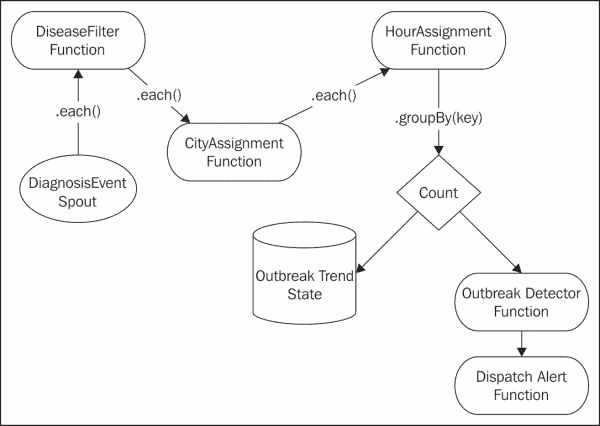
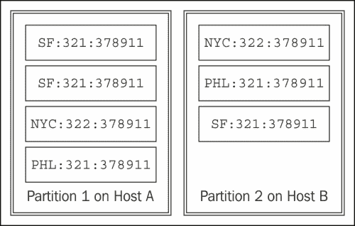
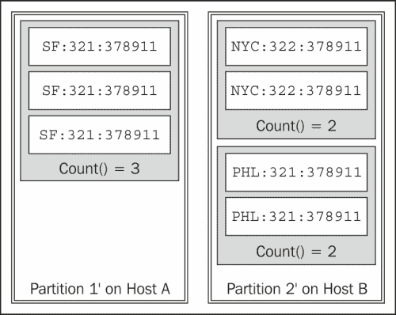

# 第三章：Trident拓扑和传感器数据

在本章中，我们将探索个Trident拓扑。 Trident在Storm 之上提供更高级别的抽象。 Trident抽象了事务处理和状态管理的细节。 具体地说，Trident提供将元组批处理成一组离散的事务。 此外，Trident 还提供允许拓扑对数据执行操作(如函数、筛选器和聚合)的抽象。

我们将以传感器数据为例，更好地了解Trident。 通常，传感器数据形成从许多不同位置读取的流。 一些传统的例子包括天气或交通信息，但这种模式扩展到了广泛的来源。 例如，在手机上运行的应用会生成过多的事件信息。 处理来自电话的事件流是传感器数据处理的另一个实例。

传感器数据包含由许多设备发出的事件，通常形成永无止境的流。 这是 Storm 的完美用例。

在本章中，我们将介绍：

*   Trident拓扑
*   Trident喷嘴
*   Trident操作.过滤器和功能
*   Trident聚合器.组合器和减速器
*   Trident之州

# 检查我们的用例

为了更好地理解Trident拓扑以及将 Storm 与传感器数据结合使用，我们将实现一个收集医疗报告以识别疾病爆发的Trident拓扑。

拓扑将处理包含以下信息的诊断事件：

<colgroup><col style="text-align: left"> <col style="text-align: left"> <col style="text-align: left"> <col style="text-align: left"></colgroup> 
| 

纬度 / 自由度 / 地区 / 界限

 | 

经度 / 黄经 / 经线

 | 

时间戳

 | 

诊断代码(ICD9-CM)

 |
| --- | --- | --- | --- |
| 39.9522 | -75.1642 | 2013 年 3 月 13 日下午 3：30 | 32.0 ( T0 ]热休克性脑膜炎( T1 ] ) |
| 40.3588 | -75.6269 | 2013 年 03 月 13 日下午 3：50 | 324.0(*颅内脓肿*) |

每个事件将包括事件的**全球定位系统**(**GPS**)坐标。 纬度和经度以十进制格式指定。 该事件还包含 ICD9-CM 代码，该代码指示该事件的诊断和时间戳。 有关 ICD-9-CM代码的完整列表，请访问：

[http：//www.icda9data.com/](http://www.icd9data.com/.)。

为了检测疫情，系统将统计特定地理位置内特定疾病代码在指定时间段内的出现次数。 为了简化本例，我们将每个诊断事件映射到最近的城市。 在实际系统中，您很可能会对事件执行更复杂的地理空间群集。

此外，对于该示例，我们将按纪元以来的小时对事件进行分组。 在实际系统中，您很可能会使用滑动窗口，并根据移动平均线计算趋势。

最后，我们将使用一个简单的阈值来确定是否爆发疫情。 如果一小时内的事件计数大于某个阈值，系统将发送警报并派遣国民警卫队。

为了保持历史记录，我们还将保存每个城市、每个小时和每个疾病的发生次数。

# Trident拓扑简介

要满足这些要求，我们需要计算拓扑中出现的次数。 在使用标准 Storm 拓扑时，这可能很有挑战性，因为元组可能会被重放，这会导致重复计数。 正如我们将在接下来的几节中看到的那样，Trident提供了解决此问题的原语。

我们将使用以下拓扑：



前面拓扑的代码如下：

```scala
public class OutbreakDetectionTopology {

    public static StormTopology buildTopology() {
    TridentTopology topology = new TridentTopology();
    DiagnosisEventSpout spout = new DiagnosisEventSpout();
    Stream inputStream = topology.newStream("event", spout);
    inputStream
    // Filter for critical events.
.each(new Fields("event"), new DiseaseFilter()))

            // Locate the closest city
         .each(new Fields("event"),
               new CityAssignment(), new Fields("city"))

         // Derive the hour segment
         .each(new Fields("event", "city"),
               new HourAssignment(), new Fields("hour",
               "cityDiseaseHour"))

         // Group occurrences in same city and hour
         .groupBy(new Fields("cityDiseaseHour"))

         // Count occurrences and persist the results.
         .persistentAggregate(new OutbreakTrendFactory(),
                              new Count(),
                              new Fields("count"))

         .newValuesStream()

         // Detect an outbreak
         .each(new Fields("cityDiseaseHour", "count"),
               new OutbreakDetector(), new Fields("alert"))

         // Dispatch the alert
         .each(new Fields("alert"),
               new DispatchAlert(), new Fields());

}
}
```

前面的代码显示了不同Trident功能之间的接线。 首先，`DiagnosisEventSpout`函数发出事件。 然后通过`DiseaseFilter`函数过滤事件，该函数过滤掉我们不关心的疾病的发生。 之后，该事件与`CityAssignment`函数中的一个城市相关联。 然后，`HourAssignment`函数为事件分配一个小时，并向包含城市、小时和疾病代码的元组添加一个键。 然后，我们按该键分组，这样就可以在拓扑中的`persistAggregate`函数步骤中对这些计数进行计数和持久化。 然后将计数传递给`OutbreakDetector`函数，该函数设置计数阈值，在超过阈值时发出警报。 最后，`DispatchAlert`函数接收警报，记录一条消息，并终止程序。 在下一节中，我们将更深入地研究其中的每一个步骤。

# 介绍Trident喷嘴

让我们首先看一下拓扑中的喷嘴。 与 Storm 不同，Trident引入了**批次**的概念。 与Storm喷口不同，Trident喷口必须分批发射元组。

每个批次都有自己的唯一事务标识符。 喷嘴根据其合同的约束来确定批次的组成。 喷嘴有三种类型的合约：**非交易型**、**交易型**和**不透明**。

非事务性喷嘴不提供对批次组成的保证，可能会重叠。 两个不同的批次可能包含相同的元组。 事务性输出保证批不重叠，并且同一批始终包含相同的元组。 不透明的喷嘴保证批次不重叠，但是批次的内容可能会改变。

下表描述了这一点：

<colgroup><col style="text-align: left"> <col style="text-align: left"> <col style="text-align: left"></colgroup> 
| 

喷嘴型

 | 

批次可以重叠

 | 

批次内容可能会更改

 |
| --- | --- | --- |
| 非事务性 | 英语字母表中第二十四个字母 / X 记号 / 成人电影 / 未知数 | 英语字母表中第二十四个字母 / X 记号 / 成人电影 / 未知数 |
| 不透明的 / 难理解的 / 不传热的 / 迟钝的 |   | 英语字母表中第二十四个字母 / X 记号 / 成人电影 / 未知数 |
| 交易的 |   |   |

spout的接口类似于以下代码片段：

```scala
public interface ITridentSpout<T> extends Serializable {

   BatchCoordinator<T> getCoordinator(String txStateId,
                              Map conf, TopologyContext context);
   Emitter<T> getEmitter(String txStateId, Map conf,
                         TopologyContext context);

   Map getComponentConfiguration();

   Fields getOutputFields();
}
```

在Trident中，喷嘴实际上并不发出元组。 相反，工作在`BatchCoordinator`和`Emitter`函数之间进行分解。 `Emitter`函数负责发出元组，`BatchCoordinator`函数负责批次管理和元数据，以便`Emitter`函数可以正确地重放批次。

`TridentSpout`函数只是向`BatchCoordinator`和`Emitter`函数提供访问器方法，并声明 spout 将发出的字段。 下面是我们的示例的`DiagnosisEventSpout`函数的清单：

```scala
public class DiagnosisEventSpout implements ITridentSpout<Long> {
 private static final long serialVersionUID = 1L;
 SpoutOutputCollector collector;
 BatchCoordinator<Long> coordinator = new DefaultCoordinator();
 Emitter<Long> emitter = new DiagnosisEventEmitter();

 @Override
 public BatchCoordinator<Long> getCoordinator(
         String txStateId, Map conf, TopologyContext context) {
     return coordinator;
 }

 @Override
 public Emitter<Long> getEmitter(String txStateId, Map conf,
                                TopologyContext context) {
     return emitter;
 }

 @Override
 public Map getComponentConfiguration() {
     return null;
 }

 @Override
 public Fields getOutputFields() {
     return new Fields("event");
 }
}
```

如前面代码中的`getOutputFields()`方法所示，在我们的示例拓扑中，喷嘴发出一个名为`event`的字段，其中包含`DiagnosisEvent`类。

`BatchCoordinator`类实现以下接口：

```scala
public interface BatchCoordinator<X> {
   X initializeTransaction(long txid, X prevMetadata);
   void success(long txid);
   boolean isReady(long txid);
   void close();
}
```

`BatchCoordinator`类是泛型类。 泛型类是重放批处理所需的元数据。 在我们的示例中，喷嘴发出随机事件，因此元数据被忽略。 但是，在现实系统中，元数据可能包含组成批次的消息或对象的标识符。 有了这些信息，不透明和事务性的喷嘴可以遵守它们的合同，并确保批次的内容不会重叠，并且在事务性喷嘴的情况下，批次内容不会改变。

`BatchCoordinator`类被实现为在单个线程中操作的 Storm Bolt。 Storm 将元数据保存在 ZooKeeper 中。 它在每个事务完成时通知协调器。

对于我们的示例，如果不进行协调，则以下是`DiagnosisEventSpout`类中使用的协调：

```scala
public class DefaultCoordinator implements BatchCoordinator<Long>,
                                              Serializable {
   private static final long serialVersionUID = 1L;
private static final Logger LOG = 
             LoggerFactory.getLogger(DefaultCoordinator.class);

@Override
public boolean isReady(long txid) {
   return true;
}

@Override
public void close() {
}

@Override
public Long initializeTransaction(long txid,
                                  Long prevMetadata) {
   LOG.info("Initializing Transaction [" + txid + "]");
   return null;
   }

@Override
public void success(long txid) {
   LOG.info("Successful Transaction [" + txid + "]");
}
}
```

Trident喷嘴中的第二个组件是`Emitter`函数。 函数`Emitter`使用收集器发射元组来执行Storm喷嘴的功能。 唯一的区别是它使用`TridentCollector`类，并且元组必须包含在由`BatchCoordinator`类初始化的批处理中。

`Emitter`函数的接口类似于以下代码片段：

```scala
public interface Emitter<X> {
void emitBatch(TransactionAttempt tx, X coordinatorMeta,
               TridentCollector collector);
void close();
}
```

如前面的代码所示，`Emitter`函数只有一个任务-发出给定批的元组。 为此，向函数传递批处理的元数据(由协调器构造)、有关事务的信息和收集器(`Emitter`函数用来发出元组)。 `DiagnosisEventEmitter`类的列表如下所示：

```scala
public class DiagnosisEventEmitter implements Emitter<Long>, Serializable {

private static final long serialVersionUID = 1L;
AtomicInteger successfulTransactions = new AtomicInteger(0);

@Override
public void emitBatch(TransactionAttempt tx, Long
                coordinatorMeta, TridentCollector collector) {
   for (int i = 0; i < 10000; i++) {
       List<Object> events = new ArrayList<Object>();
       double lat = 
             new Double(-30 + (int) (Math.random() * 75));
       double lng = 
             new Double(-120 + (int) (Math.random() * 70));
       long time = System.currentTimeMillis();
       String diag = new Integer(320 + 
                       (int) (Math.random() * 7)).toString();
       DiagnosisEvent event = 
                    new DiagnosisEvent(lat, lng, time, diag);
       events.add(event);
       collector.emit(events);
   }
}

@Override
public void success(TransactionAttempt tx) {
   successfulTransactions.incrementAndGet();
}

@Override
public void close() {
}
}
```

工作在`emitBatch()`方法中执行。 对于本例，我们将随机分配一个纬度和经度，使其大致保持在美国范围内，并且我们将使用`System.currentTimeMillis()`方法作为诊断的时间戳。

在现实生活中，ICD-9-CM码稀疏地填充在 000 到 999 之间的范围内。 在本例中，我们将仅使用 320 到 327 之间的诊断代码。 这些代码如下所示：

<colgroup><col style="text-align: left"> <col style="text-align: left"></colgroup> 
| 

密码 / 代码 / 法典 / 编码

 | 

描述 / 描写 / 形容 / 类别

 |
| --- | --- |
| 320 | 细菌性脑膜炎 |
| 三百二十一 | 由其他生物体引起的脑膜炎 |
| 322 | 不明原因脑膜炎 |
| 323 | 脑炎、脊髓炎和脑脊髓炎 |
| 324 | 颅内和椎管内脓肿 |
| 325 | 颅内静脉窦静脉炎和血栓性静脉炎 |
| 三百二十六 | 颅内脓肿或化脓性感染的远期效应 |
| 327 | 器质性睡眠障碍 |

这些诊断代码中的一个被随机分配给事件。

在本例中，我们将使用对象来封装诊断事件。 同样简单的是，我们可以将每个组件作为元组中的单独字段发出。 在对象封装和元组中字段的使用之间存在平衡。 通常，将字段数量保持在可管理的数量是一个好主意，但将用于控制流和/或分组的数据作为字段包含在元组中也是有意义的。

在我们的示例中，`DiagnosisEvent`类是拓扑操作的关键数据段。 该对象类似于以下代码片段：

```scala
public class DiagnosisEvent implements Serializable {
    private static final long serialVersionUID = 1L;
    public double lat;
    public double lng;
    public long time;
    public String diagnosisCode;

    public DiagnosisEvent(double lat, double lng,
                       long time, String diagnosisCode) {
   super();
   this.time = time;
   this.lat = lat;
   this.lng = lng;
   this.diagnosisCode = diagnosisCode;
    }
}
```

该对象是一个简单的 JavaBean。 时间以 LONG 变量的形式存储，这是自纪元以来的时间。 纬度和经度都以双精度存储。 `diagnosisCode`类存储为字符串，以防系统需要能够处理不基于 ICD-9 的其他类型的代码，如字母数字代码。

此时，拓扑能够发出事件。 在实际实现中，我们可以在实践中将拓扑集成到医疗索赔处理引擎或电子健康记录系统中。

# Trident操作简介-过滤器和功能

现在我们已经生成了事件，下一步是添加实现业务流程的逻辑组件。 在Trident中，这些操作称为**操作**。 在我们的拓扑中，我们使用两种不同类型的操作：过滤器和函数。

操作通过`Stream`对象上的方法应用于流。 在本例中，我们对`Stream`对象使用以下方法：

```scala
public class Stream implements IAggregatableStream {
public Stream each(Fields inputFields, Filter filter) {
...
}

public IAggregatableStream each(Fields inputFields,
Function function,
Fields functionFields){
   ...
}

public GroupedStream groupBy(Fields fields) {
   ...
   }

public TridentState persistentAggregate(
StateFactory stateFactory,
CombinerAggregator agg, 
Fields functionFields) {
        ...
}
}
```

请注意，前面代码中的方法返回可用于创建其他流的`Stream`对象或`TridentState`形式。 这样，就可以使用流畅风格的 Java 将操作链接在一起。

让我们再看一看示例拓扑中的关键线路：

```scala
   inputStream.each(new Fields("event"), new DiseaseFilter())
      .each(new Fields("event"), new CityAssignment(),
               new Fields("city"))

      .each(new Fields("event", "city"),
               new HourAssignment(),
             new Fields("hour", "cityDiseaseHour"))

      .groupBy(new Fields("cityDiseaseHour"))

      .persistentAggregate(new OutbreakTrendFactory(),
              new Count(), new Fields("count")).newValuesStream()

      .each(new Fields("cityDiseaseHour", "count"),
               new OutbreakDetector(), new Fields("alert"))

      .each(new Fields("alert"), new DispatchAlert(),
               new Fields());
```

通常，通过声明一组输入字段和一组输出字段(也称为**函数字段**)来应用操作。 前面代码中拓扑的第二行声明我们希望`CityAssignment`对流中的每个元组执行。 从该元组开始，`CityAssignment`将对`event`字段进行操作，并发出一个标记为`city`的函数字段，该字段被附加到元组之后。

每个操作都有略微不同的流畅样式语法，这取决于操作需要什么信息。 在接下来的几节中，我们将详细介绍不同操作的语法和语义。

## Trident过滤器简介

我们的拓扑中的第一个逻辑是**过滤器**，它忽略不受关注的疾病事件。 在本例中，系统将重点放在脑膜炎上。 在上表中，唯一的脑膜炎代码是 320、321 和 322。

要根据代码过滤事件，我们将利用Trident过滤器。 Trident提供了一个`BaseFilter`类，我们可以通过子类化来过滤系统不关心的元组，从而简化了这一过程。 `BaseFilter`类实现了`Filter`接口，该接口类似于以下代码片段：

```scala
public interface Filter extends EachOperation {
    boolean isKeep(TridentTuple tuple);
}
```

要过滤流中的元组，应用只需通过扩展`BaseFilter`类来实现此接口。 在本例中，我们将使用以下筛选器筛选事件：

```scala
public class DiseaseFilter extends BaseFilter {
private static final long serialVersionUID = 1L;
private static final Logger LOG = 
LoggerFactory.getLogger(DiseaseFilter.class);

@Override
public boolean isKeep(TridentTuple tuple) {
   DiagnosisEvent diagnosis = (DiagnosisEvent) tuple.getValue(0);
   Integer code = Integer.parseInt(diagnosis.diagnosisCode);
   if (code.intValue() <= 322) {
       LOG.debug("Emitting disease [" + 
diagnosis.diagnosisCode + "]");
       return true;
   } else {
       LOG.debug("Filtering disease [" + 
diagnosis.diagnosisCode + "]");
       return false;
   }
}
}
```

在前面的代码中，我们将从元组中提取`DiagnosisEvent`类并检查疾病代码。 由于所有脑膜炎代码都小于或等于 322，并且我们没有发出任何其他代码，因此我们只需检查代码是否小于 322，以确定事件是否与脑膜炎有关。

从`Filter`操作返回`True`将导致元组流向下游操作。 如果该方法返回`False`，则该元组将不会流向下游操作。

在我们的拓扑中，我们使用流上的`each(inputFields, filter)`方法将过滤器应用于流中的每个元组。 我们拓扑中的以下行将过滤器应用于流：

```scala
   inputStream.each(new Fields("event"), new DiseaseFilter())
```

## Trident功能简介

除了过滤器之外，Storm还为一般函数提供了一个接口。 函数类似于Storm Bolts，因为它们使用元组并可选地发出新的元组。 一个不同之处在于，Trident函数是相加的。 函数发出的值是添加到元组中的字段。 它们不会删除或变异现有字段。

函数的接口类似于以下代码片段：

```scala
public interface Function extends EachOperation {
void execute(TridentTuple tuple, TridentCollector collector);
}
```

与 Storm Bolt 类似，函数实现一个包含该函数逻辑的方法。 函数实现可以选择使用`TridentCollector`来发出传递给函数的元组。 这样，函数也可以用来过滤元组。

我们拓扑中的第一个函数是类似以下代码片段的`CityAssignment`函数：

```scala
public class CityAssignment extends BaseFunction {
private static final long serialVersionUID = 1L;
private static final Logger LOG = LoggerFactory.getLogger(CityAssignment.class);

private static Map<String, double[]> CITIES = 
                        new HashMap<String, double[]>();

    { // Initialize the cities we care about.
        double[] phl = { 39.875365, -75.249524 };
        CITIES.put("PHL", phl);
        double[] nyc = { 40.71448, -74.00598 };
        CITIES.put("NYC", nyc);
        double[] sf = { -31.4250142, -62.0841809   };
        CITIES.put("SF", sf);
        double[] la = { -34.05374, -118.24307 };
        CITIES.put("LA", la);
    }

    @Override
    public void execute(TridentTuple tuple, 
TridentCollector collector) {
       DiagnosisEvent diagnosis = 
                           (DiagnosisEvent) tuple.getValue(0);
       double leastDistance = Double.MAX_VALUE;
       String closestCity = "NONE";

       // Find the closest city.
       for (Entry<String, double[]> city : CITIES.entrySet()) {
          double R = 6371; // km
          double x = (city.getValue()[0] - diagnosis.lng) * 
             Math.cos((city.getValue()[0] + diagnosis.lng) / 2);
          double y = (city.getValue()[1] - diagnosis.lat);
          double d = Math.sqrt(x * x + y * y) * R;
          if (d < leastDistance) {
          leastDistance = d;
          closestCity = city.getKey();
          }
      }

      // Emit the value.
      List<Object> values = new ArrayList<Object>();
      Values.add(closestCity);
      LOG.debug("Closest city to lat=[" + diagnosis.lat + 
                "], lng=[" + diagnosis.lng + "] == ["
                + closestCity + "], d=[" + leastDistance + "]");
      collector.emit(values);
    }
}
```

在此函数中，我们使用静态初始值设定项来创建我们关心的城市地图。 对于样本数据，该函数有一个地图，其中包含费城(PHL)、纽约市(NYC)、旧金山(SF)、和洛杉矶(LA)的坐标。

在`execute()`方法中，函数循环遍历各个城市，并计算事件与城市之间的距离。 在实际系统中，地理空间索引可能更高效。

一旦该函数确定了最近的城市，它就会在方法的最后几行发出该城市的代码。 请记住，在Trident中，不是函数声明它将发出哪些字段，而是在操作作为函数调用中的第三个参数附加到流时声明这些字段。

声明的函数字段数必须与函数发出的值数一致。 如果它们不对齐，Storm将抛出`IndexOutOfBoundsException`。

拓扑中的下一个函数`HourAssignment`用于将时间戳转换为自纪元以来的一小时，然后可用于对事件进行临时分组。 `HourAssignment`的代码如下所示：

```scala
public class HourAssignment extends BaseFunction {
private static final long serialVersionUID = 1L;
private static final Logger LOG =    
               LoggerFactory.getLogger(HourAssignment.class);

@Override
public void execute(TridentTuple tuple,
                   TridentCollector collector) {
   DiagnosisEvent diagnosis = (DiagnosisEvent) tuple.getValue(0);
   String city = (String) tuple.getValue(1);

   long timestamp = diagnosis.time;
   long hourSinceEpoch = timestamp / 1000 / 60 / 60;

   LOG.debug("Key =  [" + city + ":" + hourSinceEpoch + "]");
   String key = city + ":" + diagnosis.diagnosisCode + ":" + 

                hourSinceEpoch;

   List<Object> values = new ArrayList<Object>();
   values.add(hourSinceEpoch);
   values.add(key);
   collector.emit(values);
}
}
```

我们通过发出*小时*以及由城市、诊断代码和小时组成的复合键，略微超载了这个函数。 实际上，它充当每个聚合计数的唯一标识符，我们将更详细地讨论。

拓扑中的最后两个函数检测爆发并向我们发出警报。 `OutbreakDetector`类的代码如下：

```scala
public class OutbreakDetector extends BaseFunction {
    private static final long serialVersionUID = 1L;
    public static final int THRESHOLD = 10000;

    @Override
    public void execute(TridentTuple tuple,
                         TridentCollector collector) {
   String key = (String) tuple.getValue(0);
   Long count = (Long) tuple.getValue(1);

   if (count > THRESHOLD) {
       List<Object> values = new ArrayList<Object>();
       values.add("Outbreak detected for [" + key + "]!");
       collector.emit(values);
   }
}
}
```

此函数提取特定城市、疾病和小时的计数，查看计数是否超过阈值。 如果有，它会发出一个新的字段，其中包含一个警报。 在前面的代码中，注意到该函数实际上充当了一个筛选器，但被实现为一个函数，因为我们希望向包含警报的元组中添加一个额外的字段。 由于筛选器不会改变元组，因此我们必须使用一个函数，该函数不仅允许我们进行筛选，而且还可以添加新字段。

我们拓扑中的最后一个函数只是发送警报(并终止程序)。 此拓扑的列表如下所示：

```scala
public class DispatchAlert extends BaseFunction {
    private static final long serialVersionUID = 1L;

    @Override
    public void execute(TridentTuple tuple, 
                     TridentCollector collector) {
   String alert = (String) tuple.getValue(0);
   Log.error("ALERT RECEIVED [" + alert + "]");
   Log.error("Dispatch the national guard!");
   System.exit(0);
   }
}
```

这个函数很简单。 它只需提取警报、记录消息并终止程序。

# 介绍Trident聚合器-合并器和减速器

与函数类似，**聚合器**允许拓扑组合元组。 与函数不同，它们替换元组字段和值。 有三种不同类型的聚合器：`CombinerAggregator`、`ReducerAggregator`和`Aggregator`。

## _CombinerAgregator

`CombinerAggregator`用于将一组元组组合成单个字段。 它有以下签名：

```scala
public interface CombinerAggregator {
   T init (TridentTuple tuple);
   T combine(T val1, T val2);
   T zero();
}
```

Storm 对每个元组调用`init()`方法，然后重复调用`combine()`方法，直到处理完分区。 传入`combine()`方法的值是部分聚合，这是对`init()`调用返回的值进行组合的结果。 分区将在下面的会话中详细讨论，但分区实际上是驻留在同一主机上的元组流的子集。 在对处理元组的值进行梳理后，Storm 将发出将这些值组合为单个新字段的结果。 如果分区为空，则 Storm 发出`zero()`方法返回的值。

## ReducerAggregator

`ReducerAggregator`具有a略微不同签名：

```scala
public interface ReducerAggregator<T> extends Serializable {
    T init();
    T reduce(T curr, TridentTuple tuple);
}
```

Storm 调用`init()`方法来检索初始值。 然后，对每个元组调用`reduce()`，直到分区被完全处理。 `reduce()`方法的第一个参数是累积部分聚合。 实现应该返回将元组合并到该部分聚合中的结果。

## 聚合器

最常见的聚合运算是`Aggregator`。 `Aggregator`的签名如下：

```scala
public interface Aggregator<T> extends Operation {
    T init(Object batchId, TridentCollector collector);
    void aggregate(T val, TridentTuple tuple,
TridentCollector collector);
 void complete(T val, TridentCollector collector);
}
```

`Aggregator`接口的`aggregate()`方法类似于`Function`接口的`execute()`方法，但它还包括一个值参数。 这允许`Aggregator`在处理元组时累加值。 请注意，使用`Aggregator`的，因为收集器同时传递到`aggregate()`方法和`complete()`方法，所以您可以发出任意数量的元组。

在我们的示例拓扑中，我们利用了名为`Count`的内置聚合器。 `Count`的实现类似于以下代码片段：

```scala
public class Count implements CombinerAggregator<Long> {
    @Override
    public Long init(TridentTuple tuple) {
        return 1L;
    }

    @Override
    public Long combine(Long val1, Long val2) {
        return val1 + val2;
    }

    @Override
    public Long zero() {
        return 0L;
    }
}
```

在我们的示例拓扑中，我们同时应用分组和计数来计算在特定城市附近的特定小时内发生的疾病。 实现这一目标的具体行如下：

```scala
.groupBy(new Fields("cityDiseaseHour"))
.persistentAggregate(new OutbreakTrendFactory(), 
   new Count(), new Fields("count")).newValuesStream()
```

回想一下，Storm 会跨可用主机对流进行分区。 这如下图所示：



方法`groupBy()`强制对数据进行重新分区。 它将所有共享命名字段的相同值的元组分组到同一分区中。 为此，Storm 必须将类似的元组发送到同一主机。 下图显示了基于我们的`groupBy()`方法对前面的数据进行的重新分区：



重新分区后，在每个分区内的每个组上运行`aggregate`函数。 在我们的示例中，我们按城市、小时和疾病代码分组(使用键)。 然后，在每个组上执行`Count`聚合器，该聚合器依次发出下游消费者的出现计数。

# Trident状态简介

现在我们有了每个聚合的计数，我们希望保留该信息以进行进一步分析。 在Trident，坚持不懈首先要从国家管理开始。 Trident 有一个用于状态的第一级原语，但与 Storm API 一样，它对存储为状态的内容或该状态如何持久化做了一些假设。 在最高级别，Trident公开一个`State`接口，如下所示：

```scala
public interface State {
   void beginCommit(Long transactionId); 
   void commit(Long transactionId);
}
```

如前所述，Trident将元组分组成批。 每个批次都有自己的事务标识符。 在前面的接口中，Trident 通知`State`对象何时提交状态以及何时应该完成提交。

与函数类似，在`Stream`对象上有方法将基于状态的操作引入到拓扑中。 更具体地说，在Trident中有两种类型的流：`Stream`和`GroupedStream`。 `GroupedStream`是执行`groupBy`操作的结果。 在我们的拓扑中，我们按`HourAssignment`函数生成的键进行分组。

在`Stream`对象上，下列方法允许拓扑读取和写入状态信息：

```scala
public class Stream implements IAggregatableStream {
    ...
    public Stream stateQuery(TridentState state, Fields inputFields,
            QueryFunction function, Fields functionFields) {
   ...
 }

public TridentState partitionPersist(StateFactory stateFactory,
Fields inputFields, StateUpdater updater,
Fields functionFields) {
   ...
}

public TridentState partitionPersist(StateSpec stateSpec,
Fields inputFields, StateUpdater updater,
Fields functionFields) {
   ...
}

public TridentState partitionPersist(StateFactory stateFactory,
Fields inputFields, StateUpdater updater) {
   ...
   }

public TridentState partitionPersist(StateSpec stateSpec,
Fields inputFields, StateUpdater updater) {
    ...
}
...
}
```

`stateQuery()`方法从状态创建输入流，并且`partitionPersist()`方法的各种风格允许拓扑从流中的元组更新状态信息。 `partitionPersist()`方法对每个分区进行操作。

除了`Stream`对象上的方法之外，`GroupedStream`对象还允许拓扑从一组元组中聚合统计信息，同时将收集到的信息持久化到状态。 以下是`GroupedStream`类上与状态相关的方法：

```scala
public class GroupedStream implements IAggregatableStream,
GlobalAggregationScheme<GroupedStream> {
...
   public TridentState persistentAggregate(
StateFactory stateFactory, CombinerAggregator agg,
Fields functionFields) {
...
}

public TridentState persistentAggregate(StateSpec spec,
CombinerAggregator agg, Fields functionFields) {
...
}

public TridentState persistentAggregate(
StateFactory stateFactory, Fields inputFields,
CombinerAggregator agg, Fields functionFields) {
...
}

public TridentState persistentAggregate(StateSpec spec,
Fields inputFields, CombinerAggregator agg,
Fields functionFields) {
...
}

public TridentState persistentAggregate(
StateFactory stateFactory, Fields inputFields,
ReducerAggregator agg, Fields functionFields) {
...
}

public TridentState persistentAggregate(StateSpec spec, Fields inputFields, ReducerAggregator agg, Fields functionFields) {
...
}

public Stream stateQuery(TridentState state, Fields inputFields,
QueryFunction function, Fields functionFields) {
...
}    

public TridentState persistentAggregate(
StateFactory stateFactory, ReducerAggregator agg,
Fields functionFields) {
...
}

public TridentState persistentAggregate(StateSpec spec,
ReducerAggregator agg, Fields functionFields) {
...
}    

public Stream stateQuery(TridentState state,
   QueryFunction function, Fields functionFields) {
...
}
}
```

与基`Stream`对象一样，`stateQuery()`方法从 state 创建一个输入流。 不同风格的`persistAggregate()`允许拓扑从流中的元组更新状态信息。 请注意，`GroupedStream`方法接受`Aggregator`，在将该信息写入`State`对象之前首先应用该参数。

现在，让我们考虑将这些函数应用到我们的示例中。 在我们的系统中，我们希望坚持按城市、疾病代码和小时计算发生次数。 这将启用类似下表的报告：

<colgroup><col style="text-align: left"> <col style="text-align: left"> <col style="text-align: left"> <col style="text-align: left"> <col style="text-align: left"></colgroup> 
| 

病 / 弊病 / 弊端

 | 

城市 / 伦敦市

 | 

日期 / 时期 / 约会 / 枣椰子

 | 

时间 / 时代 / 次数

 | 

出现次数计数

 |
| --- | --- | --- | --- | --- |
| 细菌性脑膜炎 | 旧金山 | 3/12/2013 | 下午 3 点 | 12 个 |
| 细菌性脑膜炎 | 旧金山 | 3/12/2013 | 下午 4 点 | 50 |
| 细菌性脑膜炎 | 旧金山 | 3/12/2013 | 下午 5：00 | 100 个 |
| 天花 | 纽约 （美国东北部的一个州） / 纽约 （纽约州东南部一主要城市和港口） | 3/13/2013 | 下午 5：00 | 6. |

要实现这一点，我们希望坚持使用在聚合中生成的计数。 我们可以使用`groupBy`函数返回的`GroupedStream`接口(如前所示)并调用`persistAggregate`方法。 具体地说，下面是我们在示例拓扑中进行的调用：

```scala
 persistentAggregate(new OutbreakTrendFactory(), 
   new Count(), new Fields("count")).newValuesStream()
```

为了理解持久性，我们将首先关注此方法的第一个参数。 Trident使用工厂模式生成`State`的实例。 `OutbreakTrendFactory`是我们的拓扑提供给 Storm 的工厂。 `OutbreakTrendFactory`的列表如下：

```scala
public class OutbreakTrendFactory implements StateFactory {
private static final long serialVersionUID = 1L;

@Override
public State makeState(Map conf, IMetricsContext metrics,
int partitionIndex, int numPartitions) {
   return new OutbreakTrendState(new OutbreakTrendBackingMap());
}
}
```

工厂返回 Storm 用来持久化信息的`State`对象。 在 Storm 中，有三种类型的状态。 下表介绍了每种类型：

<colgroup><col style="text-align: left"> <col style="text-align: left"></colgroup> 
| 

**状态类型**

 | 

描述 / 描写 / 形容 / 类别

 |
| --- | --- |
| **非事务性** | 对于没有回滚功能且更新是永久性的且提交被忽略的持久性机制。 |
| **重复事务处理** | 如果批处理包含相同的元组，则持久化是幂等的。 |
| **不透明交易** | 更新基于先前的值，这使得持久性对批处理组合中的更改具有弹性。 |

为了在可以重放批的分布式环境中支持计数和状态更新，Trident对状态更新进行排序，并使用不同的状态更新模式来容忍重放和错误。 以下各节将介绍这些内容。

## 重复事务状态

对于重复事务状态，最后提交的批次标识符与数据一起存储。 当且仅当应用的批次标识符是序列中的下一个时，状态才会更新。 如果它等于或小于持久化标识符，则会忽略该更新，因为它已被应用。

为了说明此方法，请考虑以下批处理序列，其中状态更新是该键出现次数的聚合计数，如我们的示例所示：

<colgroup><col style="text-align: left"> <col style="text-align: left"></colgroup> 
| 

批次号

 | 

状态更新

 |
| --- | --- |
| 1. | {SF:320:378911=4} |
| 2 个 | {SF:320:378911=10} |
| 3. | {SF:320:378911=8} |

然后，批处理按以下顺序完成处理：

1 到 2 到 3 到 3(重播)

这将导致以下状态修改，其中中间的列是批次标识符的持久性，该批次标识符指示并入状态中的最新批次：

<colgroup><col style="text-align: left"> <col style="text-align: left"> <col style="text-align: left"></colgroup> 
| 

已完成批次号

 | 

状态 / 国家 / 政府 / 领土

 |
| --- | --- |
| 1. | {批次=1} | {SF：320：378911=4} |
| 2 个 | {批次=2} | {SF：320：378911=14} |
| 3. | {批次=3} | {SF：320：378911=22} |
| 3(重播) | {批次=3} | {SF：320：378911=22} |

请注意，当批次#3 完成重放时，它对该州没有影响，因为Trident已经将其更新合并到该州。 要使重复事务状态正常工作，批处理内容不能在两次重放之间更改。

## 不透明状态

在Repeat Transaction 状态中使用的方法依赖于批次组成保持不变，如果系统遇到故障，这可能是不可能的。 如果喷嘴是从可能有部分故障的源发射的，则在初始批次中发射的一些元组可能不能用于重新发射。 不透明状态允许通过存储当前和先前状态来更改批次组成。

假设我们的批次与上一个示例中的批次相同，但这一次重放批次 3 时，聚合计数将不同，因为它包含一组不同的元组，如下表所示：

<colgroup><col style="text-align: left"> <col style="text-align: left"></colgroup> 
| 

批次号

 | 

状态更新

 |
| --- | --- |
| 1. | {SF:320:378911=4} |
| 2 个 | {SF:320:378911=10} |
| 3. | {SF:320:378911=8} |
| 3(重播) | {SF:320:378911=6} |

使用不透明状态时，状态将更新如下：

<colgroup><col style="text-align: left"> <col style="text-align: left"> <col style="text-align: left"> <col style="text-align: left"></colgroup> 
| 

♪已完成批处理♪

 | 

已提交批处理

 | 

以前的状态

 | 

当前状态

 |
| --- | --- | --- | --- |
| 1. | 1. | {} | {SF：320：378911=4} |
| 2 个 | 2 个 | {SF：320：378911=4} | {SF：320：378911=14} |
| 3(适用) | 3. | {SF：320：378911=14} | {SF：320：378911=22} |
| 3(重播) | 3. | {SF：320：378911=14} | {SF：320：378911=20} |

请注意，不透明状态存储以前的状态信息。 因此，当重放批次#3 时，它可以使用新的聚集计数来重新转换状态。

您可能想知道如果批已经提交，我们为什么还要重新应用它。 我们关注的场景是状态更新成功，但下游处理失败。 在我们的示例拓扑中，可能无法发送警报。 在这种情况下，Trident将重试该批次。 现在，在最坏的情况下，当喷嘴被要求重新排放批次时，一个或多个数据源可能不可用。

在事务性外流的情况下，它需要等待，直到所有源再次可用。 不透明的事务性输出将能够发出批处理中可用的部分，并且处理可以继续。 由于Trident依赖于批处理的顺序应用，因此不能延迟任何一批处理是非常必要的，因为这会延迟系统中的所有处理。

在这种方法下，国家的选择应该基于国家的出口，以保证幂等行为，而不是过多地计算或腐败国家。 下表显示了保证幂等行为的可能配对：

<colgroup><col style="text-align: left"> <col style="text-align: left"> <col style="text-align: left"> <col style="text-align: left"></colgroup> 
| 

喷嘴的类型

 | 

非事务状态

 | 

不透明状态

 | 

重复事务状态

 |
| --- | --- | --- | --- |
| 非事务型喷嘴 |   |   |   |
| 不透明喷嘴 |   | 英语字母表中第二十四个字母 / X 记号 / 成人电影 / 未知数 |   |
| 事务型喷嘴 |   | 英语字母表中第二十四个字母 / X 记号 / 成人电影 / 未知数 | 英语字母表中第二十四个字母 / X 记号 / 成人电影 / 未知数 |

幸运的是，Storm 提供了映射实现，使持久层远离复杂的状态管理。 具体地说，Trident提供了`State`实现来维护附加信息，以遵守前面概述的保证。 对象的名称是适当的：`NonTransactionalMap`、`TransactionalMap`和`OpaqueMap`。

返回到我们的示例，因为我们没有事务保证，所以我们选择使用`NonTransactionalMap`作为我们的`State`对象。

`OutbreakTrendState`对象类似于以下代码片段：

```scala
public class OutbreakTrendState extends NonTransactionalMap<Long> {
protected OutbreakTrendState(
OutbreakTrendBackingMap outbreakBackingMap) {
   super(outbreakBackingMap);
}
}
```

如前面的代码所示，要利用`MapState`对象，我们只需传递一个支持映射。 在我们的示例中，这是`OutbreakTrendBackingMap`。 该对象的代码如下所示：

```scala
public class OutbreakTrendBackingMap implements IBackingMap<Long> {
    private static final Logger LOG = 
LoggerFactory.getLogger(OutbreakTrendBackingMap.class);
 Map<String, Long> storage = 
new ConcurrentHashMap<String, Long>();

 @Override
 public List<Long> multiGet(List<List<Object>> keys) {
    List<Long> values = new ArrayList<Long>();
    for (List<Object> key : keys) {
        Long value = storage.get(key.get(0));
        if (value==null){
            values.add(new Long(0));
        } else {
            values.add(value);
        }
    }
    return values;
}

@Override
public void multiPut(List<List<Object>> keys, List<Long> vals) {
    for (int i=0; i < keys.size(); i++) {
        LOG.info("Persisting [" + keys.get(i).get(0) + "] ==> [" 
+ vals.get(i) + "]");
        storage.put((String) keys.get(i).get(0), vals.get(i));
    }
}
}
```

在我们的示例拓扑中，我们实际上并不保留这些值。 我们只需将它们放在`ConcurrentHashMap`中。 显然，这不适用于多台主机。 然而，`BackingMap`是一个聪明的抽象。 只需更改我们传递到`MapState`对象的构造函数中的支持映射实例，就会更改持久层。 我们将在后面的章节中看到这一点。

# 执行拓扑

`OutbreakDetectionTopology`类有以下主要方法：

```scala
public static void main(String[] args) throws Exception {
    Config conf = new Config();
    LocalCluster cluster = new LocalCluster();
    cluster.submitTopology("cdc", conf, buildTopology());
    Thread.sleep(200000);
    cluster.shutdown();
}
```

执行此方法将向本地群集提交拓扑。 喷嘴将立即开始发出诊断事件，`Count`聚合器将收集这些事件。 设置`OutbreakDetector`类中的阈值，以便计数将快速超过阈值，此时程序将使用以下命令集终止：

```scala
INFO [Thread-18] DefaultCoordinator.success(31) | Successful Transaction [8]
INFO [Thread-18] DefaultCoordinator.initializeTransaction(25) | Initializing Transaction [9]
...
INFO [Thread-24] OutbreakTrendBackingMap.multiPut(34) | Persisting [SF:320:378951] ==> [10306]
INFO [Thread-24] OutbreakTrendBackingMap.multiPut(34) | Persisting [PHL:320:378951] ==> [893]
INFO [Thread-24] OutbreakTrendBackingMap.multiPut(34) | Persisting [NYC:322:378951] ==> [1639]
INFO [Thread-24] OutbreakTrendBackingMap.multiPut(34) | Persisting [SF:322:378951] ==> [10254]
INFO [Thread-24] OutbreakTrendBackingMap.multiPut(34) | Persisting [SF:321:378951] ==> [10386]
...
00:04 ERROR: ALERT RECEIVED [Outbreak detected for [SF:320:378951]!]
00:04 ERROR: Dispatch the National Guard!

```

请注意，在成功完成批处理后会通知协调器，并且在几个批处理中，超过阈值，系统会向我们发出错误消息`Dispatch the National Guard!`。

# 摘要

在本章中，我们创建了一个拓扑，该拓扑处理诊断信息以识别异常，这将指示爆发。 同样的数据流可以应用于任何类型的数据，包括天气、地震信息或交通数据。 我们练习了Trident中的基本原语，以构建一个即使重放批次也能够对事件进行计数的系统。 在本书的后面部分，我们将利用这些相同的构造和模式来执行类似的功能。