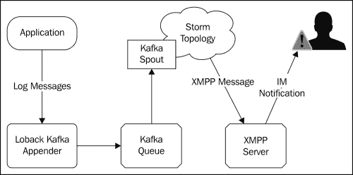
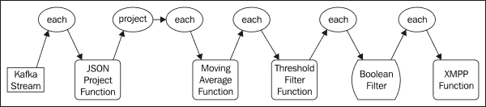
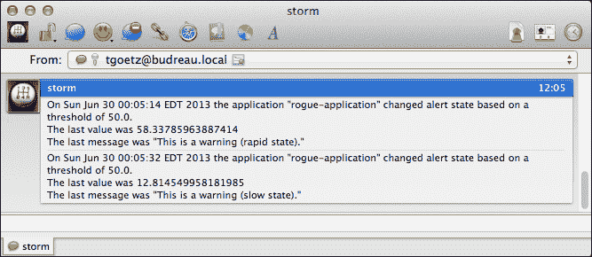

# 第四章实时趋势分析

在本章中，我们将向您介绍使用 Storm 和三叉戟进行趋势分析的技术。 实时趋势分析涉及识别数据流中的模式，例如识别某些事件的出现速率或计数何时达到特定阈值。 常见的例子包括社交媒体上的热门话题，比如某个特定的标签在 Twitter 上变得流行起来，或者在搜索引擎中识别热门搜索词。 Storm 最初是一个对 Twitter 数据执行实时分析的项目，它提供了分析计算所需的许多核心原语。

在前面的章节中，使用的 SPOUT 实现主要是使用静态样本数据或随机生成的数据的模拟。 在本章中，我们将介绍一个从队列发出数据的开源 spout(Apache Kafka)，并支持所有三种类型的三叉戟 spout 事务(非事务、重复事务和不透明事务)。 我们还将使用流行的日志记录框架实现一种简单、通用的方法来填充 Kafka 队列，这将使您能够快速开始对现有应用程序和数据进行实时分析，只需很少或根本不需要修改源代码。

在本章中，我们将介绍以下主题：

*   将数据记录到 Apache Kafka 并将其流式传输到 Storm
*   将现有应用程序的日志数据流式传输到 Storm 进行分析
*   实现指数加权移动平均三叉戟函数
*   在 Storm 中使用 XMPP 协议发送警报和通知

# 使用案例

在我们的用例中，我们有个个应用程序或一组应用程序(网站、企业应用程序等)，它们使用流行的日志框架([http://logback.qos.ch](http://logback.qos.ch))将结构化消息记录到磁盘(访问日志、错误等)。 目前，对这些数据执行分析的唯一方法是使用 Hadoop 之类的工具批量处理文件。 该过程引入的延迟极大地减慢了我们的反应时间；从日志数据中收集的模式只有在特定事件发生并且采取响应措施的机会过去之后的几个小时，有时是几天才会出现。 更可取的是，在模式出现时主动通知他们，而不是在事实发生之后。

此用例代表一个共同主题，在许多业务场景中具有广泛的应用程序，包括以下应用程序：

*   应用监控：以为例，当某些网络错误达到一定频率时通知系统管理员
*   入侵检测：例如，检测可疑活动，如失败登录尝试的增加
*   供应链管理：以为例，识别特定产品的销售高峰，并相应地调整准时交货
*   在线广告：例如，识别流行趋势和动态改变广告投放方式

# 架构

我们的应用程序的体系结构如下图所示，它将包括以下个组件：



## 源应用程序

源应用程序组件是使用 Logback 框架记录任意日志消息的任何应用程序。 出于我们的目的，我们将创建一个简单的应用程序，以特定的时间间隔记录结构化消息。 但是，正如您将看到的，任何使用 Logback 或 slf4j 框架的现有应用程序都可以替换为简单的配置更改。

## Log Back Kafka 附加器

Logback 框架有一个扩展机制，允许您向其配置中添加额外的附加器。 Logback 附加器只是一个 Java 类，它接收日志事件并对其执行某些操作。 最常用的附加器是几个`FileAppender`子类之一，这些子类简单地格式化日志消息并将其写入磁盘上的文件。 其他附加器实现将日志数据写入网络套接字、关系数据库和 SMTP 以获得电子邮件通知。 出于我们的目的，我们将实现一个附加器，该附加器将日志消息写入 Apache Kafka 队列。

## =0 _ Apache 卡夫卡

Apache Kafka([http://kafka.apache.org](http://kafka.apache.org))是一个开源的分布式发布-订阅消息传递系统。 Kafka 针对高吞吐量、持久的实时流进行了专门设计和优化。 与 Storm 一样，Kafka 的设计目的是在商用软件上进行水平扩展，以支持每秒数十万条消息。

## 卡夫卡喷嘴

kafka spout从 kafka 队列读取数据，并将其发送到 Storm 或三叉戟拓扑。 卡夫卡喷嘴最初是由 Nathan Marz 创作的，现在它仍然是 GitHub([https://github.com/nathanmarz/storm-contrib](https://github.com/nathanmarz/storm-contrib))风暴控制计划的一部分。 可以从`clojars.org`Maven 存储库([https://clojars.org/storm/storm-kafka](https://clojars.org/storm/storm-kafka))获得 Kafka spout 的预构建二进制文件。 我们将使用 Kafka 端口从 Kafka 队列中读取消息，并将它们流式传输到我们的拓扑中。

我们的拓扑将由检测源数据流中的模式的内置和自定义三叉戟组件(函数、过滤器、状态等)的集合组成。 当检测到模式时，拓扑将向函数发出元组，该函数将向 XMPP 服务器发送 XMPP 消息，以通过**即时消息**(**IM**)通知最终用户。

## XMPP 服务器

**可扩展消息传递和在线状态协议**(**XMPP**)([XMPP](http://xmpp.org))是一种基于 http://xmpp.org 的标准，用于即时消息传递、在线状态信息和联系人列表维护。 许多 IM 客户端，如 Adium(针对 OS)([http://adium.im](http://adium.im))和 Pidgin(针对 OS、Linus 和 Windows)([http://www.pidgin.im](http://www.pidgin.im))都支持 XMPP 协议，如果您曾经使用过 Google talk 进行即时消息传递，那么您一定使用过 XMPP。

我们将使用开源 OpenFire XMPP 服务器([Linux](http://www.igniterealtime.org/projects/openfire/))，因为它易于安装，并且与 http://www.igniterealtime.org/projects/openfire/、Linux 和 Windows 兼容。

# 安装所需软件

我们将从安装必要的软件开始：Apache Kafka 和 OpenFire。 尽管 Kafka 是一个分布式消息传递系统，但它可以作为单个节点安装，甚至作为开发环境的一部分在本地运行。 在生产环境中，您需要根据您的扩展要求设置一个由一台或多台机器组成的集群。 OpenFire 服务器不是群集系统，可以安装在单个节点上，也可以安装在本地。

## 安装卡夫卡

Kafka依赖动物园管理员来存储特定的状态信息，这与 Storm 非常相似。 由于 Storm 对动物园管理员施加的负载相对较轻，因此在许多情况下，在 Kafka 和 Storm 之间共享同一个动物园管理员集群是可以接受的。 因为我们已经在[第 2 章](02.html "Chapter 2. Configuring Storm Clusters")，*配置 Storm Clusters*中介绍了 ZooKeeper 的安装，所以这里我们只讨论 Kafka 附带的、适合开发环境的本地 ZooKeeper 服务器的运行。

首先从以下网站下载Apache Kafka 的 0.7.x 版本：

[http：//kafka.apache.org/downloads.html](http://kafka.apache.org/downloads.html)

接下来，解压源代码发行版，并将现有目录更改为以下目录：

```scala
tar -zxf kafka-0.7.2-incubating-src.tgz
cd kafka-0.7.2-incubating-src
```

Kafka 是用 Scala JVM 语言([http://www.scala-lang.org](http://www.scala-lang.org))编写的，并使用`sbt`(**Scala 构建工具**)([http://www.scala-sbt.org](http://www.scala-sbt.org))进行编译和打包。 幸运的是，Kafka 源代码发行版包含`sbt`，可以使用以下命令构建：

```scala
./sbt update package
```

在启动Kafka 之前，除非已经运行了 ZooKeeper 服务，否则您需要使用以下命令启动与 Kafka 捆绑在一起的 ZooKeeper 服务：

```scala
./bin/zookeeper-server-start.sh ./config/zookeeper.properties
```

最后，在一个单独的终端窗口中，使用以下命令启动 Kafka 服务：

```scala
./bin/kafka-server-start.sh ./config/server.properties
```

卡夫卡服务现在可以使用了。

## 安装 OpenFire

OpenFire是 OSX 和 Windows 的安装程序以及各种 Linux 发行版的软件包，可以从以下网站下载：

[http：//www.igniterealtime.org/downloads/index.jsp](http://www.igniterealtime.org/downloads/index.jsp)

要安装 OpenFire，请下载适用于您的操作系统的安装程序，然后按照以下网站上提供的相应安装说明进行操作：

[http：//www.igniterealtime.org/builds/openfire/docs/latest/documentation/index.html](http://www.igniterealtime.org/builds/openfire/docs/latest/documentation/index.html)

# 介绍示例应用程序

应用程序组件是一个简单 Java 类，它使用 Java(**SLF4J**)([http://www.slf4j.org](http://www.slf4j.org))的**简单日志外观来记录消息。 我们将模拟一个应用程序，该应用程序开始时以相对较慢的速度生成警告消息，然后切换到以更快的速度生成警告消息的状态，最后返回到慢速状态，如下所示：**

*   每隔 5 秒记录一条警告消息，持续 30 秒(慢速状态)
*   每秒记录一条警告消息，持续 15 秒(快速状态)
*   每隔 5 秒记录一条警告消息，持续 30 秒(慢速状态)

该应用程序的目标是生成一个简单的模式，当某些模式出现并且状态发生变化时，我们的 Storm 拓扑可以通过发送通知来识别和响应该模式，如以下代码片段所示：

```scala
public class RogueApplication {
    private static final Logger LOG = LoggerFactory.getLogger(RogueApplication.class);

    public static void main(String[] args) throws Exception {
        int slowCount = 6;
        int fastCount = 15;
        // slow state
        for(int i = 0; i < slowCount; i++){
            LOG.warn("This is a warning (slow state).");
            Thread.sleep(5000);
        }
        // enter rapid state
        for(int i = 0; i < fastCount; i++){
            LOG.warn("This is a warning (rapid state).");
            Thread.sleep(1000);
        }
        // return to slow state
        for(int i = 0; i < slowCount; i++){
            LOG.warn("This is a warning (slow state).");
            Thread.sleep(5000);
        }
    }
}
```

## 向卡夫卡发送日志消息

Logback框架提供了一个简单的扩展机制，允许您插入其他附加器。 在我们的例子中，我们希望实现一个可以将日志消息数据写入 Kafka 的附加器。

Logback 包括`ch.qos.logback.core.AppenderBase`抽象类，它使得实现`Appender`接口变得很容易。 `AppenderBase`类定义单个抽象方法，如下所示：

```scala
  abstract protected void append(E eventObject);
```

`eventObject`参数表示日志记录事件，包括事件日期、日志级别(`DEBUG`、`INFO`、`WARN`等)以及日志消息本身等属性。 我们将覆盖`append()`方法将`eventObject`数据写入 Kafka。

除了`append()`方法之外，`AppenderBase`类还定义了两个我们需要覆盖的附加生命周期方法：

```scala
 public void start();
 public void stop();
```

在 Logback框架的初始化期间调用`start()`方法，在取消初始化时调用`stop()`方法。 我们将覆盖这些方法来建立和断开与 Kafka 服务的连接。

`KafkaAppender`类的源代码如下所示：

```scala
public class KafkaAppender extends AppenderBase<ILoggingEvent> {

    private String topic;
    private String zookeeperHost;
    private Producer<String, String> producer;
    private Formatter formatter;

    // java bean definitions used to inject
    // configuration values from logback.xml
    public String getTopic() {
        return topic;
    }

    public void setTopic(String topic) {
        this.topic = topic;
    }

    public String getZookeeperHost() {
        return zookeeperHost;
    }

    public void setZookeeperHost(String zookeeperHost) {
        this.zookeeperHost = zookeeperHost;
    }

    public Formatter getFormatter() {
        return formatter;
    }

    public void setFormatter(Formatter formatter) {
        this.formatter = formatter;
    }

    // overrides
    @Override
    public void start() {
        if (this.formatter == null) {
            this.formatter = new MessageFormatter();
        }
        super.start();
        Properties props = new Properties();
        props.put("zk.connect", this.zookeeperHost);
        props.put("serializer.class", "kafka.serializer.StringEncoder");
        ProducerConfig config = new ProducerConfig(props);
        this.producer = new Producer<String, String>(config);
    }

    @Override
    public void stop() {
        super.stop();
        this.producer.close();
    }

    @Override
    protected void append(ILoggingEvent event) {
        String payload = this.formatter.format(event);
        ProducerData<String, String> data = new ProducerData<String, String>(this.topic, payload);
        this.producer.send(data);
    }

}
```

正如您将看到的，该类中的JavaBean 样式的访问器允许我们在 Logback 框架初始化时通过运行时的依赖注入配置关联值。 `zookeeperHosts`属性的 setter 和 getter 用于初始化`KafkaProducer`客户端，将其配置为发现已向 ZooKeeper 注册的 Kafka 主机。 另一种方法是提供 Kafka 主机的静态列表，但为了简单起见，使用自动发现机制更容易。 `topic`属性用于告诉`KafkaConsumer`客户端它应该从哪个 kafka 主题读取。

`Formatter`属性有些特殊。 它是我们定义的一个接口，它为处理结构化(即可解析)日志消息提供了一个扩展点，如以下代码片段所示：

```scala
public interface Formatter {
    String format(ILoggingEvent event);
}
```

`Formatter`实现的任务是获取`ILoggingEvent`对象，并将其转换为可由使用者处理的机器可读字符串。 下面的代码片段中列出的一个简单实现只是返回日志消息，而丢弃任何其他元数据：

```scala
public class MessageFormatter implements Formatter {

    public String format(ILoggingEvent event) {
        return event.getFormattedMessage();
    }
}
```

以下Logback 配置文件说明了附加器的用法。 此示例未定义自定义`Formatter`实现，因此`KafkaAppender`类将默认使用`MessageFormatter`类，仅将日志消息数据写入 kafka，并丢弃日志记录事件中包含的任何附加信息，如下面的代码片段所示：

```scala
<?xml version="1.0" encoding="UTF-8" ?>
<configuration>
    <appender name="KAFKA"
        class="com.github.ptgoetz.logback.kafka.KafkaAppender">
        <topic>mytopic</topic>
        <zookeeperHost>localhost:2181</zookeeperHost>
    </appender>
    <root level="debug">
        <appender-ref ref="KAFKA" />
    </root>
</configuration>
```

我们正在构建的 Storm 应用程序是对时间敏感的：如果我们要跟踪每个事件发生的速率，我们需要确切地知道事件发生的时间。 一种天真的方法是，当数据进入我们的拓扑时，使用`System.currentTimeMillis()`方法简单地为事件分配一个时间。 然而，三叉戟的批处理机制不能保证元组将以与接收元组相同的速率传递到拓扑。

为了说明这种情况，我们需要捕获事件发生的时间，并在写入 Kafka 队列时将其包含在数据中。 幸运的是，`ILoggingEvent`类包含事件发生的时间戳(从纪元开始以毫秒为单位)。

要包括`ILoggingEvent`中包含的元数据，我们将创建一个自定义`Formatter`实现，该实现将日志事件数据编码为 JSON 格式，如下所示：

```scala
public class JsonFormatter implements Formatter {
    private static final String QUOTE = "\"";
    private static final String COLON = ":";
    private static final String COMMA = ",";

    private boolean expectJson = false;

    public String format(ILoggingEvent event) {
        StringBuilder sb = new StringBuilder();
        sb.append("{");
        fieldName("level", sb);
        quote(event.getLevel().levelStr, sb);
        sb.append(COMMA);
        fieldName("logger", sb);
        quote(event.getLoggerName(), sb);
        sb.append(COMMA);
        fieldName("timestamp", sb);
        sb.append(event.getTimeStamp());
        sb.append(COMMA);
        fieldName("message", sb);
        if (this.expectJson) {
            sb.append(event.getFormattedMessage());
        } else {
            quote(event.getFormattedMessage(), sb);
        }

        sb.append("}");
        return sb.toString();
    }

    private static void fieldName(String name, StringBuilder sb) {
        quote(name, sb);
        sb.append(COLON);
    }

    private static void quote(String value, StringBuilder sb) {
        sb.append(QUOTE);
        sb.append(value);
        sb.append(QUOTE);
    }

    public boolean isExpectJson() {
        return expectJson;
    }

    public void setExpectJson(boolean expectJson) {
        this.expectJson = expectJson;
    }
}
```

`JsonMessageFormatter`类代码的大部分使用`java.lang.StringBuilder`类从`ILoggingEvent`对象创建 JSON。 虽然我们可以使用 JSON 库来完成这项工作，但是我们正在生成的 JSON 数据很简单，仅仅为了生成 JSON 而添加额外的依赖项就太过分了。

`JsonMessageFormatter`公开的一个JavaBean 属性是用于指定传递给`Formatter`实现的日志消息是否应被视为 JSON 的`expectJson`布尔值。 如果设置为`False`，日志消息将被视为字符串并用双引号括起来，否则消息将被视为 JSON 对象(`{...}`)或数组(`[...]`)。

下面是一个示例 Logback 配置文件，它说明了`KafkaAppender`和`JsonFormatter`类的用法：

```scala
<?xml version="1.0" encoding="UTF-8" ?>
<configuration>
    <appender name="KAFKA"
        class="com.github.ptgoetz.logback.kafka.KafkaAppender">
        <topic>foo</topic>
        <zookeeperHost>localhost:2181</zookeeperHost>
        <!-- specify a custom formatter -->
        <formatter class="com.github.ptgoetz.logback.kafka.formatter.JsonFormatter">
            <!-- 
            Whether we expect the log message to be JSON encoded or not.
            If set to "false", the log message will be treated as a string, and wrapped in quotes. Otherwise it will be treated as a parseable JSON object.
            -->
            <expectJson>false</expectJson>
        </formatter>
    </appender>
	<root level="debug">
		<appender-ref ref="KAFKA" />
	</root>
</configuration>
```

由于我们正在构建的分析拓扑更关注事件计时而不是消息内容，因此我们生成的日志消息将是字符串，因此我们将`expectJson`属性设置为`False`。

# 日志分析拓扑介绍

有了将日志数据写入 Kafka 的方法，我们就可以将注意力转向三叉戟拓扑的实现来执行分析计算了。 拓扑将执行以下操作：

1.  接收并解析原始 JSON 日志事件数据。
2.  提取并发射所需的场。
3.  更新指数加权移动平均函数。
4.  确定移动平均线是否已超过指定阈值。
5.  过滤掉不代表状态更改的事件(例如，速率高于/低于阈值)。
6.  发送即时消息(XMPP)通知。

拓扑如下图所示，顶部为三叉戟流操作，底部为流处理组件：



## 卡夫卡喷嘴

创建日志分析拓扑的第一步是配置 Kafka 接口，以将从 Kafka 接收的数据流式传输到我们的拓扑中，如下所示：

```scala
        TridentTopology topology = new TridentTopology();

        StaticHosts kafkaHosts = KafkaConfig.StaticHosts.fromHostString(Arrays.asList(new String[] { "localhost" }), 1);
        TridentKafkaConfig spoutConf = new TridentKafkaConfig(kafkaHosts, "log-analysis");
        spoutConf.scheme = new StringScheme();
        spoutConf.forceStartOffsetTime(-1);
        OpaqueTridentKafkaSpout spout = new OpaqueTridentKafkaSpout(spoutConf);

        Stream spoutStream = topology.newStream("kafka-stream", spout);
```

这段代码首先创建一个新的`TridentTopology`实例，然后使用 Kafka Java API 创建要连接的 Kafka 主机列表(因为我们在本地运行一个未集群的 Kafka 服务，所以我们指定了一个主机：`localhost`)。 接下来，我们创建`TridentKafkaConfig`对象，向其传递主机列表和唯一标识符。

我们的应用程序写入 Kafka 的数据是一个简单的 Java 字符串，所以我们使用 Storm-Kafka 内置的`StringScheme`类。 `StringScheme`类将从 Kafka 读取字符串形式的数据，并将其输出到名为`str`的元组字段中。

默认情况下，在部署时，Kafka spout 将通过向 ZooKeeper 查询状态信息，尝试从上次停止的 Kafka 队列中读取数据。 可以通过调用`TridentKafkaConfig`类的`forceOffsetTime(long time)`方法重写此行为。 时间参数可以是以下三个值之一：

*   **-2(最早偏移量)**：喷嘴将*倒回*，并从队列开头开始读取
*   **-1(最新偏移量)**：喷嘴将*快进*并从队列末尾读取
*   **以毫秒为单位的时间**：给定以毫秒为单位的特定日期(例如，`java.util.Date.getTime()`)，喷嘴将尝试从该时间点开始读取

在设置了 spout 配置之后，我们创建了*不透明事务*Kafka spout 的一个实例，并设置了相应的三叉戟流。

## JSON 项目函数

来自Kafka spout 的数据流将包含单个字段(`str`)，其中包含来自日志事件的 JSON 数据。 我们将创建一个三叉戟函数来解析传入的数据和输出，或将请求的字段投影为元组值，如以下代码片段所示：

```scala
public class JsonProjectFunction extends BaseFunction {

    private Fields fields;

    public JsonProjectFunction(Fields fields) {
        this.fields = fields;
    }

    public void execute(TridentTuple tuple, TridentCollector collector) {
        String json = tuple.getString(0);
        Map<String, Object> map = (Map<String, Object>)  
            JSONValue.parse(json);
        Values values = new Values();
        for (int i = 0; i < this.fields.size(); i++) {
            values.add(map.get(this.fields.get(i)));
        }
        collector.emit(values);
    }

}
```

`JsonProjectFunction`构造函数接受一个`Fields`对象参数，该参数将确定要发出哪些值作为要从 JSON 中查找的键名的列表。 当函数接收到元组时，它将解析元组的`str`字段中的 JSON，迭代`Fields`对象的值，并从输入 JSON 发出相应的值。

下面的代码创建一个`Fields`对象，其中包含要从 JSON 提取的字段名列表。 然后，它从 spout 流创建一个新的`Stream`对象，选择`str`元组字段作为`JsonProjectFunction`构造函数的输入，构造`JsonProjectFunction`构造函数，并指定从 JSON 中选择的字段也将从函数中输出：

```scala
        Fields jsonFields = new Fields("level", "timestamp", "message", "logger");
        Stream parsedStream = spoutStream.each(new Fields("str"), new JsonProjectFunction(jsonFields), jsonFields);
```

假设从 Kafka 管口接收到以下 JSON 消息：

```scala
{
  "message" : "foo",
  "timestamp" : 1370918376296,
  "level" : "INFO",
  "logger" : "test"
}
```

这意味着该函数将输出以下元组值：

```scala
[INFO, 1370918376296, test, foo]
```

## 计算移动平均值

为了计算在发生日志事件的速率，而不需要存储过多的状态，我们将实现一个函数，该函数执行在统计学中称为**指数加权移动平均值**的函数。

移动平均计算通常用于平滑时间序列数据的短期波动并揭示长期趋势。 移动平均线最常见的例子之一是它用于绘制股票市场价格波动的图表，如下面的屏幕截图所示：


移动平均值的平滑效果是通过在计算中考虑历史值来实现的。 移动平均计算可以在非常少量的状态下执行。 对于时间序列，我们只需要保持最后一次事件的时间和最后计算的平均值。

在伪代码中，计算类似于以下代码片段：

```scala
diff = currentTime - lastEventTime
currentAverage = (1.0 - alpha) * diff + alpha * lastAverage
```

前面计算的`alpha`值是介于`0`和`1`之间的常数值。 `alpha`值确定随时间发生的平滑量。 `alpha`值越接近`1`，历史值对当前平均值的影响就越大。 换句话说，越接近`0`的`alpha`值将导致较差的平滑度，移动平均值将更接近当前值。 更接近`1`的`alpha`值将产生相反的效果。 目前的平均值受剧烈波动的影响较小，而历史值在确定当前平均值时将具有更大的权重。

## 添加滑动窗口

在某些情况下，我们可能想要对历史值进行折现，以减少其对移动平均值的影响，例如，如果接收事件之间经过了大量时间，则重置平滑效果。 如果 Alpha 值较低，则可能不需要执行此操作，因为平滑效果最小。 但是，在高 Alpha 的情况下，可能需要抵消平滑效果。

请考虑以下示例。

我们有一个很少发生的事件(如网络错误等)。 偶尔会出现频率上的小尖峰，但这通常是可以的。 所以，我们想把这些小钉子弄平。 我们希望得到通知的是，如果出现*持续的*峰值。

如果事件平均每周发生一次(远低于我们的通知阈值)，但一天在一小时内发生多次(高于我们的通知阈值)，则高 Alpha 的平滑效果可能会抵消峰值，从而永远不会触发通知。

为了抵消这种影响，我们可以在移动平均计算中引入**滑动窗口**的概念。 由于我们已经跟踪了最后一个事件的时间和当前平均值，因此实现滑动窗口很简单，如下面的伪代码所示：

```scala
if (currentTime - lastEventTime) > slidingWindowInterval
    currentAverage = 0
end if
```

指数加权移动平均的实现如下所示：

```scala
public class EWMA implements Serializable {

    public static enum Time {
        MILLISECONDS(1), SECONDS(1000), MINUTES(SECONDS.getTime() * 60), HOURS(MINUTES.getTime() * 60), DAYS(HOURS
                .getTime() * 24), WEEKS(DAYS.getTime() * 7);

        private long millis;

        private Time(long millis) {
            this.millis = millis;
        }

        public long getTime() {
            return this.millis;
        }
    }

    // Unix load average-style alpha constants
    public static final double ONE_MINUTE_ALPHA = 1 - Math.exp(-5d / 60d / 1d);
    public static final double FIVE_MINUTE_ALPHA = 1 - Math.exp(-5d / 60d / 5d);
    public static final double FIFTEEN_MINUTE_ALPHA = 1 - Math.exp(-5d / 60d / 15d);

    private long window;
    private long alphaWindow;
    private long last;
    private double average;
    private double alpha = -1D;
    private boolean sliding = false;

    public EWMA() {
    }

    public EWMA sliding(double count, Time time) {
        return this.sliding((long) (time.getTime() * count));
    }

    public EWMA sliding(long window) {
        this.sliding = true;
        this.window = window;
        return this;
    }

    public EWMA withAlpha(double alpha) {
        if (!(alpha > 0.0D && alpha <= 1.0D)) {
            throw new IllegalArgumentException("Alpha must be between 0.0 and 1.0");
        }
        this.alpha = alpha;
        return this;
    }

    public EWMA withAlphaWindow(long alphaWindow) {
        this.alpha = -1;
        this.alphaWindow = alphaWindow;
        return this;
    }

    public EWMA withAlphaWindow(double count, Time time) {
        return this.withAlphaWindow((long) (time.getTime() * count));
    }

    public void mark() {
        mark(System.currentTimeMillis());
    }

    public synchronized void mark(long time) {
        if (this.sliding) {
            if (time - this.last > this.window) {
                // reset the sliding window
                this.last = 0;
            }
        }
        if (this.last == 0) {
            this.average = 0;
            this.last = time;
        }
        long diff = time - this.last;
        double alpha = this.alpha != -1.0 ? this.alpha : Math.exp(-1.0 * ((double) diff / this.alphaWindow));
        this.average = (1.0 - alpha) * diff + alpha * this.average;
        this.last = time;
    }

    public double getAverage() {
        return this.average;
    }

    public double getAverageIn(Time time) {
        return this.average == 0.0 ? this.average : this.average / time.getTime();
    }

    public double getAverageRatePer(Time time) {
        return this.average == 0.0 ? this.average : time.getTime() / this.average;
    }

}
```

`EWMA`实现定义了三个有用的常量`alpha`值：`ONE_MINUTE_ALPHA`、`FIVE_MINUTE_ALPHA`和`FIFTEEN_MINUTE_ALPHA`。 这些值对应于 UNIX 中用于计算平均负载的标准`alpha`值。 也可以手动指定`alpha`值，或根据*Alpha*窗口指定。

该实现使用流畅风格的*构建器*API。 例如，您可以使用一分钟的滑动窗口和相当于 UNIX 一分钟间隔的`alpha`值创建一个`EWMA`实例，如使用以下代码片段中所示：

```scala
EWMA ewma = new EWMA().sliding(1.0, Time.MINUTES).withAlpha(EWMA.ONE_MINUTE_ALPHA);
```

`mark()`方法用于更新移动平均值。 如果没有参数，`mark()`方法将使用当前时间来计算平均值。 因为我们希望使用日志事件中的原始时间戳，所以我们重载了`mark()`方法以允许指定特定的时间。

`getAverage()`方法返回调用到`mark()`之间的平均时间(以毫秒为单位)。 我们还添加了方便的`getAverageIn()`方法，它将以指定的时间单位(秒、分钟、小时等)返回平均值。 `getAverageRatePer()`方法返回特定时间度量内对`mark()`的调用速率。

正如您可能注意到的，使用指数加权移动平均数可能有些棘手。 根据具体用例的不同，为 Alpha 和可选滑动窗口找到正确的值集差别很大，找到正确的值在很大程度上是一个反复试验的问题。

## 实现移动平均功能

要在三叉戟拓扑中使用我们的`EWMA`类，我们将创建一个名为`MovingAverageFunction`的三叉戟`BaseFunction`抽象类的子类，它包装了`EWMA,`的一个实例，如以下代码片段所示：

```scala
public class MovingAverageFunction extends BaseFunction {
    private static final Logger LOG = LoggerFactory.getLogger(BaseFunction.class);

    private EWMA ewma;
    private Time emitRatePer;

    public MovingAverageFunction(EWMA ewma, Time emitRatePer){
        this.ewma = ewma;
        this.emitRatePer = emitRatePer;
    }

    public void execute(TridentTuple tuple, TridentCollector collector) {
        this.ewma.mark(tuple.getLong(0));
        LOG.debug("Rate: {}", this.ewma.getAverageRatePer(this.emitRatePer));
        collector.emit(new Values(this.ewma.getAverageRatePer(this.emitRatePer)));
    }
}
```

`MovingAverage.execute()`方法获取传入元组的第一个字段的`Long`值，使用值调用`mark()`方法来更新当前平均值，并发出当前平均值。 三叉戟中的函数是相加的，这意味着它们向流中的元组添加值。 因此，例如，假设进入我们函数的元组看起来像下面的代码片段：

```scala
[INFO, 1370918376296, test, foo]
```

这意味着在处理之后，该元组可能类似于以下代码片段：

```scala
[INFO, 1370918376296, test, foo, 3.72234]
```

这里，新值表示新的平均汇率。

要使用该函数，我们创建`EWMA`类的一个实例并将其传递给`MovingAverageFunction`构造函数。 我们使用`each()`方法将该函数应用于流，选择`timestamp`字段作为输入，如以下代码片段所示：

```scala
        EWMA ewma = new EWMA().sliding(1.0, Time.MINUTES).withAlpha(EWMA.ONE_MINUTE_ALPHA);
        Stream averageStream = parsedStream.each(new Fields("timestamp"),
                new MovingAverageFunction(ewma, Time.MINUTES), new Fields("average"));
```

## 阈值过滤

对于我们的用例，我们希望能够定义一个速率阈值，该阈值在超出时触发通知。 我们还希望在平均速率回落到该阈值以下(即恢复正常)时发出通知。 我们可以使用一个附加功能和一个简单的三叉戟过滤器的组合来实现这一功能。

该函数的任务将是确定 Average Rate 字段的新值是否超过阈值，以及这是否表示与前一个值相比有所改变(即，它是否已从阈值以下的*更改为阈值*以上的*，反之亦然)。 如果新平均值表示状态改变，则函数将发出布尔值`True`，否则将发出`False`。 我们将利用该值过滤出不代表状态更改的事件。 我们将在`ThresholdFilterFunction`类中实现阈值跟踪函数，如以下代码片段所示：*

```scala
public class ThresholdFilterFunction extends BaseFunction {
    private static final Logger LOG = LoggerFactory.getLogger(ThresholdFilterFunction.class);

    private static enum State {
        BELOW, ABOVE;
    }

    private State last = State.BELOW;
    private double threshold;

    public ThresholdFilterFunction(double threshold){
        this.threshold = threshold;
    }

    public void execute(TridentTuple tuple, TridentCollector collector) {
        double val = tuple.getDouble(0);
        State newState = val < this.threshold ? State.BELOW : State.ABOVE;
        boolean stateChange = this.last != newState;
        collector.emit(new Values(stateChange, threshold));
        this.last = newState;
        LOG.debug("State change? --> {}", stateChange);
    }
}
```

`ThresholdFilterFunction`类定义一个内部枚举来表示状态(高于或低于阈值)。 构造函数使用一个双重参数来建立我们比较的阈值。 在`execute()`方法中，我们获得当前速率值并确定它是低于还是高于阈值。 然后，我们将其与上一个状态进行比较，以查看它是否发生了更改，并将该值作为布尔值发出。 最后，我们将内部的高于/低于状态更新为新计算的值。

通过`ThresholdFilterFunction`类之后，输入流中的元组将包含一个新的布尔值，我们可以使用该值轻松过滤出不触发状态更改的事件。 要筛选出非状态更改事件，我们将使用一个简单的`BooleanFilter`类，如以下代码片段所示：

```scala
public class BooleanFilter extends BaseFilter {

    public boolean isKeep(TridentTuple tuple) {
        return tuple.getBoolean(0);
    }
}
```

`BooleanFilter.isKeep()`方法只是将元组中的字段作为布尔值读取并返回该值。 任何包含输入值`False`的元组都将从结果流中过滤出来。

下面的代码片段说明了`ThresholdFilterFuncation`类和`BooleanFilter`类的用法：

```scala
        ThresholdFilterFunction tff = new ThresholdFilterFunction(50D);
        Stream thresholdStream = averageStream.each(new Fields("average"), tff, new Fields("change", "threshold"));

        Stream filteredStream = thresholdStream.each(new Fields("change"), new BooleanFilter());
```

第一行创建阈值为`50.0`的`ThresholdFilterFunction`实例。 然后，我们使用`averageStream`作为阈值函数的输入创建一个新流，并选择`average`元组字段作为输入。 我们还为函数添加的字段指定名称(`change`和`threshold`)。 最后，我们应用`BooleanFilter`类创建一个新的流，它将只包含表示阈值比较变化的元组。

在这一点上，我们已经具备了实现通知所需的一切。 我们创建的`filteredStream`将只包含表示阈值状态更改的元组。

## 使用 XMPP 发送通知

XMPP 协议提供了即时消息标准中预期的所有典型功能：

*   花名册(联系人列表)
*   在线状态(了解其他人何时在线以及他们的在线状态)
*   用户对用户即时消息
*   群聊

XMPP 协议使用XML格式作为其通信协议，但是有许多高级客户端库使用一个简单的 API 来处理大多数低级细节。 我们将使用 Smack API([XMPP](http://www.igniterealtime.org/projects/smack/))，因为它是最简单的 http://www.igniterealtime.org/projects/smack/客户端实现之一。

下面的代码片段演示了如何使用 Smack API 向另一个用户发送一条简单的即时消息：

```scala
        // connect to XMPP server and login
        ConnectionConfiguration config = new
            ConnectionConfiguration("jabber.org");
        XMPPConnection client = new XMPPConnection(config);
        client.connect();
        client.login("username", "password");

        // send a message to another user
        Message message =
           new Message("myfriend@jabber.org", Type.normal);
        message.setBody("How are you today?");
        client.sendPacket(message);
```

该代码连接到位于[jabber.org](http://jabber.org)的 XMPP 服务器，并使用用户名和密码登录。 在后台，SMACK 库处理与服务器的低级别通信。 当客户端连接并进行身份验证时，它还会向服务器发送在线状态消息。 这允许用户的联系人(他们的 XMPP 花名册中列出的其他用户)收到该人现在已连接的通知。 最后，我们创建并发送一条发往`"myfriend@jabber.org"`的简单消息。

基于这个简单的示例，我们将创建一个名为`XMPPFunction`的类，该类在接收到三叉戟元组时发送 XMPP 通知。 该类将在`prepare()`方法中建立到 XMPP 服务器的长期连接。 此外，在`execute()`方法中，它将基于接收到的元组创建一条 XMPP 消息。

为了提高`XMPPFunction`类的可重用性，我们将引入`MessageMapper`接口，该接口定义一个方法，将三叉戟元组中的数据格式化为适合即时消息通知的字符串，如以下代码片段所示：

```scala
public interface MessageMapper extends Serializable {
    public String toMessageBody(TridentTuple tuple);
}
```

我们将把消息格式委托给`XMPPFunction`类中的`MessageMapper`实例，如下面的代码片段所示：

```scala
public class XMPPFunction extends BaseFunction {
    private static final Logger LOG = LoggerFactory.getLogger(XMPPFunction.class);

    public static final String XMPP_TO = "storm.xmpp.to";
    public static final String XMPP_USER = "storm.xmpp.user";
    public static final String XMPP_PASSWORD = "storm.xmpp.password";
    public static final String XMPP_SERVER = "storm.xmpp.server";

    private XMPPConnection xmppConnection;
    private String to;
    private MessageMapper mapper;

    public XMPPFunction(MessageMapper mapper) {
        this.mapper = mapper;
    }

    @Override
    public void prepare(Map conf, TridentOperationContext context) {
        LOG.debug("Prepare: {}", conf);
        super.prepare(conf, context);
        this.to = (String) conf.get(XMPP_TO);
        ConnectionConfiguration config = new ConnectionConfiguration((String) conf.get(XMPP_SERVER));
        this.xmppConnection = new XMPPConnection(config);
        try {
            this.xmppConnection.connect();
            this.xmppConnection.login((String) conf.get(XMPP_USER), (String) conf.get(XMPP_PASSWORD));
        } catch (XMPPException e) {
            LOG.warn("Error initializing XMPP Channel", e);
        }
    }

    public void execute(TridentTuple tuple, TridentCollector collector) {
        Message msg = new Message(this.to, Type.normal);
        msg.setBody(this.mapper.toMessageBody(tuple));
        this.xmppConnection.sendPacket(msg);

    }

}
```

`XMPPFunction`类首先定义几个字符串常量，这些常量用于查找传递给`prepare()`方法的Storm 配置中的值，然后声明我们将在函数激活时填充的实例变量。 该类的构造函数接受一个`MessageMapper`实例作为参数，该参数将在`execute()`方法中用于格式化通知消息体。

在`prepare()`方法中，我们查找`XMPPConnection`类的配置参数(`server`、`username`、`to address`等)并打开连接。 当部署了使用该功能的拓扑时，`XMPP`客户端将发送存在分组，并且在其花名册(好友列表)中具有配置了用户的其他用户将收到通知，指示该用户现在处于在线状态。

通知机制的最后一个必要部分是实现`MessageMapper`实例，以将元组的内容格式化为人类可读的消息正文，如以下代码片段所示：

```scala
public class NotifyMessageMapper implements MessageMapper {

    public String toMessageBody(TridentTuple tuple) {
        StringBuilder sb = new StringBuilder();
        sb.append("On " + new Date(tuple.getLongByField("timestamp")) + " ");
        sb.append("the application \"" + tuple.getStringByField("logger") + "\" ");
        sb.append("changed alert state based on a threshold of " + tuple.getDoubleByField("threshold") + ".\n");
        sb.append("The last value was " + tuple.getDoubleByField("average") + "\n");
        sb.append("The last message was \"" + tuple.getStringByField("message") + "\"");
        return sb.toString();
    }
}
```

# 最终拓扑

我们现在拥有构建日志分析拓扑所需的所有组件，如下所示：

```scala
public class LogAnalysisTopology {

    public static StormTopology buildTopology() {
        TridentTopology topology = new TridentTopology();

        StaticHosts kafkaHosts = KafkaConfig.StaticHosts.fromHostString(Arrays.asList(new String[] { "localhost" }), 1);
        TridentKafkaConfig spoutConf = new TridentKafkaConfig(kafkaHosts, "log-analysis");
        spoutConf.scheme = new StringScheme();
        spoutConf.forceStartOffsetTime(-1);
        OpaqueTridentKafkaSpout spout = new OpaqueTridentKafkaSpout(spoutConf);

        Stream spoutStream = topology.newStream("kafka-stream", spout);

        Fields jsonFields = new Fields("level", "timestamp", "message", "logger");
        Stream parsedStream = spoutStream.each(new Fields("str"), new JsonProjectFunction(jsonFields), jsonFields);

        // drop the unparsed JSON to reduce tuple size
        parsedStream = parsedStream.project(jsonFields);

        EWMA ewma = new EWMA().sliding(1.0, Time.MINUTES).withAlpha(EWMA.ONE_MINUTE_ALPHA);
        Stream averageStream = parsedStream.each(new Fields("timestamp"),
                new MovingAverageFunction(ewma, Time.MINUTES), new Fields("average"));

        ThresholdFilterFunction tff = new ThresholdFilterFunction(50D);
        Stream thresholdStream = averageStream.each(new Fields("average"), tff, new Fields("change", "threshold"));

        Stream filteredStream = thresholdStream.each(new Fields("change"), new BooleanFilter());

        filteredStream.each(filteredStream.getOutputFields(), new XMPPFunction(new NotifyMessageMapper()), new Fields());

        return topology.build();
    }

    public static void main(String[] args) throws Exception {
        Config conf = new Config();
        conf.put(XMPPFunction.XMPP_USER, "storm@budreau.local");
        conf.put(XMPPFunction.XMPP_PASSWORD, "storm");
        conf.put(XMPPFunction.XMPP_SERVER, "budreau.local");
        conf.put(XMPPFunction.XMPP_TO, "tgoetz@budreau.local");

        conf.setMaxSpoutPending(5);
        if (args.length == 0) {
            LocalCluster cluster = new LocalCluster();
            cluster.submitTopology("log-analysis", conf, buildTopology());

        } else {
            conf.setNumWorkers(3);
            StormSubmitter.submitTopology(args[0], conf, buildTopology());
        }
    }
}
```

然后，`buildTopology()`方法创建 Kafka 管口与我们的三叉戟函数和过滤器之间的所有流连接。 然后，`main()`方法将拓扑提交给集群：如果拓扑在本地模式下运行，则为本地集群；如果在分布式模式下运行，则为远程集群。

我们首先将Kafka 输出配置为从我们的应用程序配置为写入日志事件的同一主题中读取。 因为 Kafka 持久化它接收到的所有消息，并且因为我们的应用程序可能已经运行了一段时间(因此记录了许多事件)，所以我们通过调用值为`-1`的`forceStartOffsetTime()`方法告诉 spout 快进到 Kafka 队列的末尾。 这将避免重播所有我们可能不感兴趣的旧消息。 使用值`-2`将强制喷嘴倒回到队列的开头，使用以毫秒为单位的特定日期将强制倒回到特定的时间点。 如果没有调用`forceFromStartTime()`方法，Spout 将通过在 ZooKeeper 中查找偏移量来尝试从上次停止的位置继续。

接下来，我们设置`JsonProjectFunction`类来解析从 Kafka 接收的原始 JSON，并发出我们感兴趣的值。 回想一下，三叉戟函数是相加的。 这意味着，除了从 JSON 提取的所有值之外，我们的元组流还将包含原始的未解析 JSON 字符串。 由于我们不再需要该数据，因此我们使用要保留的字段列表调用`Stream.project()`方法。 `project()`方法对于将元组流切分成基本字段非常有用，在重新划分具有大量数据的流时尤其重要。

结果流现在正好包含我们需要的数据。 我们设置了一个具有一分钟滑动窗口的`EWMA`实例，并将`MovingAverageFunction`类配置为以分钟为单位发出当前速率。 我们创建了值为`50.0`的`ThresholdFunction`类，因此每当平均速率超过或低于每分钟 50 个事件时，我们都会收到通知。

最后，我们应用`BooleanFilter`类并将结果流连接到`XMPPFunction`类。

拓扑的`main()`方法只需用`XMPPFunction`类所需的属性填充`Config`对象并提交拓扑。

# 运行日志分析拓扑

要运行分析拓扑，首先要确保 ZooKeeper、Kafka 和 OpenFire 都已启动并运行，方法是使用本章前面概述的过程。 然后，运行拓扑的`main()`方法。

当拓扑激活时，*Storm*XMPP 用户将连接到 XMPP 服务器并触发在线状态事件。 如果您使用 XMPP 客户端登录到同一台服务器，并且您的好友列表中有*STORM*用户，您将看到它变得可用。 下面的屏幕截图显示了这一点：


接下来，运行`RogueApplication`类并等待一分钟。 您应该会收到一条即时消息通知，指示已超过阈值，随后将收到一条指示恢复正常(低于阈值)的即时消息通知，如以下屏幕截图所示：



# 摘要

在本章中，我们通过创建一个简单但功能强大的拓扑结构向您介绍了实时分析，该拓扑结构可适用于广泛的应用程序。 我们构建的组件是通用的，可以很容易地在其他项目中重用和扩展。 最后，我们介绍了一个可用于多种用途的真实的 Spout 实现。

虽然实时分析的主题非常广泛，诚然，我们在本章中只能触及皮毛，但我们鼓励您探索本书其他章节中介绍的技术，并考虑如何将它们整合到您的分析工具箱中。

在下一章中，我们将通过构建一个持续将 Storm 处理的数据写入图形数据库的应用程序，向您介绍三叉戟的分布式状态机制。