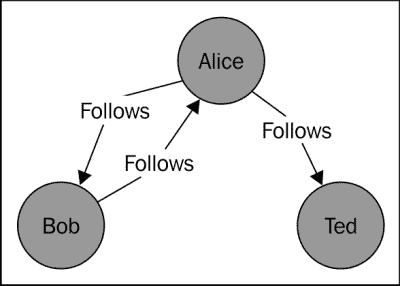
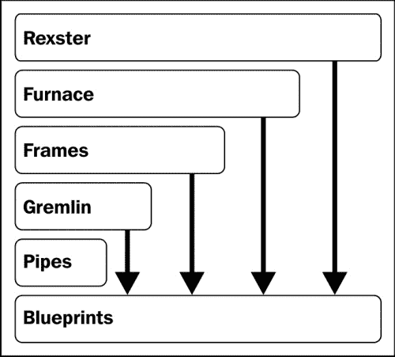
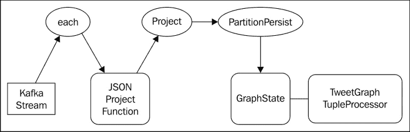

# 第五章实时图形分析

在本章中，我们将向您介绍使用 Storm 进行图形分析，将数据持久化到图形数据库并查询该数据以发现关系。 图形数据库是将数据存储为具有顶点、边和属性的图形结构的数据库，主要关注实体之间的关系。

随着 Twitter、Facebook 和 LinkedIn 等社交媒体网站的出现，社交图已经变得无处不在。 分析人与人之间的关系，他们购买的产品，他们提出的建议，甚至他们使用的词语，都可以被分析出来，以揭示使用传统数据模型难以实现的模式。 例如，当 LinkedIn 根据你的关系网显示你与另一个人只有四步之遥时，当 Twitter 提供可供关注的人的建议时，或者当亚马逊推荐你可能感兴趣的产品时，他们正在利用他们对你的关系图的了解。 图形数据库就是为这种类型的关系分析而设计的。

在本章中，我们将构建一个应用，该应用接收 Twitter Firehose(Twitter 用户发出的所有 tweet 的实时提要)的子集，并基于每条消息的内容在图形数据库中创建节点(顶点)和关系(边)，然后我们可以对其进行分析。 Twitter 中最明显的图表结构是基于用户之间的跟随/跟随关系，但是我们可以通过观察这些明确的关系来推断额外的关系。 通过查看消息的内容，我们可以使用消息元数据(hashtag、用户提及等)来识别，例如，提及相同主题或 tweet 相关 hashtag 的用户。 在本章中，我们将介绍以下主题：

*   图形数据库的基本概念
*   TinkerPop 图形 API
*   图形数据建模
*   与 TITAN 分布式图形数据库的交互
*   编写由图形数据库支持的Trident状态实现

# 使用案例

今天的社交媒体网站捕捉了大量的信息。 许多社交媒体服务，如 Twitter、Facebook 和 LinkedIn，很大程度上是基于关系：你关注的人、朋友或与之有商业联系的人。 除了明显和显性的关系之外，社交媒体互动还创造了一组持久的隐性联系，这些联系很容易被视为理所当然。 例如，在 Twitter 上，显而易见的关系由关注的人和关注的人组成。 不太明显的关系是仅仅通过使用该服务就创建的联系，也许是在不知不觉中创建的。 你有没有在推特上直接给别人发信息？ 如果是，那么你们已经建立了联系。 在推特上发了个网址？ 如果是，又是一个连接。 喜欢 Facebook 上的产品、服务或评论吗？ 连接。 即使是在推特或帖子中使用特定的单词或短语的行为也可以被认为是建立了一种联系。 通过使用这个词，你正在与它形成一种联系，通过反复使用它，你正在加强这种联系。

如果我们将数据视为“一切都是连接”，那么我们可以构建结构化数据集并对其进行分析，以公开更广泛的模式。 如果 Bob 不认识 Alice，但 Bob 和 Alice 都在 tweet 上发布了相同的 URL，我们可以从这一事实中推断出其中的联系。 随着数据集的增长，其值也将随着网络中连接数量的增加而增长(类似于梅特卡夫定律：[http://en.wikipedia.org/wiki/Metcalfe‘s_law](http://en.wikipedia.org/wiki/Metcalfe's_law))。

当我们开始查询数据集时，随着我们从不断增长的连接网络中收集模式，将数据存储在图形数据库中的价值很快就会显现出来。 我们执行的图形分析适用于许多真实世界的用例，包括：

*   定向广告
*   推荐引擎
*   情绪分析

# 架构

我们应用的架构相对简单。 我们将创建一个 Twitter 客户端应用，该应用读取 Twitter Firehose 的子集，并将每条消息作为 JSON 数据结构写入 Kafka 队列。 然后，我们将使用Kafka喷嘴将这些数据输入到我们的Storm拓扑中。 最后，我们的 Storm 拓扑将分析传入的消息并填充图形数据库。


## Twitter 客户端

Twitter提供了全面的 RESTful API，除了典型的请求-响应接口之外，该 API 还提供了支持长期连接的流 API。 Twitter4JJava 库([JSON](http://twitter4j.org/))与最新版本的 Twitter API 完全兼容，并使用干净的 Java API 处理所有底层细节(连接管理、http://twitter4j.org/身份验证和 JSON 解析)。 我们将使用 Twitter4J 连接到 Twitter 流 API。

## Kafka喷嘴

在前面的章中，我们开发了一个 Logback 附加器扩展，它允许我们轻松地将数据发布到 Kafka 队列，并且我们使用 Nathan Marz 的 Kafka spout([https://github.com/nathanmarz/storm-contrib](https://github.com/nathanmarz/storm-contrib))来使用 Storm 拓扑中的数据。 虽然使用 Twitter4J 和 Twitter 流 API 编写 Storm Spout 非常容易，但是使用 Kafka 和 Kafka Spout 为我们提供了事务性的、只有一次的语义和内置的容错能力，否则我们就必须自己实现这些功能。 有关安装和运行 Kafka 的更多信息，请参阅[第 4 章](04.html "Chapter 4. Real-time Trend Analysis")、*实时趋势分析*。

## 一种 TITAN 分布式图形数据库

Titan是一个分布式图形数据库，针对存储和查询图形结构进行了优化。 与 Storm 和 Kafka 一样，Titan 数据库可以作为集群运行，并且可以水平扩展以适应不断增加的数据量和用户负载。 Titan 将其数据存储在三个可配置存储后端之一：Apache Cassandra、Apache HBase 和 Oracle Berkely Database。 存储后端的选择取决于需要 CAP 定理的哪两个属性。 关于数据库，CAP 定理规定，分布式系统不能同时提供以下所有保证：

*   **一致性**：无论修改与否，所有客户端都能看到当前数据
*   **可用性**：尽管节点出现故障，系统仍会继续按预期运行
*   **分区容差**：系统在网络或消息故障的情况下仍能继续按预期运行


对于我们的用例，一致性对我们的应用并不重要。 我们更关心可伸缩性和容错。 如果我们查看上图中所示的 CAP 定理三角形，显然 Cassandra 是首选的存储后端。

# 图形数据库简介

图是对象(顶点)之间具有有向连接(边)的网络。 下图展示了一个简单的社交图，类似于你可能在 Twitter 上看到的：



在本例中，用户用顶点(节点)表示，关系用边(连接)表示。 请注意，图中的边是有向的，从而允许更多的表现力。 例如，这允许表达鲍勃和爱丽丝彼此跟随的事实，并且爱丽丝跟随泰德，但泰德没有跟随爱丽丝。 这种关系在没有有向边的情况下建模会更加麻烦。

许多图形数据库遵循属性图形模型。 属性图通过允许将一组属性(键-值对)分配给顶点和边来扩展基本图模型，如下图所示：


将属性元数据关联到图形模型中的对象和关系的能力为图形算法和查询提供了强大的支持元数据。 例如，向**Folders**Edge 添加**from**属性将使我们能够有效地查询在给定年份开始关注特定用户的所有用户。

与关系数据库相比，图形数据库中的关系是显式的，而不是隐式的。 图形数据库中的关系是成熟的数据结构，而不是隐式连接(即外键)。 在幕后，图形数据库的底层数据结构针对图形遍历进行了大量优化。 虽然完全可以在关系数据库中为图形建模，但它的效率通常低于以图形为中心的模型。 在关系数据模型中，遍历图结构的计算代价可能很高，因为它涉及连接许多表。 在图形数据库中，遍历节点之间的链接是一个更自然的过程。

## 访问图形-TinkerPop 堆栈

TinkerPop是一组开源项目，专注于图形技术，如数据库访问、数据流和图形遍历。 BluePrints 是 TinkerPop 堆栈的基础，它是用于与属性图交互的通用 Java API，其方式与 JDBC 为关系数据库提供通用接口的方式非常相似。 堆栈中的其他项目在该基础上添加了额外的功能，以便它们可以与实现 BluePrints API 的任何图形数据库一起使用。



TinkerPop 堆栈的组件包括：

*   **BluePrints**：GraphAPI BluePrints 是提供对属性图数据模型访问的接口集合。 实现可用于图形数据库，包括 Titan、Neo4J、MongoDB 等。
*   **Pipes**：数据流Processing Pipes是一个数据流框架，用于将各种数据操作定义和连接为流程图。 使用管道的基本体操作数据与 Storm 中的数据处理非常相似。 管道数据流是**有向无环图**(**DAG**)，非常类似于 Storm 拓扑。
*   **gremlin**：gremlin是一种图遍历语言。 它是一种基于 Java 的**领域特定语言**(**DSL**)，用于图形遍历、查询、分析和操作。 Gremlin 发行版附带了一个基于 Groovy 的 shell，它允许使用交互式分析和修改蓝图。
*   **FRAMES**：FRAMES是一个对象到图形映射框架，类似于 ORM，但为图形量身定做。
*   **FORNACE**：FORNACE项目旨在为蓝图属性图提供许多常见图形算法的实现。
*   **Rexster**：Rexster是一个图形服务器，它通过 REST API 和二进制协议公开蓝图。

出于我们的目的，我们将重点介绍 BluePrints API(用于从 Storm 拓扑填充图形)和 Gremlin(用于图形查询和分析)。

## 使用 BluePrints API 操作图表

BluePrints API非常简单。 下面的代码清单使用 BluePrints API 创建上图中描述的图形：

```scala
    Graph graph = new TinkerGraph();

    Vertex bob = graph.addVertex(null);
    bob.setProperty("name", "Bob");
    bob.setProperty("born", 1980);
    bob.setProperty("state", "Vermont");

    Vertex alice = graph.addVertex(null);
    alice.setProperty("name", "Alice");
    alice.setProperty("born", 1965);
    alice.setProperty("state", "New York");

    Vertex ted = graph.addVertex(null);
    ted.setProperty("name", "Ted");
    ted.setProperty("born", 1970);
    ted.setProperty("state", "Texas");

    Edge bobToAlice = graph.addEdge(null, bob, alice, "Follows");
    bobToAlice.setProperty("since", 2012);

    Edge aliceToBob = graph.addEdge(null, alice, bob, "Follows");
    aliceToBob.setProperty("since", 2011);

    Edge aliceToTed = graph.addEdge(null, alice, ted, "Follows");
    aliceToTed.setProperty("since", 2010);

    graph.shutdown();
```

第一行代码实例化了`com.tinkerpop.blueprints.Graph`接口的实现。 在本例中，我们创建了一个内存中的玩具图(`com.tinkerpop.blueprints.impls.tg.TinkerGraph`)用于探索。 稍后，我们将演示如何连接到分布式图形数据库。

### 提示

您可能想知道为什么我们要将`null`作为参数传递给第一个参数的`addVertex()`和`addEdge()`方法。 此参数实质上是对对象的唯一 ID 的底层蓝图实现的建议。 将`null`作为 ID 传入的效果只是让底层实现为新对象分配一个 ID。

## 使用 Gremlin 外壳操作图形

Gremlin 是构建在管道和蓝图 API 之上的高级 Java API。 除了 Java API，Gremlin还包括一个基于 Groovy 的 API，附带了一个交互式 shell(或 REPL)，允许您直接与蓝图交互。 Gremlin 外壳允许您创建和/或连接到外壳，并查询几乎任何蓝图图形。 下面的代码清单说明了执行 Gremlin shell 的过程：

```scala
./bin/gremlin.sh

         \,,,/
         (o o)
-----oOOo-(_)-oOOo-----
gremlin>
gremlin> g.V('name', 'Alice').outE('Follows').count()
==>2
```

除了查询图表之外，使用 Gremlin 创建和操作图表也很容易。 下面的代码清单由 Gremlin Groovy 代码组成，这些代码将创建与上图中所示相同的图形，并且是与 Java 代码等效的 Groovy 代码：

```scala
g = new TinkerGraph()
bob = g.addVertex()
bob.name = "Bob"
bob.born = 1980
bob.state = "Vermont"
alice = g.addVertex()
alice.name = "Alice"
alice.born=1965
alice.state = "New York"
ted = g.addVertex()
ted.name = "Ted"
ted.born = 1970
ted.state = "Texas"
bobToAlice = g.addEdge(bob, alice, "Follows")
bobToAlice.since = 2012
aliceToBob = g.addEdge(alice, bob, "Follows")
aliceToBob.since = 2011
aliceToTed = g.addEdge(alice, ted, "Follows")
aliceToTed.since = 2010
```

一旦我们构建了用于填充图形的拓扑并准备好分析图形数据，您将在本章后面的部分了解到更多关于使用 Gremlin API 和 DSL 的信息。

# 软件安装

我们正在构建的应用将利用 Apache Kafka 及其依赖项(Apache ZooKeeper)。 如果您尚未设置 ZooKeeper 和 Kafka，请按照[第 2 章](02.html "Chapter 2. Configuring Storm Clusters")、*配置 Storm Clusters*以及[第 4 章](04.html "Chapter 4. Real-time Trend Analysis")、*实时趋势分析*中的*ZooKeeper 安装*部分中的说明设置 ZooKeeper 和 Kafka。

## Titan 安装

要安装 TITAN，请从TITAN 的下载页面([https://github.com/thinkaurelius/titan/wiki/Downloads](https://github.com/thinkaurelius/titan/wiki/Downloads))下载TITAN 0.3.x 完整包，并使用以下命令将其解压到一个方便的位置：

```scala
wget http://s3.thinkaurelius.com/downloads/titan/titan-all-0.3.2.zip
unzip titan-all-0.3.2.zip

```

Titan 的完整分发包包括在任何支持的存储后端(Cassandra、HBase 和 BerkelyDB)上运行 Titan 所需的一切。 如果您只对使用特定的存储后端感兴趣，也有特定于后端的发行版。

### 备注

Storm 和 Titan 都使用 Kryo([JAVA](https://code.google.com/p/kryo/))库进行 https://code.google.com/p/kryo/对象序列化。 在撰写本文时，Storm 和 Titan 使用不同版本的 Kryo 库，当两者结合使用时会出现问题。

要修补 Titan 以便在 Storm 和 Titan 之间正确启用序列化，请将 Titan 分发版中的`kryo.jar`文件替换为 Storm 附带的`kryo.jar`文件：

```scala
cd titan-all-0.3.2/lib
rm kryo*.jar
cp $STORM_HOME/lib/kryo*.jar ./

```

此时，您可以通过运行 Gremlin shell 来测试安装：

```scala
$ cd titan
$ ./bin/gremlin.sh
 \,,,/
 (o o)
-----oOOo-(_)-oOOo-----
gremlin> g = GraphOfTheGodsFactory.create('/tmp/storm-blueprints')
==>titangraph[local:/tmp/storm-blueprints]
gremlin> g.V.map
==>{name=saturn, age=10000, type=titan}
==>{name=sky, type=location}
==>{name=sea, type=location}
==>{name=jupiter, age=5000, type=god}
==>{name=neptune, age=4500, type=god}
==>{name=hercules, age=30, type=demigod}
==>{name=alcmene, age=45, type=human}
==>{name=pluto, age=4000, type=god}
==>{name=nemean, type=monster}
==>{name=hydra, type=monster}
==>{name=cerberus, type=monster}
==>{name=tartarus, type=location}
gremlin>

```

`GraphOfTheGodsFactory`是一个包含在 Titan 中的类，它将创建并填充一个 Titan 数据库，其中包含一个表示罗马万神殿中人物和地点之间关系的示例图形。 将目录路径传递给`create()`方法将返回蓝图实现，特别是使用 BerkelyDB 和 Elasticsearch 组合作为存储后端的`com.thinkaurelius.titan.graphdb.database.StandardTitanGraph`实例。 由于 Gremlin shell 是一个 Groovy REPL，我们可以通过查看`g`变量的类来轻松地验证这一点：

```scala
gremlin> g.class.name
==>com.thinkaurelius.titan.graphdb.database.StandardTitanGraph

```

# 设置 Titan 以使用 Cassandra 存储后端

我们已经看到Titan 支持不同的存储后端。 探索所有三个选项超出了本章的范围(您可以在[http://thinkaurelius.github.io/titan/](http://thinkaurelius.github.io/titan/)了解更多关于 TITAN 及其配置选项的信息)，因此我们将重点介绍如何使用 Cassandra([http://cassandra.apache.org](http://cassandra.apache.org))存储后端。

## 安装 Cassandra

为了下载并运行 Cassandra，我们需要执行以下命令：

```scala
wget http://www.apache.org/dyn/closer.cgi?path=/cassandra/1.2.9/apache-cassandra-1.2.9-bin.tar.gz
tar -zxf ./cassandra-1.2.9.bin.tar.gz
cd cassandra-1.2.9
./bin/cassandra -f

```

Cassandra 发行版附带的默认文件将创建本地运行的单节点Cassandra 数据库。 如果在启动过程中出现错误，您可能需要通过编辑`${CASSANDRA_HOME}/conf/cassandra.yaml`和/或`${CASSANDRA_HOME}/conf/log4j-server.properties`文件来配置 Cassandra。 最常见的问题通常与在`/var/lib/cassandra`(默认情况下，Cassandra 存储数据的位置)和`/var/log/cassandra`(默认的 Cassandra 日志位置)上缺少文件写入权限有关。

## 使用 Cassandra 后端启动 Titan

要使用Cassandra 运行 Titan，我们需要将其配置为连接到我们的 Cassandra 服务器。 创建名为`storm-blueprints-cassandra.yaml`的新文件，其内容如下：

```scala
storage.backend=cassandra
storage.hostname=localhost

```

正如您可能猜测的那样，这会将 Titan 配置为连接到本地运行的 Cassandra 实例。

### 备注

对于这个项目，我们可能不需要实际运行 Titan 服务器。 由于我们使用的是 Cassandra，Storm 和 Gremlin 应该能够毫无问题地共享后端。

配置了 Titan后端之后，我们就可以创建我们的数据模型了。

# 图形数据模型

我们数据模型中的主要实体是 Twitter 用户。 Twitter 用户在发布推文时可以执行以下建立关系的操作：

*   用一个词
*   提到一个标签
*   提及其他用户
*   提及 URL
*   转发另一用户


这个概念非常自然地将映射到一个图形模型中。 在模型中，我们将有四种不同的图元类型(顶点)：

*   **用户**：这表示 Twitter 用户帐户
*   **word**：这表示 tweet 中包含的任何单词
*   **url**：这表示 tweet 中包含的任何 URL
*   **hashtag**：这表示 tweet 中包含的任何 hashtag

关系(边)将由以下操作组成：

*   **提及用户**：使用此操作，用户提及另一个用户
*   **RETWETTS_USER**：使用此操作，一个用户转发另一个用户的帖子
*   **Folders_User**：使用此操作，一个用户跟踪另一个用户
*   **提及 _hashtag**：使用此操作，用户提到了一个 hashtag
*   **USES_WORD**：使用此操作，用户在 tweet 中使用特定的单词
*   **提及 url**：使用此操作，用户在 tweet 上发布特定的 URL

用户顶点对用户的 Twitter 帐户信息进行建模，如下表所示：

<colgroup><col style="text-align: left"> <col style="text-align: left"> <col style="text-align: left"></colgroup> 
| 

用户[顶点]

 |
| --- |
| 类型 / 品种 / 象征 / 印刷文字 | 细绳 | `"user"` |
| 使用者 / 权利继续享有 / 吸毒者 / 用户 | 细绳 | Twitter 屏幕名称 |
| 名字 / 姓名 / 姓 / 名人 | 细绳 | 推特名称 |
| 地点 / 外景地 / 设置 / 外景拍摄场地 | 细绳 | 推特位置 |

URL 顶点为唯一 URL 提供参考点：

<colgroup><col style="text-align: left"> <col style="text-align: left"> <col style="text-align: left"></colgroup> 
| 

URL[顶点]

 |
| --- |
| 类型 / 品种 / 象征 / 印刷文字 | 细绳 | `"url"` |
| 重要性 / 价值观念 / 标准 / 值 | 细绳 | 统一资源定位器 |

标签顶点允许我们存储唯一的标签：

<colgroup><col style="text-align: left"> <col style="text-align: left"> <col style="text-align: left"></colgroup> 
| 

[顶点]

 |
| --- |
| 类型 / 品种 / 象征 / 印刷文字 | 细绳 | `"hashtag"` |
| 重要性 / 价值观念 / 标准 / 值 | 细绳 |   |

我们将单个单词存储在单词 vertex 中：

<colgroup><col style="text-align: left"> <col style="text-align: left"> <col style="text-align: left"></colgroup> 
| 

单词[顶点]

 |
| --- |
| 类型 / 品种 / 象征 / 印刷文字 | 细绳 | `"word"` |
| 重要性 / 价值观念 / 标准 / 值 | 细绳 |   |

`mentions_user`边用于用户对象之间的关系：

<colgroup><col style="text-align: left"> <col style="text-align: left"> <col style="text-align: left"></colgroup> 
| 

提及用户[边](_U)

 |
| --- |
| 使用者 / 权利继续享有 / 吸毒者 / 用户 | 细绳 | 提到的用户的 ID |

`mentions_url`边表示用户和 URL 对象之间的关系：

<colgroup><col style="text-align: left"> <col style="text-align: left"> <col style="text-align: left"></colgroup> 
| 

提及 URL[边缘](_U)

 |
| --- |
| 使用者 / 权利继续享有 / 吸毒者 / 用户 | 细绳 | 提到的用户的 ID |

# 连接到 Twitter 流

为了连接到Twitter API，我们必须首先生成一组 OAuth 令牌，使我们的应用能够通过 Twitter 进行身份验证。 这是通过创建与您的帐户相关联的 Twitter 应用，然后授权该应用访问您的帐户来实现的。 如果您还没有 Twitter 帐户，请立即创建一个并登录。 登录 Twitter 后，请按照以下步骤生成 OAuth 令牌：

1.  如有必要，请转到[https://dev.twitter.com/apps/new](https://dev.twitter.com/apps/new)并登录。
2.  输入应用的名称和说明。
3.  输入应用的 URL。 在我们的例子中，URL 并不重要，因为我们不是在创建一个将像移动应用一样分发的应用。 在这里输入占位符 URL 就可以了。
4.  提交表格。 下一页将显示应用的 OAuth 设置的详细信息。 请注意**Consumer Key**和**Consumer Secret**值，因为我们的应用需要这些值。
5.  在页面底部，单击**创建我的访问令牌**按钮。 这将生成一个 OAuth 访问令牌和一个密钥，允许应用代表您访问您的帐户。 我们的应用也需要这些值。 请勿共享这些值，因为它们会允许其他人以您的身份进行身份验证。

## 设置 Twitter4J 客户端

Twitter4J 客户端被分成许多不同的模块，这些模块可以根据我们的需要拼凑在一起。 出于我们的目的，我们需要`core`模块来提供基本功能，如 HTTP 传输、OAuth 和对基本 Twitter API 的访问。 我们还将使用`stream`模块访问流 API。 通过添加以下 Maven 依赖项，可以将这些模块包括在项目中：

```scala
    <dependency>
      <groupId>org.twitter4j</groupId>
      <artifactId>twitter4j-core</artifactId>
      <version>3.0.3</version>
    </dependency>
    <dependency>
      <groupId>org.twitter4j</groupId>
      <artifactId>twitter4j-stream</artifactId>
      <version>3.0.3</version>
    </dependency>
```

## OAuth 配置

默认情况下，Twitter4J 将在类路径中搜索`twitter4j.properties`文件，并从该文件加载 OAuth 令牌。 要做到这一点，最简单的方法是在 Maven 项目的`resources`文件夹中创建该文件。 将您先前生成的令牌添加到此文件：

```scala
oauth.consumerKey=[your consumer key]
oauth.consumerSecret=[your consumer secret]
oauth.accessToken=[your access token]
oauth.accessTokenSecret=[your access token secret]
```

现在我们可以使用Twitter4J 客户端连接到 Twitter 的 StreamingAPI 来实时消费 tweet 了。

### TwitterStreamConsumer 类

我们的Twitter 客户端的目的很简单；它将执行以下功能：

*   连接到 Twitter 流 API
*   请求按一组关键字过滤的推文流
*   根据状态消息创建 JSON 数据结构
*   将 JSON 数据写入 Kafka 以供 Kafka 管口使用

`TwitterStreamConsumer`类的`main()`方法创建一个`TwitterStream`对象，并将`StatusListener`的一个实例注册为侦听器。 `StatusListener`接口用作异步事件处理程序，每当发生与流相关的事件时都会通知该处理程序：

```scala
    public static void main(String[] args) throws TwitterException, IOException {

        StatusListener listener = new TwitterStatusListener();
        TwitterStream twitterStream = new TwitterStreamFactory().getInstance();
        twitterStream.addListener(listener);

        FilterQuery query = new FilterQuery().track(args);
        twitterStream.filter(query);

    }
```

注册侦听器之后，我们创建一个`FilterQuery`对象来根据一组关键字筛选流。 为方便起见，我们使用程序参数作为关键字列表，以便可以从命令行轻松更改筛选条件。

### TwitterStatusListener 类

在我们的应用中，`TwitterStatusListener`类执行大部分繁重的任务。 `StatusListener`类为流的生存期内可能发生的事件定义了几个回调方法。 我们最感兴趣的是`onStatus()`方法，因为只要有新的 Tweet 到达，它就会收到调用。 以下是`TwitterStatusListener`类的代码：

```scala
    public static class TwitterStatusListener implements StatusListener {
        public void onStatus(Status status) {

            JSONObject tweet = new JSONObject();
            tweet.put("user", status.getUser().getScreenName());
            tweet.put("name", status.getUser().getName());
            tweet.put("location", status.getUser().getLocation());
            tweet.put("text", status.getText());

            HashtagEntity[] hashTags = status.getHashtagEntities();
            System.out.println("# HASH TAGS #");
            JSONArray jsonHashTags = new JSONArray();
            for (HashtagEntity hashTag : hashTags) {
                System.out.println(hashTag.getText());
                jsonHashTags.add(hashTag.getText());
            }
            tweet.put("hashtags", jsonHashTags);

            System.out.println("@ USER MENTIONS @");
            UserMentionEntity[] mentions = status.getUserMentionEntities();
            JSONArray jsonMentions = new JSONArray();
            for (UserMentionEntity mention : mentions) {
                System.out.println(mention.getScreenName());
                jsonMentions.add(mention.getScreenName());
            }
            tweet.put("mentions", jsonMentions);

            URLEntity[] urls = status.getURLEntities();
            System.out.println("$ URLS $");
            JSONArray jsonUrls = new JSONArray();
            for (URLEntity url : urls) {
                System.out.println(url.getExpandedURL());
                jsonUrls.add(url.getExpandedURL());
            }
            tweet.put("urls", jsonUrls);

            if (status.isRetweet()) {
                JSONObject retweetUser = new JSONObject();
                retweetUser.put("user", status.getUser().getScreenName());
                retweetUser.put("name", status.getUser().getName());
                retweetUser.put("location", status.getUser().getLocation());
                tweet.put("retweetuser", retweetUser);
            }
            KAFKA_LOG.info(tweet.toJSONString());
        }

        public void onDeletionNotice(StatusDeletionNotice statusDeletionNotice) {
        }

        public void onTrackLimitationNotice(int numberOfLimitedStatuses) {

            System.out.println("Track Limitation Notice: " + numberOfLimitedStatuses);
        }

        public void onException(Exception ex) {
            ex.printStackTrace();
        }

        public void onScrubGeo(long arg0, long arg1) {
        }

        public void onStallWarning(StallWarning arg0) {

        }
    }
```

除了状态消息的原始文本之外，`Status`对象还包括用于访问所有相关元数据的便捷方法，例如 tweet 中包含的用户信息、标签、URL 和用户提及。 我们的`onStatus()`方法的大部分在最终通过 Logback Kafka 附加器将其记录到 Kafka 队列之前构建 JSON 结构。

# 推特图拓扑

Twitter 图形拓扑将从 Kafka 队列中读取原始 tweet 数据，解析出相关信息，然后在 Titan 图形数据库中创建节点和关系。 我们不是为收到的每个元组单独写入图形数据库，而是实现一个Trident状态实现，以便使用Trident的事务机制批量执行持久化操作。

这种方法提供了几个好处。 首先，对于图形数据库，比如支持事务的 Titan，我们可以利用这一功能来提供额外的只处理一次的保证。 其次，它允许我们对整批元组执行批量写入，然后执行批量提交(如果支持)，而不是对每个单独的元组执行写提交操作。 最后，通过使用通用蓝图 API，我们的Trident状态实现将在很大程度上与底层图形数据库实现无关，从而允许任何蓝图图形数据库后端轻松地交换进来和换出。



拓扑的第一个组件由我们在[章](07.html "Chapter 7. Integrating Druid for Financial Analytics")，*集成 Druid for Financial Analytics*中开发的`JSONProjectFunction,which`组成，它简单地解析原始 JSON 数据以仅提取我们感兴趣的信息。 在本例中，我们主要对消息的时间戳和 Twitter 状态消息的 JSON 表示感兴趣。

## JSONProjectFunction 类

以下是解释`JSONProjectFunction`类的代码片段：

```scala
public class JsonProjectFunction extends BaseFunction {

    private Fields fields;

    public JsonProjectFunction(Fields fields) {
        this.fields = fields;
    }

    public void execute(TridentTuple tuple, TridentCollector collector) {
        String json = tuple.getString(0);
        Map<String, Object> map = (Map<String, Object>) JSONValue.parse(json);
        Values values = new Values();
        for (int i = 0; i < this.fields.size(); i++) {
            values.add(map.get(this.fields.get(i)));
        }
        collector.emit(values);
    }

}
```

# 实现 GraphState

拓扑的核心将是一个Trident状态实现，负责将Trident元组转换为图结构并持久化它们。 回想一下，Trident状态实施由三个组件组成：

*   `StateFactory`：`StateFactory`接口定义了Trident用来创建持久`State`对象的方法。
*   `State`：Trident`State`接口定义了在将Trident批处理分区写入后备存储器之前和之后调用的`beginCommit()`和`commit()`方法。 如果写入成功(也就是说，处理所有元组都没有错误)，则Trident将调用`commit()`方法。
*   `StateUpdater`：`StateUpdater`接口定义了在给定一批元组的情况下，为更新状态而调用的`updateState()`方法。 Trident 向此方法传递三个参数：要更新的`State`对象、表示批处理分区的`TridentTuple`对象列表，以及可用于在状态更新后有选择地发出额外元组的`TridentCollector`实例。

除了Trident提供的这些抽象之外，我们还将引入两个额外的接口，它们将支持任何蓝图图形数据库(`GraphFactory`)的使用，并隔离任何特定于用例的业务逻辑(`GraphTupleProcessor`)。 在深入到Trident状态实现之前，让我们快速了解一下这些接口。

## GraphFactory

`GraphFactory`接口约定很简单：给定一个表示Storm和拓扑配置的`Map`对象，返回一个`com.tinkerpop.blueprints.Graph`实现。

```scala
GraphFactory.java
public interface GraphFactory {
    public Graph makeGraph(Map conf);
}
```

该接口允许我们简单地通过提供`makeGraph()`方法的实现来插入任何与蓝图兼容的图形实现。 稍后，我们将实现此接口以返回到 Titan 图形数据库的连接。

## GraphTupleProcessor

`GraphTupleProcessor`接口提供了Trident状态实现和任何特定于用例的业务逻辑之间的抽象。

```scala
public interface GraphTupleProcessor {

    public void process(Graph g, TridentTuple tuple, TridentCollector collector);

}
```

在给定图形对象`TridentTuple`和`TridentCollector`的情况下，操纵图形并可选地发出额外的元组是`GraphTupleProcessor`的工作。 在本章的后面部分，我们将实现此接口以基于 Twitter 状态消息的内容填充图形。

## GraphStateFactory

Trident的`StateFactory`接口表示状态实现的入口点。 当使用状态组件的Trident拓扑(通过`Stream.partitionPersist()`和`Stream.persistentAggregate()`方法)初始化时，Storm 调用`StateFactory.makeState()`方法为每个批处理分区创建一个 State 实例。 批处理分区的数量由流的并行度确定。 Storm 通过`numPartitions`和`partitionIndex`参数将此信息传递给`makeState()`方法，允许状态实现在必要时执行特定于分区的逻辑。

在我们的用例中，我们不关心分区，因此`makeState()`方法只使用`GraphFactory`实例来实例化用于构造`GraphState`实例的`Graph`实例。

```scala
GraphStateFactory.java
public class GraphStateFactory implements StateFactory {

    private GraphFactory factory;

    public GraphStateFactory(GraphFactory factory){
        this.factory = factory;
    }

    public State makeState(Map conf, IMetricsContext metrics, int partitionIndex, int numPartitions) {
        Graph graph = this.factory.makeGraph(conf);
        State state = new GraphState(graph);
        return state;
    }

}
```

## 图形状态

我们的`GraphState`类提供了`State.beginCommit()`和`State.commit()`方法的实现，当批处理分区即将发生和成功完成时，将分别调用这两个方法。 在我们的示例中，我们覆盖`commit()`方法以检查内部`Graph`对象是否支持事务，如果支持，则调用`TransactionalGraph.commit()`方法来完成事务。

### 备注

如果在一个Trident批处理中出现故障并重放该批处理，则可以多次调用`State.beginCommit()`方法，而当所有分区状态更新都成功完成时，只会调用一次`State.commit()`方法。

`GraphState`类的代码片段如下所示：

```scala
GraphState.java
public class GraphState implements State {

    private Graph graph;

    public GraphState(Graph graph){
        this.graph = graph;
    }

    @Override
    public void beginCommit(Long txid) {}

    @Override
    public void commit(Long txid) {
        if(this.graph instanceof TransactionalGraph){
            ((TransactionalGraph)this.graph).commit();
        }
    }

    public void update(List<TridentTuple> tuples, TridentCollector collector, GraphTupleProcessor processor){
        for(TridentTuple tuple : tuples){
            processor.process(this.graph, tuple, collector);
        }
    }

}
```

`GraphState.update()`方法在对`State.beginCommit()`和`State.commit()`方法的调用之间执行事务的核心处理。 如果`update()`方法对所有批处理分区都成功，则Trident事务将完成，并将调用`State.commit()`方法。

请注意，实际更新图形状态的`update()`方法只是`GraphState`类的公共方法，不会被覆盖。 正如您将看到的，我们将有机会在我们的`StateUpdater`实现中直接调用此方法。

## 图形更新器

`GraphUpdater`类实现 Storm 将在调用`State.beginCommit()`之后立即调用的`updateState()`方法(在批处理失败/重放的情况下可能会重复调用)。 `StateUpdater.updateState()`方法的第一个参数是我们用来调用`GraphState.update()`方法的状态实现的 Java 泛型类型的实例。

```scala
GraphUpdater.java
public class GraphUpdater extends BaseStateUpdater<GraphState> {

    private GraphTupleProcessor processor;

    public GraphUpdater(GraphTupleProcessor processor){
        this.processor = processor;
    }

    public void updateState(GraphState state, List<TridentTuple> tuples, TridentCollector collector) {
        state.update(tuples, collector, this.processor);
    }

}
```

# 实现 GraphFactory

我们在前面定义的`GraphFactory`接口创建了一个 TinkerPop Graph 实现，其中`Map`对象表示 Storm 配置。 以下代码说明如何创建由 Cassandra 支持的`TitanGraph`：

```scala
TitanGraphFactory.java
public class TitanGraphFactory implements GraphFactory {

    public static final String STORAGE_BACKEND = "titan.storage.backend";
    public static final String STORAGE_HOSTNAME = "titan.storage.hostname";

    public Graph makeGraph(Map conf) {
        Configuration graphConf = new BaseConfiguration();
        graphConf.setProperty("storage.backend", conf.get(STORAGE_BACKEND));
        graphConf.setProperty("storage.hostname", conf.get(STORAGE_HOSTNAME));

        return TitanFactory.open(graphConf);
    }
}
```

# 实现 GraphTupleProcessor

为了用从 Twitter 状态消息收集的关系填充图形数据库，我们需要实现`GraphTupleProcessor`接口。 下面的代码演示了如何解析 Twitter 状态消息的 JSON 对象，并创建具有`"mentions"`关系的`"user"`和`"hashtag"`顶点。

```scala
TweetGraphTupleProcessor.java
public class TweetGraphTupleProcessor implements GraphTupleProcessor {
    @Override
    public void process(Graph g, TridentTuple tuple, TridentCollector collector) {
        Long timestamp = tuple.getLong(0);
        JSONObject json = (JSONObject)tuple.get(1);

        Vertex user = findOrCreateUser(g, (String)json.get("user"), (String)json.get("name"));

        JSONArray hashtags = (JSONArray)json.get("hashtags");
        for(int i = 0; i < hashtags.size(); i++){
            Vertex v = findOrCreateVertex(g, "hashtag", ((String)hashtags.get(i)).toLowerCase());
            createEdgeAtTime(g, user, v, "mentions", timestamp);
        }

    }
}
```

# 把它们放在一起-TwitterGraphTopology 类

创建最终拓扑包括以下步骤：

*   食用Kafka喷嘴上的生 JSON
*   仅提取和投影我们感兴趣的数据
*   构建Trident`GraphState`实现并将其连接到我们的流

## TwitterGraphTopology 类

让我们详细看看 TwitterGraphTopology 类。

```scala
public class TwitterGraphTopology {
    public static StormTopology buildTopology() {
        TridentTopology topology = new TridentTopology();

        StaticHosts kafkaHosts = StaticHosts.fromHostString(Arrays.asList(new String[] { "localhost" }), 1);
        TridentKafkaConfig spoutConf = new TridentKafkaConfig(kafkaHosts, "twitter-feed");
        spoutConf.scheme = new StringScheme();
        spoutConf.forceStartOffsetTime(-2);
        OpaqueTridentKafkaSpout spout = new OpaqueTridentKafkaSpout(spoutConf);

        Stream spoutStream = topology.newStream("kafka-stream", spout);

        Fields jsonFields = new Fields("timestamp", "message");
        Stream parsedStream = spoutStream.each(spoutStream.getOutputFields(), new JsonProjectFunction(jsonFields), jsonFields);
        parsedStream = parsedStream.project(jsonFields);
        // Trident State
        GraphFactory graphFactory = new TitanGraphFactory();
        GraphUpdater graphUpdater = new GraphUpdater(new TweetGraphTupleProcessor());

        StateFactory stateFactory = new GraphStateFactory(graphFactory);
        parsedStream.partitionPersist(stateFactory, parsedStream.getOutputFields(), graphUpdater, new Fields());

        return topology.build();
    }

    public static void main(String[] args) throws Exception {
        Config conf = new Config();
        conf.put(TitanGraphFactory.STORAGE_BACKEND, "cassandra");
        conf.put(TitanGraphFactory.STORAGE_HOSTNAME, "localhost");

        conf.setMaxSpoutPending(5);
        if (args.length == 0) {
            LocalCluster cluster = new LocalCluster();
            cluster.submitTopology("twitter-analysis", conf, buildTopology());

        } else {
            conf.setNumWorkers(3);
            StormSubmitter.submitTopology(args[0], conf, buildTopology());
        }
    }
}
```

要运行应用，首先要执行`TwitterStreamConsumer`类，传入要用来查询 Twitter 防火墙的关键字列表。 例如，如果我们想要构建一个用户讨论大数据的图表，我们可以使用`bigdata`和`hadoop`作为查询参数：

```scala
java TwitterStreamConsumer bigdata hadoop
```

`TwitterStreamConsumer`类将连接到 Twitter 流 API，并开始将数据排队到 Kafka。 运行`TwitterStreamConsumer`应用后，我们可以部署`TwitterGraphTopology`开始填充 Titan 数据库。

让`TwitterStreamConsumer`和`TwitterGraphTopology`运行一段时间。 根据用于查询的关键字的流行程度，数据集可能需要一些时间才能增长到有意义的级别。 然后，我们可以使用 Gremlin shell 连接到 Titan，用图形查询来分析数据。

# 用 Gremline 查询图形

要查询图形，我们需要启动 gremlin shell 并创建一个连接到本地 Cassandra 后端的`TitanGraph`实例：

```scala
$ cd titan
$ ./bin/gremlin.sh
          \,,,/
         (o o)
-----oOOo-(_)-oOOo-----
gremlin> conf = new BaseConfiguration()
gremlin> conf.setProperty('storage.backend', 'cassandra')
gremlin> conf.setProperty('storage.hostname', 'localhost')
gremlin> g = TitanFactory.open(conf)
```

现在，`g`变量包含一个`Graph`对象，我们可以使用它来发出图遍历查询。 以下是可用于入门的几个示例查询：

*   要查找所有发过`#hadoop hashtag`推文的用户并显示他们这样做的次数，请使用以下代码：

    ```scala
    gremlin> g.V('type', 'hashtag').has('value', 'hadoop').in.userid.groupCount.cap

    ```

*   要统计`#hadoop hashtag`的推特次数，请使用以下代码：

    ```scala
    gremlin> g.V.has('type', 'hashtag').has('value', 'java').inE.count()

    ```

GremlinDSL 非常强大；涵盖完整的 API 可以填满整章(如果不是整本书的话)。 要进一步了解 Gremlin 语言，我们建议您浏览以下在线文档：

*   [https://github.com/tinkerpop/gremlin/wiki](https://github.com/tinkerpop/gremlin/wiki)的官方 Gremlin Wiki
*   位于[http://gremlindocs.com](http://gremlindocs.com)的 GremlinDocs 参考指南
*   [http://sql2gremlin.com](http://sql2gremlin.com)的 SQL2Gremlin(示例 SQL 查询及其 gremlin 等效项)

# 摘要

在本章中，我们通过创建一个拓扑向您介绍了图形数据库，该拓扑监视 Twitter 消防软管的子集，并将该信息持久化到 Titan 图形数据库以供进一步分析。 我们还通过使用前面章节中的通用构建块(如 Logback Kafka 附加器)演示了通用组件的重用。

虽然图形数据库并不适用于所有用例，但它们是您的多语言持久化工具武器库中的强大武器。 多语言持久化是一个术语，通常用于描述涉及多种类型的数据存储(如关系、键值、图形、文档等)的软件体系结构。 多语种持久化就是为正确的工作选择正确的数据库。 在本章中，我们向您介绍了图形数据模型，并希望能启发您探索图形可能是支持给定用例的最佳数据模型的情况。 在本书的后面部分，我们将创建一个 Storm 应用，该应用将数据持久存储到多个数据存储中，每个数据存储都有特定的用途。