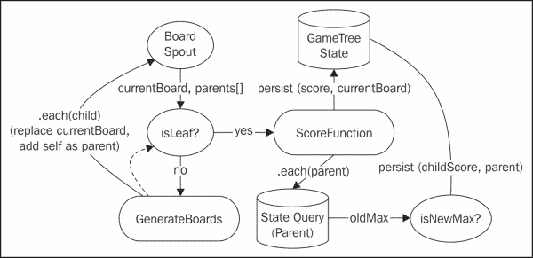
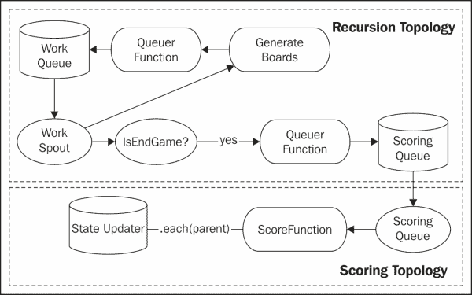

# 第六章人工智能

在前面的章节中，我们看到了使用 Storm 进行实时分析与使用 Hadoop 进行批处理相结合的模式。 在本章中，我们将朝着相反的方向前进。 我们将把 Storm 整合到一个必须实时响应终端用户查询的操作系统中。

Storm 的典型应用程序关注的是永无止境的数据流。 数据通常通过持久拓扑以尽可能快的速度排队和处理。 该系统包括一个队列以容纳不同的负载量。 在负载较轻的时候，队列是空的。 在高负载期间，队列将持久化数据以供最终处理。

即使是未经训练的眼睛也会认识到，这样的系统不提供真正的实时数据处理。 Storm 监视元组超时，但它关注的是喷出发出数据后元组的处理时间。

为了更全面地支持实时场景，从接收数据到发送响应，必须监控超时和**服务级别协议**(**SLA**)。 如今，请求通常是通过基于 HTTP 的 API 接收的，响应时间 SLA 必须为亚秒级。

HTTP是同步协议。 它通常引入像队列这样的异步机制，使系统复杂化，并引入额外的延迟。 因此，当通过 HTTP 公开特性和功能时，我们通常更喜欢与所涉及的组件进行同步集成。

在本章中，我们将探索 Storm 在公开 Web 服务 API 的架构中的位置。 具体地说，我们将构建世界上最好的 tic-tac-toe**人工智能**(**AI**)系统。 我们的系统将包括同步子系统和异步子系统。 系统的异步部分将持续工作，探索游戏状态的最佳选择。 同步组件公开 web 服务接口，该 web 服务接口在给定游戏状态的情况下返回可能的最佳走法。

本章涵盖以下主题：

*   风暴中的递归
*   分布式远程过程调用(DRPC)
*   分布式先读后写范式

# 针对我们的用例进行设计

人工智能世界的“你好世界”就是井字游戏(tic-tac-toe)。 坚持的传统，我们也将使用它作为我们的主题游戏，尽管其架构和方法远远超出了这个简单的示例(例如，全球热核战争；有关其他用例，请参考 John Badham 的*战争游戏*)。

Tc-tac-toe是 XES 和 O 的双人游戏。 黑板是一个 3x3 的格子。 一个牌手的符号是 O，另一个牌手的符号是 X，游戏轮流进行。 在一个回合中，玩家将他们的符号放置在网格中任何开放的单元格中。 如果通过放置它们的符号，它完成了一条由三个连续符号组成的水平、垂直或对角线，则该玩家获胜。 如果所有的单元格都填满了，而没有排成一条三人的线，那么这场比赛就是平局。

为交替轮换的游戏开发人工智能程序的一种常见方法是递归地探索博弈树，搜索对当前玩家(或对对手更差)评估最好的游戏状态。 博弈树是节点为游戏状态的树结构。 节点的直接子节点是游戏状态，可以通过合法地离开该节点的游戏状态来实现。

下图显示了 tic-tac-toe 的示例游戏树：


遍历博弈树寻找最佳走法的最简单算法是**Minimax**算法。 算法递归地对每个棋盘进行评分，并返回找到的最佳分数。 对于这个算法，我们假设对手的好分数对当前玩家来说是一个坏分数。 因此，该算法实际上在最大化和最小化当前棋盘得分之间交替。 Minimax 算法可以用以下伪代码进行总结：

```scala
miniMax (board, depth, maximizing)
   if (depth <= 0) 
      return score (board)
   else
      children = move(board)
      if (maximizing)
         bestValue = -∞
      for (child : children)
         value = miniMax (child, depth-1, false)
         if (value > bestValue)
            bestValue = value
         end
end
return bestValue
      else // minimizing
         bestValue = ∞
      for (child : children)
         value = miniMax (child, depth-1, false)
         if (value < bestValue)
            bestValue = value
         end
end
return bestValue
end
end
```

客户端调用具有游戏状态、深度和布尔变量的算法，该布尔变量指示该算法应该寻求最大化还是最小化得分。 在我们的用例中，游戏状态完全由棋盘封装，棋盘是一个 3x3 网格，部分填充了 X 和 O。

该算法是递归的。 代码的前几行是基本情况。 这确保了算法不会无休止地递归。 这取决于深度变量。 在交替转弯的游戏中，深度表示算法应该探索的转弯次数。

在我们的用例中，Storm 拓扑不需要跟踪深度。 我们将让 Storm 拓扑无休止地探索(或者直到没有新的电路板从`move`方法返回)。

通常情况下，每个玩家都被给予一定的时间，并且必须在分配的时间内移动。 由于我们更可能会有坐立不安的人类玩家与人工智能竞争，让我们假设系统需要在不到 200 毫秒的时间内做出反应。

在算法检查了基本情况之后，它调用`move()`方法，该方法返回所有可能移动的棋盘。 然后，该算法循环遍历所有可能的子板。 如果最大化，算法会找到得分最高的子板。 如果最小化，算法会找到得分最低的棋盘。

### 提示

**Negamax**算法通过更改分数的符号更简洁地完成了同样的操作。 此外，在实际场景中，我们可能会应用 Alpha-Beta 修剪，这会尝试修剪所探索的树的分支。 该算法只考虑落入阈值内的分支。 在我们的用例中，这是不必要的，因为搜索空间足够小，可以进行整体探索。

在我们的简单用例中，可以枚举整个游戏树。 在更复杂的游戏中，如国际象棋，博弈树是无法枚举的。 在围棋这样的极端情况下，专家们计算出法律委员会的数量超过了 2x10170 个。

Minimax 算法的目标是遍历博弈树，并为每个节点分配分数。 在我们的 Storm 拓扑中，不受任何 SLA 约束，任何非叶子节点的得分都是其后代的最大(或最小)得分。 对于叶节点，我们必须将游戏状态解释为相应的分数。 在我们的简单用例中，有三种可能的结果：我们赢了，我们的对手赢了，或者比赛是平局。

然而，在我们的同步系统中，我们很可能在到达叶节点之前就用完了时间。 在这种情况下，我们需要根据棋盘的当前状态计算分数。 评分启发式通常是开发 AI 应用程序最困难的方面。

对于我们的简单用例，我们将通过考虑网格中的线条来计算任何板的分数。 有八条线需要考虑：三条水平线、三条垂直线和两条对角线。 根据下表，每一行都对分数有贡献：

<colgroup><col style="text-align: left"> <col style="text-align: left"></colgroup> 
| 

地位 / 状态 / 身份

 | 

得分 / 音乐总谱 / 分数 / 配乐

 |
| --- | --- |
| 目前的选手连胜三场 | +1000 |
| 为当前玩家连续两次 | +10 |
| 当前玩家连续一次 | +1. |
| 对手连胜三场 | -1000-1000 |
| 对手连胜两场 | -10 |
| 对手连胜一局 | -1 |

仅当行中的其余单元格为空时，上表才适用。 尽管对前面的启发式方法有改进，但它对于这个示例就足够了。 而且，由于我们希望 Storm 在我们的游戏树上持续工作，我们希望不要太依赖启发式。 相反，我们将直接依赖叶得分的最小值(或最大值)，它将始终是胜利(+1000)、失败(-1000)或平局(0)。

最后，有了一种方法、我们的算法和一个评分函数，我们就能够继续进行架构和设计了。

# 建立架构

检查前面的算法，有许多有趣的设计和架构考虑因素，特别是考虑到 Storm 的当前状态。 该算法需要递归。 我们还需要一种同步处理请求的方法。 Storm 中的递归是一个不断发展的主题，虽然 Storm 提供了与拓扑同步交互的方法，但当与递归需求结合在一起时，这会带来一些独特而有趣的挑战。

## 检查设计挑战

最初，原生Storm 提供了一种为异步过程调用提供服务的机制。 该功能是**分布式远程过程调用**(**DRPC**)。 DRPC允许客户端通过直接向拓扑提交数据来请求拓扑。 有了 DRPC，一个简单的 RPC 客户端就像一个喷嘴。

随着三叉戟的出现，DRPC 在原生风暴中被弃用，现在只在三叉戟中正式支持。

虽然已经有一些关于递归/非线性 DRPC 的探索性工作(这是我们在这里需要的)，但它不是主流功能([https://groups.google.com/forum/#！topic/storm-user/hk3opTiv3Kc](https://groups.google.com/forum/#!topic/storm-user/hk3opTiv3Kc))。

此外，该工作将依赖于本机 Storm 中不推荐使用的类。 因此，我们需要找到在不依赖 Storm 的情况下创建递归结构的替代方法。

一旦我们找到实现递归的构造，我们需要能够同步调用相同的功能。 寻求利用 Storm 提供的功能意味着将 DRPC 调用整合到我们的体系结构中。

## 实现递归

如果我们将我们的算法直接映射到 Storm 构造，我们会期待一种允许流将数据反馈到自身的方法。 我们可以想象类似于以下逻辑数据流的拓扑：



`BoardSpout`函数在`currentBoard`字段中发出一个电路板(例如，3x3 数组)，其中第二个字段名为`parents`，将用于存储所有父节点。 `parents`字段最初将为空。

`isLeaf`过滤器决定这是否为结束状态(例如，赢、输或平局)。 如果`currentBoard`字段不是结束状态，则`GenerateBoards`函数发出所有新的线路板，用子线路板替换`currentBoard`字段的值，并将`currentBoard`字段添加到`parents`字段的节点列表中。 `GenerateBoards`函数可以绕过喷嘴将元组发回喷嘴或直接送入`isLeaf`过滤器。

如果`isLeaf`筛选器确定这是结束状态，我们需要给`currentBoard`字段评分，然后更新所有父级以反映新的分数。 `ScoreFunction` 计算棋盘的分数，并将其保存到`GameTree State`。

为了更新个父节点，我们遍历每个父节点并查询该节点的当前最大值(或最小值)。 如果孩子的分数是一个新的最大值(或最小值)，那么我们将持久化新值。

### 提示

这只是一个逻辑数据流。 构建这样的拓扑不仅是不可能的，而且出于以下各节中描述的原因，也不建议这样做。

您已经看到，这个数据流并不像我们的伪代码那样简单。 在三叉戟和 Storm 中有一些限制，迫使我们引入额外的复杂性，而且，并非数据流中阐述的所有操作在 Storm/Trident 中都可用。 让我们更仔细地研究一下这个数据流。

### 访问函数的返回值

首先，请注意，我们被迫以父级列表的形式维护我们自己的调用堆栈，因为 Storm 和 Trident 没有任何机制来访问拓扑中下游函数的结果。 在经典递归中，递归方法调用的结果在函数中立即可用，并且可以合并到该方法的结果中。 因此，前面的数据流类似于解决问题的更迭代的方法。

### 不可变的元组字段值

其次，在前面的数据流中，我们调用了一种神奇的功能来替换字段的值。 我们在`GenerateBoards`函数的递归 emit 中执行此操作。 用新电路板替换`currentBoard`字段是不可能的。 此外，将`currentBoard`字段添加到父项列表将需要更新`parents`字段的值。 在三叉戟中，元组是不变的。

### 前期字段声明

为了避免元组的不变性，我们总是可以向元组添加额外的字段-递归的每一层一个字段-但是三叉戟要求在部署之前声明所有字段。

### 递归中的元组确认

当我们考虑此数据流中的元组确认时，我们还有额外的问题。 我们在什么时候确认触发处理的初始元组？ 从逻辑数据流的角度来看，在考虑了该节点的所有子节点并且博弈树状态反映了这些分数之前，不应该确认该初始元组。 然而，当然，对于任何非平凡游戏，计算游戏树大段的处理时间很可能会超过任何元组超时。

### 输出到多个流

拓扑的另一个问题是从`isLeaf`过滤器发出的多条路径。 目前，无法在三叉戟中输出到多个流。 增强可以在[https://issues.apache.org/jira/browse/STORM-68](https://issues.apache.org/jira/browse/STORM-68)找到。

正如我们将看到的，您可以通过分叉流并作为两个流上的过滤器影响决策来解决此问题。

### 先读后写

最后，因为我们不能访问返回值，所以更新父分数需要先读后写范例。 这是任何分布式系统中的反模式。 下面的序列图演示了在没有锁定机制的情况下，先读后写构造中出现的问题：


在上图中，有两个独立运行的线程。 在我们的 use示例中，当多个子节点同时完成并试图同时解析一个父节点的最大分数时，就会发生这种情况。

第一个线程是解析子分数**7**。 第二个线程是解析子分数**15**。 它们都在解析同一节点。 在过程结束时，新的最大值应该是**15**，但是因为线程之间没有协调，所以最大分数变成了**7**。

第一线程读取节点的当前最大分数，返回**5**。 然后，第二个线程从该状态读取，并且还接收**5**。 这两个线程都将当前最大值与各自的子分进行比较，并用新值更新最大值。 由于第二个线程的更新发生在第一个线程之后，因此结果是父节点的最大值不正确。

在下一节中，我们将看到如何正确地解决前面的限制，以生成一个功能系统。

## 解决挑战

为了适应上一节中概述的约束，我们将拓扑分为两部分。 第一个拓扑将执行实际的递归。 第二个拓扑将解析分数。 这如下图所示：



该系统分为两个拓扑：**递归拓扑**和**计分拓扑**。 **递归拓扑**尝试枚举系统中的所有电路板。 计分拓扑尝试对递归拓扑列举的所有板进行计分。

为了影响递归，我们在系统中引入了两个队列。 第一个队列**工作队列**包含我们需要访问的节点列表。 递归拓扑通过**工作喷嘴**消耗队列。 如果节点不是叶子，则拓扑会将子板排队。 工作队列中消息的格式如下：

```scala
(board, parents[])
```

每个`board`是一个 3x3 阵列。 `parents`阵列包含所有母板。

如果节点是叶节点，则板使用相同的消息格式在**计分队列**上排队。 计分拓扑通过**计分喷嘴**从计分队列中读取。 **计分函数**为节点计分。 棋盘必须是叶节点，因为这是排队计分的唯一类型的节点。 然后，计分函数发出当前节点和每个父节点的元组。

然后我们需要更新状态。 由于前面概述的争用条件，查询和写入范例被封装在单个函数中。 在下面的设计中，我们将演示如何适应先读后写引入的竞争条件。

但是，在我们继续进行设计之前，请注意，因为我们引入了队列，所以我们清楚地描述了可以确认元组的线。 在第一种拓扑中，当两种情况之一为真时，确认元组：

*   拓扑已对节点的子代进行枚举和排队
*   拓扑已将节点排队等待计分

在第二种拓扑中，当当前电路板及其所有父节点都已更新以反映叶节点中的值时，确认元组。

还要注意，我们不需要在处理过程中引入新字段或改变现有字段。 第一个拓扑中仅使用`board`和`parents`字段。 第二个拓扑与此相同，但添加了一个附加字段来捕获分数。

还请注意，我们分叉了从 Work Spout 流出的溪流。 这样做是为了适应这样一个事实，即我们不能从一个函数发射到多个流。 相反，`GenerateBoards`和`IsEndGame`都必须确定游戏是否已经结束，并做出相应的反应。 在`GenerateBoards`中，过滤元组以避免无限递归。 在`IsEndGame`中，元组被传递以进行计分。 当函数能够发送到不同的流时，我们将能够将该函数折叠到单个“决定”过滤器中，该过滤器选择元组应该继续处理的流。

# 实现架构

现在让我们深入研究实现的细节。 出于示例目的，以下代码假定拓扑在本地运行。 我们使用内存队列而不是持久队列，并使用散列映射作为存储机制。 在实际的生产实现中，我们很可能会使用持久排队系统(如 Kafka)和分布式存储机制(如Cassandra)。

## 数据模型

我们将深入研究每种拓扑，但首先让我们来看看数据模型。 为简单起见，我们将游戏逻辑和数据模型封装为两个类：`Board`和`GameState`。

下面是`Board`类的列表：

```scala
public class Board implements Serializable {
public static final String EMPTY = ' ';
   public String[][] board = { { EMPTY, EMPTY, EMPTY },
{ EMPTY, EMPTY, EMPTY }, { EMPTY, EMPTY, EMPTY } };

public List<Board> nextBoards(String player) {
        List<Board> boards = new ArrayList<Board>();
        for (int i = 0; i < 3; i++) {
            for (int j = 0; j < 3; j++) {
                if (board[i][j].equals(EMPTY)) {
                    Board newBoard = this.clone();
                    newBoard.board[i][j] = player;
                    boards.add(newBoard);
                }
            }
        }
        return boards;
    }

    public boolean isEndState() {
        return (nextBoards('X').size() == 0 
|| Math.abs(score('X')) > 1000);
    }

    public int score(String player){
        return scoreLines(player) – 
            scoreLines(Player.next(player));
    }

    public int scoreLines(String player) {
        int score = 0;
        // Columns
        score += scoreLine(board[0][0], board[1][0], board[2][0], player);
        score += scoreLine(board[0][1], board[1][1], board[2][1], player);
        score += scoreLine(board[0][2], board[1][2], board[2][2], player);

        // Rows
        score += scoreLine(board[0][0], board[0][1], board[0][2], player);
        score += scoreLine(board[1][0], board[1][1], board[1][2], player);
        score += scoreLine(board[2][0], board[2][1], board[2][2], player);

       // Diagonals
        score += scoreLine(board[0][0], board[1][1], board[2][2], player);
        score += scoreLine(board[2][0], board[1][1], board[0][2], player);
        return score;
    }

    public int scoreLine(String pos1, String pos2, String pos3, String player) {
        int score = 0;
        if (pos1.equals(player) && pos2.equals(player) && pos3.equals(player)) {
            score = 10000;
        } else if ((pos1.equals(player) && pos2.equals(player) && pos3.equals(EMPTY)) ||
                (pos1.equals(EMPTY) && pos2.equals(player) && pos3.equals(player)) ||
                (pos1.equals(player) && pos2.equals(EMPTY) && pos3.equals(player))) {
            score = 100;
        } else {
            if (pos1.equals(player) && pos2.equals(EMPTY) && pos3.equals(EMPTY) ||
                    pos1.equals(EMPTY) && pos2.equals(player) && pos3.equals(EMPTY) ||
                    pos1.equals(EMPTY) && pos2.equals(EMPTY) && pos3.equals(player)){
                score = 10;
            }
        }
        return score;
    }
...
    public String toKey() {
        StringBuilder sb = new StringBuilder();
        for (int i = 0; i < 3; i++) {
            for (int j = 0; j < 3; j++) {
                sb.append(board[i][j]);
            }
        }
        return sb.toString();
    }
}
```

`Board`类提供三个主要函数。 `Board`类将电路板本身封装在多维字符串数组中作为成员变量。 然后，它提供将生成子棋盘的函数(例如，`nextBoards()`)，确定游戏是否已经结束(例如，`isEndState()`)，最后，提供在提供玩家时计算棋盘分数的方法(例如，`nextBoards(player)`及其支持方法)。

还要注意，`Board`类提供了一个`toKey()`方法。 此键唯一地表示板，并且是我们在访问持久性机制时将用作唯一标识符的键。 在本例中，唯一标识符只是来自电路板网格的值的串联。

要完全表示游戏状态，我们还需要知道当前轮到哪个玩家。 因此，我们有一个更高级别的对象，它封装了棋盘和当前玩家。 这是`GameState`对象，其清单如以下代码片段所示：

```scala
public class GameState implements Serializable {
private Board board;
    private List<Board> history;
    private String player;

...

    public String toString(){
        StringBuilder sb = new StringBuilder('GAME [');
        sb.append(board.toKey()).append(']');
        sb.append(': player(').append(player).append(')\n');
        sb.append('   history [');
        for (Board b : history){
            sb.append(b.toKey()).append(',');
        }
        sb.append(']');
        return sb.toString();
    }
}
```

除了`history`变量之外，这个类中没有什么非常令人惊讶。 该成员变量通过博弈树跟踪该路径的所有先前棋盘状态。 这是使用叶节点的得分更新游戏树所需的面包屑轨迹。

最后，我们用`Player`类表示游戏中的玩家，如以下代码片段所示：

```scala
public class Player {
    public static String next(String current){
        if (current.equals('X')) return 'O';
        else return 'X';
    }
}
```

## 检查递归拓扑

使用前面概述的数据模型，我们可以创建向下递归到博弈树的拓扑。 在我们的实现中，这是`RecursiveTopology`类。 拓扑的代码如以下代码片段所示：

```scala
public class RecursiveTopology {

    public static StormTopology buildTopology() {
        LOG.info('Building topology.');
        TridentTopology topology = new TridentTopology();

        // Work Queue / Spout
        LocalQueueEmitter<GameState> workSpoutEmitter = 
new LocalQueueEmitter<GameState>('WorkQueue');
        LocalQueueSpout<GameState> workSpout = 
new LocalQueueSpout<GameState>(workSpoutEmitter);
        GameState initialState = 
new GameState(new Board(),
new ArrayList<Board>(), 'X');
        workSpoutEmitter.enqueue(initialState);

        // Scoring Queue / Spout
        LocalQueueEmitter<GameState> scoringSpoutEmitter = 
new LocalQueueEmitter<GameState>('ScoringQueue');

        Stream inputStream = 
topology.newStream('gamestate', workSpout);

        inputStream.each(new Fields('gamestate'),
new isEndGame())
                .each(new Fields('gamestate'),
                    new LocalQueuerFunction<GameState>(scoringSpoutEmitter),
 new Fields(''));

        inputStream.each(new Fields('gamestate'),
new GenerateBoards(),
new Fields('children'))
            .each(new Fields('children'),
                    new LocalQueuerFunction<GameState>(workSpoutEmitter),
                    new Fields());

        return topology.build();
    }
...
}
```

第一部分配置用于工作和评分的内存队列。 输入流是从工作队列中工作的单个喷嘴配置的。 该队列以初始游戏状态作为种子。

然后对流进行分叉。 分叉的第一个叉子是过滤的，仅用于结束游戏的棋盘，然后将这些棋盘传递到计分队列。 叉子的第二个叉子会生成新的电路板，并对后代进行排队。

## 队列交互

对于这个示例实现，我们使用了内存队列。 在一个真正的生产系统中，我们会依靠卡夫卡喷嘴。 下面的代码片段显示了`LocalQueueEmitter`类的清单。 请注意，队列是映射中`BlockingQueue`实例的实例，它将队列名称链接到`BlockingQueue`实例。 在测试使用单个队列作为输入和输出的拓扑(即递归拓扑)时，这是一个很方便的类：

```scala
public class LocalQueueEmitter<T> implements Emitter<Long>, Serializable {
public static final int MAX_BATCH_SIZE=1000;
public static AtomicInteger successfulTransactions = 
new AtomicInteger(0);
    private static Map<String, BlockingQueue<Object>> queues =
 new HashMap<String, BlockingQueue<Object>>();
private static final Logger LOG = 
LoggerFactory.getLogger(LocalQueueEmitter.class);
    private String queueName;

    public LocalQueueEmitter(String queueName) {
        queues.put(queueName, new LinkedBlockingQueue<Object>());
        this.queueName = queueName;
    }

    @Override
    public void emitBatch(TransactionAttempt tx,
 Long coordinatorMeta, TridentCollector collector) {
        int size=0;
        LOG.debug('Getting batch for [' +
 tx.getTransactionId() + ']');
        while (getQueue().peek() != null && 
size <= MAX_BATCH_SIZE) {
            List<Object> values = new ArrayList<Object>();
            try {
                LOG.debug('Waiting on work from [' +
 this.queueName + ']:[' + 
getQueue().size() + ']');
                values.add(getQueue().take());
                LOG.debug('Got work from [' + 
this.queueName + ']:[' + 
getQueue().size() + ']');
            } catch (InterruptedException ex) {
                // do something smart
            }
            collector.emit(values);
            size++;
        }
        LOG.info('Emitted [' + size + '] elements in [' + 
            tx.getTransactionId() + '], [' + getQueue().size()
+ '] remain in queue.');
    }
...
    public void enqueue(T work) {
        LOG.debug('Adding work to [' + this.queueName +
 ']:[' + getQueue().size() + ']');
        if (getQueue().size() % 1000 == 0)
            LOG.info('[' + this.queueName + '] size = [' + 
			getQueue().size() + '].');
        this.getQueue().add(work);
    }

    public BlockingQueue<Object> getQueue() {
        return LocalQueueEmitter.queues.get(this.queueName);
    }
...
}
```

该类中的主要方法是`Emitter`接口的`emitBatch`实现。 这只是在队列有数据且未达到最大批处理大小时从队列中读取。

还要注意，类提供了一个`enqueue()`方法。 `enqueue()`方法是我们的`LocalQueueFunction`类用来完成递归的。 下面的代码片段显示了`LocalQueueFunction`类的清单：

```scala
public class LocalQueuerFunction<T>  extends BaseFunction {
    private static final long serialVersionUID = 1L;
    LocalQueueEmitter<T> emitter;

    public LocalQueuerFunction(LocalQueueEmitter<T> emitter){
        this.emitter = emitter;
    }

    @SuppressWarnings('unchecked')
    @Override
    public void execute(TridentTuple tuple, TridentCollector collector) {
        T object = (T) tuple.get(0);
        Log.debug('Queueing [' + object + ']');
        this.emitter.enqueue(object);
    }
}
```

请注意，该函数实际上是使用 spout 使用的`emitter`函数实例化的。 这允许该功能将数据直接入队到喷嘴中。 同样，这种结构在开发递归拓扑时很有用，但实际的生产拓扑很可能使用持久存储。 如果没有持久存储，则存在数据丢失的可能性，因为元组在处理(递归)完成之前被确认。

## 函数和过滤器

现在，我们将注意力转向特定于此拓扑的函数和过滤器。 第一个是一个简单的过滤器，用于过滤掉终局棋盘。 `IsEndGame`过滤器的代码如以下代码片段所示：

```scala
public class IsEndGame extends BaseFilter {
...
    @Override
    public boolean isKeep(TridentTuple tuple) {
        GameState gameState = (GameState) tuple.get(0);
        boolean keep = (gameState.getBoard().isEndState());
        if (keep){
            LOG.debug('END GAME [' + gameState + ']');
        }
        return keep;
    }
}
```

请注意，如果 Trident 支持从单个函数向不同的流发出个元组，则不需要这个类。 在下面的`IsEndGame`函数清单中，它执行相同的检查/过滤功能：

```scala
public class GenerateBoards extends BaseFunction {

    @Override
    public void execute(TridentTuple tuple,
TridentCollector collector) {
        GameState gameState = (GameState) tuple.get(0);
        Board currentBoard = gameState.getBoard();
        List<Board> history = new ArrayList<Board>();
        history.addAll(gameState.getHistory());
        history.add(currentBoard);

        if (!currentBoard.isEndState()) {
            String nextPlayer = 
			Player.next(gameState.getPlayer());
            List<Board> boards = 
			gameState.getBoard().nextBoards(nextPlayer);
            Log.debug('Generated [' + boards.size() + 
'] children boards for [' + gameState.toString() +
']');
            for (Board b : boards) {
                GameState newGameState = 
new GameState(b, history, nextPlayer);
                List<Object> values = new ArrayList<Object>();
                values.add(newGameState);
                collector.emit(values);
            }
        } else {
            Log.debug('End game found! [' + currentBoard + ']');
        }
    }
}
```

函数将当前电路板添加到历史列表，然后将新的`GameState`对象与子电路板位置一起排队。

### 提示

或者，我们可以将`IsEndGame`实现为一个函数，添加另一个字段来捕获结果；然而，更有建设性的做法是以此为例来激励函数中具有多流功能。

以下是递归拓扑的示例输出：

```scala
2013-12-30 21:53:40,940-0500 | INFO [Thread-28] IsEndGame.isKeep(20) | END GAME [GAME [XXO X OOO]: player(O)
   history [         ,      O  ,    X O  ,    X OO ,X   X OO ,X O X OO ,XXO X OO ,]]
2013-12-30 21:53:40,940-0500 | INFO [Thread-28] IsEndGame.isKeep(20) | END GAME [GAME [X OXX OOO]: player(O)
   history [         ,      O  ,    X O  ,    X OO ,X   X OO ,X O X OO ,X OXX OO ,]]
2013-12-30 21:53:40,940-0500 | INFO [Thread-28] LocalQueueEmitter.enqueue(61) | [ScoringQueue] size = [42000]
```

## 检查评分拓扑

评分拓扑更简单，因为它是线性的。 复杂的方面是状态的更新，以避免先读后写的争用情况。

拓扑的代码如下：

```scala
public static StormTopology buildTopology() {
TridentTopology topology = new TridentTopology();

GameState exampleRecursiveState =
 GameState.playAtRandom(new Board(), 'X');
LOG.info('SIMULATED STATE : [' + exampleRecursiveState + ']');

// Scoring Queue / Spout
LocalQueueEmitter<GameState> scoringSpoutEmitter = 
new LocalQueueEmitter<GameState>('ScoringQueue');
scoringSpoutEmitter.enqueue(exampleRecursiveState);
LocalQueueSpout<GameState> scoringSpout = 
new LocalQueueSpout<GameState>(scoringSpoutEmitter);

Stream inputStream = 
topology.newStream('gamestate', scoringSpout);

inputStream.each(new Fields('gamestate'), new IsEndGame())
                .each(new Fields('gamestate'),
                        new ScoreFunction(),
                        new Fields('board', 'score', 'player'))
                .each(new Fields('board', 'score', 'player'), 
new ScoreUpdater(), new Fields());
return topology.build();
}
```

只有两个函数：`ScoreFunction`和`ScoreUpdater`。 `ScoreFunction`对当前板进行评分，并为历史中的每个板发出该分数。

下面的代码片段中显示了`ScoreFunction`的清单：

```scala
public class ScoreFunction extends BaseFunction {

@Override
public void execute(TridentTuple tuple, 
TridentCollector collector) {
        GameState gameState = (GameState) tuple.get(0);
        String player = gameState.getPlayer();
        int score = gameState.score();

        List<Object> values = new ArrayList<Object>();
        values.add(gameState.getBoard());
        values.add(score);
        values.add(player);
        collector.emit(values);

        for (Board b : gameState.getHistory()) {
            player = Player.next(player);
            values = new ArrayList<Object>();
            values.add(b);
            values.add(score);
            values.add(player);
            collector.emit(values);
        }
    }
}
```

该函数简单地给当前板打分，并发出当前板的元组。 然后，该函数循环通过为每个棋盘发出元组的玩家，在每一轮中交换玩家。

最后，我们有`ScoreUpdater`函数。 再一次，我们在示例中保持了简单性。 下面是该类的代码：

```scala
public class ScoreUpdater extends BaseFunction {
...
private static final Map<String, Integer> scores =
 new HashMap<String, Integer>();
private static final String MUTEX = 'MUTEX';

@Override
public void execute(TridentTuple tuple,
TridentCollector collector) {
    Board board = (Board) tuple.get(0);
    int score = tuple.getInteger(1);
    String player = tuple.getString(2);
    String key = board.toKey();
    LOG.debug('Got (' + board.toKey() + ') => [' + score +
 '] for [' + player + ']');

    // Always compute things from X's perspective
    // We'll flip things when we interpret it if it is O's turn.
    synchronized(MUTEX){
         Integer currentScore = scores.get(key);
         if (currentScore == null ||
(player.equals('X') && score > currentScore)){
                updateScore(board, score);
            } else if (player.equals('O') &&
score > currentScore){
                updateScore(board, score);
            }
        }
    }

    public void updateScore(Board board, Integer score){
        scores.put(board.toKey(), score);
        LOG.debug('Updating [' + board.toString() + 
']=>[' + score + ']');
    }
}
```

### 先读后写寻址

请注意，在前面的代码中，我们使用互斥锁对分数的更新进行排序，从而消除了前面提到的竞争条件。 这只会起作用，因为我们在单个/本地 JVM 中操作。 当将此拓扑部署到真正的集群时，这将不起作用；但是，我们确实有几个选项来解决该问题。

#### 分布式锁定

正如我们在其他章节中看到的，可以利用分布式锁定机制，例如ZooKeeper。 在这种方法中，ZooKeeper 提供了一种跨多个主机维护互斥锁的机制。 这当然是一种可行的方法，但是分布式锁是以性能为代价的。 每个操作都会产生开销，以适应现实中可能很少发生的情况。

#### 过期时重试

另一个可能有用的模式是*过时重试*方法。 在此场景中，除了数据，我们还拉回了版本号、时间戳或校验和。 然后，我们执行条件更新，将版本/时间戳/校验和信息包括在一个子句中，如果该元数据发生更改，该子句将使更新失败(例如，在 SQL/CQL 范例中将`WHERE`子句添加到`UPDATE`语句)。 如果元数据已更改，则表明我们决策所依据的值现在已过时，我们应该重新选择数据。

显然，这些方法之间存在权衡。 对于重试，在存在大量争用的极端情况下，线程可能必须重试多次才能提交更新。 但是，使用分布式锁定时，如果单个线程停滞、失去与服务器的通信或完全失败，则可能会遇到超时问题。

### 提示

最近，这一领域取得了一些进展。 我建议您研究一下 Paxos 和 Cassandra 使用该算法来影响以下 URL 的条件更新：

*   [http：//research.microsoft.com/en-us/um/people/lamport/pubs/paxos-simple.pdf](http://research.microsoft.com/en-us/um/people/lamport/pubs/paxos-simple.pdf)
*   [http：//www.datastax.com/dev/blog/lightweight-transactions-in-cassandra-2-0](http://www.datastax.com/dev/blog/lightweight-transactions-in-cassandra-2-0)

在我们的简单例子中，我们非常幸运，我们实际上可以直接将逻辑合并到更新中。 考虑以下 SQL 语句：

```scala
UPDATE gametree SET score=7 WHERE
boardkey = '000XX OXX' AND score <=7;
```

由于我们已经解决了先读后写的问题，因此该拓扑适用于对由递归拓扑排队的所有电路板进行评分。 该拓扑为结束游戏状态分配一个值，并将该值向上传播到游戏树，从而将正确的分数与相应的游戏状态保持在一起。 在实际生产系统中，我们将从 DRPC 拓扑访问该状态，以便能够向前看多个转弯。

#### 执行拓扑

以下是评分拓扑的示例输出：

```scala
2013-12-31 13:19:14,535-0500 | INFO [main] ScoringTopology.buildTopology(29) | SIMULATED LEAF NODE : [
---------
|X||O||X|
---------
|O||O||X|
---------
|X||X||O|
---------
] w/ state [GAME [XOXOOXXXO]: player(O)
 history [         ,  X      , OX      , OX  X   , OX  X  O, OX  XX O, OXO XX O, OXO XXXO, OXOOXXXO,]]
2013-12-31 13:19:14,536-0500 | INFO [main] LocalQueueEmitter.enqueue(61) | [ScoringQueue] size = [0].
2013-12-31 13:19:14,806-0500 | INFO [main] ScoringTopology.main(52) | Topology submitted.
2013-12-31 13:19:25,566-0500 | INFO [Thread-24] DefaultCoordinator.initializeTransaction(25) | Initializing Transaction [1]
2013-12-31 13:19:25,570-0500 | DEBUG [Thread-30] LocalQueueEmitter.emitBatch(37) | Getting batch for [1]
2013-12-31 13:19:25,570-0500 | DEBUG [Thread-30] LocalQueueEmitter.emitBatch(41) | Waiting on work from [ScoringQueue]:[1]
2013-12-31 13:19:25,570-0500 | DEBUG [Thread-30] LocalQueueEmitter.emitBatch(43) | Got work from [ScoringQueue]:[0]
2013-12-31 13:19:25,571-0500 | DEBUG [Thread-30] LocalQueueEmitter.emitBatch(41) | Waiting on work from [ScoringQueue]:[0]
2013-12-31 13:19:25,571-0500 | INFO [Thread-28] IsEndGame.isKeep(20) | END GAME [GAME [XOXOOXXXO]: player(O)
 history [         ,  X      , OX      , OX  X   , OX  X  O, OX  XX O, OXO XX O, OXO XXXO, OXOOXXXO,]]
...
 ScoreUpdater.updateScore(43) | Updating [
---------
| ||O||X|
---------
|O|| ||X|
---------
|X||X||O|
---------
]=>[0]
2013-12-31 13:19:25,574-0500 | DEBUG [Thread-28] ScoreUpdater.execute(27) | Got ( OXOOXXXO) => [0] for [X]
2013-12-31 13:19:25,574-0500 | DEBUG [Thread-28] ScoreUpdater.updateScore(43) | Updating [
---------
| ||O||X|
---------
|O||O||X|
---------
|X||X||O|
---------
]=>[0]

```

它正在解析一个平局叶节点，如清单开头所示。 您可以看到，该值在此之后通过父节点传播，并更新这些节点的当前分数。

### 枚举游戏树

结合递归拓扑和计分拓扑的最终结果是一组拓扑不断地一起工作以枚举尽可能多的问题空间。 最有可能的是，该过程将与仅存储关键节点的启发式方法相结合。 此外，我们将使用启发式算法来削减搜索空间，以减少我们需要评估的董事会数量。 无论如何，我们将需要通过一个界面与系统交互，以便在给定当前游戏状态的情况下确定最佳走法。 这就是我们在下一节要解决的问题。

## 分布式远程过程调用(DRPC)

现在我们已经有了一个正常运行的递归拓扑，它将不断地计算整个游戏树，让我们来看一下同步调用。 Storm 提供的 DRPC 功能已移植到三叉戟，在 Storm 中已弃用。 这是在本例中使用三叉戟的主要动机。

使用 DRPC，您可以像在异步情况下一样构建拓扑。 下图显示了我们的DRPC 拓扑：


DRPC 客户端充当喷嘴。 客户端的输出通过`ArgsFunction`，这将规范化输入，因此我们可以重用现有函数：`GenerateBoards`和`ScoreFunction`。 然后，我们使用`.groupBy(state)`并使用`Aggregator`类的`FindBestMove`聚合结果。 然后，我们执行一个简单的投影，只将最好的移动返回给客户端。

### 提示

您可能还想看看 Spring Breeze，它允许您将 POJO 连接到 Storm 拓扑中。 这是获得重用的另一种方法，因为这些相同的 POJO 可以通过 Web 服务公开，而无需引入 DRPC。

[https：//github.com/internet-research-network/breeze](https://github.com/internet-research-network/breeze)

首先，我们来看一下拓扑的代码：

```scala
public static void main(String[] args) throws Exception {
final LocalCluster cluster = new LocalCluster();
final Config conf = new Config();

LocalDRPC client = new LocalDRPC();
TridentTopology drpcTopology = new TridentTopology();

drpcTopology.newDRPCStream('drpc', client)
                .each(new Fields('args'),
new ArgsFunction(),
new Fields('gamestate'))
                .each(new Fields('gamestate'),
new GenerateBoards(),
new Fields('children'))
                .each(new Fields('children'),
new ScoreFunction(),
new Fields('board', 'score', 'player'))
                .groupBy(new Fields('gamestate'))
                .aggregate(new Fields('board', 'score'),
new FindBestMove(), new Fields('bestMove'))
                .project(new Fields('bestMove'));

cluster.submitTopology('drpcTopology', conf,
         drpcTopology.build());

Board board = new Board();
board.board[1][1] = 'O';
board.board[2][2] = 'X';
board.board[0][1] = 'O';
board.board[0][0] = 'X';
LOG.info('Determining best move for O on:' + 
               board.toString());
LOG.info('RECEIVED RESPONSE [' + 
client.execute('drpc', board.toKey()) + ']');
}
```

在本例中，我们使用`LocalDRPC`客户端。 这作为参数传递给`newDRPCStream`调用，这是 DRPC 拓扑的关键。 从那时起，拓扑就像正常拓扑一样起作用。

您可以看到实际的远程过程调用是通过`client.execute()`方法进行的。 目前，该方法的签名只接受和返回字符串。 存在更改此签名的未完成增强请求。 您可以在[https://issues.apache.org/jira/browse/STORM-42](https://issues.apache.org/jira/browse/STORM-42)找到这种增强。

因为当前签名只接受字符串，所以我们需要封送输入。 这发生在`ArgsFunction`中，如以下代码片段所示：

```scala
    @Override
    public void execute(TridentTuple tuple, 
TridentCollector collector) {
        String args = tuple.getString(0);
        Log.info('Executing DRPC w/ args = [' + args + ']');
        Board board = new Board(args);
        GameState gameState = 
new GameState(board, new ArrayList<Board>(), 'X');
        Log.info('Emitting [' + gameState + ']');

        List<Object> values = new ArrayList<Object>();
        values.add(gameState);
        collector.emit(values);
    }
```

我们调用`client.execute()`的第二个参数是一个包含输入的字符串。 在本例中，您可以在我们传入的电路板密钥的拓扑代码中看到它。 这是 3x3 网格，单元格连接成字符串。 为了将该字符串编组到板中，我们向`Board`类添加了一个构造函数，该构造函数将字符串解析为板，如以下代码片断所示：

```scala
    public Board(String key) {
        for (int i = 0; i < 3; i++) {
            for (int j = 0; j < 3; j++) {
                this.board[i][j] = '' + key.charAt(i*3+j);
            }
        }
    }
```

DRPC 拓扑中应用的下两个函数演示了通过利用 DRPC 作为同步接口可以实现的重用。 在本例中，我们孤立地利用这些函数，但是您可以想象您也可以重用更复杂的数据流。

使用`GenerateBoard`函数，我们发出当前电路板的所有子对象。 然后，`ScoreFunction`给每个板打分。

正如在计分拓扑中一样，`ScoreFunction`的输出是`board`、`score`和`player`的三倍数。 这是每个儿童冲浪板的分数。 要确定下一步最好的行动，我们只需要最大化(或最小化)价值。 这可以使用简单的`Aggregator`来完成。 我们创建了名为`FindBestMove`的聚合函数，如以下代码片段所示：

```scala
public class FindBestMove extends BaseAggregator<BestMove> {
    private static final long serialVersionUID = 1L;

    @Override
    public BestMove init(Object batchId, 
TridentCollector collector) {
        Log.info('Batch Id = [' + batchId + ']');
        return new BestMove();
    }

    @Override
    public void aggregate(BestMove currentBestMove, 
TridentTuple tuple, TridentCollector collector) {  
        Board board = (Board) tuple.get(0);
        Integer score = tuple.getInteger(1);
        if (score > currentBestMove.score){
            currentBestMove.score = score;
            currentBestMove.bestMove = board;
        }
    }

    @Override
    public void complete(BestMove bestMove, 
TridentCollector collector) {
        collector.emit(new Values(bestMove));        
    }

}
```

该聚合扩展了`BaseAggregator`，它是一个 Java 泛型。 在这种情况下，我们想要发出尽可能好的移动，结合它的分数。 因此，我们使用`BestMove`类对`BaseAggregator`类进行参数化，如下所示：

```scala
public class BestMove {
    public Board bestMove;
    public Integer score = Integer.MIN_VALUE;

    public String toString(){
        return bestMove.toString() + '[' + score + ']';
    }
}
```

如果您还记得，对于聚合，Trident 最初调用`init()`方法，该方法返回初始聚合值。 在我们的例子中，我们简单地给`BestMove`类播种最差的一步。 请注意，`BestMove`类的得分变量以绝对最小值作为种子。 然后，Trident 对`aggregate()`方法进行后续调用，该方法允许函数将元组合并到聚合值中。 聚合在这里也可以发送值，但是因为我们只关心最终的最佳移动，所以我们不会发出`aggregate()`方法的任何内容。 最后，当所有元组的值都聚合后，Trident 调用`complete()`方法。 正是在这种方法中，我们发出了最终的最佳走法。

以下是拓扑的输出：

```scala
2013-12-31 13:53:42,979-0500 | INFO [main] DrpcTopology.main(43) | Determining best move for O on:
---------
|X||O|| |
---------
| ||O|| |
---------
| || ||X|
---------

00:00  INFO: Executing DRPC w/ args = [XO  O   X]
00:00  INFO: Emitting [GAME [XO  O   X]: player(X)
 history []]
00:00  INFO: Batch Id = [storm.trident.spout.RichSpoutBatchId@1e8466d2]
2013-12-31 13:53:44,092-0500 | INFO [main] DrpcTopology.main(44) | RECEIVED RESPONSE [[[
---------
|X||O|| |
---------
| ||O|| |
---------
| ||O||X|
---------
[10000]]]]

```

在这个例子中，轮到 O 了，他或她有得分的机会。 您可以看到，拓扑正确地识别了得分机会，并将其作为可能的最佳移动返回(具有适当的分数值)。

### 远程部署

我们展示的是 DRPC 拓扑的本地调用。 要调用远程拓扑，您需要启动 DRPC 服务器。 与任何其他 Storm 服务一样，您可以通过使用`drpc`作为参数执行 Storm 脚本来执行此操作，如以下代码片段所示：

```scala
bin/storm drpc
```

Storm 集群将连接到 DRPC 服务器以接收调用。 为了做到这一点，它需要知道 DRPC 服务器的位置。 这些在`storm.yaml`文件中指定如下：

```scala
drpc.servers: 
- 'drpchost1 ' 
- 'drpchost2'

```

配置了服务器并启动了 DRPC 服务器后，可以像提交任何其他拓扑一样提交拓扑，并且可以从任何需要大规模同步分布式处理的 Java 应用程序中使用 DRPC 客户端。 要从本地 DRPC 客户端切换到远程，唯一需要更改的行是 DRPC 客户端的实例化。 您需要使用以下行，而不是实例化本地 DRPC 客户端：

```scala
DRPCClient client = new DRPCClient('drpchost1', 3772);
```

参数指定 DRPC 服务器的主机和端口，并应与 YAML 文件中的配置匹配。

# 摘要

在本章中，我们介绍了一个人工智能用例。 在利用树和图数据结构的领域中存在许多问题，并且最适合这些数据结构的算法通常是递归的。 为了演示这些算法如何转换为 Storm，我们采用了 Minimax 算法，并使用 Storm 的构造实现了它。

在此过程中，我们注意到 Storm 中的一些约束使其比预期的更加复杂，并且我们看到了绕过这些约束以产生工作/可伸缩系统的模式和方法。

此外，我们还引入了 DRPC。 DRPC 可用于向客户端公开同步接口。 DRPC 还允许设计重用同步和异步接口之间的代码和数据流。

将同步和异步拓扑与共享状态相结合，不仅对人工智能应用程序是一种强大的模式，而且对分析也是一种强大的模式。 通常，新数据不断地到达后台，但用户通过同步接口查询该数据。 当您将 DRPC 与其他章节中介绍的三叉戟状态功能相结合时，您应该能够构建一个能够适应实时分析用例的系统。

在下一章中，我们将 Storm 与非事务性实时分析系统 Druid 集成。 我们还将与三叉戟和动物园管理员一起更深入地研究分布式状态管理。