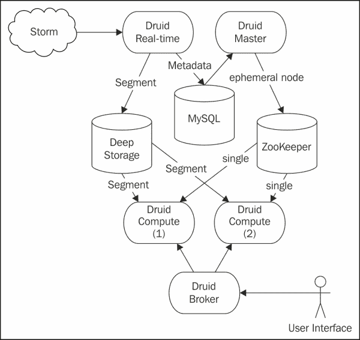
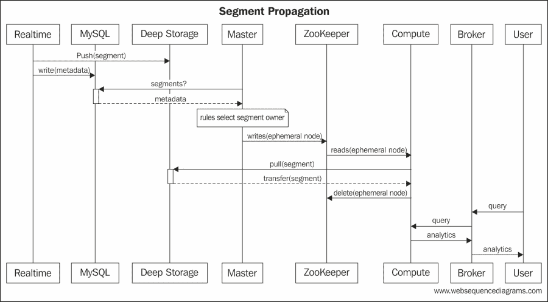
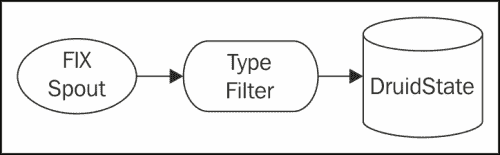
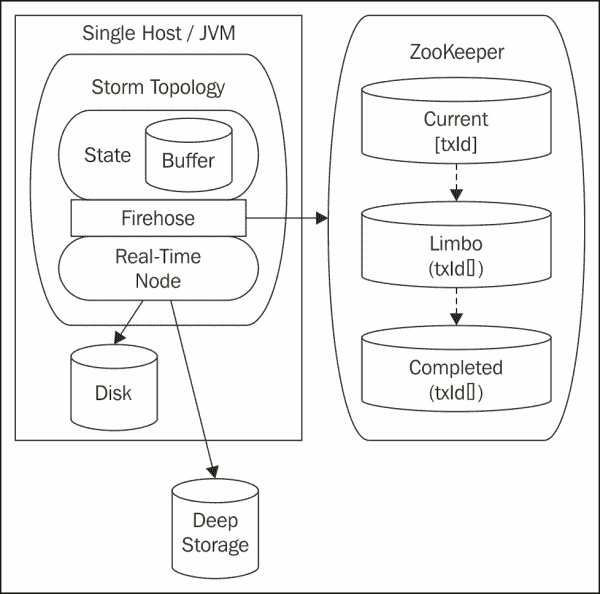
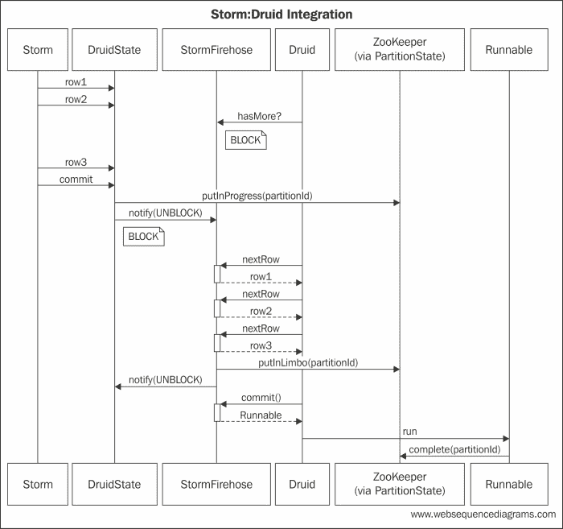
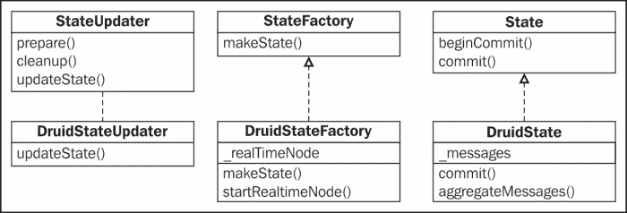

# 七、为金融分析整合 Druid

在本章中，我们将扩展Trident的使用，以创建实时金融分析仪表板。 该系统将处理金融消息，以随时间以不同的粒度级别提供股票定价信息。 该系统将使用自定义状态实现演示与非事务性系统的集成。

在上一个示例中，我们使用Trident对一段时间内运行的事件总数进行计数。 对于只分析数据的一个维度的简单用例来说，这就足够了，但是架构设计并不灵活。 要引入新的维度，需要进行 Java 开发和部署新代码。

传统上，数据仓库技术和商业智能平台用于计算和存储维度分析。 仓库部署为**在线分析处理**(**OLAP**)系统的一部分，该系统与**在线事务处理**(**OLTP**)分离。 数据向下传播到 OLAP 系统，但通常会有一些延迟。 对于回溯分析来说，这是一个足够的模型，但在需要实时分析的情况下还不够。

同样，其他方法使用批处理技术来增强数据科学家的能力。 数据科学家使用 PIG 等语言来表达他们的查询。 然后，这些查询向下编译成运行大型数据集的作业。 幸运的是，它们运行在 Hadoop 等平台上，这些平台将处理分布在多台机器上，但这仍然会带来很大的延迟。

这两种方法都不适合金融系统，因为金融系统承受不起分析可用性的如此滞后。 仅启动批处理作业的开销就可能对金融系统的实时需求造成太大的延迟。

在本章中，我们将扩展 Storm 的使用，以提供一个灵活的系统，该系统只需最少的工作即可引入新的维度，同时提供实时分析。 我们的意思是，数据获取和维度分析的可用性之间只有一小段时间的延迟。

在本章中，我们将介绍以下主题：

*   自定义状态实现
*   与非事务性存储集成
*   在分布式状态下使用 ZooKeeper
*   Druid 和实时聚合分析

# 使用案例

在我们的用例中，我们将利用金融系统中股票的订单。 使用此信息，我们将随着时间的推移提供定价信息，这些信息可通过**表述性状态转移**(**REST**)界面获得。

金融行业中规范的报文格式是**金融信息交换**(**FIX**)格式。 此格式的规范可在[http://www.fixprotocol.org/](http://www.fixprotocol.org/)中找到。

FIX消息示例如下所示：

```scala
23:25:1256=BANZAI6=011=135215791235714=017=520=031=032=037=538=1000039=054=155=SPY150=2151=010=2528=FIX.4.19=10435=F34=649=BANZAI52=20121105-
```

FIX 消息本质上是键-值对的流。 ASCII 字符 01 是标题(**SOH**)的**开始，用于分隔这些对。 FIX 将键称为标记。 如前面的消息所示，标记由整数标识。 每个标记都有关联的字段名称和数据类型。 有关标签类型的完整参考，请访问[http://www.fixprotocol.org/FIXimate3.0/en/FIX.4.2/fields_sorted_by_tagnum.html](http://www.fixprotocol.org/FIXimate3.0/en/FIX.4.2/fields_sorted_by_tagnum.html)。**

下表显示了我们的用例的重要字段：

<colgroup><col style="text-align: left"> <col style="text-align: left"> <col style="text-align: left"> <col style="text-align: left"></colgroup> 
| 

标签 ID

 | 

字段名称

 | 

描述 / 描写 / 形容 / 类别

 | 

数据类型

 |
| --- | --- | --- | --- |
| `11` | `CIOrdID` | 这是消息的唯一标识符。 | 细绳 |
| `35` | `MsgType` | 这是修复消息的类型。 | 细绳 |
| `44` | `Price` | 这是每股股票的价格。 | 普赖斯 （人名） |
| `55` | `Symbol` | 这是股票代码。 | 细绳 |

FIX 是 TCP/IP 协议之上的一层。 因此，在实际系统中，这些消息是通过 TCP/IP 接收的。 为了便于与 Storm 集成，系统可以用 Kafka 对这些消息进行排队。 然而，在我们的示例中，我们将简单地摄取一个充满修复消息的文件。 FIX 支持多种消息类型。 有些用于控制消息(例如，登录、心跳等)。 我们将过滤掉这些消息，只将包含价格信息的类型传递给分析引擎。

# 集成非事务性系统

为了扩展前面的示例，我们可以为配置开发一个框架，该框架允许用户指定他们希望聚合事件的维度。 然后，我们可以在拓扑中使用该配置来维护一组内存中的数据集，以累积聚合，但是任何内存中的存储都容易受到故障的影响。 为了解决容错问题，我们可以使这些聚合持久保存在数据库中。

我们需要预测并支持用户想要执行的所有不同类型的聚合(例如，总和、平均、地理空间等)。 这似乎是一项实质性的努力。

幸运的是，实时分析引擎有多种选择。 一个流行的开源选择是Druid。 以下文章摘自位于[http://static.druid.io/docs/druid.pdf](http://static.druid.io/docs/druid.pdf)的白皮书：

> Druid 是一个开源的实时分析数据存储，支持对大规模数据集的快速即席查询。 该系统结合了面向列的数据布局、无共享体系结构和高级索引结构，允许任意探索具有亚秒级延迟的十亿行表。 Druid 横向扩展，是 MetamMarkets 数据分析平台的核心引擎。

从这段摘录来看，德鲁伊完全符合我们的要求。 现在，挑战是将其与 Storm 整合。

德鲁伊的技术堆栈很自然地融入了一个基于Storm的生态系统。 与 Storm 类似，它使用 ZooKeeper 在其节点之间进行协调。 德鲁伊还支持与Kafka直接集成。 对于某些情况，这可能是合适的。 在我们的示例中，为了演示非事务性系统的集成，我们将直接集成 Druid 和 Storm。

我们将在这里简要介绍一下德鲁伊。 不过，有关德鲁伊的更多详细信息，请参考以下网站：

[https：//github.com/metamx/druid/wiki](https://github.com/metamx/druid/wiki)

Druid 通过其**实时**节点收集信息。 基于可配置的粒度，**实时**节点将事件信息收集到片段中，这些片段永久地保存在深层存储机制中。 Druid 将这些段的元数据持久存储在 MySQL 中。 **主**节点识别新段，基于规则识别该段的**计算**节点，并通知**计算**节点拉新段。 **代理**节点位于**Compute**节点前面，接收来自消费者的`REST`查询，并将这些查询分发到适当的**Compute**节点。

因此，将 Storm 与 Druid 集成的体系结构类似于下图所示：



如上图所示，涉及三种数据存储机制。 **MySQL**数据库是一个简单的元数据存储库。 它包含所有数据段的所有元数据信息。 **深度存储**机制包含实际段信息。 每个段都包含基于配置文件中定义的维度和聚合的特定时间段的事件的合并索引。 因此，数据段可以很大(例如，2 GB 的 BLOB)。 在我们的示例中，我们将使用 Cassandra 作为深度存储机制。

最后，第三种数据存储机制是**ZooKeeper**。 **ZooKeeper**中的存储是暂时的，仅用于控制信息。 当有新的段可用时，**主**节点在**ZooKeeper**中写入一个短暂节点。 **Compute**节点订阅相同的路径，并且临时节点触发**Compute**节点拉取新的段。 在成功检索段之后，**计算**节点从**ZooKeeper**移除短暂节点。

对于我们的示例，整个事件序列如下所示：



上图展示了 Storm 下游的事件处理。 在许多实时分析引擎中，需要认识到的重要一点是无法恢复事务。 分析系统针对处理速度和聚合进行了高度优化。 牺牲的是交易的完整性。

如果我们重新检查Trident的状态分类，就会发现有三种不同的状态：事务性、不透明性和非事务性。 事务性状态要求每个批处理的内容随时间保持不变。 不透明的事务状态可以容忍批次组成随时间变化。 最后，非事务性状态根本不能保证只有一种语义。

总结`storm.trident.state.State`对象的 Javadoc，有三种不同的状态：

<colgroup><col style="text-align: left"> <col style="text-align: left"></colgroup> 
| **非事务状态** | 在此状态下，提交被忽略。无法回滚。更新是永久性的。 |
| **重复交易状态** | 只要所有批次都相同，系统就是幂等系统。 |
| **不透明事务状态** | 状态转换是递增的。 先前状态与批次标识符一起存储，以允许在重放时更改批次组成。 |

认识到在拓扑中引入状态会有效地对存储中的任何写入进行排序，这一点很重要。 这可能会显著影响性能。 在可能的情况下，最好的方法是确保整个系统是幂等的。 如果所有写入都是幂等的，那么您根本不需要引入事务性存储(或状态)，因为体系结构自然允许元组重放。

通常，如果状态持久性由您控制架构的数据库支持，则可以调整架构以添加参与事务的附加信息：重复事务的上次提交批次标识符和不透明事务的上一个状态。 然后，在状态实现中，您可以利用此信息来确保您的状态对象与您正在使用的喷嘴类型一致。

但是，情况并不总是如此，特别是在执行聚合(如计数、求和、求平均值等)的系统中。 卡桑德拉的反机制就有这个限制。 不可能撤消计数器的加法，也不可能使加法幂等。 如果重放元组，计数器将再次递增，系统中很可能存在过度计数的元素。 因此，任何由 Cassandra 计数器支持的状态实现都被认为是非事务性的。

同样，德鲁伊也是非交易型的。 一旦德鲁伊消费了一个事件，该事件就不能撤销。 因此，如果 Storm 中的某个批处理被 Druid 部分使用，然后重放该批处理，或者更改了组成，则聚合维度分析将无法恢复。 出于这个原因，考虑德鲁伊和Storm之间的集成是很有趣的，我们可以采取哪些步骤来解决回放问题，以及这种耦合的力量。

简而言之，为了将 Storm 连接到 Druid，我们将利用事务性外流的特性来最小化连接到像 Druid 这样的非事务性状态机制时过度计数的风险。

# 拓扑

有了架构概念，让我们回到用例。 为了将重点放在集成上，我们将使拓扑保持简单。 下图描述了拓扑：



**fix spout**发出包含简单 FIX 消息的元组。 然后筛选器检查消息的类型，筛选包含定价信息的股票订单。 然后，这些过滤后的元组流向`DruidState`对象，该对象是通向 Druid 的桥梁。

此简单拓扑的代码如下：

```scala
public class FinancialAnalyticsTopology {

    public static StormTopology buildTopology() {
    TridentTopology topology = new TridentTopology();
    FixEventSpout spout = new FixEventSpout();
    Stream inputStream = 
topology.newStream("message", spout);
    inputStream.each(new Fields("message"),
new MessageTypeFilter())
        .partitionPersist(new DruidStateFactory(),
new Fields("message"), new DruidStateUpdater());
    return topology.build();
    }

}
```

## 喷嘴

有多个用于FIX 消息格式的解析器。 在喷嘴中，我们将使用修复解析器，这是 Google 的一个项目。 有关该项目的更多信息，您可以参考[https://code.google.com/p/fixparser/](https://code.google.com/p/fixparser/)。

就像上一章一样，喷嘴本身也是直截了当的。 它只返回对协调器和发射器的引用，如以下代码所示：

```scala
package com.packtpub.storm.trident.spout;

@SuppressWarnings("rawtypes")
public class FixEventSpout implements ITridentSpout<Long> {
    private static final long serialVersionUID = 1L;
    SpoutOutputCollector collector;
    BatchCoordinator<Long> coordinator = new DefaultCoordinator();
    Emitter<Long> emitter = new FixEventEmitter();
    ...
    @Override
    public Fields getOutputFields() {
        return new Fields("message");
    }
}
```

如前面的代码所示，`Spout`声明了单个输出字段：`message`。 它将包含由`Emitter`生成的`FixMessageDto`对象，如以下代码所示：

```scala
package com.packtpub.storm.trident.spout;

public class FixEventEmitter implements Emitter<Long>,
Serializable {
    private static final long serialVersionUID = 1L;
    public static AtomicInteger successfulTransactions = 
new AtomicInteger(0);
    public static AtomicInteger uids = new AtomicInteger(0);

    @SuppressWarnings("rawtypes")
    @Override
    public void emitBatch(TransactionAttempt tx,
    Long coordinatorMeta, TridentCollector collector) {
    InputStream inputStream = null;
    File file = new File("fix_data.txt");
    try {
        inputStream = 
new BufferedInputStream(new FileInputStream(file));
        SimpleFixParser parser = new SimpleFixParser(inputStream);
        SimpleFixMessage msg = null;
        do {
        msg = parser.readFixMessage();
        if (null != msg) {
            FixMessageDto dto = new FixMessageDto();
            for (TagValue tagValue : msg.fields()) {
                if (tagValue.tag().equals("6")) { // AvgPx
                    // dto.price = 
//Double.valueOf((String) tagValue.value());
                    dto.price = new Double((int) (Math.random() * 100));
                } else if (tagValue.tag().equals("35")) {
                    dto.msgType = (String)tagValue.value();
                } else if (tagValue.tag().equals("55")) {
                   dto.symbol = (String) tagValue.value();
                } else if (tagValue.tag().equals("11")){
                   // dto.uid = (String) tagValue.value();
                   dto.uid = Integer.toString(uids.incrementAndGet());
                }
            }
            new ObjectOutputStream(
            new ByteArrayOutputStream()).writeObject(dto);
                List<Object> message = new ArrayList<Object>();
                message.add(dto);
                collector.emit(message);
        }
    } while (msg != null);
    } catch (Exception e) {
        throw new RuntimeException(e);
    } finally {
        IoUtils.closeSilently(inputStream);
    }
    }

    @Override
    public void success(TransactionAttempt tx) {
        successfulTransactions.incrementAndGet();
    }

    @Override
    public void close() {
    }
}
```

从前面的代码中，您可以看到我们重新解析了每个批处理的文件。 如前所述，在实时系统中，我们可能会通过 TCP/IP 接收消息，并在 Kafka 中对它们进行排队。 然后，我们会用Kafka喷嘴来发出信息。 这是一个偏好问题；但是，要在 Storm 中完全封装数据处理，系统很可能会将原始消息文本排队。 在该设计中，我们将解析函数中的文本，而不是喷嘴中的文本。

尽管此`Spout`仅足以用于此示例，但请注意，每个批次的组成都是相同的。 具体地说，每个批处理都包含文件中的所有消息。 由于我们的状态设计依赖于此特性，因此在实际系统中，我们需要使用`TransactionalKafkaSpout`。

## 过滤器

与喷嘴一样，过滤器也很简单。 它检查`msgType`对象并过滤不是完成订单的消息。 填写订单实际上是库存采购收据。 它们包含该交易的平均执行价格和所购股票的代码。 以下代码是此邮件类型的筛选器：

```scala
package com.packtpub.storm.trident.operator;

public class MessageTypeFilter extends BaseFilter {
    private static final long serialVersionUID = 1L;

    @Override
    public boolean isKeep(TridentTuple tuple) {
        FixMessageDto message = (FixMessageDto) tuple.getValue(0);
    if (message.msgType.equals("8")) {
        return true;
    }
    return false;
    }
}
```

这提供了一个的好机会来指出 Storm 中可序列化的重要性。 请注意，在前面的代码中，滤镜对`FixMessageDto`对象进行操作。 简单地使用`SimpleFixMessage`对象会更容易，但是`SimpleFixMessage`是不可序列化的。 在本地群集上运行时，这不会造成任何问题。 但是，由于在 Storm 中的数据处理过程中会在主机之间交换元组，因此元组中的所有元素都必须是可序列化的。

### 提示

开发人员经常提交对元组中不可序列化的数据对象的更改。 这会导致下游部署问题。 若要确保元组中的所有对象都保持可序列化，请添加验证对象可序列化的单元测试。 测试很简单；使用以下代码：

```scala
new ObjectOutputStream(
new ByteArrayOutputStream()).
writeObject(YOUR_OBJECT);
```

## 状态设计

现在，让我们继续到这个例子中最有趣的方面。 为了集成 Druid 和 Storm，我们将在拓扑中嵌入一个实时的 Druid 服务器，并实现必要的接口来将元组流连接到它。 为了降低连接到非事务性系统的固有风险，我们利用 ZooKeeper 来持久化状态信息。 这种持久性不能防止故障导致的异常，但有助于识别故障发生时哪些数据面临风险。

概要设计如下所示：



在较高级别上，Storm通过使用工厂在工作 JVM 进程中创建状态对象。 将为批处理中的每个分区创建一个状态对象。 状态工厂对象确保实时服务器在返回任何状态对象之前正在运行，如果服务器没有运行，则启动服务器。 然后，状态对象缓冲这些消息，直到 Storm 调用 Commit。 当 Storm 调用 Commit 时，state 对象解锁 Druid**Firehose**。 这将向 Druid 发送数据已准备好聚合的信号。 然后，我们在 Commit 方法中阻止 Storm，而实时服务器开始通过**Firehose**拉取数据。

为了确保每个分区最多处理一次，我们将分区标识符与每个分区相关联。 分区标识符是批次标识符和分区索引的组合，因为我们使用的是事务性输出，所以它唯一地标识了一组数据。

**Firehose**将标识符保存在**ZooKeeper**中，以维护分区的状态。

在**ZooKeeper**中有三种状态：

<colgroup><col style="text-align: left"> <col style="text-align: left"></colgroup> 
| 

状态 / 国家 / 政府 / 领土

 | 

描述 / 描写 / 形容 / 类别

 |
| --- | --- |
| 正在进行中 | 此`Zookeeper`路径包含 Druid 正在处理的分区标识符。 |
| 林波舞 / 监狱 / 地狱的边境 / 放置丢弃物的场所 | 此`Zookeeper`路径包含 Druid 整体使用但可能未提交的分区标识符。 |
| 极度的 / 绝对的 / 完整的 / 完全的 | 此`Zookeeper`路径包含个 Druid 成功提交的分区标识符。 |

当批处理正在进行时，**防火墙**将分区标识符写入正在进行的路径。 当 Druid 拉出整个 Storm 分区时，分区标识符移到**Limbo**，我们释放 Storm 继续处理，同时等待来自 Druid 的提交消息。

在接收到来自 Druid 的提交消息后，**防火墙**将分区标识符移到**完成的**路径。 此时，我们假设数据已写入磁盘。 如果发生磁盘故障，我们仍然容易丢失数据。 但是，如果我们假设可以使用批处理重新构建聚合，那么这很可能是可以接受的风险。

以下状态机捕获处理的不同阶段：


如图所示，在**缓冲消息**和**聚集消息**之间有一个循环。 主控制环路在这两种状态之间快速切换，在 Storm 处理环路和 Druid 聚合环路之间分配时间。 这两种状态是互斥的：要么系统正在聚合一个批处理，要么它正在缓冲下一个批处理。

当 Druid 已将信息写入磁盘时，将触发第三个状态。 当发生这种情况时(我们稍后会看到)，会通知**Firehose**，我们可以更新持久化机制以指示批处理已安全处理。 在调用提交之前，Druid 使用的批必须保持在**状态**。

当处于**边缘**时，不能对数据做出任何假设。 德鲁伊可能已经汇总了这些记录，也可能没有。

如果出现故障，Storm 可能会利用其他`TridentState`实例来完成处理。 因此，对于每个分区，**防火墙**必须执行以下步骤：

1.  **防火墙**必须检查分区是否已完成。 如果是这样，则分区是重播，可能是由于下游故障。 由于保证批处理具有与以前相同的内容，因此可以安全地忽略它，因为 Druid 已经聚合了它的内容。 系统可能会记录一条警告消息。
2.  **防火墙**必须检查分区是否处于不确定状态。 如果是这种情况，那么 Druid 完全使用了分区，但从未调用 Commit，或者在调用 Commit 之后、**Firehose**更新**zooKeeper**之前系统失败。 系统应该会发出警报。 它不应该尝试完成批处理，因为它已被 Druid 完全使用，并且我们不知道聚合的状态。 它只是返回，使 Storm 能够继续到下一批。
3.  **防火墙**必须检查分区是否正在进行。 如果是这种情况，那么出于某种原因，网络上的某个地方正在由另一个实例处理该分区。 在普通处理过程中不应发生这种情况。 在这种情况下，系统应针对此分区发出警报。 在我们的简单系统中，我们将简单地继续，让我们的离线批处理来更正聚合。

在许多大型实时系统中，用户愿意容忍实时分析中的微小差异，只要偏差不频繁且可以相当快地修复即可。

需要注意的是，这种方法之所以成功，是因为我们使用的是事务性输出。 事务性输出保证每个批处理具有相同的组成。 此外，要使此方法起作用，批处理中的每个分区必须具有相同的组成。 当且仅当拓扑中的分区是确定性的时，这才是正确的。 使用确定性分区和事务性输出，即使在重播的情况下，每个分区也将包含相同的数据。 如果我们使用随机分组，这种方法将不起作用。 我们的示例拓扑是确定性的。 这保证了批处理标识符在与分区索引组合时表示一组随时间变化的一致数据。

# 实现架构

设计就绪后，我们可以将注意力转向实现。 该实现的序列图如下所示：



前面的图实现了设计中显示的状态机。 一旦实时服务器启动，Druid 就会使用`hasMore()`方法轮询`StormFirehose`对象。 与 Druid 的合同规定，`Firehose`对象的实现应该阻塞，直到数据可用。 在 Druid 轮询和`Firehose`对象阻塞时，Storm 将元组传递到`DruidState`对象`'s`消息缓冲区。 批处理完成后，Storm 调用`DruidState`对象上的`commit()`方法。 此时，将更新 PartitionStatus。 分区被放入进程中，并且实现解锁了`StormFirehose`对象。

Druid 开始通过`nextRow()`方法从`StormFirehose`对象拉取数据。 当`StormFirehose`对象耗尽分区的内容时，它会将分区置于边缘状态，并将控制权释放回 Storm。

最后，当在 StormFirehose 上调用 Commit 方法时，实现返回一个`Runnable`，这是 Druid 用来通知 Firehose 该分区是持久化的。 当 Druid调用`run()`时，实现将分区移至完成。

## 德鲁伊德州

首先，我们将看看方程式的暴风面。 在上一章中，我们扩展了`NonTransactionalMap`类以持久化状态。 这种抽象使我们不能了解顺序批处理的细节。 我们只是实现了`IBackingMap`接口来支持`multiGet`和`multiPut`调用，而超类负责其余的工作。

在此场景中，我们需要对持久化过程进行比默认实现提供的更多控制。 相反，我们需要自己实现基本的`State`接口。 下面的类图描述了类层次结构：



如图所示，`DruidStateFactory`类管理嵌入式实时节点。 可以为管理嵌入式服务器的更新器提出论点。 然而，由于每个 JVM 应该只有一个实时服务器实例，并且该实例需要在任何状态对象之前存在，所以嵌入式服务器的生命周期管理似乎更适合工厂。

下面的代码片段包含`DruidStateFactory`类的相关部分：

```scala
public class DruidStateFactory implements StateFactory {
    private static final long serialVersionUID = 1L;
    private static final Logger LOG = 
LoggerFactory.getLogger(DruidStateFactory.class);
    private static RealtimeNode rn = null;

    private static synchronized void startRealtime() {
    if (rn == null) {
        final Lifecycle lifecycle = new Lifecycle();
        rn = RealtimeNode.builder().build();
        lifecycle.addManagedInstance(rn);
        rn.registerJacksonSubtype(
        new NamedType(StormFirehoseFactory.class, "storm"));

        try {
            lifecycle.start();
        } catch (Throwable t) {

        }
    }
    }

    @Override
    public State makeState(Map conf, IMetricsContext metrics,
        int partitionIndex, int numPartitions) {
            DruidStateFactory.startRealtime();
            return new DruidState(partitionIndex);
    }
}
```

不涉及太多细节，前面的代码将启动一个实时节点(如果还没有启动的话)。 此外，它还向该实时节点注册`StormFirehoseFactory`类。

该工厂还实现了 Storm 的`StateFactory`接口，该接口允许 Storm 使用此工厂创建新的`State`对象。 `State`对象本身相当简单：

```scala
public class DruidState implements State {
private static final Logger LOG = 
LoggerFactory.getLogger(DruidState.class);
private Vector<FixMessageDto> messages = 
new Vector<FixMessageDto>();
    private int partitionIndex;

public DruidState(int partitionIndex){
    this.partitionIndex = partitionIndex;
}

@Override
    public void beginCommit(Long batchId) {
}

@Override
public void commit(Long batchId) {
    String partitionId = batchId.toString() + "-" + partitionIndex;
    LOG.info("Committing partition [" + 
        partitionIndex + "] of batch [" + batchId + "]");
    try {
        if (StormFirehose.STATUS.isCompleted(partitionId)) {
        LOG.warn("Encountered completed partition [" 
            + partitionIndex + "] of batch [" + batchId 
                + "]");
        return;
    } else if (StormFirehose.STATUS.isInLimbo(partitionId)) {
        LOG.warn("Encountered limbo partition [" + partitionIndex 
                 + "] of batch [" + batchId + 
                 "] : NOTIFY THE AUTHORITIES!");
        return;
    } else if (StormFirehose.STATUS.isInProgress(partitionId)) {
              LOG.warn("Encountered in-progress partition [\" + 
              partitionIndex + \"] of batch [" + batchId + 
              "] : NOTIFY THE AUTHORITIES!");
        return;
    }
    StormFirehose.STATUS.putInProgress(partitionId);
    StormFirehoseFactory.getFirehose()
        .sendMessages(partitionId, messages);
    } catch (Exception e) {
            LOG.error("Could not start firehose for [" + 
                      partitionIndex + "] of batch [" + 
                      batchId + "]", e);
    }
    }

public void aggregateMessage(FixMessageDto message) {
    messages.add(message);
}
}
```

正如您在前面的代码中看到的，`State`对象是一个消息缓冲区。 它将实际的提交逻辑委托给`Firehose`对象，我们稍后将对其进行研究。 但是，该类中有几行关键代码行实现了我们前面概述的故障检测。

`State`对象的`commit()`方法中的条件逻辑检查 ZooKeeper 状态，以确定此分区是否已成功处理(`inCompleted`)、提交失败(`inLimbo`)或在处理过程中失败(`inProgress`)。 当我们检查`DruidPartitionStatus`对象时，我们将更深入地研究状态存储。

同样重要的是要注意，Storm 直接调用`commit()`方法，但更新器调用`aggregateMessage()`方法。 尽管 Storm 永远不应该并发调用这些方法，但我们还是选择了使用线程安全的向量。

DruidStateUpdater 代码如下：

```scala
public class DruidStateUpdater implements StateUpdater<DruidState> {
...
@Override
public void updateState(DruidState state, 
List<TridentTuple> tuples, TridentCollector collector) {
for (TridentTuple tuple : tuples) {
   	   FixMessageDto message = (FixMessageDto) tuple.getValue(0);
      state.aggregateMessage(message);
   }
}
}
```

如前面的代码所示，更新器只是循环遍历元组，并将它们传递给 State 对象进行缓冲。

## 实现 StormFirehose 对象

在我们将注意力转向实现的 Druid 方面之前，我们可能应该退后一步，更详细地讨论 Druid。 Druid 提要通过 SPEC 文件进行配置。 在我们的示例中，这是`realtime.spec`，如以下代码所示：

```scala
[{
    "schema": {
        "dataSource": "stockinfo",
        "aggregators": [
            { "type": "count", "name": "orders"},
            { "type": "doubleSum", "fieldName": "price", "name":"totalPrice" }
        ],
        "indexGranularity": "minute",
        "shardSpec": {"type": "none"}
    },

    "config": {
        "maxRowsInMemory": 50000,
        "intermediatePersistPeriod": "PT30s"
    },

    "firehose": {
        "type": "storm",
        "sleepUsec": 100000,
        "maxGeneratedRows": 5000000,
        "seed": 0,
        "nTokens": 255,
        "nPerSleep": 3
    },

    "plumber": {
        "type": "realtime",
        "windowPeriod": "PT30s",
        "segmentGranularity": "minute",
        "basePersistDirectory": "/tmp/example/rand_realtime/basePersist"
    }
}]
```

对于我们的示例，前面规范文件中的重要元素是`schema`和`firehose`。 `schema`元素定义数据以及 Druid 应该对该数据执行的聚合。 在我们的示例中，Druid 将计算我们在`orders`字段中看到股票代码的次数，并跟踪在`totalPrice`字段中支付的总价格。 `totalPrice`字段将用于计算一段时间内的运行股票价格平均值。 此外，您需要指定一个`indexGranularity`对象，该对象指定索引的时间粒度。

`firehose`元素包含`Firehose`对象的配置。 正如我们在`StateFactory`接口中看到的，当实时服务器启动时，实现向 Druid 注册一个`FirehoseFactory`类。 该工厂注册为`Jackson`子类型。 在解析实时规范文件时，JSON 的`firehose`元素中的类型用于链接回数据流的适当`FirehoseFactory`。

有关 JSON 多态性的更多信息，请访问以下网站：

[http：//wiki.fasterxml.com/JacksonPolymorphicDeserialization](http://wiki.fasterxml.com/JacksonPolymorphicDeserialization)

有关规范文件的详细信息，请参阅以下网站：

[https：//github.com/metamx/druid/wiki/Realtime](https://github.com/metamx/druid/wiki/Realtime)

现在，我们可以将注意力转向实现的 Druid 方面。 `Firehose`是将数据提供给 Druid 实时服务器所必须实现的主要接口。

我们的`StormFirehoseFactory`类的代码如下：

```scala
@JsonTypeName("storm")
public class StormFirehoseFactory implements FirehoseFactory {
    private static final StormFirehose FIREHOSE = 
    new StormFirehose();
    @JsonCreator
    public StormFirehoseFactory() {
    }

    @Override
    public Firehose connect() throws IOException {
        return FIREHOSE;
    }

    public static StormFirehose getFirehose(){
        return FIREHOSE;
    }
}
```

工厂实现很简单。 在本例中，我们只返回一个静态单例对象。 请注意，该对象使用`@JsonTypeName`和`@JsonCreator`进行注释。 如前面的代码所述，`Jackson`是注册`FirehoseFactory`对象的方式。 因此，指定为`@JsonTypeName`的名称必须与等级库文件中指定的类型对齐。

实现的核心在`StormFirehose`类中。 在这个类中，我们将逐个检查四个关键方法：`hasMore()`、`nextRow()`、`commit()`和`sendMessages()`。

`sendMessages()`方法是，即进入`StormFirehose`类的入口点。 它实际上是Storm和德鲁伊之间的交接点。 此方法的代码如下所示：

```scala
public synchronized void sendMessages(String partitionId, 
                     List<FixMessageDto> messages) {
    BLOCKING_QUEUE = 
    new ArrayBlockingQueue<FixMessageDto>(messages.size(), 
    false, messages);
    TRANSACTION_ID = partitionId;
    LOG.info("Beginning commit to Druid. [" + messages.size() + 
    "] messages, unlocking [START]");
    synchronized (START) {
        START.notify();
    }
    try {
        synchronized (FINISHED) {
        FINISHED.wait();
        }
    } catch (InterruptedException e) {
        LOG.error("Commit to Druid interrupted.");
    }
    LOG.info("Returning control to Storm.");
}
```

此方法是同步的，以防止并发问题。 请注意，除了将消息缓冲区复制到队列中并通知`hasMore()`方法释放批处理之外，它不做任何其他事情。 然后，它会阻止等待 Druid 完全使用该批处理。

然后，流程进入`nextRow()`方法，如下图所示：

```scala
    @Override
    public InputRow nextRow() {
        final Map<String, Object> theMap = 
        Maps.newTreeMap(String.CASE_INSENSITIVE_ORDER);
        try {
        FixMessageDto message = null;
        message = BLOCKING_QUEUE.poll();

        if (message != null) {
        LOG.info("[" + message.symbol + "] @ [" +
         message.price + "]");
        theMap.put("symbol", message.symbol);
        theMap.put("price", message.price);
        }

        if (BLOCKING_QUEUE.isEmpty()) {
        STATUS.putInLimbo(TRANSACTION_ID);
        LIMBO_TRANSACTIONS.add(TRANSACTION_ID);
        LOG.info("Batch is fully consumed by Druid. " 
        + "Unlocking [FINISH]");
        synchronized (FINISHED) {
            FINISHED.notify();

        }
        }
    } catch (Exception e) {
        LOG.error("Error occurred in nextRow.", e);
        System.exit(-1);
    }
    final LinkedList<String> dimensions = 
    new LinkedList<String>();
    dimensions.add("symbol");
    dimensions.add("price");
    return new MapBasedInputRow(System.currentTimeMillis(), 
                                dimensions, theMap);
    }
```

此方法从队列中拉出一条消息。 如果它不为空，则将数据添加到作为`MapBasedInputRow`方法传递给 Druid 的映射中。 如果队列中没有剩余消息，则释放我们在前面代码中检查的`sendMessages()`方法。 从 Storm 的角度来看，这一批已经完成。 德鲁伊现在拥有这些数据。 然而，从系统的角度来看，数据处于不确定状态，因为 Druid 可能没有将数据持久化到磁盘。 如果硬件发生故障，我们将面临完全丢失数据的风险。

然后，Druid 将轮询`hasMore()`方法，如以下代码所示：

```scala
@Override
public boolean hasMore() {
    if (BLOCKING_QUEUE != null && !BLOCKING_QUEUE.isEmpty())
        return true;
    try {
        synchronized (START) {
        START.wait();
        }
    } catch (InterruptedException e) {
        LOG.error("hasMore() blocking interrupted!");
    }
    return true;
}
```

由于队列为空，因此该方法将阻塞，直到再次调用`sendMessage()`。

这就只剩下一块拼图，即`commit()`方法。 它如以下代码所示：

```scala
    @Override
    public Runnable commit() {
	List<String> limboTransactions = new ArrayList<String>();
	LIMBO_TRANSACTIONS.drainTo(limboTransactions);
	return new StormCommitRunnable(limboTransactions);
    }
```

此方法返回`Runnable`，它由 Druid 在完成消息持久化后调用。 虽然`Firehose`对象中的所有其他方法都是从单个线程调用的，但`Runnable`是从不同的线程调用的，因此必须是线程安全的。 出于这个原因，我们将 Limbo 中的事务复制到一个单独的列表中，并将其传递给`Runnable`对象的构造函数。 正如您在以下代码中看到的那样，`Runnable`什么也不做，只是将事务移到`Zookeeper`中的已完成状态。

```scala
public class StormCommitRunnable implements Runnable {
    private List<String> partitionIds = null;

    public StormCommitRunnable(List<String> partitionIds){
        this.partitionIds = partitionIds;
    }

    @Override
    public void run() {
    try {
        StormFirehose.STATUS.complete(partitionIds);
    } catch (Exception e) {
        Log.error("Could not complete transactions.", e);
    }
}
}
```

## 在 ZooKeeper 中实现分区状态

现在我们已经检查了所有代码，现在我们来看看如何在 ZooKeeper 中持久化状态。 这使得系统能够协调分布式处理，特别是在发生故障的情况下。

该实现利用 ZooKeeper 来持久化分区处理状态。 ZooKeeper 是另一个开源项目。 有关更多信息，可以参考[http://zookeeper.apache.org/](http://zookeeper.apache.org/)。

ZooKeeper 维护节点树。 每个节点都有一个关联的路径，这与文件系统非常相似。 该实现通过名为Curator 的框架使用 ZooKeeper。 有关的更多信息，可以参考[http://curator.incubator.apache.org/](http://curator.incubator.apache.org/)。

当通过 Curator 连接到 ZooKeeper 时，您需要提供一个命名空间。 实际上，这是存储应用数据的顶级节点。 在我们的实现中，命名空间是`stormdruid`。 然后，应用在其下面维护三条路径，用于存储批处理状态信息。

路径对应于设计中描述的状态，如下所示：

*   `/stormdruid/current`：对应当前状态
*   `/stormdruid/limbo`：这对应于边缘状态
*   `/stormdruid/completed`：这对应于已完成状态

在我们的实现中，ZooKeeper 的所有分区状态交互都通过`DruidPartitionStatus`类运行。

此类的代码如下所示：

```scala
public class DruidBatchStatus {
    private static final Logger LOG = 
LoggerFactory.getLogger(DruidBatchStatus.class);
    final String COMPLETED_PATH = "completed";
    final String LIMBO_PATH = "limbo";
    final String CURRENT_PATH = "current";
    private CuratorFramework curatorFramework;

    public DruidBatchStatus() {
    try {
curatorFramework = 
    CuratorFrameworkFactory.builder()
    .namespace("stormdruid")
    .connectString("localhost:2181")
    .retryPolicy(new RetryNTimes(1, 1000))
    .connectionTimeoutMs(5000)
            .build();
        curatorFramework.start();

        if (curatorFramework.checkExists()
    .forPath(COMPLETED_PATH) == null) {
        curatorFramework.create().forPath(COMPLETED_PATH);
        }

    }catch (Exception e) {
        LOG.error("Could not establish connection to Zookeeper", 
                  e);
    }
    }

    public boolean isInLimbo(String paritionId) throws Exception {
        return (curatorFramework.checkExists().forPath(LIMBO_PATH + "/" + paritionId) != null);
    }

    public void putInLimbo(Long paritionId) throws Exception {
    curatorFramework.inTransaction().
        delete().forPath(CURRENT_PATH + "/" + paritionId)
        .and().create().forPath(LIMBO_PATH + "/" + 
                                paritionId).and().commit();
    }
}
```

为了研究空间，我们只展示了与边缘状态相关的构造器和方法。 在构造函数中，客户端连接到 ZooKeeper 并创建三个基本路径，如前面的代码所述。 然后，它提供查询方法来测试事务是正在进行、处于边缘还是已完成。 它还提供在这些状态之间移动事务的方法。

# 执行执行

代码讲得够多了，让我们开始演示吧！ 我们使用`FinancialAnalyticsTopology`类的 Main 方法启动拓扑。 为了更好地演示，我们引入了 0 到 100 之间的随机价格。 (返回参考`Emitter`代码。)

启动拓扑后，您将看到以下输出：

```scala
2014-02-16 09:47:15,479-0500 | INFO [Thread-18] DefaultCoordinator.initializeTransaction(24) | Initializing Transaction [1615]
2014-02-16 09:47:15,482-0500 | INFO [Thread-22] DruidState.commit(28) | Committing partition [0] of batch [1615]
2014-02-16 09:47:15,484-0500 | INFO [Thread-22] StormFirehose.sendMessages(82) | Beginning commit to Druid. [7996] messages, unlocking [START]
2014-02-16 09:47:15,511-0500 | INFO [chief-stockinfo] StormFirehose.nextRow(58) | Batch is fully consumed by Druid. Unlocking [FINISH]
2014-02-16 09:47:15,511-0500 | INFO [Thread-22] StormFirehose.sendMessages(93) | Returning control to Storm.
2014-02-16 09:47:15,513-0500 | INFO [Thread-18] DefaultCoordinator.success(30) | Successful Transaction [1615] 
```

您可以从多个维度询问处理过程。

使用 ZooKeeper 客户端，您可以检查事务的状态。 请看下面的清单；它显示了事务/批次标识符及其状态：

```scala
[zk: localhost:2181(CONNECTED) 50] ls /stormdruid/current
[501-0]
[zk: localhost:2181(CONNECTED) 51] ls /stormdruid/limbo
[486-0, 417-0, 421-0, 418-0, 487-0, 485-0, 484-0, 452-0, ...
[zk: localhost:2181(CONNECTED) 82] ls /stormdruid/completed
[zk: localhost:2181(CONNECTED) 52] ls /stormdruid/completed
[59-0, 321-0, 296-0, 357-0, 358-0, 220-0, 355-0,
```

对于警报和监控，请注意以下事项：

*   如果`current`路径中有多个批次，则应发出警报
*   如果在`limbo`中存在不连续的批次标识符，或者远远落后于当前标识符，则应发出警报

要清理 ZooKeeper 中的状态，可以执行以下代码：

```scala
zk: localhost:2181(CONNECTED) 83] rmr /stormdruid
```

要监控数据段传播，可以使用 MySQL 客户端。 使用默认模式，您可以通过以下代码从`prod_segments`表中选择段来查找段：

```scala
mysql> select * from prod_segments;
```

# 检查分析

现在，我们一直在等待的时刻到来了；通过使用 Druid 提供的 rest API，我们可以看到一段时间内的平均股价。 要使用 rest API，不需要运行完整的 Druid 集群。 您将只能查询单个嵌入式实时节点看到的数据，但是每个节点都能够为请求提供服务，这使得测试变得更容易。 使用 cURL，您可以使用以下命令发出对实时节点的查询：

```scala
curl -sX POST "http://localhost:7070/druid/v2/?pretty=true" -H 'content-type: application/json'  -d @storm_query

```

`curl`语句的最后一个参数引用一个文件，该文件的内容将作为`POST`请求的主体包括在内。 该文件包含以下详细信息：

```scala
{
    "queryType": "groupBy",
    "dataSource": "stockinfo",
    "granularity": "minute",
    "dimensions": ["symbol"],
    "aggregations":[
        { "type": "longSum", "fieldName": "orders",
         "name": "cumulativeCount"},
        { "type": "doubleSum", "fieldName": "totalPrice",
         "name": "cumulativePrice" }
    ],
    "postAggregations":[
    {  "type":"arithmetic",
        "name":"avg_price",
        "fn":"/",
        "fields":[ {"type":"fieldAccess","name":"avgprice",
        "fieldName":"cumulativePrice"},
                   {"type":"fieldAccess","name":"numrows",
        "fieldName":"cumulativeCount"}]}
    ],
    "intervals":["2012-10-01T00:00/2020-01-01T00"]
}
```

在德鲁伊中有两种类型的聚合。 有一些聚合是作为索引的一部分进行的，还有一些聚合是在查询时进行的。 在编制索引期间发生的聚合在等级库文件中定义。 如果您还记得，规范文件中有两个聚合：

```scala
"aggregators": [
{ "type": "count", "name": "orders"},
   { "type": "doubleSum", "fieldName": "price",
"name": "totalPrice" }
],
```

我们聚集的事件有两个字段：`symbol`和`price`。 前面的聚合在索引时应用，并引入了两个附加字段：`totalPrice`和`orders`。 回想一下，`totalPrice`是该时间段内每个事件的价格总和。 `orders`字段包含该时间段内事件的总计数。

然后，当我们执行查询时，Druid 根据`groupBy`语句应用第二组聚合。 在我们的查询中，我们按`symbol`以分钟为粒度进行分组。 然后，聚合引入了两个新字段：`cumulativeCount`和`cumulativePrice`。 这些字段包含先前聚合的总和。

最后，我们介绍了一种`postaggregation`方法来计算这段时间的平均值。 `postaggregation`方法将两个累加域相除(`""fn":"/"`)以产生新的`avg_price`域。

向正在运行的服务器发出`curl`语句将导致以下响应：

```scala
[ {
  "version" : "v1",
  "timestamp" : "2013-05-15T22:31:00.000Z",
  "event" : {
    "cumulativePrice" : 3464069.0,
    "symbol" : "MSFT",
    "cumulativeCount" : 69114,
    "avg_price" : 50.12108979367422
  }
}, {
  "version" : "v1",
  "timestamp" : "2013-05-15T22:31:00.000Z",
  "event" : {
    "cumulativePrice" : 3515855.0,
    "symbol" : "ORCL",
    "cumulativeCount" : 68961,
    "avg_price" : 50.98323690201708
  }
...
 {
  "version" : "v1",
  "timestamp" : "2013-05-15T22:32:00.000Z",
  "event" : {
    "cumulativePrice" : 1347494.0,
    "symbol" : "ORCL",
    "cumulativeCount" : 26696,
    "avg_price" : 50.47550194785736
  }
}, {
  "version" : "v1",
  "timestamp" : "2013-05-15T22:32:00.000Z",
  "event" : {
    "cumulativePrice" : 707317.0,
    "symbol" : "SPY",
    "cumulativeCount" : 13453,
    "avg_price" : 52.576897346316805
  }
} ]
```

由于我们更新了代码以生成 0 到 100 之间的随机价格，因此平均值约为 50 也就不足为奇了。 (哇哦！)

# 摘要

在本章中，我们对Trident状态 API 有了更深入的了解。 我们创建了`State`和`StateUpdater`接口的直接实现，而不是依赖于默认实现。 具体地说，我们实现这些接口是为了弥合事务性 Spout 和非事务性系统(即 Druid)之间的差距。 尽管不可能在非事务性存储中建立只需一次的语义，但我们会在系统遇到问题时设置警报机制。 从表面上看，一旦出现故障，我们就可以使用批处理机制来重建任何可疑的聚合段。

在未来的研究中，在Storm和德鲁伊之间建立一个幂等接口将是有益的。 为此，我们可以为 Storm 中的每个批次发布单个线段。 因为段传播在 Druid 中是原子的，所以这将为我们提供一种机制，以原子方式将每一批提交给 Druid。 此外，还可以并行处理批处理，从而提高吞吐量。 Druid 支持一组不断扩展的查询类型和聚合机制。 它的力量令人难以置信，Storm和德鲁伊的联姻就是一个强大的联姻。