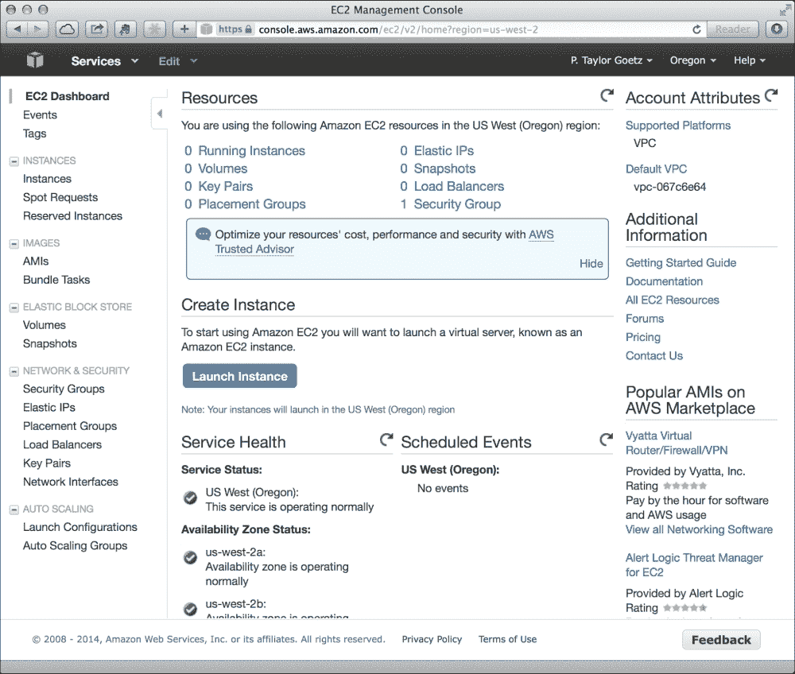
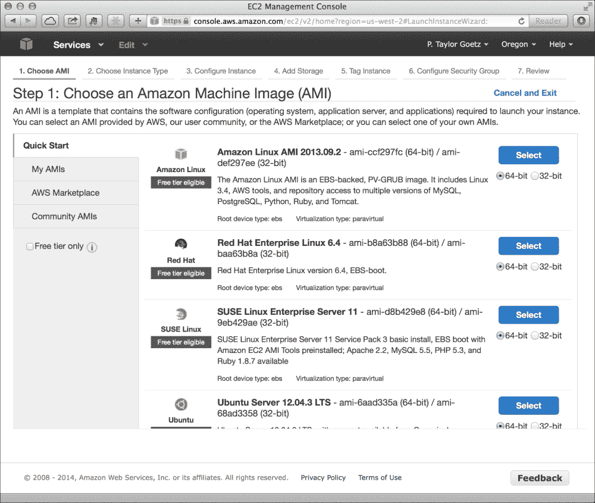
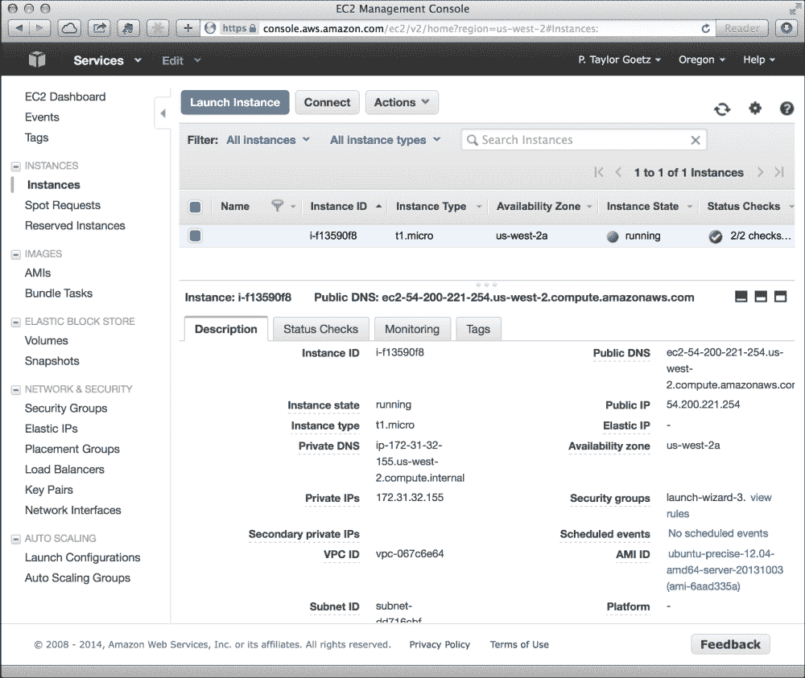
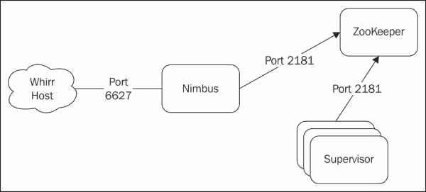

# 十、云中的 Storm

在本章中，我们将向您介绍如何在云提供商的托管环境中部署和运行 Storm。

在[第 2 章](02.html "Chapter 2. Configuring Storm Clusters")，*配置 Storm 集群*中，向您介绍了在集群环境中设置 Storm 所需的步骤，随后的章节介绍了 Kafka、Hadoop 和 Cassandra 等补充技术的安装和配置。 虽然大多数安装相对简单，但就物理资产要求以及配置和维护环境所需的时间而言，即使是中等规模群集的维护成本也很容易成为采用分布式计算技术的负担(如果不是直接阻碍的话)。

幸运的是，今天有许多云托管提供商为多机计算环境的按需动态配置提供服务。 大多数云托管提供商提供广泛的服务和选项来满足大多数用户的需求，从单个占用空间较小的服务器到由数百台甚至数千台机器组成的大规模基础设施，不一而足。 事实上，在备受瞩目的互联网内容提供商中，一个共同的趋势是选择云托管提供商，而不是内部的数据中心。

使用云提供商的主要好处之一是能够根据需要和按需部署和取消部署计算资源。 例如，一家在线零售商可能会在假日季之前提供额外的服务器和资源，以满足需求，稍后当热潮平息时会缩减规模。 此外，正如我们将看到的，云提供商为测试和原型分布式应用提供了一种经济高效的方法。

我们将从向云提供商配置 Storm 集群开始。 在本章的后面部分，我们将向您展示如何配置和管理本地的虚拟化 Storm 实例，以便在您的工作站上的完全集群环境中测试 Storm 应用。

在本章中，我们将介绍以下主题：

*   使用**Amazon Web Services**(**AWS**)**弹性计算云**(**EC2**)调配虚拟机
*   使用 Apache Whirr 自动将 Storm 群集调配和部署到 EC2
*   使用 Vagant 在本地环境中启动和调配虚拟化 Storm 群集以进行开发和测试

# 亚马逊弹性计算云(EC2)简介

Amazon EC2 是 Amazon 提供的许多远程计算服务的核心部分。 EC2 允许用户按需租用托管在亚马逊网络基础设施上的虚拟计算资源。

我们将首先设置一个 EC2 帐户，并在 Amazon 的 EC2 基础设施上手动启动一个虚拟机。

## 设置 AWS 帐户

建立 AWS 帐户很容易，但需要亚马逊帐户。 如果您还没有亚马逊帐户，请在[http://www.amazon.com/](http://www.amazon.com/)注册一个。

在您的亚马逊帐户建立后，您可以在[http://aws.amazon.com/](http://aws.amazon.com/)上设置一个亚马逊帐户。

## AWS 管理控制台

**AWS 管理控制台**充当 Amazon 提供的所有云服务的主要管理界面。 我们主要对 EC2 服务感兴趣，因此让我们首先登录 EC2 管理控制台，如以下屏幕截图所示：


### 创建 SSH 密钥对

在启动任何 EC2 实例之前，您需要一个密钥对。 要创建新的密钥对，请单击**密钥对**链接以打开密钥对管理器，如以下屏幕截图所示：



系统将提示您为密钥对命名。 输入名称并单击**是**按钮。 此时，根据您使用的浏览器，系统将提示您下载您的私有证书文件或自动下载该文件。

确保该文件的安全非常重要，因为该密钥将使您能够完全由管理员访问使用该密钥启动的任何 EC2 映像。 下载私钥后，应立即更改其文件权限，使其不可公开读取；例如，对于 UNIX，请使用以下命令：

```scala
chmod 400 my-keyfile.pem

```

许多 SSH 客户端将查看密钥文件的权限，并发出警告或拒绝使用公开可读的密钥文件。

## 手动启动 EC2 实例

一旦创建了密钥对，就可以启动 EC2 实例了。

启动 EC2 机器的第一步是选择**Amazon 机器映像**(**AMI**)。 AMI 是一个虚拟设备模板，可以在 Amazon EC2 上作为虚拟机运行。

Amazon 为流行的操作系统发行版(如 Red Hat、Ubuntu 和 SuSE)提供了许多 AMI。 出于我们的目的，我们将使用 Ubuntu Server 实例，如以下屏幕截图所示：



一旦您选择了一个 AMI，系统将提示您选择一个**实例类型**。 Instance 类型表示具有不同内存(RAM)、CPU 核心、存储和 I/O 性能的虚拟硬件配置文件。 亚马逊对运行的实例按小时收费，价格从最弱的实例类型(**t1.micro**)每小时几美分到最强大的实例类型(**hs1.8xLarge**)每小时几美元不等。 您选择的类型将取决于您的用例和预算。 例如，**t1.micro**实例(一个 CPU、0.6 GB RAM 和低 I/O 性能)对于测试很有用，但显然不适合繁重的生产负载。

选择实例类型后，单击**Review and Launch**按钮，查看实例详细信息，然后单击**Launch**，即可启动虚拟机。 然后，系统将提示您选择密钥对，以便远程登录和管理实例。 几分钟后，您的实例将启动并运行，如以下屏幕截图所示：



### 登录 EC2 实例

当您启动实例时，EC2 将使用您在安装过程中选择的密钥对预先配置 SSH，从而允许您远程登录到计算机。 要远程登录实例，您需要之前下载的私钥文件以及分配给实例的公共 DNS 名称(或公共 IP 地址)。 您可以通过单击实例并查看详细信息，在 EC2 管理控制台中找到此信息。

现在，您可以使用以下命令连接到该实例：

```scala
ssh -i [keypair] [username]@[public DNS or IP]

```

例如，要使用`my-keypair.pem`私钥文件以“ubuntu”用户身份连接：

```scala
ssh -i my-keypair.pem ubuntu@ec2-54-200-221-254.us-west-2.compute.amazonaws.com

```

Ubuntu 用户在远程主机上拥有管理员权限，使您能够以您喜欢的方式配置机器。

此时，您可以安装 Storm 或任何其他您喜欢的服务。 但是，如果手动配置的实例超过一般大小的集群，那么很快就会变得非常耗时且难以管理。 在下一节中，我们将介绍一种将此过程自动化的方法，将其作为更具伸缩性的工作流的一部分。

# 介绍 Apache Whirr

Apache whirr 项目([http://whirr.apache.org](http://whirr.apache.org))提供了一个 Java API 和一组 Shell 脚本，用于在 Amazon EC2 和 Rackspace 等云提供商上安装和运行各种服务。 Whirr 允许您根据节点数量定义集群的布局，并控制每个节点上运行哪些服务。 Whirr 还附带了一组脚本，用于执行管理操作，如启动新集群、启动和停止集群以及终止集群。

Whirr 最初是一组用于在 AmazonEC2 上运行 Hadoop 的 Shell 脚本，后来成熟到包含基于 Apache jcloud([http://jclouds.apache.org](http://jclouds.apache.org))项目的 Java API，该项目允许它支持多个云提供商。 Whirr 还扩展到 Hadoop 之外，支持许多额外的分布式计算服务，如 Cassandra、Elastic Search、HBase、Pig 等。

## 安装旋钮

首先下载最新版本，然后在您将用于启动和管理群集的计算机上将其解压缩：

```scala
wget http://www.apache.org/dist/whirr/whirr-0.8.2/whirr-0.8.2.tar.gz
tar -zxf whirr-0.8.2.tar.gz

```

为方便起见，请将 Whirr 的`bin`目录添加到系统的`PATH`环境变量中，以便可以从任何目录运行 Whirr 命令，如下所示：

```scala
WHIRR_HOME=/Users/tgoetz/whirr-0.8.2
export PATH=$PATH:$WHIRR_HOME/bin

```

Whirr 使用 SSH 与云实例通信，因此我们将创建专用密钥对用于 Whirr。 Whirr 要求密钥具有空密码，如以下命令所示：

```scala
ssh-keygen -t rsa -P '' -f ~/.ssh/id_rsa_whirr

```

为了让 Whirr 与您的云提供商帐户交互，它需要知道您的凭据。 对于 EC2，这由您的 EC2 访问密钥 ID 和 EC2 秘密访问密钥组成。 如果您的 AWS 帐户是新帐户，则需要生成新凭据；否则，您应该已经将凭据下载到安全位置。 要生成个新的 EC2 凭据集，请执行以下步骤：

1.  登录**AWS 管理控制台**。
2.  单击导航栏右上角的名称并选择**安全凭证**。
3.  展开标题为**Access Key(Access Key ID And Secret Access Key)**的部分，然后单击**Create New Access Key**按钮。
4.  单击**下载密钥文件**将您的凭证下载到安全位置。

您下载的密钥文件将包含以下格式的 Access Key ID 和 Secret Access Key：

```scala
AWSAccessKeyId=QRIXIUUTWRXXXXTPW4UA
AWSSecretKey=/oA7m/XW+x1eGQiyxxxTsU+rxRSIxxxx3EbM1yg6
```

Whirr 为您提供了三个用于指定云凭据的选项：命令行参数、集群配置文件或本地凭据文件(`~/.whirr/credentials`)。 我们将使用最后一个选项，因为它是最方便的，如下所示：

```scala
mkdir ~/.whirr
echo "PROVIDER=aws-ec2" > ~/.whirr/credentials
echo "IDENTITY=[your EC2 Access Key ID]" >> ~/.whirr/credentials
echo "CREDENTIAL=[your EC2 Secret Access Key]" >> ~/.whirr/credentials

```

# 配置带有漩涡的 Storm 群集

现在我们已经安装了 Whirr，让我们将注意力转向集群配置。 Whirr 的配置文件或配方只是 Java 属性文件，其中包含定义集群内节点和服务布局的 Whirr 属性。

让我们从启动 3 节点 ZooKeeper 集群所需的最低配置开始：

```scala
whirr.cluster-name=zookeeper
whirr.instance-templates=3 zookeeper
```

`whirr.cluster-name`属性只是为集群分配一个唯一的标识符，在运行管理命令(如列出集群中的主机或销毁集群)时使用。

`whirr.instance-template`属性定义群集中的节点数以及每个节点上运行的服务。 在前面的示例中，我们定义了一个由三个节点组成的集群，每个节点都分配了 ZooKeeper 角色。

只要定义了这两个属性，我们就足以告诉 Whirr 如何启动和管理 ZooKeeper 集群。 Whirr 将对其他所有内容使用默认值。 但是，有几个选项通常需要覆盖。 例如，我们希望 Whirr 使用前面创建的专用密钥对，如以下代码片段所示：

```scala
whirr.private-key-file=${sys:user.home}/.ssh/id_rsa_whirr
whirr.public-key-file=${whirr.private-key-file}.pub
```

接下来，我们将使用我们想要的硬件规范和我们的集群所在的区域来配置 Whirr，如以下代码片段所示：

```scala
whirr.image-id=us-east-1/ami-55dc0b3c
whirr.hardware-id=t1.micro
whirr.location=us-east-1
```

`whirr.image-id`属性是特定于提供程序的，并指定要使用的机器映像。 这里，我们指定了一个 Ubuntu10.04 64 位 AMI。

因为我们只是在测试 Whirr，所以我们选择了最小(且最便宜)的实例类型：`t1.micro`。 最后，我们已经指定希望在`us-east-1`区域部署我们的集群。

要查看公共 AMI 的完整列表，请执行以下步骤：

1.  在 EC2 管理控制台中，从右上角的下拉菜单中选择一个区域。
2.  在左侧导航窗格中，单击**AMI**。
3.  从页面顶部的**过滤器**下拉菜单中，选择**公共图像**。

Whirr 使用 Ubuntu Linux 镜像进行了最彻底的测试。 虽然其他操作系统可能可以运行，但如果您遇到问题，请使用 Ubuntu 映像重试。

## 启动集群

我们的 ZooKeeper 集群的配置文件现在类似于以下代码片段：

```scala
whirr.cluster-name=zookeeper
whirr.instance-templates=3 zookeeper
whirr.private-key-file=${sys:user.home}/.ssh/id_rsa_whirr
whirr.public-key-file=${whirr.private-key-file}.pub
whirr.image-id=us-east-1/ami-55dc0b3c
whirr.hardware-id=t1.micro
whirr.location=us-east-1
```

如果我们将这些属性保存到名为`zookeeper.properties`的文件中，则可以使用以下命令启动集群：

```scala
whirr launch-cluster --config zookeeper.properties

```

当命令完成时，Whirr 将输出创建的实例列表以及可用于连接到每个实例的 SSH 命令。

您可以使用以下 SSH 命令登录实例：

```scala
[zookeeper]: ssh -i /Users/tgoetz/.ssh/id_rsa_whirr -o "UserKnownHostsFile /dev/null" -o StrictHostKeyChecking=no storm@54.208.197.231 
[zookeeper]: ssh -i /Users/tgoetz/.ssh/id_rsa_whirr -o "UserKnownHostsFile /dev/null" -o StrictHostKeyChecking=no storm@54.209.143.46
[zookeeper]: ssh -i /Users/tgoetz/.ssh/id_rsa_whirr -o "UserKnownHostsFile /dev/null" -o StrictHostKeyChecking=no storm@54.209.22.63

```

要销毁集群，请使用与启动集群相同的选项运行`whirr destroy-cluster`。

完成集群后，您可以使用以下命令终止所有实例：

```scala
whirr destroy-cluster --config zookeeper.properties

```

# 介绍漩涡 Storm

Whirr Storm 项目([https://github.com/ptgoetz/whirr-storm](https://github.com/ptgoetz/whirr-storm))是用于配置 Storm 集群的 Whirr 服务实现。 Whirr Storm 支持所有 Storm 守护程序的配置以及对 Storm 的`storm.yaml`配置文件的完全控制。

## 设置漩涡 Storm

要安装 Whirr Storm 服务，只需将 JAR 文件放在`$WHIRR_HOME/lib`目录中，如下所示：

```scala
wget http://repo1.maven.org/maven2/com/github/ptgoetz/whirr-storm/1.0.0/whirr-storm-1.0.0.jar -P $WHIRR_HOME/lib
```

接下来，通过运行不带参数的`Whirr`命令来验证安装，以打印 Whirr 可用的实例角色列表。 该列表现在应该包括 Whirr Storm 提供的角色，如以下代码片段所示：

```scala
$ whirr
…
 storm-drpc
 storm-logviewer
 storm-nimbus
 storm-supervisor
 storm-ui

```

### 集群配置

在我们前面的个 Whirr 示例中，我们创建了一个由三个节点组成的集群，其中每个节点只有 ZooKeeper 角色。 Whirr 允许您为一个节点分配多个角色，我们需要为 Storm 集群执行此操作。 在详细介绍为 Storm 配置 Whirr 之前，让我们先看看 Whirr Storm 定义的不同角色，如下表所示：

<colgroup><col style="text-align: left"> <col style="text-align: left"></colgroup> 
| 

角色 / 作用 / 任务 / 职责

 | 

描述 / 描写 / 形容 / 类别

 |
| --- | --- |
| `storm-nimbus` | 这是运行 Nimbus 守护进程的角色。 每个群集只应为一个节点分配此角色。 |
| `storm-supervisor` | 这是运行 Supervisor 守护程序的角色。 |
| `storm-ui` | 这是运行 Storm UI Web 服务的角色。 |
| `storm-logviewer` | 这是用于运行 Storm 日志查看器服务的角色。 此角色应仅分配给也具有`storm-supervisor`角色的节点。 |
| `storm-drpc` | 这是运行 Storm DRPC 服务的角色。 |
| `zookeeper` | 这个角色是由 Whirr 提供的。 具有此角色的节点将成为 ZooKeeper 群集的一部分。 Storm 集群中必须至少有一个 ZooKeeper 节点，对于多节点 ZooKeeper 集群，节点数应为奇数。 |

要在 Whirr 配置中使用这些角色，我们在的`whirr.instance-template`属性中按以下格式指定它们：

```scala
whirr.instance-templates=[# of nodes] [role 1]+[role 2],[# of nodes] [role 3]+[role n]
```

例如，要创建单节点伪群集，其中 Storm 的所有后台进程都在一台计算机上运行，我们将对`whirr.instance-template`使用下列值：

```scala
whirr.instance-template=1 storm-nimbus+storm-ui+storm-logviewer+storm-supervisor+zookeeper
```

如果我们要创建一个多节点群集，其中一个节点运行 Nimbus 和 Storm UI，三个节点运行 Supervisor 和 Logviewer 守护程序，以及一个 3 节点 ZooKeeper 群集，我们将使用以下配置：

```scala
whirr.instance-templates=1 storm-nimbus+storm-ui,3 storm-supervisor+storm-logviewer, 3 zookeeper
```

### 自定义 Storm 的配置

Whirr Storm 将生成一个`storm.yaml`配置文件，其中包含`nimbus.host`、`storm.zookeeper.servers`和`drpc.servers`的值，这些值是根据集群中节点的主机名以及分配给它们的角色自动计算出来的。 除非特别覆盖，否则所有其他 Storm 配置参数都将继承默认值。 请注意，如果您尝试覆盖`nimbus.host`、`storm.zookeeper.servers`或`drpc.servers`的值，Whirr Storm 将忽略它并记录一条警告消息。

### 提示

尽管 Whirr Storm 会自动计算和配置集群的`nimbus.host`值，但在本地运行该命令时，您仍然需要告诉 Storm 可执行文件 Nimbus 主机的主机名。 要做到这一点，最简单的方法(如果您有多个集群也是最方便的)是使用`–c`标志指定 nimbus 的主机名，如下所示：

```scala
Storm <command> [arguments] –c nimbus.host=<nimbus hostname>
```

通过添加关键字前缀为`whirr-storm`的属性，可以在 Whirr 配置文件中指定其他 Storm 配置参数。 例如，要设置`topology.message.timeout.secs`参数的值，我们可以将其添加到 Whirr 配置文件，如下所示：

```scala
whirr-storm.topology.message.timeout.secs=30
```

前面的代码将导致`storm.yaml`中的以下行：

```scala
topology.message.timeout.secs: 30
```

接受值列表的配置参数可以在 Whirr 配置文件中表示为逗号分隔的列表，例如`supervisor.slots.ports`的以下配置：

```scala
whirr-storm.supervisor.slots.ports=6700,6701,6702,6703
```

前面的代码将生成以下 YAML：

```scala
supervisor.slots.ports:
    - 6700
    - 6701
    - 6702
    - 6703
```

### 自定义防火墙规则

在 EC2 上启动新的计算机实例时，默认情况下，防火墙会阻止其大多数网络端口。 要实现实例之间的网络通信，必须明确配置防火墙规则，以允许在主机之间的特定端口上进行进出。

默认情况下，Whirr Storm 将自动创建 Storm 组件通信所需的安全组和防火墙规则，例如打开 Nimbus Thrift 端口以提交拓扑，打开**Nimbus**和**Supervisor**节点之间的端口 2181，如下图所示：



但是，在许多情况下，Storm 的工作进程需要与任意端口上的其他服务通信。 例如，如果您有一个从外部队列消耗数据的接口或一个写入数据库的螺栓，则需要额外的防火墙规则才能启用该交互。

考虑这样一个场景，我们有一个从 Kafka 队列读取数据的接口，并将数据流式传输到一个写入 Cassandra 数据库的螺栓。 在这种情况下，我们将使用以下`whirr.instance-template`值设置集群：

```scala
whirr.instance-templates=3 kafka,3 cassandra,1 storm-nimbus,3 storm-supervisor, 3 zookeeper
```

在此设置中，我们需要一个防火墙配置，允许每个 Supervisor/Worker 节点连接到端口 9092 上的每个 Kafka 节点和端口 9126 上的每个 Cassandra 节点，如下图所示：


对于这种情况，Whirr Storm 具有配置属性`whirr.storm.supervisor.firewall-rules`，允许您打开集群中其他节点上的任意端口。 属性值是逗号分隔的角色端口对列表，如以下代码片段所示：

```scala
whirr.storm.supervisor.firewall-rules=[role1]:[port1],[role2]:[port2]
```

例如，要为我们的场景设置规则，我们将使用以下设置：

```scala
whirr.storm.supervisor.firewall-rules=cassandra:9160,kafka:9092
```

此配置将指示 Whirr Storm 创建防火墙规则，允许每个 Supervisor 节点连接到端口 9160 上的每个 Cassandra 节点，以及每个 Supervisor 节点连接到端口 9092 上的每个 Kafka 节点。

# 介绍流浪汉

Vagant([Apache](http://www.vagrantup.com))是一个类似于 http://www.vagrantup.com Whirr 的工具，因为它旨在帮助以一种简单且可重复的方式配置虚拟机实例。 然而，Whirr 和 Vagant 有一个关键的不同之处。 Whirr 的主要目的是实现基于云的配置，而 Vagant 则更专注于使用 VirtualBox 和 VMWare 等虚拟化软件进行本地虚拟化。

Vagant 支持多个虚拟机提供者，包括 VirtualBox([https://www.virtualbox.org](https://www.virtualbox.org))和 VMWare([http://www.vmware.com](http://www.vmware.com))。 在本章中，我们将介绍 Vagant 与 VirtualBox 的结合使用，因为它是免费的，并且得到了 Vagant 的良好支持。

在使用 Vagant 之前，您必须安装 4.x 版的 VirtualBox(Vagant 尚不支持 5.x 版)。 我们在[第 2 章](02.html "Chapter 2. Configuring Storm Clusters")，*配置 Storm Clusters*中介绍了 VirtualBox 的安装，这里不再重复这些说明。 安装 VirtualBox 在很大程度上只是一个运行安装程序的问题，但是如果您遇到问题，请参考[第 2 章](02.html "Chapter 2. Configuring Storm Clusters")，*配置 Storm Clusters*中的说明。

## 安装流浪汉

Vagant 网站([http://www.vagrantup.com/downloads.html](http://www.vagrantup.com/downloads.html))上提供了适用于 OS X 和 Windows 的 LINUX 软件包和 Vagant 安装程序。 请务必安装最新版本的 Vagant，因为它将包含最新的更新和错误修复。 安装过程将更新系统的`PATH`变量以包括 Vagant 可执行文件。 您可以通过打开终端并键入`vagrant --version`来验证安装，如下所示：

```scala
$ vagrant --version
Vagrant 1.3.5

```

如果命令因任何原因失败，请咨询 Vagant 网站以获取常见问题的解决方案。

## 启动您的第一台虚拟机

使用 Vagant 启动虚拟机包括两个步骤。 首先，使用`vagrant init`命令初始化一个新的 Vagant 项目，如下所示：

```scala
$ vagrant init precise64 http://files.vagrantup.com/precise64.box

A `Vagrantfile` has been placed in this directory. You are now
ready to `vagrant up` your first virtual environment! Please read
the comments in the Vagrantfile as well as documentation on
`vagrantup.com` for more information on using Vagrant.

```

对于流浪者*框*，`vagrant init`命令的两个参数是`name`和`URL`。 流浪盒是专门为与流浪者一起使用而打包的虚拟机映像。 因为流浪盒可能非常大(超过 300MB)，所以流浪盒会将它们本地存储在磁盘上，而不是每次都下载。 `name`参数只是提供盒子的标识符，因此可以在其他 Vagant 配置中重用它，而`URL`参数告诉 Vagant 盒子的下载位置。

下一步是启动虚拟机，如下所示：

```scala
$ vagrant up

```

如果在本地磁盘上找不到`vagrant init`命令中指定的流浪者框，则流浪者将下载它。 然后，Vagant 将克隆虚拟机，引导它，并配置网络，以便可以从主机轻松访问它。 当命令完成时，运行 Ubuntu 12.04LTS 64 位的 VirtualBox 虚拟机将在后台运行。

然后，您可以使用 SSH 命令登录到计算机：

```scala
$ vagrant ssh
Welcome to Ubuntu 12.04 LTS (GNU/Linux 3.2.0-23-generic x86_64)

 * Documentation:  https://help.ubuntu.com/
Welcome to your Vagrant-built virtual machine.
Last login: Fri Sep 14 06:23:18 2012 from 10.0.2.2
vagrant@precise64:~$

```

Vagant 用户具有管理权限，因此您可以自由地对虚拟机执行任何您喜欢的操作，例如安装软件包和修改文件。 使用完虚拟机后，您可以使用`vagrant destroy`命令将其关闭并删除其所有痕迹：

```scala
$ vagrant destroy
Are you sure you want to destroy the 'default' VM? [y/N] y
[default] Forcing shutdown of VM...
[default] Destroying VM and associated drives...

```

Vagant 为挂起、恢复和停止虚拟机等操作提供额外的管理命令。 有关 Vagant 提供的命令的概述，请运行`vagrant --help`命令。

### Vagrantfile 和共享文件系统

当我们运行`vagrant init`命令时，Vagant 在我们运行该命令的目录中创建了一个名为`Vagrantfile`的文件。 此文件描述项目需要的机器类型，以及如何配置和设置机器。 Vagrantfile 使用 Ruby 语法编写，即使您不是 Ruby 开发人员也很容易学习。 `Vagrantfile`的初始内容将是最小的，并且主要由文档注释组成。 删除注释后，我们的 Vagant 文件类似于以下代码片段：

```scala
VAGRANTFILE_API_VERSION = "2"

Vagrant.configure(VAGRANTFILE_API_VERSION) do |config|
  config.vm.box = "precise64"
  config.vm.box_url = "http://files.vagrantup.com/precise64.box"
end
```

如您所见，该文件只包含我们传递给`vagrant init`命令的框名和 URL。 稍后，我们将在构建 Vagant 项目以配置虚拟化 Storm 集群时对此进行扩展。

当您使用`vagrant up`启动计算机时，默认情况下，Vagant 将在虚拟机(`/vagrant`)上创建一个共享文件夹，该文件夹将与项目目录(包含`Vagrantfile`的目录)的内容同步。 您可以通过登录虚拟机并列出该目录的内容来验证此功能

```scala
$ vagrant ssh
vagrant@precise64:~$ ls /vagrant/
Vagrantfile

```

这是我们将存储所有配置脚本和数据文件的位置。 虽然`vagrant destroy`命令删除了虚拟机的所有痕迹，但它保持项目目录的内容不变。 这使我们能够存储永久项目数据，这些数据将始终可用于我们的虚拟机。

### 流浪汉供应

Vavant 支持使用 shell 脚本以及 Pupet 和 Chef 提供。 我们将使用 shell Provisioner，因为它是最容易入门的，因为除了基本的 shell 脚本外，它不需要任何额外的知识。

为了说明 Vagant shell 配置的工作原理，我们将修改我们的 Vagant 项目，以便在 Vagant 虚拟机中安装 Apache Web 服务器。 我们将首先使用 Ubuntu 的 APT 包管理器创建一个简单的 shell 脚本来安装 Apache2。 在与`Vagrantfile`相同的目录中，将以下脚本另存为`install_apache.sh`：

```scala
#!/bin/bash
apt-get update
apt-get install -y apache2

```

接下来，我们将修改我们的`Vagrantfile`，以便在 Vagant 通过添加以下行来配置我们的虚拟机时执行我们的脚本：

```scala
config.vm.provision "shell", path: "install_apache.sh"
```

最后，配置端口转发，以便将发往主机上端口 8080 的请求转发到来宾(虚拟机)上的端口 8080：

```scala
config.vm.network "forwarded_port", guest: 80, host: 8080
```

我们的完整 Vagrantfile 现在应该如下所示：

```scala
VAGRANTFILE_API_VERSION = "2"

Vagrant.configure(VAGRANTFILE_API_VERSION) do |config|
  config.vm.box = "precise64"
  config.vm.box_url = "http://files.vagrantup.com/precise64.box"
  config.vm.provision "shell", path: "install_apache.sh"
  config.vm.network "forwarded_port", guest: 80, host: 8080
end
```

如果您的虚拟机仍在运行，请立即通过运行`vagrant destroy`将其终止，然后执行`vagrant up`以启动新的虚拟机。 Vagant 完成后，您应该可以通过将浏览器指向主机上的`http://localhost:8080`来查看默认的 Apache 页面。

### 使用 Vagant 配置多机集群

为了使用 Vagant 对虚拟化 Storm 集群建模，我们需要一种在单个 Vagant 项目中配置多台机器的方法。 幸运的是，Vagant 支持多台机器，其语法使我们可以轻松地将现有的单机项目转换为多机配置。

对于我们的多机设置，我们将定义名为`www1`和`www2`的两个虚拟机。 为了避免主机上的端口冲突，我们将主机端口 8080 转发到`www1`上的端口 80，将主机端口 7070 转发到`www2`上的端口 80，如以下代码片段所示：

```scala
VAGRANTFILE_API_VERSION = "2"

Vagrant.configure(VAGRANTFILE_API_VERSION) do |config|

  config.vm.define "www1" do |www1|
    www1.vm.box = "precise64"
    www1.vm.box_url = "http://files.vagrantup.com/precise64.box"
    www1.vm.provision "shell", path: "apache.sh"
    www1.vm.network "forwarded_port", guest: 80, host: 8080
  end

  config.vm.define "www2" do |www2|
    www2.vm.box = "precise64"
    www2.vm.box_url = "http://files.vagrantup.com/precise64.box"
    www2.vm.provision "shell", path: "apache.sh"
    www2.vm.network "forwarded_port", guest: 80, host: 7070
  end

end
```

在多机设置下，不带参数运行`vagrant up`将调出`Vagrantfile`中定义的每台机器。 此行为也适用于 Vagant 的其他管理命令。 要控制单个计算机，请将该计算机的名称添加到命令中。 例如，如果我们只想启动`www1`机器，我们将使用以下命令：

```scala
vagrant up www1

```

同样，要销毁虚拟机，我们将使用以下命令：

```scala
vagrant destroy www1

```

# 创建 Storm 资源调配脚本

在[第 2 章](02.html "Chapter 2. Configuring Storm Clusters")，*配置 Storm 集群*中，我们讲述了手动安装 Storm 及其对 Ubuntu Linux 的依赖。 我们可以利用在[第 2 章](02.html "Chapter 2. Configuring Storm Clusters")，*配置 Storm Clusters*中使用的命令，通过使用它们来创建流浪资源调配脚本，以自动执行原本需要手动执行的过程。 如果您不理解配置脚本中使用的某些命令，请参阅[第 2 章](02.html "Chapter 2. Configuring Storm Clusters")，*配置 Storm Clusters*，了解更深入的说明。

## 动物园管理员

ZooKeeper 是为大多数 Linux 平台预先打包的，使我们的安装脚本变得简单，让包管理器完成大部分工作。 以下是安装 ZooKeeper 的命令行：

```scala
install-zookeeper.sh

```

安装 ZooKeeper 的命令如下：

```scala
apt-get update
apt-get --yes install zookeeper=3.3.5* zookeeperd=3.3.5*
```

## Storm

Storm 安装脚本稍微复杂一些，因为它没有预先打包，必须手动安装。 我们将使用在[第 2 章](02.html "Chapter 2. Configuring Storm Clusters")，*配置 Storm Clusters*中使用的命令，将它们汇编到一个脚本中，并将它们参数化到脚本中，以便脚本将 Storm 版本字符串作为参数。 这将允许我们在不同的 Storm 版本之间轻松切换，而不必修改安装脚本，如以下代码片段所示：

```scala
install-storm.sh

```

```scala
apt-get update
apt-get install -y unzip supervisor openjdk-6-jdk

/etc/init.d/supervisor stop

groupadd storm
useradd --gid storm --home-dir /home/storm --create-home --shell /bin/bash storm

unzip -o /vagrant/$1.zip -d /usr/share/
chown -R storm:storm /usr/share/$1
ln -s /usr/share/$1 /usr/share/storm
ln -s /usr/share/storm/bin/storm /usr/bin/storm

mkdir /etc/storm
chown storm:storm /etc/storm

rm /usr/share/storm/conf/storm.yaml
cp /vagrant/storm.yaml /usr/share/storm/conf/
cp /vagrant/cluster.xml /usr/share/storm/logback/
ln -s /usr/share/storm/conf/storm.yaml /etc/storm/storm.yaml 

mkdir /var/log/storm
chown storm:storm /var/log/storm
```

`install-storm.sh`脚本利用流浪者共享目录(`/vagrant`)的存在。 这使我们可以将`storm.yaml`和`logback.xml`文件放在紧挨着`Vagrantfile`的方便位置。

在`storm.yaml`文件中，我们将使用主机名而不是 IP 地址，并让 Vagant 配置名称解析，如以下代码片段所示：

```scala
storm.yaml

```

```scala
storm.zookeeper.servers:
    - "zookeeper"

nimbus.host: "nimbus"

# netty transport
storm.messaging.transport: "backtype.storm.messaging.netty.Context"
storm.messaging.netty.buffer_size: 16384
storm.messaging.netty.max_retries: 10
storm.messaging.netty.min_wait_ms: 1000
storm.messaging.netty.max_wait_ms: 5000

drpc.servers:
  - "nimbus"
```

## _

Superorder 服务是通过`install-storm.sh`脚本安装的，但是我们仍然需要配置它来管理 Storm 守护进程。 我们不会为每个服务创建单独的配置文件，而是编写一个脚本，以服务名称作为参数生成 Superorder 配置，如以下代码片段所示：

```scala
configure-supervisord.sh

```

```scala
echo [program:storm-$1] | sudo tee -a /etc/supervisor/conf.d/storm-$1.conf
echo command=storm $1 | sudo tee -a /etc/supervisor/conf.d/storm-$1.conf
echo directory=/home/storm | sudo tee -a /etc/supervisor/conf.d/storm-$1.conf
echo autorestart=true | sudo tee -a /etc/supervisor/conf.d/storm-$1.conf
echo user=storm | sudo tee -a /etc/supervisor/conf.d/storm-$1.conf
```

`configure-supervisord.sh`脚本需要一个表示要管理的 Storm 服务名称的参数。 例如，要为 Nimbus 守护程序生成 Superorder 配置，您可以使用以下命令调用该脚本：

```scala
sh configure-supervisord.sh nimbus

```

### Storm Vagrantfile 文件

对于我们的 Storm 集群，我们将创建一个包含个 ZooKeeper 节点、一个 Nimbus 节点和一个或多个 Supervisor 节点的集群。 因为`Vagrantfile`是用 Ruby 编写的，所以我们可以使用 Ruby 的许多语言特性，这将使配置文件更加健壮。 例如，我们将使 Supervisor 节点的数量易于配置。

在`storm.yaml`文件中，我们使用主机名而不是 IP 地址，这意味着我们的机器必须能够将名称解析为 IP 地址。 Vagant 没有提供用于管理`/etc/hosts`文件中条目的工具，但幸运的是，有一个 Vagant 插件可以提供这种功能。 在深入研究 Storm 群集的`Vagrantfile`之前，请使用以下命令安装`vagrant-hostmanager`插件([https://github.com/smdahlen/vagrant-hostmanager](https://github.com/smdahlen/vagrant-hostmanager))：

```scala
vagrant plugin install vagrant-hostmanager

```

`vagrant-hostmanager`插件将为集群中的所有计算机设置主机名解析。 它还可以选择在主机和虚拟机之间添加名称解析。

接下来，让我们看一下完整的`Vagrantfile`，并逐行遍历它：

```scala
require 'uri'
# Configuration
STORM_DIST_URL = "https://dl.dropboxusercontent.com/s/dj86w8ojecgsam7/storm-0.9.0.1.zip"
STORM_SUPERVISOR_COUNT = 2
STORM_BOX_TYPE = "precise64"
# end Configuration

STORM_ARCHIVE = File.basename(URI.parse(STORM_DIST_URL).path)
STORM_VERSION = File.basename(STORM_ARCHIVE, '.*')

# Vagrantfile API/syntax version. Don't touch unless you know what you're doing!
VAGRANTFILE_API_VERSION = "2"
Vagrant.configure(VAGRANTFILE_API_VERSION) do |config|

  config.hostmanager.manage_host = true
  config.hostmanager.enabled = true
  config.vm.box = STORM_BOX_TYPE

  if(!File.exist?(STORM_ARCHIVE))
    `wget -N #{STORM_DIST_URL}`
  end

  config.vm.define "zookeeper" do |zookeeper|
    zookeeper.vm.network "private_network", ip: "192.168.50.3"
    zookeeper.vm.hostname = "zookeeper"
    zookeeper.vm.provision "shell", path: "install-zookeeper.sh"
  end

  config.vm.define "nimbus" do |nimbus|
    nimbus.vm.network "private_network", ip: "192.168.50.4"
    nimbus.vm.hostname = "nimbus"
    nimbus.vm.provision "shell", path: "install-storm.sh", args: STORM_VERSION
    nimbus.vm.provision "shell", path: "config-supervisord.sh", args: "nimbus"
    nimbus.vm.provision "shell", path: "config-supervisord.sh", args: "ui"
    nimbus.vm.provision "shell", path: "config-supervisord.sh", args: "drpc"
    nimbus.vm.provision "shell", path: "start-supervisord.sh"
  end

  (1..STORM_SUPERVISOR_COUNT).each do |n|
    config.vm.define "supervisor#{n}" do |supervisor|
      supervisor.vm.network "private_network", ip: "192.168.50.#{4 + n}"
      supervisor.vm.hostname = "supervisor#{n}"
      supervisor.vm.provision "shell", path: "install-storm.sh", args: STORM_VERSION
      supervisor.vm.provision "shell", path: "config-supervisord.sh", args: "supervisor"
      supervisor.vm.provision "shell", path: "config-supervisord.sh", args: "logviewer"
      supervisor.vm.provision "shell", path: "start-supervisord.sh"
    end
  end
end
```

文件的第一行告诉 Ruby 解释器需要`uri`模块，我们将使用该模块进行 URL 解析。

接下来，我们设置一些变量，表示 Storm 分发存档的 URL、我们想要的 Supervisor 节点的数量以及我们的虚拟机的流浪箱类型的名称。 这些变量旨在由用户更改。

通过使用 Ruby 的`File`和`URI`类解析分发 URL，将`STORM_ARCHIVE`和`STORM_VERSION`值设置为 Storm 分发的文件名和版本名。 这些值将作为参数传递给设置脚本。

接下来，我们进入主要的流浪者配置部分。 我们首先配置`vagrant-hostmanager`插件，如下所示：

```scala
  config.hostmanager.manage_host = true
  config.hostmanager.enabled = true
```

这里，我们告诉`vagrant-hostmanager`插件管理主机和虚拟机之间的主机名解析，它还应该管理虚拟机上的`/etc/hosts`文件。

下一个块检查是否已下载 Storm 分发归档文件；如果没有，它将使用`wget`命令下载它，如以下代码片段所示：

```scala
  if(!File.exist?(STORM_ARCHIVE))
    `wget -N #{STORM_DIST_URL}`
  end
```

上述代码将 Storm 存档下载到与`Vagrantfile`相同的目录，从而使`/vagrant`共享目录中的配置脚本可以访问它。

接下来的两个代码块配置 ZooKeeper 和 Nimbus，相对简单。 它们包含两个我们以前从未见过的新指令：

```scala
    zookeeper.vm.network "private_network", ip: "192.168.50.3"
    zookeeper.vm.hostname = "zookeeper"
```

`zookeeper.vm.network`指令通知 Vagant 使用 VirtualBox 仅主机网络适配器为虚拟机分配特定的 IP 地址。 下一行告诉 Vagant 将虚拟机上的主机名设置为特定值。 最后，我们调用适用于每个节点的配置脚本。

最后一个块配置管理程序节点。 Ruby 代码创建了一个循环，从`1`迭代到`STORM_SUPERVISOR_COUNT`的值，并允许您设置集群中 Supervisor 节点的数量。 它将根据`STORM_SUPERVISOR_COUNT`变量指定的 Supervisor 节点数动态设置虚拟机名、主机名和 IP 地址。

### 启动 Storm 集群

在`Vagrantfile`中定义了集群并准备好配置脚本之后，我们就可以使用`vagrant up`启动 Vagant 集群了。 由于有四台机器和每台机器上要安装的大量软件，这将需要一段时间。

一旦 Vagant 完成了集群的启动，您应该能够从位于`http://nimbus:8080`的主机上查看 Storm UI。 要向群集提交拓扑，可以使用以下命令：

```scala
storm jar myTopology.jar com.example.MyTopology my-topology -c nimbus.host=nimbus

```

# 摘要

在本章中，我们刚刚触及了在云环境中部署 Storm 的皮毛，但我们希望向您介绍许多可用的可能性，从将其部署到 Amazon EC2 等托管云环境，到将其部署到工作站上的本地云提供商，甚至是内部虚拟机管理程序服务器。

我们鼓励您更深入地了解 AWS 等云托管提供商以及 Vagant 等虚拟化选项，以便更好地装备您的 Storm 部署选项。 在[第 2 章](02.html "Chapter 2. Configuring Storm Clusters")，*配置 Storm Clusters*中介绍的手动安装过程和本章介绍的技术之间，您应该能够找到最适合您需求的开发、测试和部署解决方案。